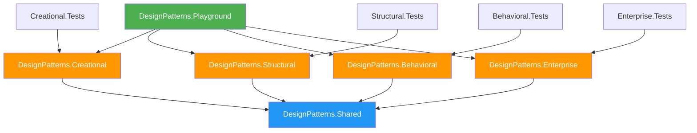
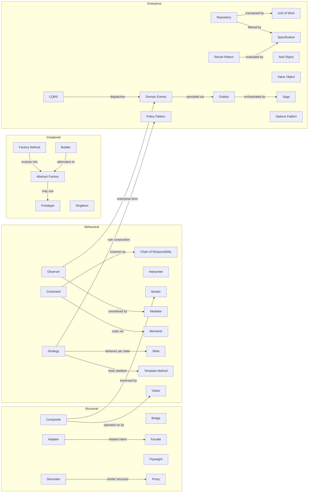
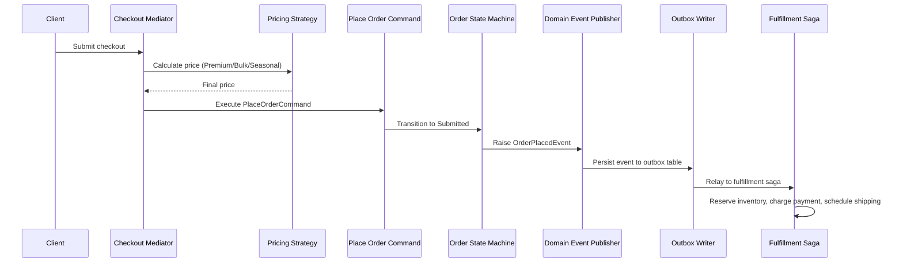

# Architecture Overview

This document describes the high-level architecture of the repository, explains how the projects relate to each other, and maps the connections between design patterns.

---

## Solution Architecture

The solution follows a layered project structure where each design pattern category lives in its own class library. A shared project provides common abstractions, and a playground console application ties everything together for interactive exploration.

```
DotnetAdvanceDesignPattern.sln
│
├── src/
│   ├── DesignPatterns.Shared          # Common interfaces, models, enums
│   ├── DesignPatterns.Creational      # 5 creational patterns
│   ├── DesignPatterns.Structural      # 7 structural patterns
│   ├── DesignPatterns.Behavioral      # 11 behavioral patterns
│   ├── DesignPatterns.Enterprise      # 12 enterprise patterns
│   └── DesignPatterns.Playground      # Console runner referencing all projects
│
└── tests/
    ├── DesignPatterns.Creational.Tests
    ├── DesignPatterns.Structural.Tests
    ├── DesignPatterns.Behavioral.Tests
    └── DesignPatterns.Enterprise.Tests
```

### Project Dependencies



---

## Pattern Relationship Map

Design patterns do not exist in isolation. The following diagram shows how patterns in this repository relate to and build upon each other.



---

## How Patterns Compose in Real Systems

### E-Commerce Order Flow

This example shows how multiple patterns combine to handle a realistic order placement:



### Pattern Layers

| Layer               | Patterns Used                                   | Purpose                              |
|---------------------|-------------------------------------------------|--------------------------------------|
| **Presentation**    | Facade, Adapter                                 | Simplify external API surface        |
| **Application**     | Mediator, Command, CQRS                         | Orchestrate use cases                |
| **Domain**          | Strategy, State, Specification, Value Object     | Express business rules               |
| **Infrastructure**  | Repository, Unit of Work, Outbox, Proxy          | Persist and communicate reliably     |
| **Cross-cutting**   | Decorator, Observer, Singleton, Options Pattern  | Add behavior across all layers       |

---

## Folder Convention Per Pattern

Each pattern folder follows a consistent structure:

```
PatternName/
├── IPatternAbstraction.cs       # Core interface or abstract class
├── ConcreteImplementationA.cs   # First real-world implementation
├── ConcreteImplementationB.cs   # Second variant
├── SubFolder/                   # Grouped variants (e.g., Handlers/, States/)
│   ├── SpecificVariant.cs
│   └── AnotherVariant.cs
└── (Models or DTOs if needed)
```

**Naming conventions**:
- Interfaces start with `I` (e.g., `IShippingCarrier`, `IPricingStrategy`).
- Abstract base classes use the pattern name (e.g., `DocumentExporter`, `ApprovalHandler`).
- Concrete classes use descriptive business names (e.g., `FedExAdapter`, `PremiumPricingStrategy`).

---

## Design Principles Demonstrated

The patterns in this repository reinforce these core principles:

| Principle                        | Patterns That Demonstrate It                           |
|----------------------------------|--------------------------------------------------------|
| **Single Responsibility**        | Command, Strategy, Specification                       |
| **Open/Closed**                  | Decorator, Strategy, Template Method, Visitor          |
| **Liskov Substitution**          | Factory Method, Abstract Factory, Null Object          |
| **Interface Segregation**        | Adapter, Bridge, Repository                            |
| **Dependency Inversion**         | All patterns via constructor injection                 |
| **Composition over Inheritance** | Decorator, Strategy, Bridge, Composite                 |
| **Encapsulate What Varies**      | Strategy, State, Factory Method                        |
| **Program to an Interface**      | Every pattern in this repository                       |

---

## Next Steps

- [Pattern Categories](design-pattern-categories.md) — Understand the four categories.
- [Pattern Selection Guide](pattern-selection-guide.md) — Choose the right pattern for your problem.
- [Decision Matrix](decision-matrix.md) — Map problems to patterns.
