# Comparison Maps

Side-by-side comparisons of commonly confused design patterns, with Mermaid diagrams, comparison tables, and clear guidance on when to use which.

---

## Table of Contents

1. [Factory Method vs Abstract Factory](#1-factory-method-vs-abstract-factory)
2. [Strategy vs State](#2-strategy-vs-state)
3. [Decorator vs Proxy](#3-decorator-vs-proxy)
4. [Facade vs Adapter](#4-facade-vs-adapter)
5. [Command vs Chain of Responsibility](#5-command-vs-chain-of-responsibility)
6. [Observer vs Mediator](#6-observer-vs-mediator)
7. [Builder vs Abstract Factory](#7-builder-vs-abstract-factory)
8. [Repository vs Specification](#8-repository-vs-specification)
9. [CQRS vs CRUD](#9-cqrs-vs-crud)
10. [Domain Events vs Observer](#10-domain-events-vs-observer)

---

## 1. Factory Method vs Abstract Factory

### Key Difference in One Sentence

Factory Method creates **one product** via a method override; Abstract Factory creates **a family of related products** via a factory object.

### Side-by-Side Table

| Aspect               | Factory Method                           | Abstract Factory                           |
|-----------------------|------------------------------------------|--------------------------------------------|
| **Products created**  | One product type                         | Family of related products                 |
| **Mechanism**         | Override a method in a subclass          | Implement a factory interface              |
| **Extensibility**     | Add a new creator subclass               | Add a new factory implementation           |
| **Client knows**      | The creator, not the product             | The factory, not the products              |
| **Complexity**        | Low — one interface, one method          | Higher — multiple product interfaces       |
| **Example**           | `CreatePaymentProcessor()` returns one   | `CreateBlob()` + `CreateQueue()` + `CreateTable()` |
| **Use when**          | Single product varies by config          | Multiple products must be compatible       |

### Structure Comparison

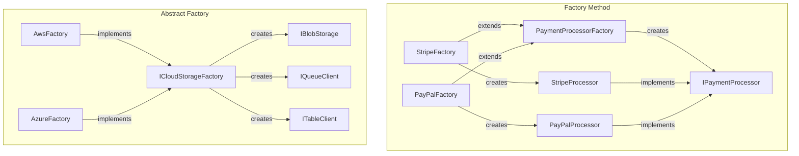

### When to Use Which

- **Factory Method**: You need ONE product and want to defer the creation decision. Adding Stripe? Add a `StripeFactory` subclass.
- **Abstract Factory**: You need MULTIPLE related products that must work together. AWS S3 + SQS + DynamoDB must not mix with Azure Blob + Queue + Table.

---

## 2. Strategy vs State

### Key Difference in One Sentence

Strategy lets the **client choose** which algorithm to use; State lets the **object itself** change behavior as its internal state transitions.

### Side-by-Side Table

| Aspect               | Strategy                                  | State                                       |
|-----------------------|-------------------------------------------|---------------------------------------------|
| **What varies**       | The algorithm used                        | The behavior based on current state         |
| **Who decides**       | Client or external configuration          | The object itself (internal transitions)    |
| **Awareness**         | Strategies are independent of each other  | States know about valid next states         |
| **Transitions**       | No concept of transitioning               | States transition to other states           |
| **Lifetime**          | Strategy set once or changed by client    | State changes automatically during lifecycle|
| **Example**           | Pricing: Regular, Premium, Bulk           | Order: Draft, Submitted, Shipped, Delivered |
| **GoF intent**        | Interchange algorithms                    | Change behavior when state changes          |

### Structure Comparison

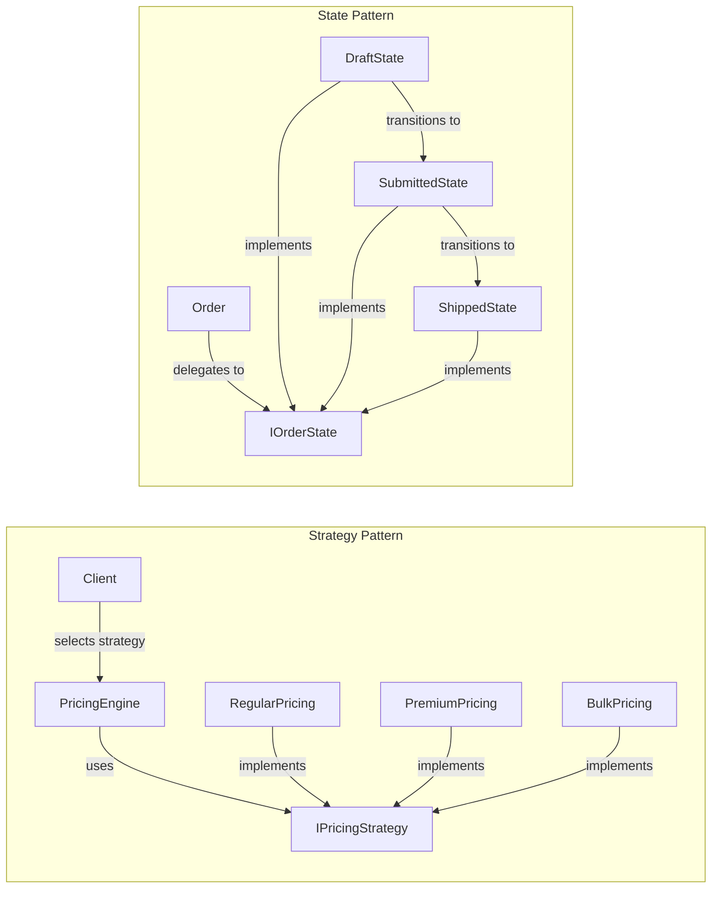

### When to Use Which

- **Strategy**: "The caller picks the pricing algorithm." The pricing engine does not care which strategy it uses; the client decides.
- **State**: "The order changes its own behavior as it moves through its lifecycle." Draft orders can add items; Shipped orders cannot. The order transitions itself.

---

## 3. Decorator vs Proxy

### Key Difference in One Sentence

Decorator **adds behavior** to an object; Proxy **controls access** to an object.

### Side-by-Side Table

| Aspect               | Decorator                                  | Proxy                                      |
|-----------------------|--------------------------------------------|--------------------------------------------|
| **Intent**            | Enhance functionality                      | Control access                             |
| **Interface**         | Same interface as the wrapped object       | Same interface as the real subject         |
| **Stacking**          | Multiple decorators can stack              | Usually one proxy                          |
| **Lifecycle**         | Does not manage the wrapped object's life  | May manage the subject's lifecycle         |
| **Client awareness**  | Client often assembles the decorator chain | Client typically does not know about proxy |
| **Typical uses**      | Logging, retry, metrics, caching layers    | Lazy loading, auth, remote access, caching |
| **Example**           | `LoggingDecorator(RetryDecorator(client))` | `CachingInventoryProxy`                   |

### Structure Comparison

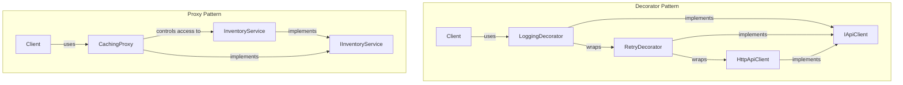

### When to Use Which

- **Decorator**: You want to **add logging, retry, caching, or metrics** as composable layers. You might stack three decorators on the same service.
- **Proxy**: You want to **control whether or how** the real object is accessed — lazy loading it, checking authorization first, or caching its responses transparently.

**Overlap note**: Caching can be either. Use Proxy when the cache is an intrinsic part of how the service works (transparent to client). Use Decorator when caching is one of several composable behaviors the client assembles.

---

## 4. Facade vs Adapter

### Key Difference in One Sentence

Facade **simplifies** your own complex subsystem; Adapter **translates** someone else's incompatible interface.

### Side-by-Side Table

| Aspect               | Facade                                     | Adapter                                    |
|-----------------------|--------------------------------------------|--------------------------------------------|
| **Intent**            | Simplify a complex subsystem               | Make an incompatible interface work         |
| **Scope**             | Entire subsystem (many classes)            | One class or interface                     |
| **Interface change**  | Defines a NEW, simpler interface           | Conforms to an EXISTING target interface   |
| **Code ownership**    | You own the subsystem code                 | You do not own the adaptee code            |
| **Direction**         | Inward (hides your own complexity)         | Outward (integrates external code)         |
| **Example**           | `ReportFacade.Generate(type, range)`       | `FedExAdapter : IShippingCarrier`          |

### Structure Comparison

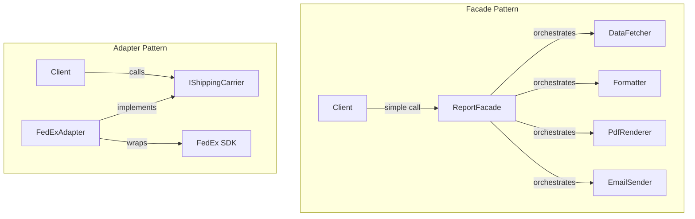

### When to Use Which

- **Facade**: "Our report generation involves 5 subsystem classes. We need a one-method entry point." You own all the code; you create a simpler API over it.
- **Adapter**: "FedEx's SDK has methods named `CreateShipmentRequest()` and `PostShipment()`, but our code expects `IShippingCarrier.Ship()`." You wrap someone else's incompatible API.

---

## 5. Command vs Chain of Responsibility

### Key Difference in One Sentence

Command **encapsulates an action** for execution control (undo, queue, log); Chain of Responsibility **routes a request** through a pipeline of handlers.

### Side-by-Side Table

| Aspect               | Command                                     | Chain of Responsibility                    |
|-----------------------|---------------------------------------------|--------------------------------------------|
| **Focus**             | What to do (encapsulate action)             | Who should handle (route request)          |
| **Execution**         | One receiver executes the command           | Zero, one, or many handlers may process    |
| **Undo**              | Built-in undo/redo support                  | Not typically undoable                     |
| **Queuing**           | Commands can be queued, logged, replayed    | Requests flow through immediately          |
| **Coupling**          | Client knows the command, not the receiver  | Client knows the first handler only        |
| **Example**           | `ShipOrderCommand.Execute()` / `.Undo()`   | Expense approval: Lead, Manager, VP, CFO   |

### Structure Comparison

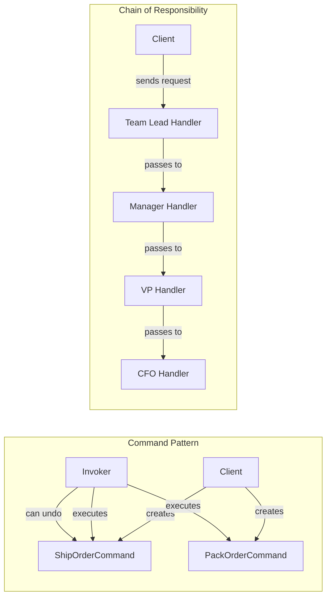

### When to Use Which

- **Command**: "I need to execute an order fulfillment step, log it, and potentially undo it." The command is a self-contained action.
- **Chain of Responsibility**: "An expense request should route to the appropriate approval level based on amount." The chain decides WHO handles it.

---

## 6. Observer vs Mediator

### Key Difference in One Sentence

Observer **broadcasts** from one subject to many listeners; Mediator **coordinates** complex communication among many peers.

### Side-by-Side Table

| Aspect               | Observer                                    | Mediator                                    |
|-----------------------|---------------------------------------------|---------------------------------------------|
| **Communication**     | One-to-many (broadcast)                     | Many-to-many (through hub)                 |
| **Knowledge**         | Subject knows observer interface only       | Mediator knows all colleagues              |
| **Coupling**          | Observers coupled to subject interface      | Colleagues decoupled from each other       |
| **Direction**         | Subject pushes to all observers             | Colleagues communicate via mediator        |
| **Complexity**        | Low (pub/sub)                               | Higher (mediator contains coordination logic)|
| **Example**           | Patient monitor notifies dashboard + alerts | Checkout coordinates inventory + payment + shipping |

### Structure Comparison

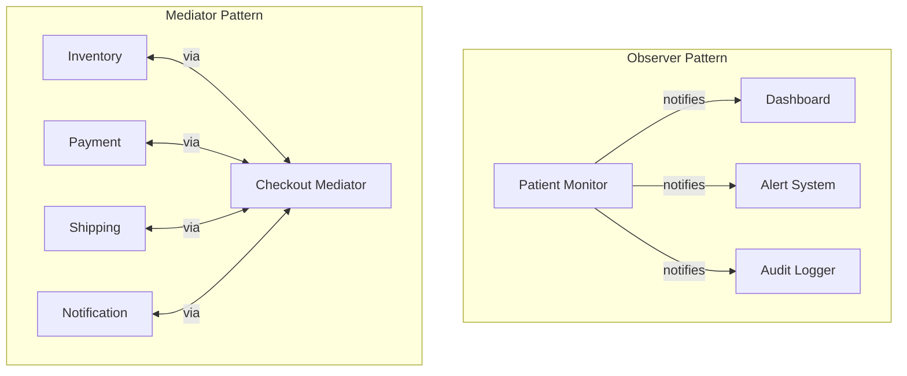

### When to Use Which

- **Observer**: "When a patient's heart rate changes, the dashboard, alert system, and logger all need to update." One source, many listeners, simple broadcast.
- **Mediator**: "During checkout, inventory must be checked before payment, payment must succeed before shipping, and notification depends on all of them." Complex coordination among multiple peers.

---

## 7. Builder vs Abstract Factory

### Key Difference in One Sentence

Builder constructs **one complex product** step by step; Abstract Factory creates **a family of related products** all at once.

### Side-by-Side Table

| Aspect               | Builder                                     | Abstract Factory                            |
|-----------------------|---------------------------------------------|---------------------------------------------|
| **Products**          | One complex product                         | Multiple related products                  |
| **Construction**      | Step by step (fluent API)                   | All at once (factory methods)              |
| **Optional parts**    | Supports optional parts and defaults        | All products are typically required         |
| **Validation**        | Can validate at each step                   | Validates product compatibility            |
| **API style**         | `builder.SetX().SetY().Build()`             | `factory.CreateBlob(); factory.CreateQueue()` |
| **Example**           | Build an invoice with optional discounts    | Create AWS or Azure storage services       |

### Structure Comparison

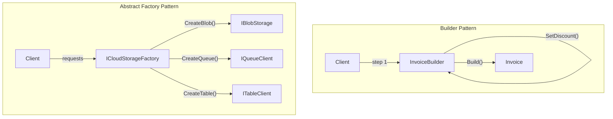

### When to Use Which

- **Builder**: "An invoice has required fields (customer, at least one line item) and optional fields (discount, notes, payment terms). I want to build it step by step with validation."
- **Abstract Factory**: "I need blob storage, queue client, and table client that all come from the same provider. AWS or Azure, but never mixed."

---

## 8. Repository vs Specification

### Key Difference in One Sentence

Repository manages **how** data is accessed (CRUD); Specification defines **what** data to access (query criteria).

### Side-by-Side Table

| Aspect               | Repository                                  | Specification                               |
|-----------------------|---------------------------------------------|---------------------------------------------|
| **Responsibility**    | CRUD operations                             | Query criteria / filter logic              |
| **Interface**         | `Add()`, `GetById()`, `Delete()`, `Find()`  | `IsSatisfiedBy()`, `ToExpression()`        |
| **Composability**     | Not composable; standalone per entity type  | Composable via AND, OR, NOT                |
| **Reusability**       | Per entity type                             | Per business rule, reusable across queries |
| **Testability**       | Mock the repository interface               | Unit test against in-memory objects        |
| **Relationship**      | Repository *uses* specifications            | Specification is *passed to* repository    |

### How They Work Together

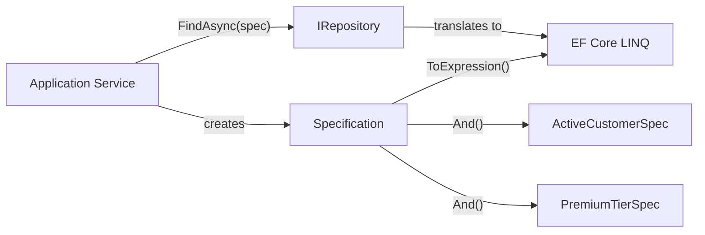

### When to Use Which

They are **complementary, not competing**:
- **Repository**: Always, when you need to abstract data access.
- **Specification**: Add it when your queries are complex, dynamic, and reusable. Pass specifications TO the repository.

---

## 9. CQRS vs CRUD

### Key Difference in One Sentence

CQRS **separates** read and write models for independent optimization; CRUD uses a **single model** for all operations.

### Side-by-Side Table

| Aspect               | CQRS                                        | CRUD                                        |
|-----------------------|---------------------------------------------|---------------------------------------------|
| **Models**            | Separate read model and write model         | Single model for reads and writes          |
| **Complexity**        | Higher (two models, sync needed)            | Lower (one model, one path)               |
| **Scalability**       | Read and write scale independently          | Scale together                             |
| **Consistency**       | Often eventually consistent                 | Immediately consistent                     |
| **Performance**       | Reads use denormalized views or caches      | Reads and writes share same tables          |
| **Team skill**        | Must understand eventual consistency        | Standard data access knowledge             |
| **Best for**          | Complex domains, high read volume           | Simple CRUD, small teams, prototypes       |
| **Avoid when**        | Same shape for reads and writes             | Read perf suffers; models have diverged    |

### Structure Comparison

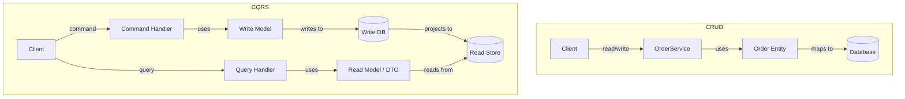

### When to Use Which

- **CRUD**: "Users can create, view, edit, and delete orders. The read and write shapes are the same. We are a small team." Stay with CRUD.
- **CQRS**: "Our order list page needs a denormalized view joining 5 tables. Write operations enforce complex invariants. Reads are 100x more frequent than writes." Move to CQRS.

**Migration trigger**: Move from CRUD to CQRS when your read queries become complex projections, read performance suffers from write contention, or your read and write models have diverged naturally.

---

## 10. Domain Events vs Observer

### Key Difference in One Sentence

Domain Events are **semantically meaningful business events** dispatched through infrastructure; Observer is a **low-level notification mechanism** between objects.

### Side-by-Side Table

| Aspect               | Domain Events                               | Observer (GoF)                              |
|-----------------------|---------------------------------------------|---------------------------------------------|
| **Scope**             | Cross-aggregate, cross-service              | Within a single subsystem                  |
| **Coupling**          | Fully decoupled via event dispatcher        | Subject holds observer references          |
| **Payload**           | Rich event objects (`OrderPlacedEvent`)      | Raw state data or the subject itself       |
| **Dispatch**          | Async, deferred, after SaveChanges          | Synchronous, immediate                     |
| **Registration**      | DI-discovered handlers                      | Explicit subscribe/unsubscribe             |
| **Persistence**       | Events can be stored (outbox, event store)  | Notifications are ephemeral                |
| **Idempotency**       | Required (events may be replayed)           | Not typically needed                       |
| **Example**           | `OrderPlacedEvent` triggers email + audit   | Monitor notifies dashboard + logger        |

### Structure Comparison

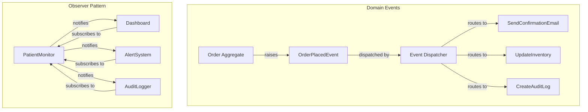

### When to Use Which

- **Observer**: "When a patient monitor reading changes, the dashboard, alert system, and logger should update immediately in the same process." Simple, synchronous, in-memory.
- **Domain Events**: "When an order is placed, send a confirmation email, update inventory projections, create an audit trail, and notify the fulfillment service." Business-level events with persistence, async handling, and cross-service delivery.

**Evolution path**: Observer is often the starting point. As requirements grow (persistence, async, cross-service), evolve to Domain Events + Outbox.

---

## Master Comparison Diagram

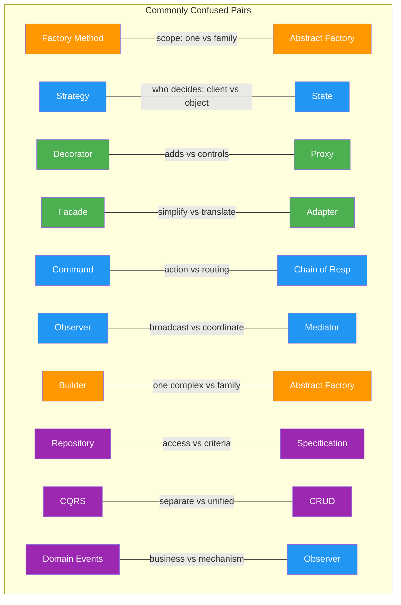

---

## Quick Cheat Sheet

| Pair                         | Use A When...                              | Use B When...                               |
|------------------------------|--------------------------------------------|--------------------------------------------|
| Factory Method vs Abs Factory| One product type varies                    | Family of products must be compatible      |
| Strategy vs State            | Client picks the algorithm                 | Object changes behavior by internal state  |
| Decorator vs Proxy           | Stack multiple behavior layers             | Control access transparently               |
| Facade vs Adapter            | Simplify your own complex code             | Translate someone else's incompatible code |
| Command vs CoR               | Encapsulate action for undo/queue          | Route request through handler chain        |
| Observer vs Mediator         | One source broadcasts to many              | Many peers coordinate via hub              |
| Builder vs Abstract Factory  | Build one complex thing step by step       | Create many related things at once         |
| Repository vs Specification  | Manage CRUD operations                     | Define reusable query criteria             |
| CQRS vs CRUD                 | Read/write models differ significantly     | Same model works for both                  |
| Domain Events vs Observer    | Business events with persistence/async     | Simple in-process notifications            |

---

## Next Steps

- [Decision Matrix](decision-matrix.md) — Full problem-to-pattern mapping
- [Interview Cheat Sheet](interview-revision-cheatsheet.md) — One-liners and interview questions
- [Anti-Patterns](anti-patterns.md) — What happens when you confuse these patterns
