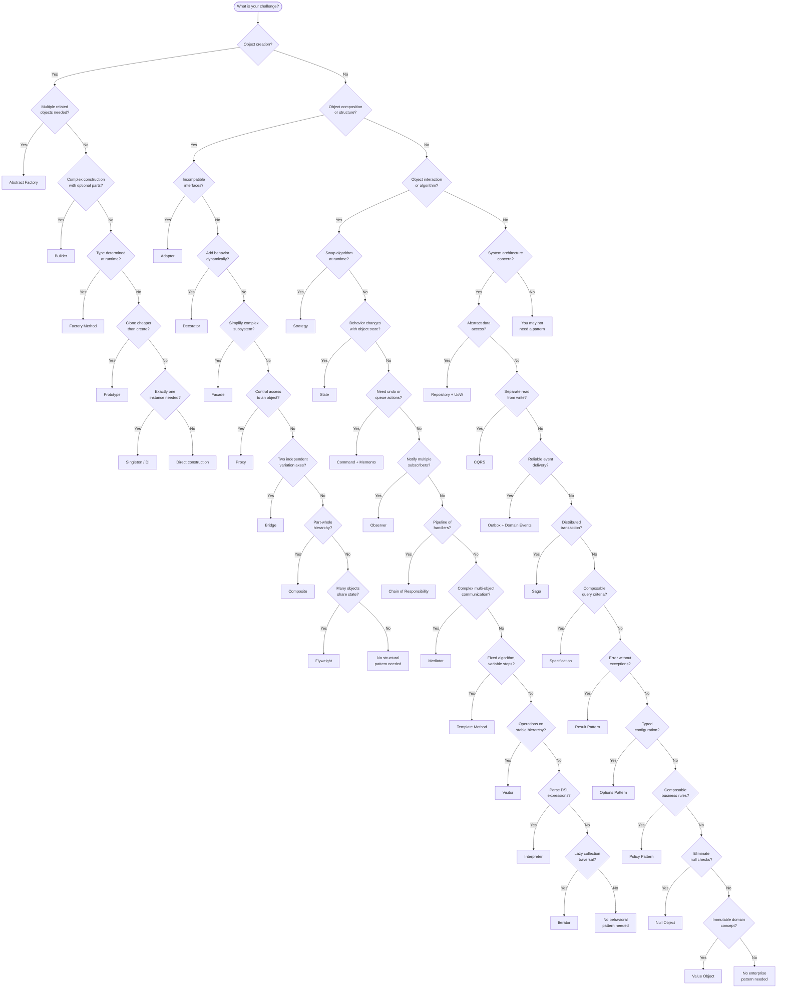

# Decision Matrix

This document provides a comprehensive mapping from **problems** to **patterns**, helping you systematically choose the right design pattern for your situation.

---

## Master Decision Flowchart



---

## Problem-to-Pattern Matrix

### Creation Problems

| Problem                                                    | Primary Pattern    | Alternative          | Avoid If                                |
|------------------------------------------------------------|--------------------|----------------------|-----------------------------------------|
| Type depends on runtime config or user input               | Factory Method     | Abstract Factory     | Only 1-2 types, no future extension     |
| Need coordinated families (AWS S3+SQS vs Azure Blob+Queue)| Abstract Factory   | Factory Method       | Only one product family exists          |
| Constructor has 5+ parameters                              | Builder            | Factory Method       | Object is simple (2-3 required fields)  |
| Object initialization involves I/O, DB, or computation    | Prototype          | Builder              | Objects are cheap to construct          |
| Shared resource must have exactly one instance             | Singleton (DI)     | Static class         | DI container can manage lifetime        |

### Composition Problems

| Problem                                                    | Primary Pattern    | Alternative          | Avoid If                                |
|------------------------------------------------------------|--------------------|----------------------|-----------------------------------------|
| Third-party API does not match your interface              | Adapter            | Facade               | You can modify both interfaces          |
| Two dimensions vary independently (Type x Channel)         | Bridge             | Strategy             | Only one dimension varies               |
| Tree/hierarchy needs uniform traversal                     | Composite          | Iterator             | Structure is flat                       |
| Add logging, retry, caching to any service                 | Decorator          | Proxy                | Only one concern, applied once          |
| Complex subsystem needs a simplified API                   | Facade             | Adapter              | Subsystem is already simple             |
| Thousands of objects share immutable state                 | Flyweight          | Caching              | Few objects, memory is not an issue     |
| Need lazy loading, caching, or auth check on access        | Proxy              | Decorator            | Direct access is acceptable             |

### Interaction Problems

| Problem                                                    | Primary Pattern         | Alternative          | Avoid If                              |
|------------------------------------------------------------|-------------------------|----------------------|---------------------------------------|
| Algorithm varies by customer type or config                | Strategy                | Template Method      | Only one algorithm exists             |
| Object behavior depends on lifecycle state                 | State                   | Strategy + enum      | Only 2 states with minimal difference |
| Need undo/redo for user actions                            | Command + Memento       | ---                  | No undo requirement                   |
| Multiple systems react to the same event                   | Observer                | Mediator             | Only one subscriber                   |
| Request must traverse a chain of validators/handlers       | Chain of Responsibility | Decorator            | Single handler always processes       |
| Many objects talk to many objects                          | Mediator                | Observer             | Two objects communicate directly      |
| Algorithm skeleton is fixed, steps vary                    | Template Method         | Strategy             | No shared algorithm structure         |
| New operations needed on stable type hierarchy             | Visitor                 | Pattern matching     | Types change frequently               |
| Parse structured expressions                              | Interpreter             | Parser library       | Grammar is complex                    |
| Paginated or streamed data needs lazy traversal            | Iterator                | LINQ                 | Data fits in memory                   |

### Architecture Problems

| Problem                                                    | Primary Pattern         | Alternative          | Avoid If                              |
|------------------------------------------------------------|-------------------------|----------------------|---------------------------------------|
| Need testable, swappable data access                       | Repository              | DbContext directly   | Simple CRUD, no test isolation needed |
| Multiple repos must commit atomically                      | Unit of Work            | Transaction scope    | Single repo operations only           |
| Dynamic, composable query filters                          | Specification           | LINQ Where           | Simple one-off queries                |
| Validation and not-found are common "errors"               | Result Pattern          | Exceptions           | Truly unexpected failures only        |
| Read model differs from write model                        | CQRS                    | Single model         | Same shape for reads and writes       |
| Domain actions need decoupled side effects                 | Domain Events           | Observer             | No side effects, simple flow          |
| Events must survive process/broker failures                | Outbox                  | Direct publish       | Best-effort delivery is OK            |
| Multi-service workflow needs rollback                      | Saga                    | 2PC                  | Single service, local transaction     |
| Want safe defaults instead of null                         | Null Object             | Null check           | Null has semantic meaning             |
| Domain concept has no identity (Money, Email)              | Value Object            | Primitive type       | Concept needs identity                |
| Configuration needs typing and validation                  | Options Pattern         | IConfiguration       | One simple config key                 |
| Business rules compose with AND/OR logic                   | Policy Pattern          | If/else chain        | Single non-combinatorial rule         |

---

## Scenario-Based Selection

### "I am building..."

| Scenario                                  | Recommended Patterns                                  |
|-------------------------------------------|-------------------------------------------------------|
| Payment processing system                 | Factory Method, Strategy, Result Pattern              |
| E-commerce order management               | State, Command, CQRS, Domain Events, Saga            |
| Multi-provider cloud integration          | Abstract Factory, Adapter, Bridge                     |
| API with resilience (retry, circuit break)| Decorator, Proxy, Policy Pattern                      |
| Document management with undo             | Command, Memento, Template Method                     |
| Complex search/filter UI                  | Specification, Interpreter, Builder                   |
| Healthcare monitoring dashboard           | Observer, Mediator, Composite                         |
| Microservices event-driven architecture   | Domain Events, Outbox, Saga, CQRS                    |
| Report generation pipeline                | Facade, Template Method, Strategy                     |
| Permission/RBAC system                    | Composite, Specification, Proxy                       |
| Configuration management                  | Options Pattern, Builder, Singleton                   |
| Invoice/document generation               | Builder, Template Method, Strategy                    |
| Fraud detection engine                    | Visitor, Strategy, Chain of Responsibility            |
| Inventory management                      | Proxy, Repository, Unit of Work                       |
| Notification system (email, SMS, push)    | Bridge, Observer, Strategy                            |

---

## Decision by .NET Layer

### ASP.NET Core Web API

| Layer              | Pattern(s)                                   | Purpose                                     |
|--------------------|----------------------------------------------|---------------------------------------------|
| Controllers        | Facade, Mediator                             | Thin controllers that delegate              |
| Middleware         | Chain of Responsibility, Decorator           | Request pipeline, cross-cutting concerns    |
| Filters            | Strategy, Chain of Responsibility            | Authorization, validation, exception handling|
| Configuration      | Options Pattern, Builder                     | Typed settings with validation              |
| DI Registration    | Factory Method, Singleton                    | Service resolution and lifetime management  |

### Application / Service Layer

| Concern            | Pattern(s)                                   | Purpose                                     |
|--------------------|----------------------------------------------|---------------------------------------------|
| Use case handlers  | Command, CQRS, Mediator                      | Encapsulate application logic               |
| Validation         | Specification, Policy, Result Pattern        | Composable validation rules                 |
| Orchestration      | Saga, Mediator                               | Multi-step workflow coordination            |
| Event handling     | Domain Events, Observer                       | React to domain changes                     |

### Domain Layer

| Concern            | Pattern(s)                                   | Purpose                                     |
|--------------------|----------------------------------------------|---------------------------------------------|
| Entities           | State, Value Object                          | Rich domain objects                         |
| Business rules     | Specification, Policy, Strategy              | Encapsulated, testable rules                |
| Domain events      | Observer, Domain Events                       | Decoupled side effects                      |
| Value types        | Value Object, Flyweight                      | Immutable domain primitives                 |

### Infrastructure Layer

| Concern            | Pattern(s)                                   | Purpose                                     |
|--------------------|----------------------------------------------|---------------------------------------------|
| Data access        | Repository, Unit of Work, Specification      | Persistence abstraction                     |
| External services  | Adapter, Proxy                               | Integration isolation                       |
| Messaging          | Outbox, Observer                              | Reliable event delivery                     |
| Resilience         | Decorator, Policy Pattern                    | Retry, circuit breaker, timeout             |
| Caching            | Proxy, Decorator, Flyweight                  | Performance optimization                    |

---

## Pattern Compatibility Matrix

Which patterns work well together?

| Pattern A           | Works Well With                                      |
|---------------------|------------------------------------------------------|
| Factory Method      | Strategy, Prototype, Singleton                       |
| Abstract Factory    | Bridge, Prototype, Builder                           |
| Builder             | Composite, Prototype, Fluent Interface               |
| Strategy            | Factory Method, Template Method, DI                  |
| Decorator           | Proxy, Strategy, Chain of Responsibility             |
| Observer            | Mediator, Command, Domain Events                     |
| Command             | Memento, Chain of Responsibility, Strategy           |
| State               | Strategy, Factory Method, Observer                   |
| Composite           | Iterator, Visitor, Builder                           |
| Repository          | Unit of Work, Specification, CQRS                    |
| CQRS                | Domain Events, Outbox, Specification                 |
| Domain Events       | Outbox, Saga, Observer                                |
| Result Pattern      | Specification, Policy Pattern, CQRS                  |
| Specification       | Repository, Policy Pattern, Result Pattern           |
| Saga                | Outbox, Domain Events, Command                       |

---

## Quick Decision Rules

1. **"I need to create an object, but the type depends on input."** Use **Factory Method**.
2. **"I have AWS services and Azure services that must not mix."** Use **Abstract Factory**.
3. **"My constructor has too many parameters."** Use **Builder**.
4. **"I need to wrap a third-party API."** Use **Adapter**.
5. **"I want to add retry logic without changing my service."** Use **Decorator**.
6. **"My subsystem has 10 classes but clients need one call."** Use **Facade**.
7. **"I have an if/else chain checking order status."** Use **State**.
8. **"I need different pricing algorithms."** Use **Strategy**.
9. **"I need undo functionality."** Use **Command + Memento**.
10. **"Multiple services must react to an order being placed."** Use **Observer / Domain Events**.
11. **"My database queries are complex and repeated."** Use **Specification**.
12. **"Reads and writes need different models."** Use **CQRS**.
13. **"Events must not be lost even if the broker is down."** Use **Outbox**.
14. **"A workflow spans three microservices."** Use **Saga**.
15. **"I keep checking if the result is null."** Use **Null Object** or **Result Pattern**.

---

## Complexity vs Value Assessment

Before choosing a pattern, plot it on this mental model:

```
HIGH VALUE
    |
    |  Repository+UoW    CQRS        Saga
    |  Strategy          Domain Events
    |  Factory Method    Outbox
    |  Decorator         Specification
    |  Adapter
    |  Observer          Builder
    |  Result Pattern
    |  State             Mediator
    |  Facade            Visitor
    |  Null Object
    |  Value Object      Interpreter
    |  Options Pattern   Flyweight
    |
LOW VALUE ─────────────────────────────────── HIGH COMPLEXITY
    LOW COMPLEXITY
```

**Top-left quadrant** (high value, low complexity): Always use these when applicable.
**Top-right quadrant** (high value, high complexity): Use when the problem demands it.
**Bottom-left quadrant** (low value, low complexity): Use for convenience, do not overthink.
**Bottom-right quadrant** (low value, high complexity): Avoid unless specifically needed.

---

## Next Steps

- [Pattern Selection Guide](pattern-selection-guide.md) — Detailed decision trees per category
- [Comparison Maps](comparison-maps.md) — Side-by-side comparisons of similar patterns
- [Anti-Patterns](anti-patterns.md) — Avoid choosing the wrong pattern
