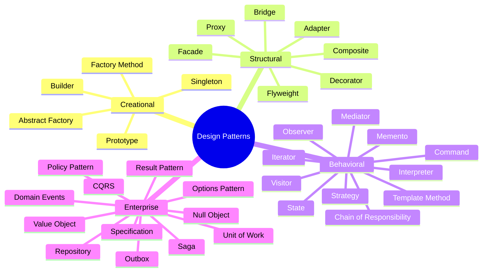
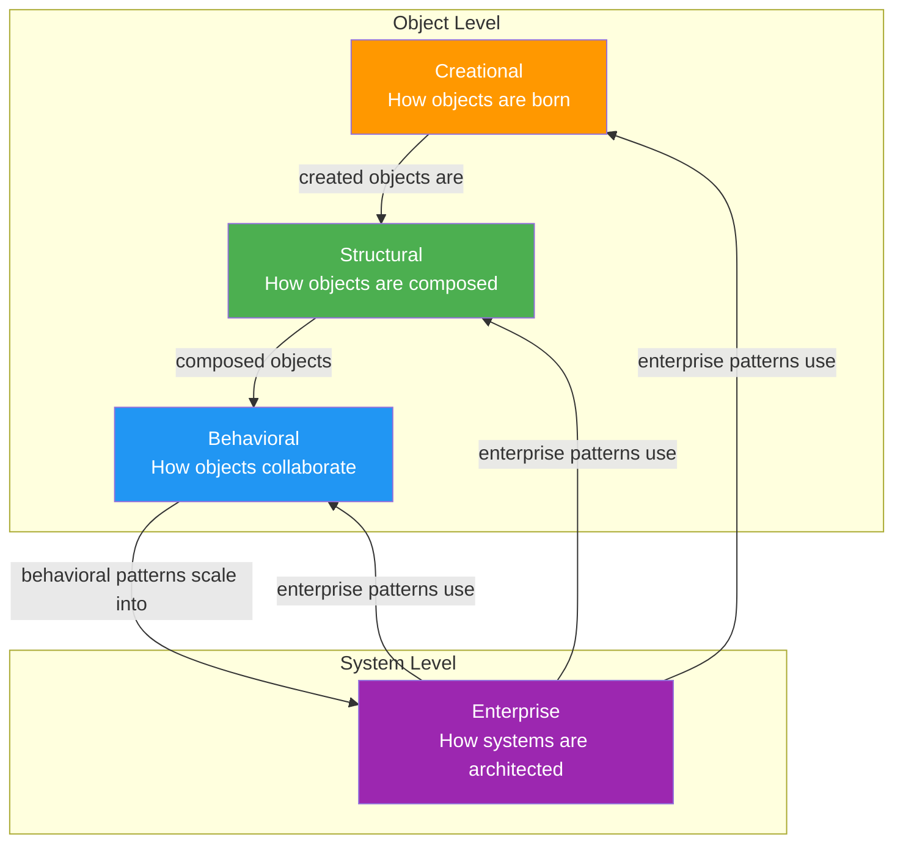

# Design Pattern Categories

This document explains the four categories of design patterns covered in this repository: the three classic **GoF (Gang of Four)** categories plus **Enterprise/Practical** patterns used in production .NET applications.

---

## Overview Mind Map

---

## Category 1: Creational Patterns

### What They Solve

Creational patterns abstract the instantiation process. They help make a system independent of how its objects are created, composed, and represented.

### Core Question

> "How should I create this object?"

### When You Need Them

- The concrete class to instantiate is determined at runtime.
- Object creation is complex (many parameters, conditional logic, expensive setup).
- You want to decouple client code from specific implementations.
- You need families of related objects that must be used together.

### Patterns in This Category

| Pattern          | One-Liner                                                  | This Repo's Scenario     |
|------------------|------------------------------------------------------------|--------------------------|
| Factory Method   | Let subclasses decide which class to instantiate           | Payment Gateways         |
| Abstract Factory | Create families of related objects without concrete types  | Cloud Storage (AWS/Azure)|
| Builder          | Construct complex objects step by step                     | Invoice Generation       |
| Prototype        | Clone existing objects instead of creating from scratch    | Feature Flags            |
| Singleton        | Ensure a class has only one instance                       | Telemetry Registry       |

### Key Principle

**"Program to an interface, not an implementation."** Creational patterns let client code work with abstractions while the pattern handles which concrete class is actually instantiated.

---

## Category 2: Structural Patterns

### What They Solve

Structural patterns deal with class and object **composition**. They help you build larger structures from individual classes and objects while keeping the structure flexible and efficient.

### Core Question

> "How should I compose these objects together?"

### When You Need Them

- You need to integrate with a third-party library that has an incompatible interface.
- You want to add responsibilities to objects dynamically.
- You need to represent part-whole hierarchies.
- You want to simplify a complex subsystem for consumers.
- You need to share state efficiently across many objects.

### Patterns in This Category

| Pattern    | One-Liner                                                  | This Repo's Scenario     |
|------------|------------------------------------------------------------|--------------------------|
| Adapter    | Convert one interface to another                           | Shipping Carriers        |
| Bridge     | Separate abstraction from implementation                   | Notifications            |
| Composite  | Treat individual and composite objects uniformly           | Permission Hierarchy     |
| Decorator  | Add behavior dynamically by wrapping                       | API Client Resilience    |
| Facade     | Provide a simple interface to a complex subsystem          | Report Generation        |
| Flyweight  | Share fine-grained objects to save memory                  | Tax Rates                |
| Proxy      | Provide a surrogate to control access                      | Inventory Service        |

### Key Principle

**"Favor composition over inheritance."** Structural patterns achieve flexibility by composing objects at runtime rather than locking behavior into an inheritance hierarchy at compile time.

---

## Category 3: Behavioral Patterns

### What They Solve

Behavioral patterns are concerned with **algorithms** and the **assignment of responsibilities** between objects. They describe not just patterns of objects and classes but also the patterns of communication between them.

### Core Question

> "How should these objects interact and divide responsibility?"

### When You Need Them

- You need to vary the algorithm used at runtime.
- You want to decouple senders from receivers.
- You need to traverse or operate on complex structures.
- You want to model state-dependent behavior.
- You need undo/redo functionality.
- You want to define a processing pipeline.

### Patterns in This Category

| Pattern                  | One-Liner                                                    | This Repo's Scenario |
|--------------------------|--------------------------------------------------------------|----------------------|
| Chain of Responsibility  | Pass requests along a chain until one handles it             | Expense Approval     |
| Command                  | Encapsulate a request as an object                           | Order Fulfillment    |
| Interpreter              | Define a grammar and build an interpreter for it             | Search Query DSL     |
| Iterator                 | Provide sequential access to elements                        | Paginated API        |
| Mediator                 | Centralize complex communications                            | Checkout Workflow    |
| Memento                  | Capture and restore state without violating encapsulation    | Document Editor      |
| Observer                 | Notify dependents when state changes                         | Healthcare IoT       |
| State                    | Change behavior when state changes                           | Order Lifecycle      |
| Strategy                 | Define a family of interchangeable algorithms                | Pricing Engine       |
| Template Method          | Define the skeleton of an algorithm in a base class          | Document Export      |
| Visitor                  | Define new operations without changing element classes        | Fraud Detection      |

### Key Principle

**"Encapsulate what varies."** Behavioral patterns identify the aspects of your application that vary and separate them from what stays the same.

---

## Category 4: Enterprise / Practical Patterns

### What They Solve

Enterprise patterns address concerns that emerge in **real-world, production-grade applications** — data access, distributed systems, configuration management, and domain modeling. They are not part of the original GoF catalog but are essential knowledge for any professional .NET developer.

### Core Question

> "How should I architect the layers and infrastructure of a production system?"

### When You Need Them

- You need a clean data access layer that is testable and swappable.
- You must ensure transactional consistency across multiple repository operations.
- You want to express domain logic as composable, testable rules.
- You need to handle errors gracefully without exception-based control flow.
- You must guarantee event delivery in distributed systems.
- You want type-safe configuration with validation.

### Patterns in This Category

| Pattern         | One-Liner                                                    | Origin               |
|-----------------|--------------------------------------------------------------|----------------------|
| Repository      | Abstract persistence behind a collection-like interface      | Fowler's PoEAA       |
| Unit of Work    | Track changes and commit as a single transaction             | Fowler's PoEAA       |
| Specification   | Encapsulate query criteria as composable objects             | Evans' DDD           |
| Result Pattern  | Represent success/failure explicitly as a return type        | Functional paradigm  |
| CQRS            | Separate command (write) and query (read) models            | Greg Young / DDD     |
| Domain Events   | Publish events from domain aggregates                        | Evans' DDD           |
| Outbox          | Reliably publish events using transactional outbox           | Microservices        |
| Null Object     | Provide a do-nothing default instead of null                 | Bobby Woolf          |
| Value Object    | Immutable objects with value-based equality                  | Evans' DDD           |
| Saga            | Manage distributed transactions via compensation             | Garcia-Molina (1987) |
| Options Pattern | Bind configuration sections to typed objects                 | .NET Core idiom      |
| Policy Pattern  | Compose business rules as first-class objects                | DDD / Clean Arch     |

### Key Principle

**"Make the implicit explicit."** Enterprise patterns take concerns that are often buried in infrastructure code (transactions, event delivery, configuration) and make them first-class, testable, documented parts of your architecture.

---

## How the Categories Relate

### Progression Path

1. **Creational** patterns get the right objects into existence.
2. **Structural** patterns connect those objects into useful structures.
3. **Behavioral** patterns define how those structures communicate and process work.
4. **Enterprise** patterns combine all of the above into production architectures.

---

## Category Comparison Table

| Aspect               | Creational          | Structural           | Behavioral            | Enterprise            |
|----------------------|---------------------|----------------------|-----------------------|-----------------------|
| **Focus**            | Object creation     | Object composition   | Object interaction    | System architecture   |
| **Granularity**      | Single object       | Small group          | Communication flow    | Entire layer/service  |
| **Complexity**       | Low-Medium          | Medium               | Medium-High           | High                  |
| **Count in GoF**     | 5                   | 7                    | 11                    | N/A (not GoF)         |
| **Count here**       | 5                   | 7                    | 11                    | 12                    |
| **Learn first**      | Factory, Builder    | Adapter, Decorator   | Strategy, Observer    | Repository, Result    |
| **Interview focus**  | Singleton, Factory  | Decorator, Proxy     | Strategy, State, Cmd  | CQRS, Repository      |

---

## Next Steps

- [Creational Patterns Summary](creational-patterns-summary.md)
- [Structural Patterns Summary](structural-patterns-summary.md)
- [Behavioral Patterns Summary](behavioral-patterns-summary.md)
- [Enterprise Patterns Summary](enterprise-patterns-summary.md)
- [Pattern Selection Guide](pattern-selection-guide.md)
