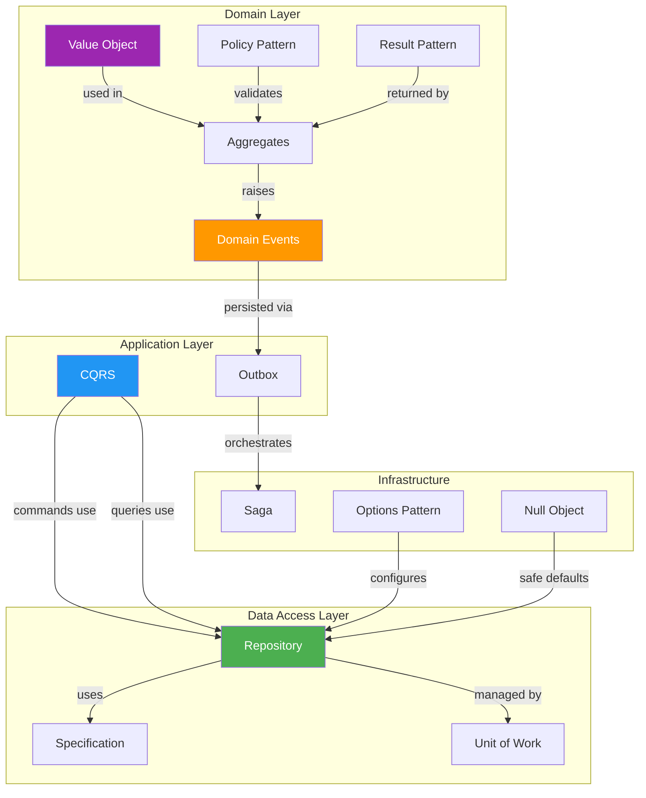

# Enterprise Patterns Summary

Enterprise patterns address concerns that arise in **production-grade .NET applications** — data access, distributed systems, domain modeling, and configuration management. They are not part of the classic GoF catalog but are essential for professional .NET development.

---

## Summary Table

| Pattern         | Key Benefit                                | When to Use                                           | When to Avoid                                          |
|-----------------|--------------------------------------------|-------------------------------------------------------|--------------------------------------------------------|
| Repository      | Abstracts data access; enables testing     | Need swappable persistence; complex query logic       | Simple CRUD with EF Core; no testability benefit       |
| Unit of Work    | Transactional consistency                  | Multiple repos must commit atomically                 | Single repo operations; EF Core SaveChanges suffices   |
| Specification   | Composable, reusable query predicates      | Complex filtering with dynamic criteria               | Simple `Where` clauses; trivial queries                |
| Result Pattern  | Explicit success/failure without exceptions| Expected failures (validation, not-found, conflicts)  | Truly exceptional situations (out of memory, IO)       |
| CQRS            | Separate read/write optimization           | Read and write models differ significantly            | Simple CRUD; same model works for both                 |
| Domain Events   | Decouples side effects from domain logic   | Actions trigger notifications, audit, projections     | No side effects needed; simple synchronous flow        |
| Outbox          | Guaranteed event delivery                  | At-least-once delivery with transactional guarantee   | In-process events only; no distributed concerns        |
| Null Object     | Eliminates null checks                     | Default behavior is well-defined and safe             | Null has important semantic meaning (absence of data)  |
| Value Object    | Immutable domain primitives with equality  | Domain concepts with value semantics (Money, Email)   | Entities with identity; mutable state is needed        |
| Saga            | Distributed transaction coordination       | Multi-service workflows with compensation             | Single-service transactions; two-phase commit works    |
| Options Pattern | Typed, validated configuration             | App settings with validation and hot reload           | One or two simple config values                        |
| Policy Pattern  | Composable business rules                  | Rules change independently; need AND/OR composition   | Single hardcoded rule; no combinatorial logic          |

---

## Pattern Details

### Repository

**Intent**: Mediate between the domain and data mapping layers using a collection-like interface for accessing domain objects.

**Key characteristics**:
- Exposes `Add()`, `GetById()`, `Update()`, `Delete()`, `Find(specification)`.
- Hides the ORM (EF Core, Dapper) behind an interface.
- Enables unit testing with in-memory implementations.
- Often combined with Unit of Work and Specification.

**Key participants**:
- `IRepository<T>` — Generic repository interface
- `EfRepository<T>` — EF Core implementation
- `InMemoryRepository<T>` — Test implementation

**When it earns its keep**:
- You need to swap persistence technologies.
- You have complex query logic that benefits from encapsulation.
- You want to unit test business logic without a database.

---

### Unit of Work

**Intent**: Maintain a list of objects affected by a business transaction and coordinate the writing out of changes and the resolution of concurrency problems.

**Key characteristics**:
- Wraps multiple repository operations in a single transaction.
- Calls `SaveChanges()` once to commit all changes atomically.
- In EF Core, `DbContext` already implements Unit of Work — the pattern makes it explicit.

**Key participants**:
- `IUnitOfWork` — Interface with `SaveChangesAsync()` and repository accessors
- `EfUnitOfWork` — Wraps `DbContext`

---

### Specification

**Intent**: Encapsulate query logic in a composable, reusable object that can be combined with other specifications using AND, OR, and NOT.

**Key characteristics**:
- Each specification encapsulates a single query criterion.
- Specifications compose: `new ActiveCustomerSpec().And(new PremiumTierSpec())`.
- Can generate `Expression<Func<T, bool>>` for EF Core LINQ translation.
- Separates query logic from repository and service layers.

**Key participants**:
- `Specification<T>` — Base class with `IsSatisfiedBy(T)` and `ToExpression()`
- `AndSpecification<T>`, `OrSpecification<T>`, `NotSpecification<T>` — Combinators
- Concrete specifications — `ActiveCustomerSpec`, `HighValueOrderSpec`

---

### Result Pattern

**Intent**: Represent the outcome of an operation as a return type (success or failure) instead of throwing exceptions for expected failures.

**Key characteristics**:
- `Result<T>` carries either a value (success) or an error (failure).
- Eliminates exception-based control flow for validation, not-found, and conflict scenarios.
- Enables railway-oriented programming — chain operations that each return `Result<T>`.
- Makes error handling explicit in method signatures.

**Key participants**:
- `Result<T>` — Generic result type
- `Result` — Non-generic result for void operations
- `Error` — Error type with code and message

---

### CQRS (Command Query Responsibility Segregation)

**Intent**: Separate the model for reading data (queries) from the model for updating data (commands).

**Key characteristics**:
- Commands change state and return nothing (or a Result).
- Queries return data and have no side effects.
- Each side can be optimized independently (e.g., denormalized read models).
- Commands and queries are handled by separate handlers.

**Key participants**:
- `ICommand`, `ICommandHandler<TCommand>` — Write side
- `IQuery<TResult>`, `IQueryHandler<TQuery, TResult>` — Read side
- Command/query dispatcher — Routes to the correct handler

---

### Domain Events

**Intent**: Publish events from domain aggregates to trigger side effects (notifications, projections, audit trails) without coupling the aggregate to those concerns.

**Key characteristics**:
- Events are raised within the domain model.
- Handlers are registered separately and process events asynchronously or synchronously.
- Keeps the domain model focused on business rules, not side effects.
- Often combined with Outbox for reliable delivery.

**Key participants**:
- `IDomainEvent` — Marker interface for events
- `OrderPlacedEvent`, `PaymentReceivedEvent` — Concrete events
- `IDomainEventHandler<TEvent>` — Handler interface
- `IDomainEventDispatcher` — Dispatches events to registered handlers

---

### Outbox

**Intent**: Store domain events in a transactional outbox table alongside the business data change, then relay them to the message broker in a separate process. This guarantees at-least-once delivery.

**Key characteristics**:
- Events are written to an `OutboxMessage` table in the same database transaction as the business operation.
- A background worker polls the outbox and publishes events to the message broker.
- Eliminates the dual-write problem (database + message broker).
- Events are idempotent — consumers must handle duplicates.

**Key participants**:
- `OutboxMessage` — Entity stored in the database
- `OutboxWriter` — Writes events to the outbox table
- `OutboxProcessor` — Background service that relays events

---

### Null Object

**Intent**: Provide an object with a defined neutral ("do nothing") behavior as a surrogate for the absence of an object.

**Key characteristics**:
- Implements the same interface as the real object but does nothing.
- Eliminates null checks throughout the codebase.
- Makes "no behavior" explicit and documented.

**Key participants**:
- `ILogger` — Interface
- `NullLogger` — No-op implementation (logs nothing)
- `IDiscountStrategy` — Interface
- `NoDiscount` — Returns the original price unchanged

---

### Value Object

**Intent**: Model domain concepts that have no identity — they are defined entirely by their attributes and compared by value, not reference.

**Key characteristics**:
- Immutable after creation.
- Equality is based on all properties (value equality, not reference equality).
- Self-validating — invalid states are impossible.
- Implemented as C# `record` types for automatic equality and immutability.

**Key participants**:
- `Money` — Amount + Currency, with arithmetic operations
- `EmailAddress` — Validated email with format enforcement
- `Address` — Street, City, State, Zip with equality

---

### Saga

**Intent**: Manage a long-running distributed process as a sequence of local transactions, each with a compensating action to handle failures.

**Key characteristics**:
- Each step is a local transaction in one service.
- If a step fails, compensating actions undo previous steps.
- Two styles: **orchestration** (central coordinator) and **choreography** (event-driven).
- This repo demonstrates orchestration.

**Key participants**:
- `ISaga` — Saga definition with steps and compensations
- `SagaOrchestrator` — Executes steps and triggers compensations on failure
- `SagaStep` — Individual step with `Execute()` and `Compensate()`

---

### Options Pattern

**Intent**: Bind configuration sections from `appsettings.json` to strongly-typed C# classes with validation and hot-reload support.

**Key characteristics**:
- `IOptions<T>` — Singleton, read once at startup.
- `IOptionsSnapshot<T>` — Scoped, re-reads per request.
- `IOptionsMonitor<T>` — Singleton with change notifications.
- Data annotation validation via `ValidateDataAnnotations()`.

**Key participants**:
- Configuration POCO class with `[Required]`, `[Range]`, etc.
- `services.Configure<T>(configuration.GetSection("..."))` — Registration
- Constructor injection of `IOptions<T>` — Consumption

---

### Policy Pattern

**Intent**: Encapsulate business rules as first-class objects that can be composed (AND/OR), evaluated independently, and tested in isolation.

**Key characteristics**:
- Each policy answers one question: "Is this allowed/applicable?"
- Policies compose: `new MinimumOrderPolicy().And(new CustomerInGoodStandingPolicy())`.
- Similar to Specification but focused on business rules rather than query criteria.
- Policies can carry violation messages for user feedback.

**Key participants**:
- `IPolicy<T>` — Policy interface with `IsApplicable(T)` and `Violations`
- Concrete policies — `MinimumOrderPolicy`, `FraudCheckPolicy`
- `CompositePolicy<T>` — Combines multiple policies with AND/OR logic

---

## Comparison Notes

### CQRS vs CRUD

| Aspect              | CQRS                                        | CRUD                                        |
|---------------------|---------------------------------------------|---------------------------------------------|
| **Models**          | Separate read and write models              | Single model for everything                 |
| **Complexity**      | Higher (more classes, possible event store) | Lower (one model, one repository)           |
| **Scalability**     | Read/write sides scale independently        | Scale together                              |
| **Consistency**     | Eventual (if async projections)             | Strong (single model, single DB)            |
| **Use when**        | Read/write shapes differ; high read volume  | Simple domain; same shape for read/write    |
| **Avoid when**      | Simple CRUD app; team unfamiliar with CQRS  | Read performance is critical; shapes differ |

**One sentence**: CQRS pays off when reads and writes have **different shapes, frequencies, or scaling needs**; CRUD is simpler when they do not.

### Domain Events vs Observer

| Aspect              | Domain Events                               | Observer                                    |
|---------------------|---------------------------------------------|---------------------------------------------|
| **Scope**           | Application/system level                    | Object level                                |
| **Coupling**        | Fully decoupled via event dispatcher        | Subject knows observer interface            |
| **Delivery**        | Can be async, persisted, replayed           | Typically synchronous, in-memory            |
| **Origin**          | DDD / enterprise architecture              | GoF pattern catalog                         |
| **Use when**        | Side effects from domain operations         | Simple in-process notifications             |

**One sentence**: Domain Events are the **enterprise-scale evolution** of Observer, adding persistence, async delivery, and cross-boundary communication.

### Repository vs Specification

| Aspect              | Repository                                  | Specification                               |
|---------------------|---------------------------------------------|---------------------------------------------|
| **Focus**           | Data access abstraction                     | Query criteria encapsulation                |
| **Responsibility**  | CRUD operations                             | Filter/selection logic                      |
| **Reusability**     | Per-entity type                             | Per-business rule (combinable)              |
| **Relationship**    | Repository *uses* Specification             | Specification is *passed to* Repository     |

**One sentence**: Repository **manages persistence**; Specification **defines what to query** — they are complementary, not competing.

### Result Pattern vs Exceptions

| Aspect              | Result Pattern                              | Exceptions                                  |
|---------------------|---------------------------------------------|---------------------------------------------|
| **For**             | Expected failures (validation, not-found)   | Unexpected failures (IO, null ref)          |
| **Performance**     | No stack unwinding                          | Expensive stack trace capture               |
| **Explicitness**    | Failure is visible in the return type       | Failure is invisible until try/catch        |
| **Composition**     | Chain with `Map()`, `Bind()`, `Match()`     | Nested try/catch blocks                     |

### Outbox vs Direct Publishing

| Aspect              | Outbox Pattern                              | Direct Publish                              |
|---------------------|---------------------------------------------|---------------------------------------------|
| **Consistency**     | Transactional with business data            | Dual-write problem (DB + broker)            |
| **Delivery**        | At-least-once guaranteed                    | May lose events on broker failure           |
| **Complexity**      | Higher (outbox table, background processor) | Lower (single publish call)                 |
| **Use when**        | Event delivery must be reliable             | Best-effort delivery is acceptable          |

---

## Enterprise Pattern Composition

These patterns are most powerful when composed together:

### Common Compositions

| Composition                           | Purpose                                    |
|---------------------------------------|--------------------------------------------|
| Repository + Unit of Work             | Transactional data access                  |
| Repository + Specification            | Flexible, composable queries               |
| CQRS + Domain Events                  | Side effects from command handling         |
| Domain Events + Outbox                | Reliable cross-service communication       |
| Outbox + Saga                         | Distributed transaction management         |
| Result Pattern + Specification        | Validated query results                    |
| Policy Pattern + Result Pattern       | Business rule evaluation with clear errors |
| Options Pattern + any pattern         | Externalized configuration for any service |
| Null Object + Repository              | Safe fallback when entity not found        |

---

## .NET-Specific Idioms

| Pattern         | .NET Idiom                                                              |
|-----------------|-------------------------------------------------------------------------|
| Repository      | Generic `IRepository<T>` backed by EF Core `DbSet<T>`                  |
| Unit of Work    | EF Core `DbContext` (already implements UoW); explicit `IUnitOfWork`    |
| Specification   | `Expression<Func<T, bool>>` for EF Core LINQ translation               |
| Result Pattern  | FluentResults, Ardalis.Result, or custom `Result<T>` record            |
| CQRS            | MediatR `IRequest`/`IRequestHandler`, or custom dispatcher             |
| Domain Events   | MediatR `INotification`/`INotificationHandler`                         |
| Outbox          | EF Core `SaveChangesInterceptor` + background `IHostedService`         |
| Null Object     | `NullLogger<T>` from `Microsoft.Extensions.Logging`                    |
| Value Object    | C# `record` types with init-only properties                            |
| Saga            | MassTransit Sagas, NServiceBus Sagas, or custom orchestrator           |
| Options Pattern | `IOptions<T>`, `IOptionsSnapshot<T>`, `IOptionsMonitor<T>`            |
| Policy Pattern  | Custom `IPolicy<T>` or Polly library for resilience policies           |

---

## Next Steps

- [Anti-Patterns](anti-patterns.md) — Repository overuse, fake CQRS, and anemic domain models
- [Comparison Maps](comparison-maps.md) — CQRS vs CRUD and Domain Events vs Observer deep dives
- [Interview Cheat Sheet](interview-revision-cheatsheet.md) — Quick revision for enterprise patterns
