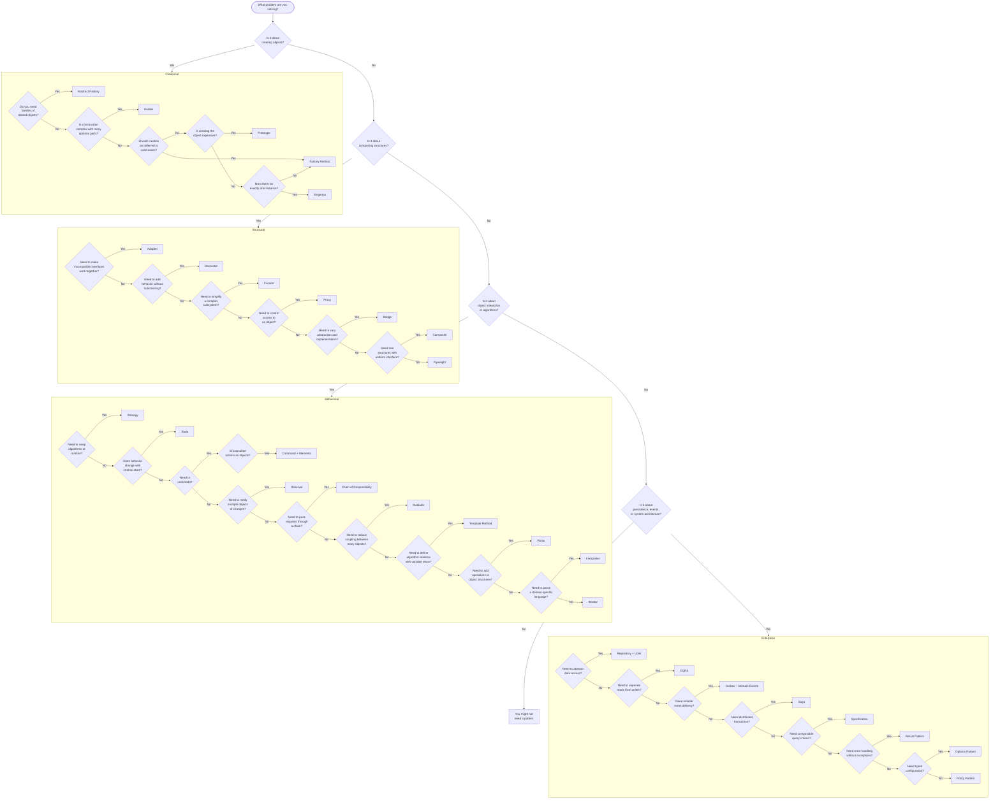

# Pattern Selection Guide

This guide helps you choose the right design pattern based on the problem you are facing. Use the decision trees, flowcharts, and tables below to navigate from **problem** to **pattern**.

---

## Master Decision Flowchart

---

## Problem-to-Pattern Quick Lookup

### "I need to..."

| Problem Statement                                                          | Recommended Pattern(s)                |
|----------------------------------------------------------------------------|---------------------------------------|
| Create objects without specifying the exact class                          | Factory Method, Abstract Factory      |
| Build an object with many optional parts                                   | Builder                               |
| Copy an object that is expensive to create                                 | Prototype                             |
| Ensure only one instance exists globally                                   | Singleton (prefer DI registration)    |
| Integrate a third-party library with an incompatible API                  | Adapter                               |
| Vary an abstraction and its implementation independently                  | Bridge                                |
| Represent a tree structure (files, menus, permissions)                    | Composite                             |
| Add logging, caching, retry, or metrics to an existing service            | Decorator                             |
| Simplify a complex subsystem into one entry point                         | Facade                                |
| Reduce memory for thousands of similar objects                            | Flyweight                             |
| Add access control, lazy loading, or caching transparently                | Proxy                                 |
| Route a request through multiple handlers                                 | Chain of Responsibility               |
| Queue, log, or undo operations                                           | Command                               |
| Parse and evaluate a domain-specific language                             | Interpreter                           |
| Iterate over a collection without exposing its structure                  | Iterator                              |
| Coordinate multiple services without direct coupling                      | Mediator                              |
| Save and restore an object's state (undo/redo)                           | Memento                               |
| Notify multiple components when something changes                        | Observer                              |
| Change an object's behavior based on its state                           | State                                 |
| Choose an algorithm at runtime                                            | Strategy                              |
| Define a fixed algorithm structure with customizable steps                | Template Method                       |
| Add operations to a class hierarchy without modifying it                  | Visitor                               |
| Abstract data access and make it testable                                 | Repository + Unit of Work             |
| Compose reusable query/filter criteria                                    | Specification                         |
| Handle errors without throwing exceptions                                 | Result Pattern                        |
| Separate read and write concerns for different scaling                    | CQRS                                  |
| Raise events from domain logic for side effects                          | Domain Events                         |
| Guarantee event delivery alongside database transactions                 | Outbox                                |
| Avoid null checks everywhere                                             | Null Object                           |
| Model domain concepts like Money, Address, Email                         | Value Object                          |
| Manage a multi-step distributed process with rollback                    | Saga                                  |
| Bind configuration files to strongly-typed objects                       | Options Pattern                       |
| Compose business rules that can be evaluated independently               | Policy Pattern                        |

---

## Decision by Concern

### Object Creation Decisions

| Situation                                        | Pattern          | Why                                          |
|--------------------------------------------------|------------------|----------------------------------------------|
| Type is determined by runtime configuration      | Factory Method   | Defers instantiation to factory              |
| Multiple related types must be created together  | Abstract Factory | Guarantees compatible families               |
| Object has 4+ constructor parameters             | Builder          | Step-by-step construction with validation    |
| Object creation involves deep copy               | Prototype        | Clone instead of rebuild                     |
| Global state coordination is needed              | Singleton        | One instance, but prefer DI singleton scope  |

### Wrapping / Composition Decisions

| Situation                                        | Pattern    | Why                                           |
|--------------------------------------------------|------------|-----------------------------------------------|
| Third-party interface does not match yours       | Adapter    | Translates interface                          |
| Need to add behavior without changing the class  | Decorator  | Wraps and enhances                            |
| Need to control access (auth, cache, lazy)       | Proxy      | Wraps and controls                            |
| Need a simple API for a complex subsystem        | Facade     | Hides complexity                              |

### Algorithm / Behavior Decisions

| Situation                                        | Pattern          | Why                                          |
|--------------------------------------------------|------------------|----------------------------------------------|
| Algorithm varies by type/configuration           | Strategy         | Runtime algorithm swap                       |
| Behavior depends on object's lifecycle state     | State            | State-driven behavior                        |
| Steps are fixed but details vary                 | Template Method  | Inheritance-based customization              |
| Need undo/redo for operations                    | Command + Memento| Command records; Memento snapshots           |
| Multiple objects must react to changes           | Observer         | Pub/sub notification                         |

### Architecture Decisions

| Situation                                        | Pattern(s)              | Why                                         |
|--------------------------------------------------|-------------------------|---------------------------------------------|
| Read-heavy system with different read/write needs| CQRS                    | Optimize each side independently            |
| Side effects (email, audit) from domain actions  | Domain Events           | Decouple side effects from core logic       |
| Need at-least-once event delivery guarantee      | Domain Events + Outbox  | Transactional outbox for reliability        |
| Multi-service workflow with failure compensation | Saga                    | Coordinated rollback                        |
| Complex query filters combined dynamically       | Specification           | Composable predicates                       |
| Configuration with validation and hot reload     | Options Pattern         | `IOptions<T>` / `IOptionsMonitor<T>`        |

---

## When NOT to Use a Pattern

| Temptation                                  | Better Alternative                                    |
|---------------------------------------------|-------------------------------------------------------|
| Factory for 1-2 simple types               | Direct instantiation or a simple `switch`             |
| Singleton for everything                    | DI container with appropriate lifetime                |
| Repository wrapping EF Core with no benefit | Use `DbContext` directly if no abstraction needed     |
| Decorator for one cross-cutting concern     | Middleware or a simple wrapper method                 |
| Mediator to call one service               | Direct dependency injection                           |
| CQRS for a simple CRUD app                 | Standard service + repository                        |
| Specification for trivial `Where` clauses  | LINQ directly                                        |
| Strategy when there is only one algorithm  | Just write the code inline                            |

> **Rule of thumb**: If introducing a pattern adds more code than the problem it solves, you do not need it yet. Patterns earn their keep when complexity grows.

---

## Next Steps

- [Decision Matrix](decision-matrix.md) — Detailed problem-to-pattern mapping table.
- [Comparison Maps](comparison-maps.md) — Side-by-side comparisons of similar patterns.
- [Anti-Patterns](anti-patterns.md) — Learn what happens when patterns are misapplied.
