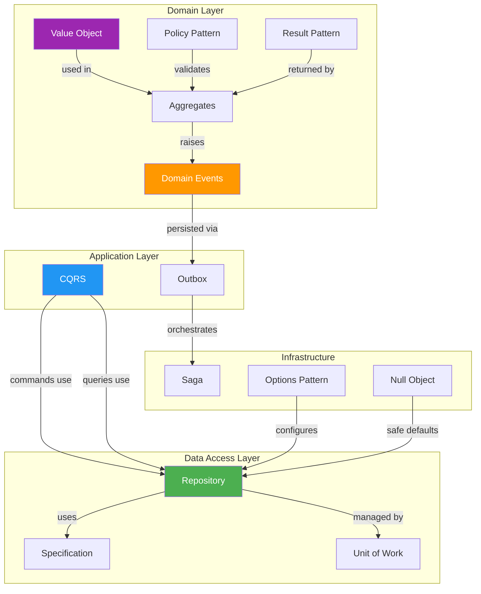

# Enterprise Patterns Summary

> A comprehensive reference of all enterprise and design patterns covered in this repository, with summary tables and head-to-head comparisons.

---

## Table of Contents

1. [Creational Patterns Summary](#creational-patterns-summary)
2. [Structural Patterns Summary](#structural-patterns-summary)
3. [Behavioral Patterns Summary](#behavioral-patterns-summary)
4. [Enterprise Patterns Summary](#enterprise-patterns-summary-1)
5. [Head-to-Head Comparisons](#head-to-head-comparisons)
   - [CQRS vs CRUD](#cqrs-vs-crud)
   - [Domain Events vs Observer](#domain-events-vs-observer)
   - [Repository vs Specification](#repository-vs-specification)
   - [Saga vs Two-Phase Commit (2PC)](#saga-vs-two-phase-commit-2pc)
6. [Pattern Composition Guide](#pattern-composition-guide)
7. [.NET-Specific Idioms](#net-specific-idioms)

---

## Creational Patterns Summary

| Pattern | Use Case | Key Benefit | When to Use | When to Avoid |
|---------|----------|-------------|-------------|---------------|
| **Factory Method** | Creating objects without specifying the exact class | Decouples creation from usage; supports Open/Closed Principle | When a class cannot anticipate the type of objects it needs; when subclasses should decide which class to instantiate | When there is only one concrete type and no foreseeable need for variants |
| **Simple Factory** | Centralizing creation logic in one place | Single point of creation with selection logic | When creation logic is simple and involves choosing among a few types | When creation logic is complex or types come from different families |
| **Static Factory** | Providing named constructors for clarity | Self-documenting creation via method names like `CreateFromJson()`, `CreateDefault()` | When constructor overloads are ambiguous; when creation semantics need naming | When you need inheritance or interface-based polymorphism for the factory itself |
| **Abstract Factory** | Creating families of related objects | Ensures consistency across product families (e.g., AWS vs Azure services) | When the system must work with multiple families of related products | When product families are unlikely to change or there is only one family |
| **Builder** | Constructing complex objects step by step | Separates construction from representation; fluent APIs | When object construction involves many optional parameters or complex assembly | When objects are simple enough for a constructor call |
| **Step Builder** | Enforcing a required construction sequence | Compile-time enforcement of build order via interface chaining | When certain build steps are mandatory and must occur in a specific order | When build order is irrelevant or all parameters are optional |
| **Prototype** | Cloning existing objects to create new ones | Avoids costly initialization by copying pre-configured instances | When object creation is expensive and new objects differ slightly from existing ones | When objects are cheap to create or have no shared initial state |
| **Singleton** | Ensuring exactly one instance of a class | Controlled access to a shared resource (connection pool, config cache) | When exactly one instance is needed for a genuinely shared resource | When used as global mutable state; prefer DI singleton lifetime in modern .NET |

---

## Structural Patterns Summary

| Pattern | Use Case | Key Benefit | When to Use | When to Avoid |
|---------|----------|-------------|-------------|---------------|
| **Adapter** | Making incompatible interfaces work together | Integrates third-party or legacy code without modification | When you need to use a class whose interface does not match expectations | When you control both interfaces and can unify them |
| **Class Adapter** | Adapting via inheritance (single class) | No composition overhead; direct access to adaptee members | When the adaptee has protected members you need; when only one adaptee is involved | When you need to adapt multiple classes or when inheritance is impractical |
| **Bridge** | Separating abstraction from implementation | Both dimensions vary independently (e.g., notification type x channel) | When you have two orthogonal dimensions of variation | When there is only one dimension of variation |
| **Composite** | Treating individual objects and compositions uniformly | Enables tree structures with uniform operations | When you have part-whole hierarchies (file systems, UI, org charts) | When the hierarchy is flat or uniform treatment adds confusion |
| **Decorator** | Adding behavior to objects dynamically | Extends functionality without modifying existing code; stackable | When you need to add responsibilities dynamically and transparently | When extensions are fixed and few (just modify the class) |
| **Facade** | Simplifying access to a complex subsystem | Single simplified entry point to multiple components | When clients need a simplified view of a complex subsystem | When the subsystem is already simple or the facade becomes a God class |
| **Flyweight** | Sharing common state across many objects | Reduces memory by sharing intrinsic state | When many objects share identical state and extrinsic state can be external | When objects are few or memory is not a constraint |
| **Proxy** | Controlling access to an object | Adds access control, caching, lazy loading, or logging transparently | When you need virtual proxies, protection proxies, or caching proxies | When direct access is acceptable and no cross-cutting concern applies |
| **Virtual Proxy** | Lazy-loading expensive resources | Defers creation until first access | When object initialization is expensive and may not be needed | When the object is always needed immediately |
| **Protection Proxy** | Authorization checks before access | Enforces access control without modifying the real subject | When different users have different access levels to the same resource | When all callers have equal access rights |
| **Caching Proxy** | Caching results of expensive operations | Avoids redundant computations or I/O | When the same operation is called repeatedly with the same inputs | When results change frequently or caching introduces stale data risks |

---

## Behavioral Patterns Summary

| Pattern | Use Case | Key Benefit | When to Use | When to Avoid |
|---------|----------|-------------|-------------|---------------|
| **Chain of Responsibility** | Passing requests along a chain of handlers | Decouples sender from receiver; each handler decides to process or pass | Multiple objects may handle a request; middleware pipelines | There is always exactly one handler |
| **Command** | Encapsulating requests as objects | Enables undo/redo, queuing, logging, macro recording | When you need to parameterize actions, queue operations, or support undo | Simple actions without undo or queuing needs |
| **Interpreter** | Evaluating language grammar or expressions | Implements DSLs and rule engines using expression trees | Simple grammar or expression evaluation (filters, math) | Complex grammar (use a parser generator) |
| **Iterator** | Traversing collections without exposing internals | Uniform traversal interface | Custom collections needing traversal | Rarely avoided in C# (IEnumerable is built-in) |
| **Mediator** | Reducing direct communication between components | Centralizes interaction; components do not reference each other | Many components interact in complex ways (chat, UI coordination) | Simple direct relationships between components |
| **Memento** | Capturing and restoring object state | Undo/redo via snapshots without exposing internals | Save/restore state (text editors, game saves) | Trivially small state or no undo business need |
| **Observer** | Notifying dependents of state changes | Loose coupling between publisher and subscribers | One change should notify many; event-driven architectures | Only one subscriber exists |
| **Event-Based Observer** | Using .NET native events for notifications | Leverages built-in `event`/`EventHandler<T>` mechanism | Idiomatic .NET in-process event handling | Cross-process or persistent event scenarios |
| **State** | Changing behavior based on internal state | Eliminates complex conditionals for state-dependent behavior | Behavior changes significantly based on state (order processing) | Only 2-3 simple states (if/switch is clearer) |
| **Strategy** | Selecting algorithms at runtime | Algorithm interchangeability without modifying context | Choose between algorithms at runtime (pricing, sorting, payments) | Only one algorithm with no realistic alternative |
| **Template Method** | Defining algorithm skeleton with customizable steps | Enforces structure while allowing step customization | Classes share an algorithm but differ in specific steps (exporters) | No fixed algorithm structure or steps do not vary |
| **Visitor** | Adding operations to object structures without modifying them | New operations without changing element classes | Stable object structure with frequently added operations | Object structure changes frequently |

---

## Enterprise Patterns Summary

| Pattern | Use Case | Key Benefit | When to Use | When to Avoid |
|---------|----------|-------------|-------------|---------------|
| **Repository** | Abstracting data access behind a collection-like interface | Decouples domain from data access; enables testing | Need swappable persistence; complex query logic | Simple CRUD with EF Core (DbContext suffices) |
| **Unit of Work** | Coordinating writes across repositories in one transaction | Atomic multi-repository commits | Multiple repos must commit together | Single repo; EF Core SaveChanges suffices |
| **Specification** | Encapsulating query logic as composable objects | Reusable, testable, combinable query criteria | Complex filtering with dynamic criteria | Simple `Where` clauses; trivial queries |
| **Result Pattern** | Representing operation outcomes without exceptions | Explicit success/failure; no exception-driven control flow | Expected failures (validation, not-found, conflicts) | Truly exceptional situations (OOM, IO failures) |
| **CQRS** | Separating read and write models | Independent optimization, scaling, and modeling | Read/write models differ significantly; high read volume | Simple CRUD with same read/write shape |
| **Domain Events** | Decoupling side effects from domain operations | Domain triggers events; handlers react independently | Actions trigger notifications, audit, projections | No side effects; simple synchronous flow |
| **Outbox** | Ensuring reliable event publishing with database writes | At-least-once delivery; eliminates dual-write problem | Reliable event delivery alongside transactional writes | In-process events only; no distributed concerns |
| **Saga** | Managing distributed transactions across services | Consistency without distributed locks via compensation | Multi-service workflows requiring all-or-nothing | Single-database transactions; 2PC is viable |
| **Null Object** | Eliminating null checks with do-nothing implementations | Simplifies code; adheres to polymorphism | Default behavior is well-defined and safe | Null has semantic meaning (absence of data) |
| **Value Object** | Representing concepts defined by value, not identity | Immutability, structural equality, self-validation | Domain concepts like Money, Email, DateRange | Objects needing unique identity (use Entity) |
| **Options Pattern** | Binding config sections to strongly typed objects | Type-safe configuration with validation and hot-reload | App settings mapping to logical groups | One or two simple config values |
| **Policy Pattern** | Defining composable business/resilience rules | Separates rule/resilience concerns from business logic | Rules that compose (AND/OR); transient failure handling | Single hardcoded rule; no combinatorial logic |

---

## Head-to-Head Comparisons

### CQRS vs CRUD

| Dimension | CQRS | CRUD |
|-----------|------|------|
| **Core Idea** | Separate models and paths for reads and writes | Single model for all operations |
| **Data Model** | Read model optimized for queries; write model for invariants | One model serves both reads and writes |
| **Scalability** | Read/write sides scale independently | Scaling is uniform; reads and writes compete |
| **Complexity** | Higher: two models, synchronization, eventual consistency | Lower: one model, one path, immediate consistency |
| **Consistency** | Often eventually consistent between stores | Immediately consistent |
| **Performance** | Reads can use denormalized views, caches, search indices | Reads and writes share the same tables and indexes |
| **Team Skill Required** | High: must understand eventual consistency, projections | Low: standard CRUD patterns |
| **Testing** | More complex: must test both sides and synchronization | Simpler: one model, one path |
| **Best For** | High-read/low-write, complex domains, event sourcing | Simple CRUD apps, small teams, rapid prototyping |
| **Avoid When** | App is simple CRUD; reads and writes have the same shape | Read performance suffers; models have diverged |
| **.NET Implementation** | Separate `ICommandHandler<T>` / `IQueryHandler<T>` | `DbContext` with `DbSet<T>` for all operations |

**Migration trigger:** Move from CRUD to CQRS when your read queries are becoming complex projections, read performance suffers from write contention, or your read and write models have diverged.

---

### Domain Events vs Observer

| Dimension | Domain Events | Observer (GoF) |
|-----------|---------------|----------------|
| **Core Idea** | Domain raises semantically meaningful events; handlers react | Subject notifies registered observers of state changes |
| **Coupling** | Zero coupling: events dispatched via mediator/bus | Subject holds references to observer interface |
| **Scope** | Cross-aggregate, cross-bounded-context, cross-service | Within a single subsystem or object graph |
| **Payload** | Rich event objects with domain semantics (`OrderPlacedEvent`) | Raw state change data or the subject itself |
| **Dispatch** | Async or deferred; often after `SaveChanges()` | Usually synchronous and immediate |
| **Registration** | Handlers discovered via DI container | Observers explicitly subscribe/unsubscribe |
| **Persistence** | Events can be persisted (event sourcing, outbox) | Notifications are ephemeral |
| **Idempotency** | Required (events may be replayed) | Not typically needed |
| **Best For** | DDD, microservices, event sourcing, audit trails | UI events, real-time notifications, in-process pub/sub |
| **.NET Implementation** | `IDomainEvent` + `INotificationHandler<T>` via MediatR | `event EventHandler<T>` or `IObservable<T>` |

**Key distinction:** Domain events are first-class business concepts describing something that happened. Observer notifications are a technical mechanism for change propagation.

---

### Repository vs Specification

| Dimension | Repository | Specification |
|-----------|-----------|---------------|
| **Core Idea** | Collection-like interface for data access | Composable objects encapsulating query criteria |
| **Responsibility** | **How** to access data (CRUD operations) | **What** data to access (filtering, sorting, includes) |
| **Interface Surface** | `GetById()`, `Add()`, `Save()`, `Delete()`, `Find(spec)` | `IsSatisfiedBy(entity)`, `ToExpression()` |
| **Composition** | Repositories do not compose; each is standalone | Specifications compose via AND, OR, NOT |
| **Testability** | Mock the repository interface | Unit test specifications against in-memory objects |
| **Reusability** | Per-entity type | Per-business-rule, reusable across contexts |
| **Common Mistake** | Adding a new method for every query variant | Over-specifying trivial one-off queries |
| **Relationship** | Repository *uses* specifications | Specification is *passed to* repository |

**Best used together:**
```csharp
var spec = new ActiveOrdersSpec(customerId).And(new HighValueOrdersSpec(1000m));
var orders = await _repository.ListAsync(spec);
```

---

### Saga vs Two-Phase Commit (2PC)

| Dimension | Saga | Two-Phase Commit (2PC) |
|-----------|------|----------------------|
| **Core Idea** | Sequence of local transactions with compensating actions | Coordinator ensures all participants commit or all abort |
| **Consistency** | Eventually consistent | Strongly consistent |
| **Locking** | No distributed locks; each step commits immediately | Participants lock resources during prepare phase |
| **Failure Handling** | Compensating transactions undo completed steps | Coordinator tells all to abort if any fails |
| **Performance** | Higher throughput: no cross-service locks | Lower throughput: locks held across participants |
| **Availability** | Participants operate independently; orchestrator retries | Coordinator failure blocks all participants |
| **Network Tolerance** | Tolerates partitions (compensates later) | Vulnerable to partitions (participants may block) |
| **Complexity** | Must design compensation for every step; idempotency required | Standardized protocol but needs reliable coordinator |
| **CAP Theorem** | Favors AP (Availability + Partition tolerance) | Favors CP (Consistency + Partition tolerance) |
| **Isolation** | No isolation between steps (other transactions see intermediate state) | Full isolation during prepare/commit |
| **Duration** | Supports long-running processes (minutes, hours) | Short-lived (seconds, held locks) |
| **Best For** | Microservices, long-running workflows, cross-service | Co-located databases, strong consistency required |
| **.NET Implementation** | Custom orchestrator, MassTransit, NServiceBus | `TransactionScope` with distributed transaction |

**Decision rule:** Distributed services across a network -> Saga. Co-located resources needing strong consistency -> 2PC.

**Saga compensation flow:**
```
1. Create Order       --> OK
2. Reserve Inventory  --> OK
3. Charge Payment     --> FAIL
4. Compensate: Release Inventory (undo step 2)
5. Compensate: Cancel Order (undo step 1)
```

---

## Pattern Composition Guide

### Common Pattern Compositions

| Composition | Purpose | Example |
|-------------|---------|---------|
| Repository + Unit of Work | Transactional multi-repository data access | Save Order and OrderItems atomically |
| Repository + Specification | Flexible, composable queries | `repo.ListAsync(activeSpec.And(premiumSpec))` |
| CQRS + Domain Events | Side effects triggered by command handling | Command handler raises `OrderPlacedEvent` |
| Domain Events + Outbox | Reliable cross-service event delivery | Event saved in outbox table, relayed by background worker |
| Outbox + Saga | Distributed transaction management | Saga steps triggered by outbox-published events |
| Strategy + Factory Method | Runtime algorithm selection with creation decoupling | Factory creates the right pricing strategy |
| Decorator + Proxy | Layered cross-cutting concerns | Caching proxy wrapped in a logging decorator |
| Result Pattern + Specification | Validated query results with explicit errors | Specification validation returns `Result<T>` |
| Builder + Prototype | Complex object construction from templates | Clone prototype, then customize with builder |
| Command + Memento | Full undo/redo support | Command saves memento before execution |
| Composite + Visitor | Operations on tree structures | Visitor traverses composite tree |
| Policy + Result Pattern | Business rule evaluation with clear errors | Policy returns `Result` with violation messages |

### Composition Diagram



---

## .NET-Specific Idioms

| Pattern | .NET Idiom |
|---------|-----------|
| Factory Method | `static Create()` methods; `IServiceProvider` in composition root |
| Abstract Factory | Interface with multiple `Create*()` methods; DI-registered families |
| Builder | Fluent API with method chaining; Step Builder via interface sequence |
| Singleton | `services.AddSingleton<T>()`; `Lazy<T>` for thread safety |
| Adapter | Wrapper class implementing target interface; extension methods |
| Decorator | DI decoration via Scrutor; manual wrapping in `Program.cs` |
| Proxy | `DispatchProxy` for dynamic proxies; Castle.Core for interception |
| Strategy | `Func<T>` delegates; DI-resolved implementations |
| Observer | `event EventHandler<T>`; `IObservable<T>` / `IObserver<T>` |
| Command | MediatR `IRequest<T>` / `IRequestHandler<T>` |
| Chain of Responsibility | ASP.NET Core middleware pipeline; MediatR pipeline behaviors |
| State | Enum + switch (simple); State objects (complex) |
| Repository | Generic `IRepository<T>` backed by EF Core `DbSet<T>` |
| Unit of Work | EF Core `DbContext`; explicit `IUnitOfWork` wrapper |
| Specification | `Expression<Func<T, bool>>` for EF Core LINQ translation |
| Result Pattern | FluentResults, Ardalis.Result, or custom `Result<T>` record |
| CQRS | MediatR `IRequest` / `IRequestHandler`, or custom dispatcher |
| Domain Events | MediatR `INotification` / `INotificationHandler` |
| Outbox | EF Core `SaveChangesInterceptor` + `IHostedService` |
| Null Object | `NullLogger<T>` from `Microsoft.Extensions.Logging` |
| Value Object | C# `record` types with init-only properties |
| Saga | MassTransit / NServiceBus sagas, or custom orchestrator |
| Options Pattern | `IOptions<T>`, `IOptionsSnapshot<T>`, `IOptionsMonitor<T>` |
| Policy Pattern | Custom `IPolicy<T>`; Polly for resilience policies |

---

## Quick Selection by Problem Domain

| Problem Domain | Primary Pattern(s) | Supporting Pattern(s) |
|---------------|--------------------|-----------------------|
| Object creation complexity | Factory Method, Abstract Factory, Builder | Prototype |
| Algorithm variation | Strategy | Template Method |
| State-dependent behavior | State | Strategy (simple states) |
| Cross-cutting concerns | Decorator, Proxy | Chain of Responsibility |
| Complex subsystem access | Facade | Adapter |
| Third-party integration | Adapter | Facade |
| Event-driven architecture | Observer, Domain Events | Mediator, Outbox |
| Distributed transactions | Saga | Outbox, Domain Events |
| Data access abstraction | Repository | Specification, Unit of Work |
| Resilience / fault tolerance | Policy Pattern | Retry, Circuit Breaker |
| Configuration management | Options Pattern | Builder |
| Error handling | Result Pattern | Null Object |
| Complex object structures | Composite | Visitor, Iterator |
| Undo/redo support | Command, Memento | -- |
| Memory optimization | Flyweight | Prototype |
| Request processing pipeline | Chain of Responsibility | Mediator |
| Multi-dimensional variation | Bridge | Strategy |
| Expression evaluation | Interpreter | Visitor |

---

## Next Steps

- [Anti-Patterns](anti-patterns.md) -- Common misuses: repository overuse, fake CQRS, anemic domain models
- [Comparison Maps](comparison-maps.md) -- Side-by-side visual comparisons with Mermaid diagrams
- [Decision Matrix](decision-matrix.md) -- Problem-to-pattern mapping with decision flowchart
- [Interview Cheat Sheet](interview-revision-cheatsheet.md) -- Quick revision for all patterns
