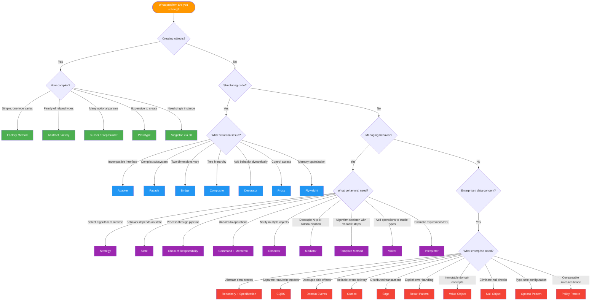
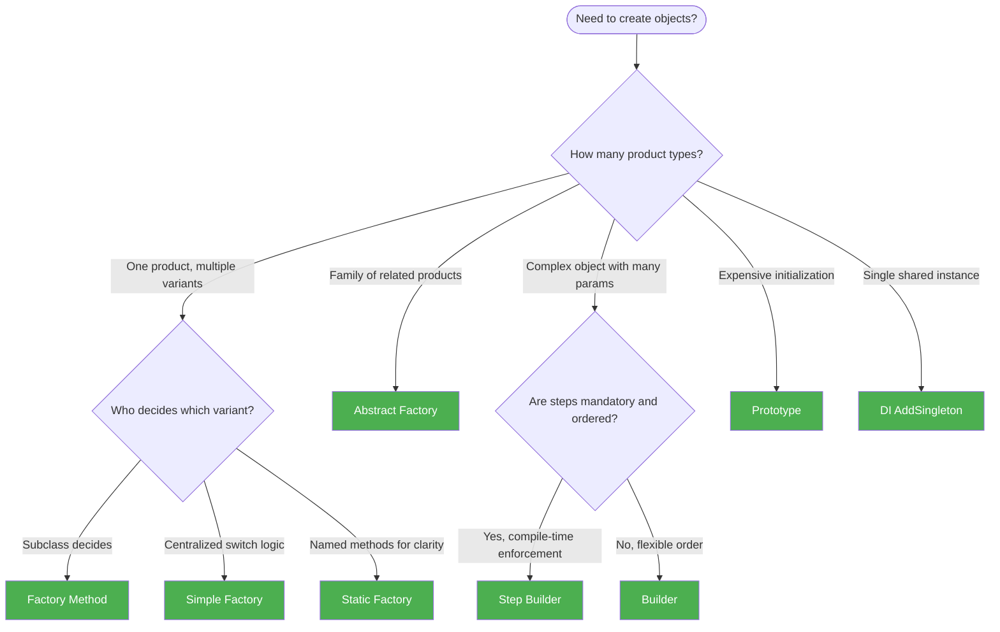
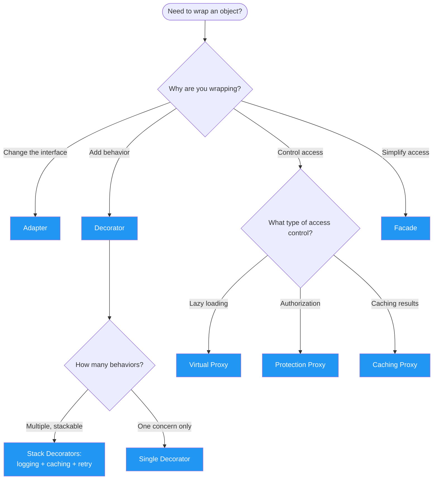
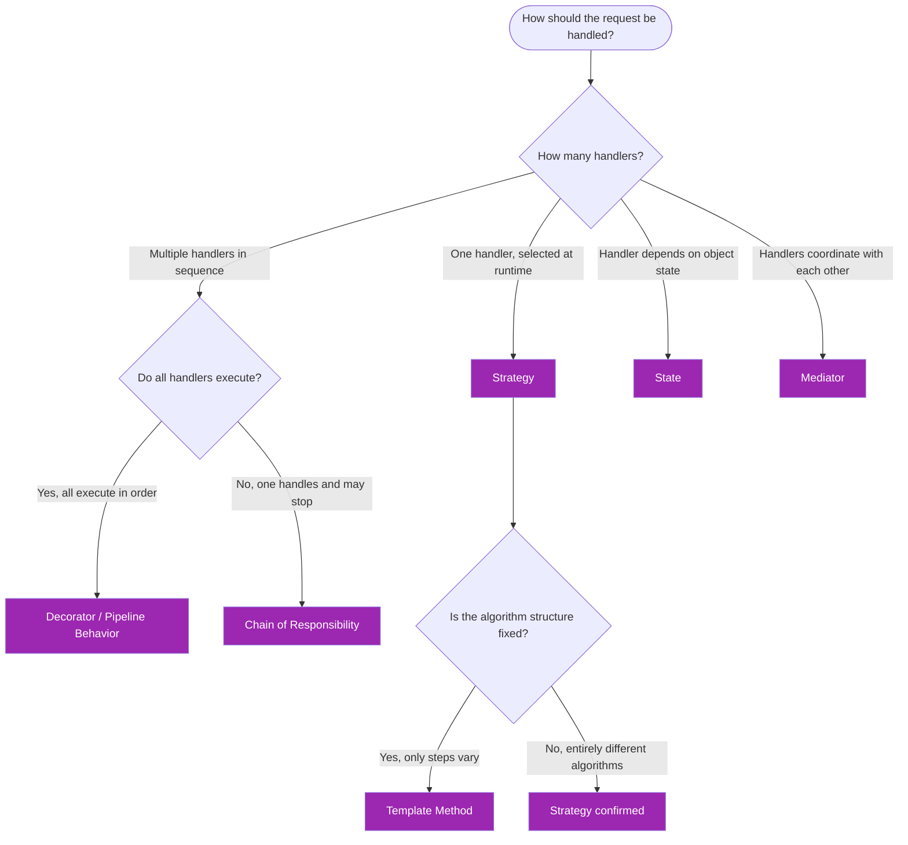
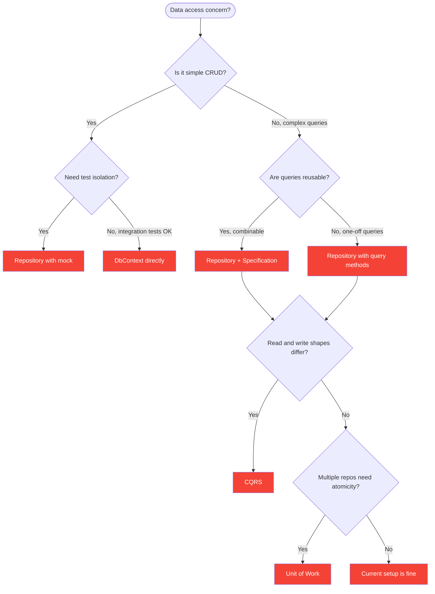

# Decision Matrix: Problems to Patterns

> A systematic mapping from problems and scenarios to recommended design patterns. Use this when you know the problem but need to choose the right pattern.

---

## Table of Contents

1. [Problem-to-Pattern Decision Matrix](#problem-to-pattern-decision-matrix)
2. [Scenario Deep Dives](#scenario-deep-dives)
3. [Decision Flowcharts](#decision-flowcharts)
4. [Pattern Selection by Quality Attribute](#pattern-selection-by-quality-attribute)
5. [Decision by .NET Layer](#decision-by-net-layer)
6. [Anti-Pattern Decisions](#anti-pattern-decisions)

---

## Problem-to-Pattern Decision Matrix

### Object Creation Scenarios

| Problem / Scenario | Primary Pattern | Alternative | Key Consideration |
|--------------------|----------------|-------------|-------------------|
| Need to create objects without specifying exact class | Factory Method | Simple Factory | Use FM when subclasses should decide; Simple Factory for centralized switch logic |
| Need named constructors with clear semantics | Static Factory | Builder | Static Factory for simple creation; Builder when multiple optional params exist |
| Need to create families of related objects that must be used together | Abstract Factory | Factory Method | AF ensures family consistency; FM when only one product dimension exists |
| Need to construct complex objects with many optional parameters | Builder | Telescoping Constructor | Builder when >4 optional params or when readable fluent API is desired |
| Need to enforce mandatory build steps in a specific order | Step Builder | Builder with validation | Step Builder for compile-time enforcement; regular Builder for runtime validation |
| Need to create objects that are expensive to initialize | Prototype | Object Pool | Prototype when objects differ slightly; Object Pool when objects are reused identically |
| Need exactly one instance of a resource across the application | Singleton (DI lifetime) | Static class | Use `AddSingleton<T>()` in .NET DI; avoid manual Singleton pattern |
| Need to create objects based on runtime configuration | Factory Method | Abstract Factory | FM for single products; AF for product families; both resolved via DI |

### Structural / Integration Scenarios

| Problem / Scenario | Primary Pattern | Alternative | Key Consideration |
|--------------------|----------------|-------------|-------------------|
| Need to integrate a third-party API with incompatible interface | Adapter | Facade | Adapter for 1:1 interface translation; Facade for simplifying an entire complex API |
| Need to simplify a complex subsystem with many classes | Facade | Adapter | Facade hides internal complexity; Adapter translates single interfaces |
| Need two dimensions of variation without class explosion | Bridge | Strategy | Bridge when both abstraction and implementation vary; Strategy for one algorithm dimension |
| Need to model tree/hierarchical structures with uniform operations | Composite | Iterator | Composite for part-whole hierarchies; Iterator for flat sequential traversal |
| Need to add behavior to objects dynamically without modification | Decorator | Proxy | Decorator for stacking behaviors (logging + caching + retry); Proxy for single access-control concern |
| Need to control access to an object (lazy load, auth, caching) | Proxy | Decorator | Proxy controls access transparently; Decorator adds new behavior |
| Need to reduce memory for thousands of similar objects | Flyweight | Object Pool | Flyweight shares intrinsic state; Object Pool reuses entire objects |
| Need to add logging/caching/retry to existing services | Decorator | Chain of Responsibility | Decorator for wrapping individual services; CoR for processing pipelines |
| Need to wrap cross-cutting concerns around service calls | Decorator | Proxy, AOP | Decorator for explicit wrapping; Proxy for transparent interception |

### Algorithm and Behavior Scenarios

| Problem / Scenario | Primary Pattern | Alternative | Key Consideration |
|--------------------|----------------|-------------|-------------------|
| Need to select an algorithm at runtime | Strategy | Template Method | Strategy uses composition (more flexible); TM uses inheritance (enforces skeleton) |
| Need to define an algorithm skeleton with customizable steps | Template Method | Strategy | TM when the algorithm has a fixed structure; Strategy when steps are fully interchangeable |
| Need to change object behavior based on internal state | State | Strategy with enums | State when behavior depends on state AND states trigger transitions; Strategy for external selection |
| Need to process requests through a pipeline of handlers | Chain of Responsibility | Decorator | CoR when handlers may stop the chain; Decorator when all layers always execute |
| Need to decouple many-to-many component communication | Mediator | Observer | Mediator centralizes communication; Observer for 1-to-many direct notification |
| Need to notify multiple objects when state changes | Observer | Domain Events | Observer for in-process sync; Domain Events for cross-boundary async with persistence |
| Need to evaluate expressions or DSL rules | Interpreter | Visitor | Interpreter for grammar evaluation; Visitor for operations on existing structures |
| Need to add operations to stable type hierarchies | Visitor | Extension Methods | Visitor for double dispatch with type hierarchy; Extension Methods for simple additions |

### State Management and Operations Scenarios

| Problem / Scenario | Primary Pattern | Alternative | Key Consideration |
|--------------------|----------------|-------------|-------------------|
| Need undo/redo support | Command + Memento | Event Sourcing | Command captures the action; Memento captures the state snapshot; Event Sourcing captures all events |
| Need to queue, log, or schedule operations | Command | Message Queue | Command for in-process; Message Queue for distributed; both encapsulate operations as data |
| Need to save and restore object state | Memento | Serialization | Memento when internal state must not be exposed; Serialization for simpler persistence |
| Need to traverse a collection without exposing internals | Iterator | LINQ | Iterator for custom collections; LINQ for standard IEnumerable-based traversal |

### Data Access and Persistence Scenarios

| Problem / Scenario | Primary Pattern | Alternative | Key Consideration |
|--------------------|----------------|-------------|-------------------|
| Need testable, swappable data access | Repository | DbContext directly | Repository adds value with multiple data sources or complex queries; DbContext suffices for simple CRUD |
| Need atomic multi-repository transactions | Unit of Work | TransactionScope | UoW with EF Core (DbContext already is UoW); TransactionScope for multi-context |
| Need composable, reusable query criteria | Specification | LINQ expressions | Specification for complex, combinable predicates; raw LINQ for simple one-off queries |
| Need to separate read and write models | CQRS | Service layer | CQRS when shapes differ significantly; Service layer when same model works for both |
| Need to model immutable domain concepts | Value Object | Record types | Value Object for domain semantics; C# record for structural equality shortcut |
| Need to handle expected failures explicitly | Result Pattern | Exceptions | Result for validation/not-found; Exceptions for unexpected failures (IO, null ref) |
| Need optional behavior with safe defaults | Null Object | Nullable types | Null Object for do-nothing behavior; Nullable when absence has semantic meaning |

### Distributed Systems Scenarios

| Problem / Scenario | Primary Pattern | Alternative | Key Consideration |
|--------------------|----------------|-------------|-------------------|
| Need to decouple domain side effects | Domain Events | Observer | Domain Events for cross-aggregate/service; Observer for in-process notifications |
| Need guaranteed event delivery with database writes | Outbox | Direct Publishing | Outbox eliminates dual-write problem; Direct Publishing when best-effort suffices |
| Need to coordinate distributed transactions | Saga | Two-Phase Commit | Saga for microservices (eventual consistency); 2PC for co-located DBs (strong consistency) |
| Need resilience for external service calls | Policy Pattern (Polly) | Manual retry | Policy Pattern for composable retry/circuit-breaker/timeout; Manual for single simple retry |
| Need strongly typed application configuration | Options Pattern | Raw IConfiguration | Options for groups of related settings; Raw for single values |
| Need composable business rule evaluation | Policy Pattern | Specification | Policy for business rules (yes/no + violations); Specification for query predicates |

### Cross-Cutting Concern Scenarios

| Problem / Scenario | Primary Pattern | Alternative | Key Consideration |
|--------------------|----------------|-------------|-------------------|
| Need to add logging to all service calls | Decorator | AOP / Interceptors | Decorator for explicit wrapping; AOP for implicit interception |
| Need to add caching to specific operations | Caching Proxy | Decorator | Proxy when caching is the primary concern; Decorator when stacking with other behaviors |
| Need to add authorization checks before operations | Protection Proxy | Middleware | Proxy for per-service auth; Middleware for request-level auth |
| Need to add validation to incoming requests | Chain of Responsibility | MediatR Pipeline | CoR for custom pipelines; MediatR Pipeline Behaviors for CQRS architectures |
| Need to add retry/circuit-breaker to HTTP calls | Policy Pattern | Decorator | Policy Pattern (Polly) for resilience; Decorator for general behavior wrapping |

---

## Scenario Deep Dives

### Scenario: "I need runtime algorithm selection"

**Context:** Your application has multiple ways to perform the same operation (e.g., pricing strategies, sorting algorithms, payment processors).

| Factor | Recommendation |
|--------|---------------|
| Algorithms are fully interchangeable | **Strategy** -- inject different implementations via DI |
| Algorithm has fixed steps, only details vary | **Template Method** -- override specific steps in subclasses |
| Algorithm needs to be selected based on input type | **Factory Method + Strategy** -- factory creates the right strategy |
| Only 2-3 simple options | **Switch/if-else** -- do not over-pattern simple choices |

### Scenario: "I need to create families of objects"

| Factor | Recommendation |
|--------|---------------|
| Objects must be from the same family and not mix | **Abstract Factory** -- enforces family consistency |
| Only one product type, multiple variants | **Factory Method** -- simpler, one dimension |
| Objects are complex with many optional parts | **Builder** -- step-by-step construction |
| Objects are expensive to create from scratch | **Prototype** -- clone a pre-configured template |

### Scenario: "I need undo support"

| Factor | Recommendation |
|--------|---------------|
| Need to undo individual operations | **Command** -- each command stores how to reverse itself |
| Need to undo to a specific state checkpoint | **Memento** -- snapshots of entire state |
| Need both operation-level and state-level undo | **Command + Memento** -- Command triggers Memento save before execution |
| Need full audit trail of all changes ever made | **Event Sourcing** -- store all events, replay to any point |

### Scenario: "I need cross-cutting concerns"

| Factor | Recommendation |
|--------|---------------|
| Adding behavior to individual services (logging, caching) | **Decorator** -- wrap each service |
| Request-level pipeline (validation, logging, auth) | **Chain of Responsibility** or **MediatR Pipeline Behaviors** |
| Transparent interception without code changes | **Proxy** (DispatchProxy) or **AOP** (Castle.Core) |
| Authorization before method execution | **Protection Proxy** |
| Caching method results | **Caching Proxy** |
| Resilience (retry, circuit breaker) | **Policy Pattern** (Polly) |

### Scenario: "I need state management"

| Factor | Recommendation |
|--------|---------------|
| Object behavior changes dramatically with internal state | **State** -- each state is a class with its own behavior |
| Only status tracking, no behavior change | **Enum** -- simple status property |
| State transitions with side effects | **State + Domain Events** -- state transitions raise events |
| Saving/restoring state (checkpoints, undo) | **Memento** -- snapshots without exposing internals |

### Scenario: "I need to handle data access"

| Factor | Recommendation |
|--------|---------------|
| Simple CRUD, single data source, EF Core | **DbContext directly** -- no wrapper needed |
| Complex queries, multiple data sources, need testability | **Repository + Specification** -- encapsulate and compose queries |
| Read/write models differ significantly in shape or scale | **CQRS** -- separate models and potentially separate stores |
| Multiple repos must commit atomically | **Unit of Work** (or just DbContext's built-in UoW) |
| Need testable data access without hitting database | **Repository** -- mock the interface; or use in-memory DB |

### Scenario: "I am building a microservices system"

| Factor | Recommendation |
|--------|---------------|
| Services need to react to domain changes | **Domain Events + Outbox** -- reliable async event delivery |
| Multi-service workflow with rollback needs | **Saga** -- compensating actions for each step |
| Services need independent read/write scaling | **CQRS** -- separate read/write models and stores |
| External service calls may fail transiently | **Policy Pattern** -- retry, circuit breaker, timeout |
| Services need to integrate with different APIs | **Adapter** -- isolate each external API behind a common interface |

---

## Decision Flowcharts

### Master Decision Flowchart



### Creational Pattern Decision Tree



### Wrapping Pattern Decision Tree



### Behavioral Request Handling Decision Tree



### Data Access Decision Tree



---

## Pattern Selection by Quality Attribute

### Prioritizing Testability

| Priority | Pattern | Why |
|----------|---------|-----|
| High | Strategy | Algorithms injected; easy to mock and verify |
| High | Repository | Data access abstracted; mock the interface |
| High | Result Pattern | Return values, not exceptions; easy to assert |
| High | Specification | Query logic testable against in-memory collections |
| Medium | Decorator | Each decorator testable independently |
| Medium | Command | Each command testable in isolation |
| Medium | Factory Method | Creation logic isolated and testable |

### Prioritizing Extensibility (Open/Closed Principle)

| Priority | Pattern | Why |
|----------|---------|-----|
| High | Strategy | Add algorithms without modifying context |
| High | Factory Method | Add product types without modifying consumers |
| High | Decorator | Add behaviors without modifying existing code |
| High | Visitor | Add operations without modifying element classes |
| Medium | Chain of Responsibility | Add handlers without modifying pipeline |
| Medium | Observer | Add subscribers without modifying publisher |
| Medium | Abstract Factory | Add product families with a new factory |

### Prioritizing Performance

| Priority | Pattern | Why |
|----------|---------|-----|
| High | Flyweight | Reduces memory for many similar objects |
| High | Caching Proxy | Avoids redundant expensive operations |
| High | Prototype | Avoids expensive object construction |
| Medium | CQRS | Optimizes read path independently of writes |
| Medium | Virtual Proxy | Defers expensive initialization until needed |
| Medium | Iterator | Lazy evaluation, process only what is needed |

### Prioritizing Maintainability

| Priority | Pattern | Why |
|----------|---------|-----|
| High | Facade | Hides subsystem complexity from consumers |
| High | Adapter | Isolates external API changes to one class |
| High | State | Eliminates complex state-dependent conditionals |
| High | Mediator | Decouples component communication |
| Medium | Bridge | Prevents class explosion from multiple dimensions |
| Medium | Result Pattern | Makes error handling explicit and traceable |

### Prioritizing Reliability

| Priority | Pattern | Why |
|----------|---------|-----|
| High | Outbox | Guarantees event delivery alongside writes |
| High | Saga | Handles distributed failures with compensation |
| High | Policy Pattern | Retry, circuit breaker, timeout for external calls |
| Medium | Result Pattern | Explicit error handling, no silent failures |
| Medium | Null Object | Eliminates NullReferenceExceptions |
| Medium | Value Object | Self-validating; invalid states impossible |

---

## Decision by .NET Layer

### ASP.NET Core Web API

| Layer | Pattern(s) | Purpose |
|-------|-----------|---------|
| Controllers | Facade, Mediator | Thin controllers that delegate to services |
| Middleware | Chain of Responsibility, Decorator | Request pipeline, cross-cutting concerns |
| Filters | Strategy, Chain of Responsibility | Authorization, validation, exception handling |
| Configuration | Options Pattern, Builder | Typed settings with validation |
| DI Registration | Factory Method, Singleton lifetime | Service resolution and lifetime management |

### Application / Service Layer

| Concern | Pattern(s) | Purpose |
|---------|-----------|---------|
| Use case handlers | Command, CQRS, Mediator | Encapsulate application logic |
| Validation | Specification, Policy, Result Pattern | Composable validation rules |
| Orchestration | Saga, Mediator | Multi-step workflow coordination |
| Event handling | Domain Events, Observer | React to domain changes |

### Domain Layer

| Concern | Pattern(s) | Purpose |
|---------|-----------|---------|
| Entities | State, Value Object | Rich domain objects with behavior |
| Business rules | Specification, Policy, Strategy | Encapsulated, testable rules |
| Domain events | Domain Events, Observer | Decoupled side effects |
| Value types | Value Object, Flyweight | Immutable domain primitives |

### Infrastructure Layer

| Concern | Pattern(s) | Purpose |
|---------|-----------|---------|
| Data access | Repository, Unit of Work, Specification | Persistence abstraction |
| External services | Adapter, Proxy | Integration isolation |
| Messaging | Outbox, Observer | Reliable event delivery |
| Resilience | Decorator, Policy Pattern | Retry, circuit breaker, timeout |
| Caching | Proxy, Decorator, Flyweight | Performance optimization |

---

## Anti-Pattern Decisions: When NOT to Use a Pattern

| Scenario | DO NOT Use | Instead Use | Why |
|----------|-----------|-------------|-----|
| Only one algorithm, no variation | Strategy | Direct method call | Pattern adds classes without benefit |
| Simple CRUD with one model | CQRS | Service layer or DbContext | Fake CQRS adds ceremony, not value |
| Only one implementation of interface | Repository (wrapping EF) | DbContext directly | Double abstraction with no gain |
| 2-3 simple states with minimal behavior | State pattern (full) | If/switch statement | Clearer and less code |
| One subscriber for events | Observer | Direct method call | Observer adds indirection for one consumer |
| Simple service call routing | MediatR | Direct DI injection | Mediator hides dependency graph |
| Same read/write model | CQRS handlers | Unified service class | Separate handlers add no value |
| No undo/queuing needs | Command | Direct method invocation | Command's benefits are unused |
| Flat data structure | Composite | Simple list/array | Composite adds tree complexity unnecessarily |
| No realistic second implementation | Interface extraction | Concrete class | Premature abstraction |

---

## Pattern Compatibility Matrix

Which patterns work well together?

| Pattern A | Works Well With |
|-----------|----------------|
| Factory Method | Strategy, Prototype, Singleton, DI |
| Abstract Factory | Bridge, Prototype, Builder |
| Builder | Composite, Prototype, Step Builder |
| Strategy | Factory Method, Template Method, DI |
| Decorator | Proxy, Strategy, Chain of Responsibility |
| Observer | Mediator, Command, Domain Events |
| Command | Memento, Chain of Responsibility, Strategy |
| State | Strategy, Factory Method, Observer, Domain Events |
| Composite | Iterator, Visitor, Builder |
| Repository | Unit of Work, Specification, CQRS |
| CQRS | Domain Events, Outbox, Specification |
| Domain Events | Outbox, Saga, Observer |
| Result Pattern | Specification, Policy Pattern, CQRS |
| Specification | Repository, Policy Pattern, Result Pattern |
| Saga | Outbox, Domain Events, Command |

---

## Quick Decision Rules

1. **"I need to create an object, but the type depends on input."** --> **Factory Method**
2. **"I have AWS services and Azure services that must not mix."** --> **Abstract Factory**
3. **"My constructor has too many parameters."** --> **Builder**
4. **"I need to wrap a third-party API."** --> **Adapter**
5. **"I want to add retry logic without changing my service."** --> **Decorator**
6. **"My subsystem has 10 classes but clients need one call."** --> **Facade**
7. **"I have an if/else chain checking order status."** --> **State**
8. **"I need different pricing algorithms."** --> **Strategy**
9. **"I need undo functionality."** --> **Command + Memento**
10. **"Multiple services must react to an order being placed."** --> **Observer / Domain Events**
11. **"My database queries are complex and repeated."** --> **Specification**
12. **"Reads and writes need different models."** --> **CQRS**
13. **"Events must not be lost even if the broker is down."** --> **Outbox**
14. **"A workflow spans three microservices."** --> **Saga**
15. **"I keep checking if the result is null."** --> **Null Object** or **Result Pattern**

---

## Complexity vs Value Assessment

Before choosing a pattern, plot it on this mental model:

```
HIGH VALUE
    |
    |  Strategy          CQRS           Saga
    |  Factory Method    Domain Events
    |  Decorator         Outbox
    |  Adapter           Specification
    |  Observer          Builder
    |  Result Pattern    Repository+UoW
    |  State             Mediator
    |  Facade            Visitor
    |  Null Object
    |  Value Object      Interpreter
    |  Options Pattern   Flyweight
    |
LOW VALUE ─────────────────────────────────── HIGH COMPLEXITY
    LOW COMPLEXITY
```

- **Top-left** (high value, low complexity): Always use when applicable.
- **Top-right** (high value, high complexity): Use when the problem demands it.
- **Bottom-left** (low value, low complexity): Use for convenience, do not overthink.
- **Bottom-right** (low value, high complexity): Avoid unless specifically needed.

---

## Next Steps

- [Comparison Maps](comparison-maps.md) -- Side-by-side visual comparisons with Mermaid diagrams
- [Interview Cheat Sheet](interview-revision-cheatsheet.md) -- Quick revision for all patterns
- [Anti-Patterns](anti-patterns.md) -- Detailed guide on pattern misuse
- [Enterprise Patterns Summary](enterprise-patterns-summary.md) -- Full enterprise pattern reference
