# Comparison Maps

> Side-by-side comparisons of commonly confused design patterns, with Mermaid diagrams, comparison tables, and clear guidance on when to use which.

---

## Table of Contents

1. [Factory Method vs Abstract Factory](#1-factory-method-vs-abstract-factory)
2. [Strategy vs State](#2-strategy-vs-state)
3. [Decorator vs Proxy](#3-decorator-vs-proxy)
4. [Facade vs Adapter](#4-facade-vs-adapter)
5. [Command vs Chain of Responsibility](#5-command-vs-chain-of-responsibility)
6. [Observer vs Mediator](#6-observer-vs-mediator)
7. [Builder vs Abstract Factory](#7-builder-vs-abstract-factory)
8. [Repository vs Specification](#8-repository-vs-specification)
9. [CQRS vs CRUD](#9-cqrs-vs-crud)
10. [Domain Events vs Observer](#10-domain-events-vs-observer)
11. [Master Comparison Diagram](#master-comparison-diagram)
12. [Quick Cheat Sheet](#quick-cheat-sheet)

---

## 1. Factory Method vs Abstract Factory

### Key Difference in One Sentence

Factory Method creates **one product** via a method override in subclasses; Abstract Factory creates **a family of related products** via a factory object.

### Side-by-Side Table

| Aspect | Factory Method | Abstract Factory |
|--------|---------------|-----------------|
| **Intent** | Defer instantiation of one product to subclasses | Create families of related products without specifying concrete classes |
| **Structure** | One creation method, overridden by subclasses | Multiple creation methods on a single factory interface |
| **Products created** | One product type at a time | Multiple related products per factory call |
| **Mechanism** | Inheritance -- subclass overrides the factory method | Composition -- client uses a factory object |
| **Extensibility** | Add a new creator subclass per product variant | Add a new factory implementation per product family |
| **Client knows** | The creator interface, not the product class | The factory interface, not any product classes |
| **Complexity** | Low -- one interface, one method | Higher -- multiple product interfaces, one factory interface |
| **Use when** | Single product varies by config or runtime input | Multiple products must be used together consistently |
| **Avoid when** | Only one concrete product exists | Only one product family exists |
| **This repo example** | `PaymentProcessorFactory` creates one `IPaymentProcessor` | `ICloudInfrastructureFactory` creates `IBlobStorage` + `IQueueClient` |

### Mermaid Diagram

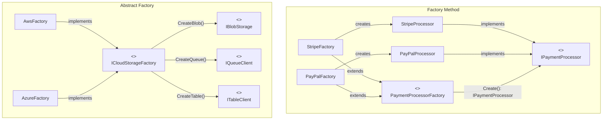

### When to Use Which

- **Factory Method**: "I need to create ONE type of payment processor, and the specific type depends on runtime configuration. Adding a new processor (Stripe, PayPal, Square) means adding a new factory subclass."
- **Abstract Factory**: "I need blob storage, a queue client, AND a table client. They must all come from the same cloud provider. AWS S3 + SQS + DynamoDB or Azure Blob + Queue + Table -- never mixed."

---

## 2. Strategy vs State

### Key Difference in One Sentence

Strategy lets the **client choose** which algorithm to use; State lets the **object itself** change behavior as its internal state transitions.

### Side-by-Side Table

| Aspect | Strategy | State |
|--------|----------|-------|
| **Intent** | Define a family of interchangeable algorithms | Change object behavior when internal state changes |
| **Structure** | Context holds a strategy reference set by the client | Context holds a state reference that replaces itself |
| **Who decides** | The client or external configuration | The object itself via internal transitions |
| **Awareness** | Strategies are independent, unaware of each other | States know about valid next states and trigger transitions |
| **Transitions** | No concept of transitioning between strategies | States transition to other states as events occur |
| **Lifetime** | Strategy set once or changed explicitly by client | State changes automatically during the object's lifecycle |
| **Use when** | You have multiple algorithms for the same task | Object behavior is entirely determined by its state |
| **Avoid when** | Only one algorithm exists | Only 2-3 simple states with trivial behavior differences |
| **This repo example** | `IPricingStrategy` -- Regular, Premium, Bulk pricing | `IOrderState` -- Draft, Submitted, Shipped, Delivered |

### Mermaid Diagram

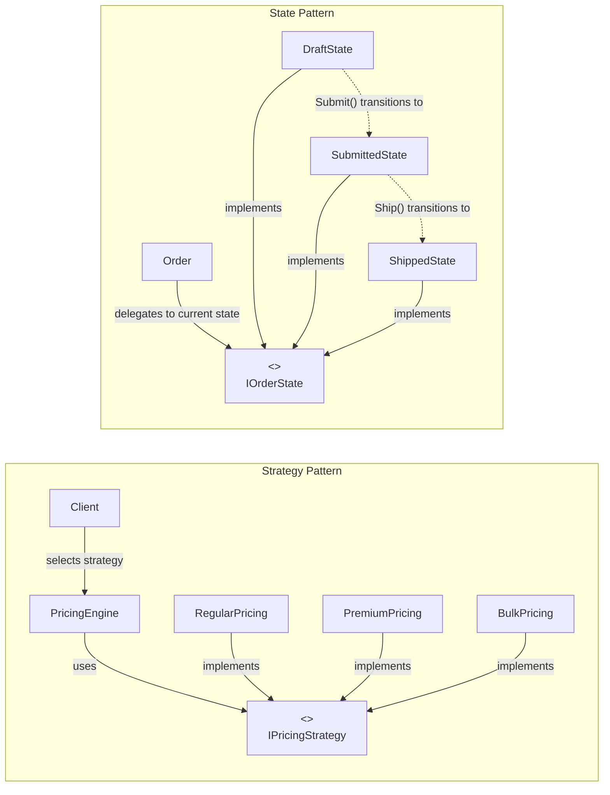

### When to Use Which

- **Strategy**: "The caller decides which pricing algorithm to use. The pricing engine does not care which strategy is active -- the client or configuration selects it. Strategies never transition between each other."
- **State**: "An order moves through its lifecycle: Draft -> Submitted -> Shipped -> Delivered. In Draft state, items can be added. In Shipped state, adding items throws an error. The order transitions itself when events occur."

**Key test**: If the object changes its own behavior based on what happened to it, use State. If the caller decides the behavior, use Strategy.

---

## 3. Decorator vs Proxy

### Key Difference in One Sentence

Decorator **adds new behavior** to an object by wrapping it; Proxy **controls access** to an object by standing in for it.

### Side-by-Side Table

| Aspect | Decorator | Proxy |
|--------|-----------|-------|
| **Intent** | Attach additional responsibilities dynamically | Provide a surrogate to control access to the real object |
| **Structure** | Wraps the same interface; multiple decorators stack | Wraps the same interface; typically one proxy layer |
| **Stacking** | Multiple decorators compose: `log(retry(cache(real)))` | Usually a single proxy |
| **Lifecycle** | Does NOT manage the wrapped object's lifecycle | MAY manage the real object's lifecycle (lazy creation) |
| **Client awareness** | Client often assembles the decorator chain explicitly | Client typically does not know a proxy is being used |
| **Typical uses** | Logging, retry, metrics, validation, compression | Lazy loading, authorization, caching, remote access |
| **Use when** | You want to stack multiple behaviors dynamically | You want to transparently control access for one concern |
| **Avoid when** | Only one behavior is needed and never changes | Direct access is acceptable and no access control is needed |
| **This repo example** | `LoggingDecorator(RetryDecorator(HttpApiClient))` | `CachingInventoryProxy`, `AuthorizationProxy` |

### Mermaid Diagram

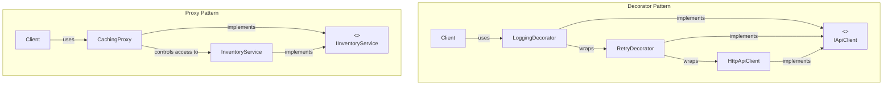

### When to Use Which

- **Decorator**: "I want to add logging AND retry AND caching as composable, stackable layers around my API client. Each layer is independently addable or removable."
- **Proxy**: "I want the inventory service to transparently cache its results. The caller does not know a proxy is involved; it just calls the service normally."

**Overlap note**: Caching can be either. Use Proxy when the cache is an intrinsic, transparent part of how the service works. Use Decorator when caching is one of several composable behaviors being assembled.

---

## 4. Facade vs Adapter

### Key Difference in One Sentence

Facade **simplifies** your own complex subsystem behind a single entry point; Adapter **translates** an external, incompatible interface to match what your code expects.

### Side-by-Side Table

| Aspect | Facade | Adapter |
|--------|--------|---------|
| **Intent** | Provide a simplified interface to a complex subsystem | Convert one interface into another that clients expect |
| **Structure** | One class wrapping N subsystem classes | One class wrapping one incompatible class |
| **Scope** | Entire subsystem (many classes orchestrated) | Single class or interface translation |
| **Interface change** | Defines a NEW, simpler interface | Conforms to an EXISTING target interface |
| **Code ownership** | You own the subsystem code | You typically do NOT own the adaptee code |
| **Direction** | Inward -- hides your own complexity | Outward -- integrates external code into your system |
| **Use when** | Clients need a simple API over a complex subsystem | A third-party API does not match your expected interface |
| **Avoid when** | The subsystem is already simple | You control both interfaces and can simply unify them |
| **This repo example** | `ReportFacade` orchestrates DataFetcher + Formatter + Renderer | `FedExAdapter` wraps FedEx SDK behind `IShippingCarrier` |

### Mermaid Diagram

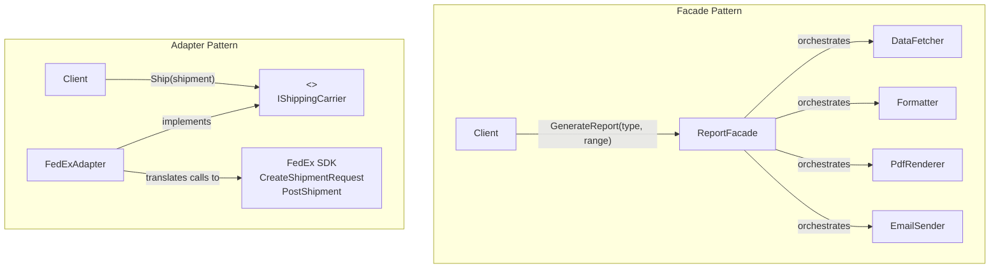

### When to Use Which

- **Facade**: "Our report generation involves DataFetcher, Formatter, PdfRenderer, and EmailSender. We need a one-method entry point: `GenerateReport(type, dateRange)`. All the code is ours."
- **Adapter**: "FedEx's SDK has `CreateShipmentRequest()` and `PostShipment()`, but our code expects `IShippingCarrier.Ship(Shipment)`. We need a translation layer."

---

## 5. Command vs Chain of Responsibility

### Key Difference in One Sentence

Command **encapsulates an action** as an object for execution control (undo, queue, log); Chain of Responsibility **routes a request** through a pipeline of handlers until one processes it.

### Side-by-Side Table

| Aspect | Command | Chain of Responsibility |
|--------|---------|------------------------|
| **Intent** | Encapsulate a request as an object | Avoid coupling the sender to the receiver by giving multiple objects a chance to handle |
| **Structure** | Command object with `Execute()` and optionally `Undo()` | Chain of handler objects, each with a `Handle()` and reference to the next |
| **Focus** | WHAT to do (encapsulate the action) | WHO should handle (route the request) |
| **Execution** | One receiver executes the command | Zero, one, or many handlers may process the request |
| **Undo** | Built-in undo/redo support | Not typically undoable |
| **Queuing** | Commands can be queued, logged, serialized, replayed | Requests flow through the chain immediately |
| **Use when** | You need undo, queuing, logging, or macro recording | Multiple handlers may process a request; the handler is determined at runtime |
| **Avoid when** | Simple actions with no undo/queuing needs | There is always exactly one handler |
| **This repo example** | `ShipOrderCommand` with `Execute()` and `Undo()` | Approval chain: Lead -> Manager -> VP -> CFO |

### Mermaid Diagram

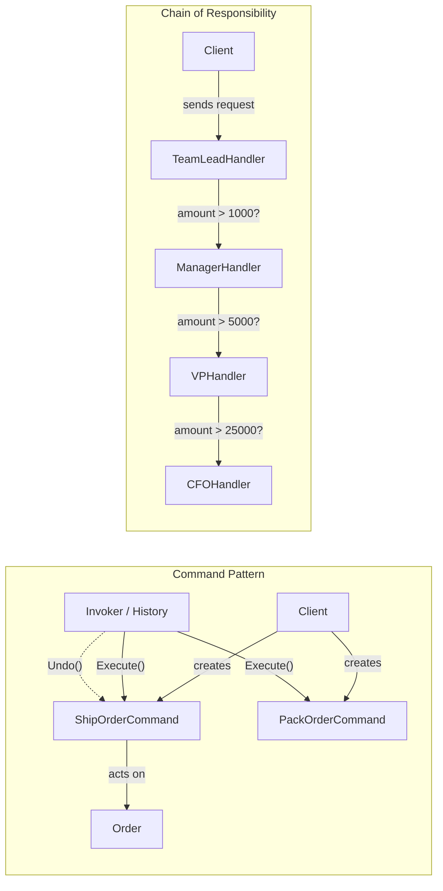

### When to Use Which

- **Command**: "I need to execute order fulfillment steps, log each one for audit, and potentially undo them. Each command is a self-contained action with state."
- **Chain of Responsibility**: "An expense request of $3,000 should be approved by a Manager (handles up to $5,000). A $10,000 request passes through to the VP. The chain decides WHO handles it."

**Key test**: Command is about WHAT to do (and being able to undo/replay it). CoR is about WHO should handle it (routing through a pipeline).

---

## 6. Observer vs Mediator

### Key Difference in One Sentence

Observer **broadcasts** notifications from one subject to many independent listeners; Mediator **coordinates** complex bidirectional communication among many peers through a central hub.

### Side-by-Side Table

| Aspect | Observer | Mediator |
|--------|----------|---------|
| **Intent** | Define a one-to-many dependency so dependents are notified of state changes | Define an object that encapsulates how a set of objects interact |
| **Structure** | Subject holds a list of observers; notifies all on change | Mediator holds references to all colleagues; routes messages between them |
| **Communication** | One-to-many (broadcast) | Many-to-many (through central hub) |
| **Knowledge** | Subject knows observer interface only | Mediator knows all colleague types and their interactions |
| **Coupling** | Observers loosely coupled to subject via interface | Colleagues fully decoupled from each other |
| **Direction** | Subject pushes to all observers (unidirectional) | Colleagues communicate bidirectionally via mediator |
| **Complexity** | Low -- simple pub/sub | Higher -- mediator contains coordination logic |
| **Use when** | One source broadcasts to many independent listeners | Many components interact in complex, interdependent ways |
| **Avoid when** | There is only one subscriber | Only two components communicate |
| **This repo example** | `PatientMonitor` notifies Dashboard + AlertSystem | Checkout coordinates Inventory + Payment + Shipping |

### Mermaid Diagram

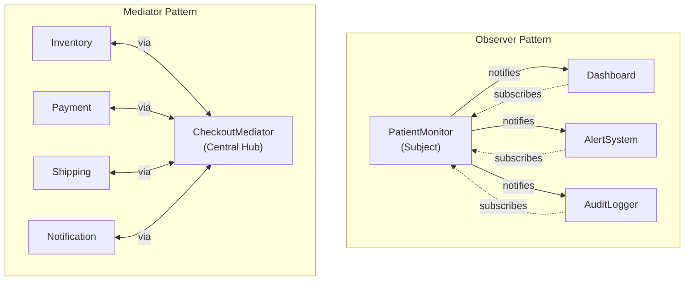

### When to Use Which

- **Observer**: "When a patient's heart rate changes, the dashboard, alert system, and logger all need to update. Simple broadcast -- one source, many independent listeners."
- **Mediator**: "During checkout, inventory must be checked before payment, payment must succeed before shipping is initiated, and notification depends on all of them. Complex coordination -- many peers with interdependencies."

**Key test**: If communication is one-directional (publish -> subscribe), use Observer. If communication is bidirectional and interdependent (A talks to B which affects C which updates A), use Mediator.

---

## 7. Builder vs Abstract Factory

### Key Difference in One Sentence

Builder constructs **one complex product** step by step with optional parts; Abstract Factory creates **a family of related products** in a single operation.

### Side-by-Side Table

| Aspect | Builder | Abstract Factory |
|--------|---------|-----------------|
| **Intent** | Separate the construction of a complex object from its representation | Create families of related objects without specifying concrete classes |
| **Structure** | Fluent API with step methods and a `Build()` finalizer | Factory interface with multiple `Create*()` methods |
| **Products** | One complex product assembled step by step | Multiple related, simpler products |
| **Construction** | Incremental -- `SetX().AddY().Build()` | All at once -- each `Create*()` returns a product |
| **Optional parts** | Supports optional parts, defaults, and conditional steps | All products are typically required from the family |
| **Validation** | Can validate at each step or at build time | Validates family compatibility |
| **Use when** | Building a complex object with many optional parameters | Creating related objects that must be from the same family |
| **Avoid when** | The object is simple (2-3 required fields) | Only one product family exists |
| **This repo example** | `InvoiceBuilder.SetCustomer().AddLineItem().Build()` | `AwsFactory.CreateBlob()` + `CreateQueue()` + `CreateTable()` |

### Mermaid Diagram

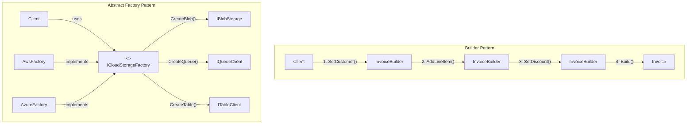

### When to Use Which

- **Builder**: "An invoice has required fields (customer, at least one line item) and optional fields (discount percentage, notes, payment terms, custom footer). I want to build it step by step with a fluent API and validate at build time."
- **Abstract Factory**: "I need blob storage, a queue client, and a table client that all come from the same cloud provider. AWS or Azure, but never mixed. Each product is created independently but from the same factory."

---

## 8. Repository vs Specification

### Key Difference in One Sentence

Repository manages **how** data is accessed (CRUD operations); Specification defines **what** data to access (query criteria).

### Side-by-Side Table

| Aspect | Repository | Specification |
|--------|-----------|---------------|
| **Intent** | Mediate between domain and data mapping layers using a collection-like interface | Encapsulate query logic in a composable, reusable object |
| **Structure** | Interface with `Add()`, `GetById()`, `Delete()`, `Find(spec)` | Class with `IsSatisfiedBy()` and `ToExpression()` |
| **Responsibility** | HOW to access data (persistence mechanics) | WHAT data to access (filtering, sorting, includes) |
| **Composability** | Not composable; each repository is standalone per entity | Composable via AND, OR, NOT operators |
| **Reusability** | Per entity type | Per business rule, reusable across any query context |
| **Testability** | Mock the repository interface | Unit test the specification against in-memory objects |
| **Relationship** | Repository *uses* specifications | Specification is *passed to* repository |
| **Common mistake** | Adding a new method for every query variant | Over-specifying trivial one-off queries |
| **Use when** | Always, when abstracting data access | Queries are complex, dynamic, reusable, and combinable |
| **Avoid when** | Simple CRUD with EF Core (DbContext suffices) | Queries are simple `Where()` clauses |

### Mermaid Diagram

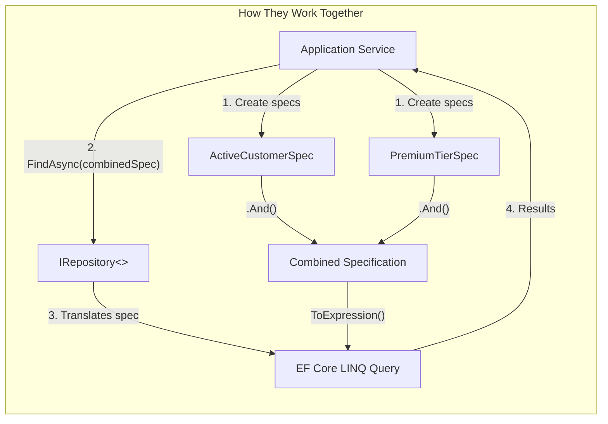

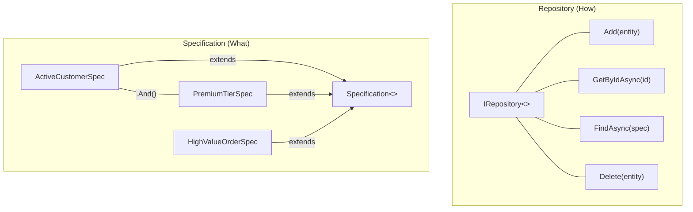

### When to Use Which

They are **complementary, not competing**:
- **Repository**: Always when you need to abstract data access. Provides CRUD operations.
- **Specification**: Add it when your queries are complex, dynamic, reusable, and need to be combined. Pass specifications TO the repository's `Find(spec)` method.

**Combined example**: `var customers = await _repo.FindAsync(new ActiveCustomerSpec().And(new PremiumTierSpec()));`

---

## 9. CQRS vs CRUD

### Key Difference in One Sentence

CQRS **separates** read and write models for independent optimization and scaling; CRUD uses a **single model** for all operations.

### Side-by-Side Table

| Aspect | CQRS | CRUD |
|--------|------|------|
| **Intent** | Separate the model for reading from the model for writing | Use one model for all create, read, update, delete operations |
| **Structure** | Separate command handlers and query handlers with different models | Single service/controller with one entity model |
| **Models** | Write model (domain entity) + Read model (DTO/projection) | One entity model serves both reads and writes |
| **Scalability** | Read and write sides scale independently | Read and write scale together |
| **Consistency** | Often eventually consistent between stores | Immediately consistent |
| **Performance** | Reads use denormalized views, caches, search indices | Reads and writes share the same tables and indexes |
| **Complexity** | Higher -- two models, synchronization, eventual consistency | Lower -- one model, one path, one data store |
| **Team skill** | Must understand eventual consistency, projections | Standard CRUD knowledge |
| **Use when** | Read/write models differ; high read volume; event sourcing | Simple CRUD; same shape for reads and writes; small team |
| **Avoid when** | Same model works for both; app is simple CRUD | Read performance is suffering; models have diverged |
| **Migration trigger** | Read queries becoming complex projections; write contention affecting reads | -- |

### Mermaid Diagram

```mermaid
graph TD
    subgraph "CRUD Architecture"
        CRUD_Client[Client] -->|"GET/POST/PUT/DELETE"| CRUD_Controller[OrderController]
        CRUD_Controller -->|uses| CRUD_Service[OrderService]
        CRUD_Service -->|uses| CRUD_Model[Order Entity]
        CRUD_Model -->|reads and writes| CRUD_DB[(Single Database)]
    end

    subgraph "CQRS Architecture"
        CQRS_Client[Client] -->|"POST (write)"| CQRS_CmdHandler[CreateOrderCommandHandler]
        CQRS_Client -->|"GET (read)"| CQRS_QueryHandler[GetOrderQueryHandler]
        CQRS_CmdHandler -->|uses| CQRS_WriteModel[Order Aggregate<br/>Rich Domain Model]
        CQRS_QueryHandler -->|uses| CQRS_ReadModel[OrderDto / ReadModel]
        CQRS_WriteModel -->|writes to| CQRS_WriteDB[(Write Database)]
        CQRS_WriteDB -->|projects events to| CQRS_ReadDB[(Read Store<br/>Denormalized Views)]
        CQRS_ReadModel -->|reads from| CQRS_ReadDB
    end
```

### When to Use Which

- **CRUD**: "Users can create, view, edit, and delete orders. The read and write shapes are identical. We are a small team and immediate consistency is important." Stay with CRUD.
- **CQRS**: "Our order list page needs a denormalized view joining 5 tables with aggregated totals. Write operations enforce 15 complex business invariants. Reads are 100x more frequent than writes. We need to scale reads independently." Adopt CQRS.

**Migration trigger**: Consider moving from CRUD to CQRS when:
- Read queries become complex multi-table projections.
- Read performance suffers due to write contention (locks).
- Read and write models have naturally diverged in shape.
- You are adopting event sourcing and need read-side projections.

---

## 10. Domain Events vs Observer

### Key Difference in One Sentence

Domain Events are **semantically meaningful business events** dispatched through infrastructure (async, persistent, cross-service); Observer is a **low-level notification mechanism** between objects (sync, ephemeral, in-process).

### Side-by-Side Table

| Aspect | Domain Events | Observer (GoF) |
|--------|---------------|----------------|
| **Intent** | Publish business-meaningful events from domain aggregates | Notify dependents when a subject's state changes |
| **Structure** | Event objects dispatched by a bus/mediator to DI-registered handlers | Subject holds a list of observer references; notifies directly |
| **Scope** | Cross-aggregate, cross-bounded-context, potentially cross-service | Within a single subsystem or object graph |
| **Coupling** | Fully decoupled -- publisher has zero knowledge of handlers | Subject knows the observer interface; observers know the subject |
| **Payload** | Rich event objects with domain semantics (`OrderPlacedEvent`) | Raw state change data or the subject itself |
| **Dispatch** | Asynchronous or deferred; often dispatched after `SaveChanges()` | Synchronous and immediate |
| **Registration** | Handlers auto-discovered via DI container | Observers explicitly subscribe/unsubscribe at runtime |
| **Persistence** | Events can be persisted (outbox, event store) for replay | Notifications are ephemeral -- lost if not received |
| **Idempotency** | Required -- events may be replayed or delivered more than once | Not typically needed |
| **Use when** | Business events with side effects, cross-service, audit trail | Simple in-process notifications, UI updates, real-time displays |
| **Avoid when** | Side effects are trivial and always in-process | Events must cross service boundaries or be persisted |
| **This repo example** | `OrderPlacedEvent` -> email handler + inventory handler + audit handler | `PatientMonitor` -> Dashboard + AlertSystem + Logger |

### Mermaid Diagram

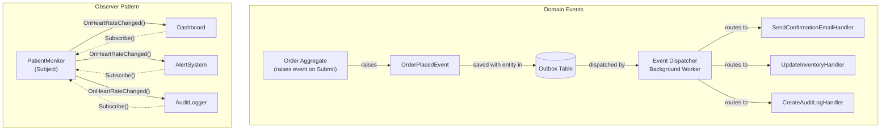

### When to Use Which

- **Observer**: "When a patient monitor reading changes, the dashboard, alert system, and logger should update immediately in the same process. It is a simple, synchronous, in-memory notification."
- **Domain Events**: "When an order is placed, send a confirmation email, update inventory projections, create an audit trail, and notify the fulfillment service. These are business-level events that may cross service boundaries, must be persisted for reliability, and handlers run independently."

**Evolution path**: Many systems start with Observer for simple notifications and evolve to Domain Events + Outbox as requirements grow to include persistence, async delivery, cross-service communication, and replay capability.

---

## Master Comparison Diagram

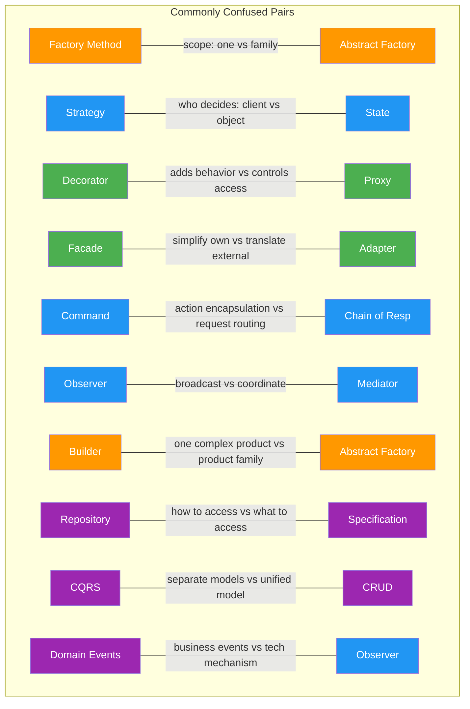

---

## Quick Cheat Sheet

| Pair | Use A When... | Use B When... |
|------|--------------|--------------|
| **Factory Method** vs **Abstract Factory** | One product type varies by configuration | Family of products must be compatible |
| **Strategy** vs **State** | Client picks the algorithm externally | Object changes behavior by internal state |
| **Decorator** vs **Proxy** | Stack multiple behavior layers dynamically | Control access to an object transparently |
| **Facade** vs **Adapter** | Simplify your own complex subsystem | Translate someone else's incompatible API |
| **Command** vs **Chain of Responsibility** | Encapsulate action for undo/queue/log | Route request through a pipeline of handlers |
| **Observer** vs **Mediator** | One source broadcasts to many listeners | Many peers coordinate through a hub |
| **Builder** vs **Abstract Factory** | Build one complex thing step by step | Create many related things from one family |
| **Repository** vs **Specification** | Manage CRUD operations (how to access) | Define reusable query criteria (what to access) |
| **CQRS** vs **CRUD** | Read/write models differ in shape or scale | Same model works for both reads and writes |
| **Domain Events** vs **Observer** | Business events needing persistence/async | Simple in-process synchronous notifications |

---

## Next Steps

- [Decision Matrix](decision-matrix.md) -- Full problem-to-pattern mapping with flowcharts
- [Interview Cheat Sheet](interview-revision-cheatsheet.md) -- One-liners and top interview questions
- [Anti-Patterns](anti-patterns.md) -- What happens when you confuse these patterns
- [Enterprise Patterns Summary](enterprise-patterns-summary.md) -- Detailed reference for all patterns
