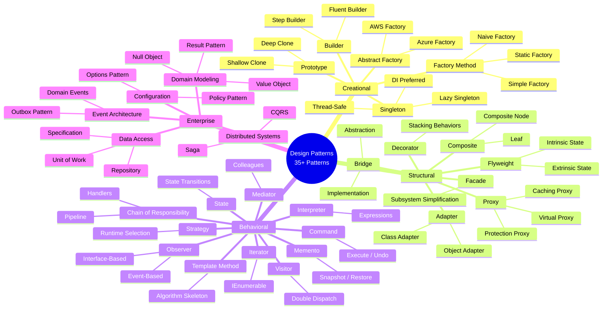

# Interview Revision Cheat Sheet

> A master quick-reference guide covering all 35+ patterns in this repository. Designed for rapid review before interviews, code reviews, or architecture discussions.

---

## Table of Contents

1. [One-Liner Memory Hooks](#one-liner-memory-hooks)
2. [Pattern-to-Use-Case Quick Lookup](#pattern-to-use-case-quick-lookup)
3. ["Choose This When..." Bullets](#choose-this-when-bullets)
4. [Top 3 Interview Questions per Category](#top-3-interview-questions-per-category)
5. [Key Tradeoffs Table](#key-tradeoffs-table)
6. ["Compare With..." Quick Reference](#compare-with-quick-reference)
7. [Pattern Categories Mind Map](#pattern-categories-mind-map)

---

## One-Liner Memory Hooks

### Creational Patterns

| # | Pattern | Memory Hook |
|---|---------|-------------|
| 1 | **Factory Method** | "Let subclasses decide which class to instantiate -- the `new` keyword moves to a method." |
| 2 | **Simple Factory** | "A single method with a switch/match that picks the right class -- simplest creation helper." |
| 3 | **Static Factory** | "Named constructors -- `Money.FromCents(500)` reads better than `new Money(5, 0)`." |
| 4 | **Abstract Factory** | "A factory of factories -- create entire families (AWS set vs Azure set) with one swap." |
| 5 | **Builder** | "Construct complex objects step by step -- the fluent `.WithX().WithY().Build()` pattern." |
| 6 | **Step Builder** | "Builder with compile-time enforced order -- interfaces chain so you cannot skip required steps." |
| 7 | **Prototype** | "Clone an existing object instead of building from scratch -- `Clone()` is cheaper than `new`." |
| 8 | **Singleton** | "One instance, one access point -- but in modern .NET, prefer `AddSingleton<T>()` via DI." |

### Structural Patterns

| # | Pattern | Memory Hook |
|---|---------|-------------|
| 9 | **Adapter** | "A translator plug -- makes a square peg fit a round hole by wrapping incompatible interfaces." |
| 10 | **Class Adapter** | "Adapter via inheritance -- the adapter IS the adaptee (inherits) and the target (implements)." |
| 11 | **Bridge** | "Two dimensions vary independently -- separate 'what' (abstraction) from 'how' (implementation)." |
| 12 | **Composite** | "Treat one and many the same -- a folder and a file both respond to `GetSize()`." |
| 13 | **Decorator** | "Wrap to add behavior -- like stackable middleware: `logging(caching(service))`." |
| 14 | **Facade** | "One door to a complex building -- simplify a subsystem into a single entry point." |
| 15 | **Flyweight** | "Share the heavy parts -- 1000 trees share one TreeType, each just stores its position." |
| 16 | **Proxy (Virtual)** | "Lazy load -- do not create the expensive object until someone actually uses it." |
| 17 | **Proxy (Protection)** | "Bouncer at the door -- check permissions before allowing access to the real object." |
| 18 | **Proxy (Caching)** | "Remember the answer -- return cached results instead of calling the real service again." |

### Behavioral Patterns

| # | Pattern | Memory Hook |
|---|---------|-------------|
| 19 | **Chain of Responsibility** | "Pass the buck -- each handler either handles it or forwards it down the line." |
| 20 | **Command** | "Turn a method call into an object -- now you can queue it, undo it, log it." |
| 21 | **Interpreter** | "Build a mini-language -- each grammar rule is a class, each sentence is a tree." |
| 22 | **Iterator** | "Walk a collection without knowing its internals -- `foreach` in C# is built on this." |
| 23 | **Mediator** | "Air traffic control -- components talk to the mediator, never directly to each other." |
| 24 | **Memento** | "Ctrl+Z in a box -- save a snapshot of state, restore it later, no internals exposed." |
| 25 | **Observer** | "Newspaper subscription -- publisher sends updates to all subscribers automatically." |
| 26 | **Event-Based Observer** | "C# native events -- `event EventHandler<T>` is Observer built into the language." |
| 27 | **State** | "Object changes its class -- behavior changes when internal state changes, no if/else." |
| 28 | **Strategy** | "Swap the algorithm -- same interface, different implementation, chosen at runtime." |
| 29 | **Template Method** | "Fill in the blanks -- base class defines the skeleton, subclasses override the steps." |
| 30 | **Visitor** | "Add operations without editing classes -- double dispatch lets new ops visit old structures." |

### Enterprise Patterns

| # | Pattern | Memory Hook |
|---|---------|-------------|
| 31 | **Repository** | "A collection that happens to be backed by a database -- `Add()`, `Find()`, `Remove()`." |
| 32 | **Unit of Work** | "One SaveChanges to rule them all -- track changes across repos, commit atomically." |
| 33 | **Specification** | "Composable WHERE clauses -- `ActiveSpec.And(PremiumSpec)` builds reusable predicates." |
| 34 | **Result Pattern** | "Return success or failure, never throw for expected errors -- `Result<T>` not exceptions." |
| 35 | **CQRS** | "Reads and writes are separate worlds -- different models, maybe different databases." |
| 36 | **Domain Events** | "Something happened in the domain -- raise it, and whoever cares will react." |
| 37 | **Outbox** | "Write the event to the database with the data -- a background worker delivers it later." |
| 38 | **Saga** | "A chain of local transactions with compensations -- each step can be undone." |
| 39 | **Null Object** | "Do nothing, politely -- instead of null checks, use a no-op implementation." |
| 40 | **Value Object** | "Defined by its value, not its identity -- two Moneys with same amount are equal." |
| 41 | **Options Pattern** | "`IOptions<T>` binds appsettings.json sections to strongly typed C# classes." |
| 42 | **Policy Pattern** | "Composable rules -- `MinOrderPolicy.And(CreditCheckPolicy)` evaluates to yes/no." |

---

## Pattern-to-Use-Case Quick Lookup

| Use Case | Recommended Pattern(s) |
|----------|----------------------|
| Create objects without specifying exact class | Factory Method |
| Named constructors with clear semantics | Static Factory |
| Create families of related objects consistently | Abstract Factory |
| Build complex objects with many optional parts | Builder |
| Enforce mandatory build steps in order | Step Builder |
| Clone expensive-to-create objects | Prototype |
| Ensure one instance of a shared resource | Singleton (DI lifetime) |
| Integrate incompatible third-party APIs | Adapter |
| Adapt via inheritance (single adaptee) | Class Adapter |
| Vary abstraction and implementation independently | Bridge |
| Model tree/hierarchical structures | Composite |
| Add behavior dynamically without modifying classes | Decorator |
| Simplify a complex subsystem API | Facade |
| Reduce memory for many similar objects | Flyweight |
| Lazy-load expensive resources | Virtual Proxy |
| Access control / authorization | Protection Proxy |
| Cache expensive operation results | Caching Proxy |
| Process requests through a pipeline | Chain of Responsibility |
| Support undo/redo operations | Command + Memento |
| Evaluate DSL or expression grammar | Interpreter |
| Traverse custom collections | Iterator |
| Decouple many-to-many component communication | Mediator |
| Save/restore object state without breaking encapsulation | Memento |
| Notify multiple subscribers of state changes | Observer |
| Use C# native events for notifications | Event-Based Observer |
| Change behavior based on internal state | State |
| Select algorithm at runtime | Strategy |
| Define algorithm skeleton with variable steps | Template Method |
| Add operations to stable object structures | Visitor |
| Abstract data access from domain logic | Repository |
| Atomic multi-repository transactions | Unit of Work |
| Composable, reusable query criteria | Specification |
| Handle expected failures without exceptions | Result Pattern |
| Separate read/write models for scaling | CQRS |
| Decouple domain side effects | Domain Events |
| Guarantee reliable event publishing | Outbox |
| Coordinate distributed transactions | Saga |
| Eliminate null checks with safe defaults | Null Object |
| Model immutable domain concepts by value | Value Object |
| Strongly typed application configuration | Options Pattern |
| Composable business/resilience rules | Policy Pattern |

---

## "Choose This When..." Bullets

### Creational Patterns

**Factory Method**
- The concrete type depends on runtime input or configuration.
- You want to add new product types without modifying existing code (Open/Closed).
- Subclasses should control which class gets instantiated.

**Simple Factory**
- Creation logic is straightforward and involves choosing among a handful of types.
- You want a single centralized point for object creation without subclass polymorphism.

**Static Factory**
- Constructor overloads are ambiguous or lack clarity.
- You want named creation methods like `CreateFromJson()`, `Default()`, `Parse()`.

**Abstract Factory**
- You need to create families of related objects (AWS services vs Azure services).
- Mixing objects from different families would be a bug.
- The entire family is selected by configuration or environment at startup.

**Builder**
- The object has 5+ parameters, especially optional ones.
- You want a fluent, readable construction API.
- The same construction process should produce different representations.

**Step Builder**
- Certain build steps are mandatory and must occur in a specific order.
- You want compile-time enforcement that required steps cannot be skipped.
- Construction is a multi-phase pipeline (e.g., configure -> validate -> build).

**Prototype**
- Creating a new object involves expensive operations (DB lookup, network call).
- New objects differ only slightly from existing pre-configured templates.
- You need a registry of cloneable prototype instances.

**Singleton**
- Exactly one instance is needed for a genuinely shared resource (connection pool, hardware).
- In modern .NET: use `services.AddSingleton<T>()` instead of coding the pattern manually.
- The instance must be thread-safe and ideally immutable or read-only.

### Structural Patterns

**Adapter**
- A third-party library has a different interface than your code expects.
- You cannot modify the source of the incompatible class.
- You want to isolate your code from external API changes.

**Class Adapter**
- You need access to protected members of the adaptee.
- Only one adaptee needs to be adapted and inheritance is practical.

**Bridge**
- You have two independent dimensions of variation (e.g., notification type x delivery channel).
- Without Bridge, you would face M x N class combinations.
- Either dimension should be extendable without affecting the other.

**Composite**
- Your data naturally forms tree structures (file systems, org charts, UI components).
- You want to apply the same operation to individual items and groups uniformly.
- Recursive structures should be traversable with a single interface.

**Decorator**
- You need to add responsibilities (logging, caching, validation, retry) dynamically.
- Behaviors should be stackable and independently removable.
- Inheritance would cause class explosion (N behaviors leads to 2^N subclasses).

**Facade**
- A subsystem has many interdependent classes and most clients need only a simplified API.
- You want to reduce coupling between application layers.
- New developers should be able to use the subsystem without understanding its internals.

**Flyweight**
- Memory profiling shows thousands of objects with shared common (intrinsic) state.
- Memory is a measurable constraint (games, rendering, large data sets).
- Extrinsic state can be passed in or computed externally.

**Proxy (Virtual)**
- Object initialization is expensive and may not always be needed.
- You want to defer creation until first access transparently.

**Proxy (Protection)**
- Different users have different access levels to the same resource.
- Authorization logic should not pollute the business logic.

**Proxy (Caching)**
- The same operation is called repeatedly with identical inputs.
- Results change infrequently relative to access frequency.

### Behavioral Patterns

**Chain of Responsibility**
- Multiple handlers may process a request; the handler is determined at runtime.
- You want a pluggable processing pipeline (validation, middleware, approval workflows).
- Handlers should be addable/removable/reorderable without changing callers.

**Command**
- You need undo/redo functionality.
- You need to queue, schedule, or log operations.
- You want to parameterize objects with operations or build macros.

**Interpreter**
- You have a simple, stable grammar or expression language to evaluate.
- Rules are expressed as composable expression trees.
- The grammar is small enough that a class-per-rule approach is manageable.

**Iterator**
- You need a uniform way to traverse different collection types.
- You want lazy, on-demand evaluation of large or streamed data.
- In C# this is built-in via `IEnumerable<T>` / `IAsyncEnumerable<T>`.

**Mediator**
- Many components communicate in complex many-to-many patterns.
- Direct coupling between components would create maintenance nightmares.
- You need a central coordinator (chat rooms, UI forms, event orchestration).

**Memento**
- You need to capture and restore state without exposing object internals.
- You are implementing undo/redo, checkpointing, or game saves.
- State changes frequently and you need rollback capability.

**Observer**
- A change in one object should notify multiple dependents automatically.
- The number and identity of subscribers can change at runtime.
- You want loose coupling between the event source and its consumers.

**Event-Based Observer**
- You want idiomatic .NET event handling with `event EventHandler<T>`.
- All observers are in-process and the notification is synchronous.

**State**
- Object behavior depends heavily on its internal state (order lifecycle, workflow).
- State transitions follow well-defined rules.
- You want to eliminate large if/else or switch blocks that check state.

**Strategy**
- You need to choose between multiple algorithms at runtime (pricing, sorting, payment).
- The algorithm varies independently from the code that uses it.
- New algorithms should be addable without modifying existing code.

**Template Method**
- Multiple classes share an algorithm structure but differ in specific steps.
- You want to enforce the algorithm skeleton while allowing step customization.
- The invariant parts of the algorithm should not be redefined.

**Visitor**
- You frequently add new operations to a stable set of element types.
- You need double dispatch (operation depends on both visitor and element type).
- New element types are rare (each new type requires updating all visitors).

### Enterprise Patterns

**Repository**
- You need testable data access that is swappable (EF Core to Dapper, SQL to NoSQL).
- You have complex query logic that benefits from encapsulation.
- You want to unit test business logic without a database.

**Unit of Work**
- Multiple repositories must participate in a single atomic transaction.
- Cross-entity operations must succeed or fail together.

**Specification**
- Query criteria are complex, reusable, and need dynamic composition (AND/OR/NOT).
- Business rules need to be expressed as testable, composable predicates.
- You want to avoid adding a new repository method for every query variant.

**Result Pattern**
- Operations can fail in expected, non-exceptional ways (validation, not-found, conflict).
- You want explicit error handling visible in method signatures.
- You want to chain operations in a railway-oriented style.

**CQRS**
- Read and write models have fundamentally different shapes.
- Read workload vastly exceeds write workload and needs independent optimization.
- You are considering event sourcing or need audit trails of all state changes.

**Domain Events**
- A domain action triggers multiple side effects (email, audit, cache, projections).
- Side effects should be decoupled from the triggering domain logic.
- Events may need to cross bounded context boundaries.

**Outbox**
- You must guarantee event delivery alongside database writes (no dual-write problem).
- Events must survive process crashes and message broker outages.
- At-least-once delivery semantics are acceptable (consumers handle idempotency).

**Saga**
- A business process spans multiple services/databases that must all succeed or compensate.
- Distributed transactions (2PC) are impractical or unavailable.
- Each step must be reversible via a compensating action.

**Null Object**
- A dependency is optional and the default behavior is well-defined as "do nothing."
- You want to eliminate null checks and `?.` operators throughout the codebase.
- The absence of behavior is a valid, safe default.

**Value Object**
- A domain concept has no identity and is defined entirely by its attributes (Money, Email, Address).
- You want immutability and value-based equality built in.
- The object should self-validate on construction.

**Options Pattern**
- Configuration values form a logical group (SMTP settings, JWT options, feature flags).
- You need startup validation of configuration.
- You may need hot-reload of configuration without restarting.

**Policy Pattern**
- Business rules or resilience policies need to be composable (AND/OR).
- Rules change independently and should be testable in isolation.
- You want to evaluate multiple policies and collect all violations.

---

## Top 3 Interview Questions per Category

### Creational Patterns

**Q1: "What is the difference between Factory Method and Abstract Factory?"**
> Factory Method creates *one product* via a method overridden in subclasses (uses inheritance). Abstract Factory creates *families of related products* via an interface (uses composition). FM answers "which one?"; AF answers "which family?" In this repository, the payment processor uses Factory Method (one product hierarchy), while cloud infrastructure uses Abstract Factory (AWS family vs Azure family).

**Q2: "When would you use Builder over a constructor?"**
> When the object has many optional parameters (telescoping constructor problem), when you want a readable fluent API, when construction needs step-by-step validation, or when the same process should produce different representations. Step Builder adds compile-time enforcement of mandatory steps through interface chaining.

**Q3: "Why is Singleton considered harmful, and what is the alternative in .NET?"**
> Classic Singleton creates hidden global state, makes testing difficult (shared state across tests), and introduces tight coupling via `Instance` properties. In modern .NET, register with `services.AddSingleton<T>()` which provides the same single-instance guarantee with explicit dependency injection, testability via mocking, and no static access.

### Structural Patterns

**Q1: "What is the difference between Decorator and Proxy?"**
> Both wrap an object implementing the same interface. Decorator *adds new behavior* (logging, caching, validation); Proxy *controls access* to existing behavior (lazy loading, authorization, caching). Decorator is explicitly stackable (multiple layers); Proxy is typically one layer. The client knows it is decorating; the client may not know it is using a proxy.

**Q2: "Explain the Bridge pattern with a real-world .NET example."**
> Notifications (Email, SMS, Push) x Channels (SMTP, Twilio, Firebase). Without Bridge: EmailSmtp, EmailTwilio, SmsSmtp, SmsTwilio... = N*M classes. With Bridge: N notification types + M channel implementations, each varying independently. In this repo, Bridge separates notification abstractions from delivery channel implementations.

**Q3: "When would you choose Adapter over Facade?"**
> Adapter makes *one* incompatible interface compatible (1:1 translation for third-party integration). Facade simplifies *an entire subsystem* into one unified interface (N:1 simplification). Use Adapter when you cannot modify the external code; use Facade when you want to hide your own complexity.

### Behavioral Patterns

**Q1: "What is the difference between Strategy and State?"**
> Strategy: the *client* chooses the algorithm externally and can swap it at any time. State: the *object itself* changes behavior when its internal state changes, and states can trigger transitions. Strategy is "you pick"; State is "the object evolves." In Strategy, the context is unaware of strategy implementations; in State, states often reference each other for transitions.

**Q2: "How does Chain of Responsibility relate to ASP.NET Core middleware?"**
> ASP.NET Core middleware IS Chain of Responsibility. Each middleware receives the request, optionally processes it, and calls `next()` to pass it to the next middleware. The chain can short-circuit (return early) or modify the request/response. Registration order defines the chain. MediatR pipeline behaviors follow the same pattern.

**Q3: "When would you use Command over a simple method call?"**
> When you need: undo/redo (Command stores state to reverse), queuing (serialize commands for later), audit logging (every command is a record), or macro recording (composite commands). If none of these apply, a direct method call is simpler. In this repo, the Command pattern is used with undo history to implement text editor operations.

### Enterprise Patterns

**Q1: "Should you wrap EF Core in a Repository?"**
> Not always. EF Core's `DbContext` already implements Repository (`DbSet<T>`) and Unit of Work (`SaveChanges`). Add a custom Repository only for: swappable persistence, complex query encapsulation (combine with Specification), or testable data access without hitting a database. For simple CRUD, `DbContext` directly is preferred. See the [anti-patterns guide](anti-patterns.md#8-repository-overuse-with-ef-core).

**Q2: "Explain CQRS and when you would NOT use it."**
> CQRS separates read and write models for independent optimization, scaling, and modeling. Do NOT use it when: reads and writes have the same shape, the app is simple CRUD, the team is unfamiliar with eventual consistency, or you do not need independent scaling. "Fake CQRS" (same DB, same model, separate handlers) adds ceremony without benefit.

**Q3: "How does the Saga pattern handle failures?"**
> Each saga step has a compensating action. On failure at step N, the orchestrator runs compensations for steps N-1 through 1 in reverse order. Compensations are not rollbacks -- they are new forward-looking transactions that semantically undo the effect (refund payment, release inventory). Idempotency is critical because compensations may execute more than once due to retries.

---

## Key Tradeoffs Table

| Pattern | Benefit You Gain | Cost You Pay |
|---------|-----------------|--------------|
| Factory Method | Open/Closed Principle for creation | Extra classes per product type |
| Simple Factory | Centralized creation logic | Switch statement grows with new types |
| Static Factory | Self-documenting named constructors | Cannot be overridden in subclasses |
| Abstract Factory | Family consistency guaranteed | Complex when families or products grow |
| Builder | Readable, validated step-by-step construction | More code than a simple constructor |
| Step Builder | Compile-time enforcement of mandatory steps | Interface explosion for many steps |
| Prototype | Skip expensive initialization | Deep copy complexity; clone semantics |
| Singleton | Global coordination, one instance | Testing difficulty; global state risk |
| Adapter | Third-party integration without changes | Extra wrapper layer, indirection |
| Class Adapter | Direct access to adaptee internals | Locked to single inheritance hierarchy |
| Bridge | Prevents M x N class explosion | Initial abstraction overhead |
| Composite | Uniform operations on trees | Complexity for leaf-only operations |
| Decorator | Dynamic, stackable behavior | Deep nesting; debugging through layers |
| Facade | Simplified subsystem access | Can become a God class over time |
| Flyweight | Significant memory reduction | Complexity separating intrinsic/extrinsic state |
| Proxy (Virtual) | Deferred expensive creation | Extra layer; lazy initialization logic |
| Proxy (Protection) | Transparent authorization | Auth logic in proxy may duplicate middleware |
| Proxy (Caching) | Avoid redundant computations | Stale data risk; cache invalidation complexity |
| Chain of Responsibility | Flexible handler pipeline | Request may go unhandled; ordering matters |
| Command | Undo/redo, queuing, logging | More classes per operation |
| Interpreter | Custom DSL evaluation | Slow for complex grammars; hard to scale |
| Iterator | Lazy, decoupled traversal | Built into C#; rarely coded manually |
| Mediator | Decoupled component communication | Mediator can become God class |
| Memento | State snapshot/restore without breaking encapsulation | Memory for storing snapshots |
| Observer | Loose publisher/subscriber coupling | Memory leaks if not unsubscribed; update storms |
| Event-Based Observer | Idiomatic .NET; no infrastructure needed | Synchronous only; in-process only |
| State | Clean state-dependent behavior | More classes per state; state coupling |
| Strategy | Swappable algorithms at runtime | Client must know which strategies exist |
| Template Method | Algorithm structure enforced | Inheritance coupling; less flexible than Strategy |
| Visitor | New operations without modifying elements | Adding new element types is painful |
| Repository | Testable, swappable data access | Extra layer; may wrap EF Core superfluously |
| Unit of Work | Atomic multi-repo transactions | EF Core already provides this |
| Specification | Composable, reusable query predicates | Overkill for simple one-off queries |
| Result Pattern | Explicit error handling in signatures | Verbose compared to exceptions |
| CQRS | Independent read/write optimization | Complexity; eventual consistency |
| Domain Events | Decoupled side effects | Event ordering; debugging event flows |
| Outbox | Guaranteed at-least-once delivery | Background worker; infrastructure complexity |
| Saga | Distributed consistency without locks | Compensation design; idempotency requirement |
| Null Object | No null checks; polymorphic defaults | Hides absence; may mask bugs |
| Value Object | Immutability; value equality | EF Core mapping complexity |
| Options Pattern | Type-safe, validated configuration | Overhead for single primitive values |
| Policy Pattern | Composable, testable business rules | Overhead for simple single rules |

---

## "Compare With..." Quick Reference

| Pattern | Compare With | Key Difference |
|---------|-------------|----------------|
| Factory Method | Abstract Factory | FM creates one product via inheritance; AF creates families via composition |
| Factory Method | Simple Factory | FM uses polymorphism (subclass decides); Simple Factory uses a switch/match |
| Factory Method | Static Factory | FM uses inheritance for creation; Static Factory uses named static methods |
| Builder | Abstract Factory | Builder constructs one object step-by-step; AF creates complete objects at once |
| Builder | Prototype | Builder builds from scratch; Prototype copies an existing instance |
| Builder | Step Builder | Builder allows any order; Step Builder enforces mandatory step sequence |
| Singleton | Static Class | Singleton can implement interfaces, supports DI, can be lazy; static cannot |
| Adapter | Facade | Adapter wraps one interface 1:1; Facade simplifies N interfaces into 1 |
| Adapter | Bridge | Adapter fixes existing incompatibility; Bridge designs for future variation |
| Adapter | Decorator | Adapter changes the interface; Decorator keeps the same interface |
| Decorator | Proxy | Decorator adds behavior; Proxy controls access |
| Decorator | Chain of Responsibility | Decorator always delegates; CoR may stop the chain |
| Composite | Decorator | Composite builds trees (branching); Decorator wraps linearly (stacking) |
| Bridge | Strategy | Bridge separates two class hierarchies; Strategy swaps one algorithm dimension |
| Facade | Mediator | Facade simplifies access (one-way); Mediator coordinates communication (two-way) |
| Flyweight | Prototype | Flyweight shares one instance among many; Prototype clones to create new instances |
| Strategy | State | Strategy: client picks externally; State: object changes internally |
| Strategy | Template Method | Strategy uses composition; Template Method uses inheritance |
| Command | Strategy | Command encapsulates a request (noun); Strategy encapsulates an algorithm (verb) |
| Command | Memento | Command stores how to undo; Memento stores what state to restore |
| Chain of Responsibility | Decorator | CoR can stop; Decorator always delegates. CoR picks one; Decorator wraps all |
| Observer | Mediator | Observer: direct pub/sub; Mediator: centralized hub |
| Observer | Domain Events | Observer is in-process synchronous; Domain Events are dispatched via bus, often async |
| Iterator | Visitor | Iterator traverses the structure; Visitor adds operations during traversal |
| Repository | Specification | Repository manages persistence (how); Specification defines criteria (what) |
| Repository | Unit of Work | Repository handles one entity's CRUD; UoW coordinates multi-repo transactions |
| CQRS | CRUD | CQRS separates read/write models; CRUD uses one unified model |
| Saga | 2PC | Saga uses compensation (eventual); 2PC uses locking (strong consistency) |
| Domain Events | Observer | Domain Events are business concepts; Observer is a technical mechanism |
| Result Pattern | Exceptions | Result for expected failures; Exceptions for unexpected failures |
| Null Object | Nullable/Optional | Null Object provides default behavior; Nullable signals explicit absence |
| Value Object | Entity | Value Object: equality by attributes, no identity. Entity: equality by ID |
| Policy | Specification | Policy evaluates business rules; Specification evaluates query criteria |
| Outbox | Direct Publishing | Outbox guarantees at-least-once; Direct may lose events on failure |

---

## Pattern Categories Mind Map

---

## Rapid-Fire Flash Cards

Cover the right column and test yourself.

| Prompt | Answer |
|--------|--------|
| Pattern for "plug incompatible interfaces"? | Adapter |
| Pattern for "add behavior without modifying class"? | Decorator |
| Pattern for "one instance only"? | Singleton (DI lifetime) |
| Pattern for "create families of related objects"? | Abstract Factory |
| Pattern for "build complex objects step by step"? | Builder |
| Pattern for "swap algorithm at runtime"? | Strategy |
| Pattern for "change behavior based on internal state"? | State |
| Pattern for "undo/redo support"? | Command + Memento |
| Pattern for "pipeline of handlers"? | Chain of Responsibility |
| Pattern for "tree structures with uniform ops"? | Composite |
| Pattern for "simplify a complex API"? | Facade |
| Pattern for "notify subscribers of changes"? | Observer |
| Pattern for "decouple many-to-many communication"? | Mediator |
| Pattern for "separate read/write models"? | CQRS |
| Pattern for "reliable event publishing"? | Outbox |
| Pattern for "distributed transaction rollback"? | Saga |
| Pattern for "composable query criteria"? | Specification |
| Pattern for "explicit success/failure returns"? | Result Pattern |
| Pattern for "no null checks"? | Null Object |
| Pattern for "immutable domain concepts"? | Value Object |
| Pattern for "type-safe config"? | Options Pattern |
| Pattern for "composable business rules"? | Policy Pattern |
| Pattern for "control access transparently"? | Proxy |
| Pattern for "two independent dimensions of variation"? | Bridge |
| Pattern for "share state across many similar objects"? | Flyweight |
| Pattern for "add operations without editing element classes"? | Visitor |
| Pattern for "define algorithm skeleton with variable steps"? | Template Method |
| Pattern for "evaluate expression grammar"? | Interpreter |
| Pattern for "clone expensive objects"? | Prototype |
| What does the Adapter pattern do in two words? | Interface translation |
| What does the Bridge pattern do in two words? | Dual variation |
| What does the Flyweight pattern do in two words? | Shared state |
| What does the Visitor pattern do in two words? | External operations |
| What does the Template Method do in two words? | Algorithm skeleton |
| What does the Command pattern do in two words? | Action object |

---

## Interview Tips

1. **Start with the problem, not the pattern.** "We need to swap pricing algorithms at runtime, so Strategy fits" beats "Strategy is a good pattern."

2. **Know when to argue AGAINST a pattern.** "We do not need CQRS here because reads and writes share the same shape" demonstrates deeper understanding.

3. **Mention .NET-specific idioms.** "I would register strategies in DI and inject `IEnumerable<IPricingStrategy>`" shows practical knowledge.

4. **Connect patterns to SOLID.** "Decorator supports Open/Closed because we add behavior without modifying the existing class."

5. **Discuss tradeoffs honestly.** Every pattern has a cost. Mentioning the downside alongside the benefit shows engineering maturity.

6. **Use the business scenario.** "In our payment system, Factory Method lets us add Stripe or PayPal without changing checkout" is more convincing than abstract descriptions.

7. **Know the anti-patterns.** Being able to identify Singleton abuse, repository overuse, or fake CQRS shows you understand when NOT to use a pattern.

---

## Next Steps

- [Comparison Maps](comparison-maps.md) -- Side-by-side visual comparisons with Mermaid diagrams
- [Decision Matrix](decision-matrix.md) -- Problem-to-pattern mapping with decision flowchart
- [Anti-Patterns](anti-patterns.md) -- Know when to argue against a pattern
- [Enterprise Patterns Summary](enterprise-patterns-summary.md) -- Detailed enterprise pattern reference
