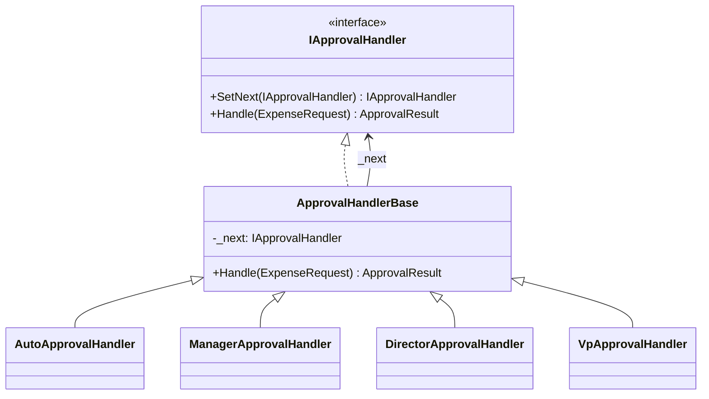
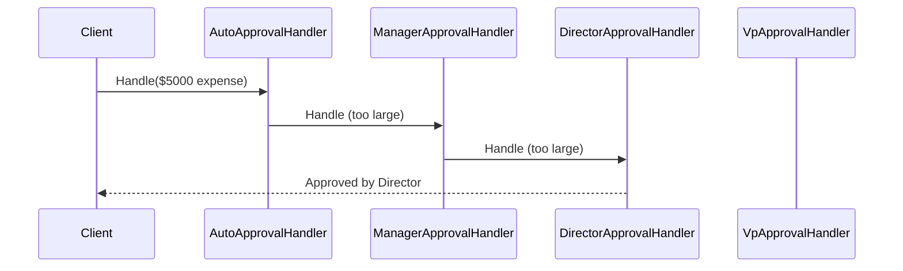

# Chain of Responsibility

## Memory Hook (one-liner)
"Pass the request down the line until someone handles it — like an expense approval escalating from auto-approve to manager to director to VP."

## Problem
An expense request needs approval, but the approver depends on the amount. Hard-coding `if/else if/else if` chains to route requests creates rigid, unmaintainable code that violates Open/Closed principle. Adding a new approval level means modifying the routing logic everywhere.

## Naive Approach
```csharp
// Brittle if-else chain, tightly coupled to all approval levels
if (amount < 100) return AutoApprove();
else if (amount < 1000) return ManagerApprove();
else if (amount < 10000) return DirectorApprove();
else return VpApprove();
```

## Pattern Solution
Each handler in the chain decides: "Can I handle this?" If yes, it processes the request. If no, it passes to the next handler. Handlers are linked dynamically, so adding/removing/reordering is trivial.

## When To Use (5 bullets)
- Multiple objects may handle a request, and the handler isn't known a priori
- You want to issue a request without coupling sender to receiver
- The set of handlers should be configurable dynamically
- You need to process a request through a series of checks/validations
- You want to decouple request senders from the processing logic

## When NOT To Use (5 bullets)
- When every request must be handled (chain may silently drop unhandled requests)
- When request handling order doesn't matter (just use a list of handlers)
- When you need guaranteed response time (chain traversal adds latency)
- When there's only one possible handler (just call it directly)
- When handlers need to collaborate (Mediator is better)

## Participants
| Participant | In Our Code |
|---|---|
| Handler | `IApprovalHandler` |
| ConcreteHandler | `AutoApprovalHandler`, `ManagerApprovalHandler`, etc. |
| Client | Code that builds the chain and submits `ExpenseRequest` |

## Variants
1. **Classic Chain** — processing stops at the first handler that handles the request (our approval chain)
2. **Pipeline** — every step processes the request AND forwards it (our `Pipeline<T>` variant)
3. **Middleware** — ASP.NET Core middleware is a pipeline-style chain of responsibility

## Tradeoffs Table
| Aspect | Pro | Con |
|---|---|---|
| Flexibility | Add/remove handlers without changing client | Request may go unhandled |
| Coupling | Sender doesn't know the concrete handler | Debugging chain traversal can be tricky |
| SRP | Each handler has one responsibility | Chain setup can be complex |

## Common Interview Questions
1. How does Chain of Responsibility differ from Decorator?
2. How would you guarantee that every request is handled?
3. What's the difference between the classic chain and pipeline variant?
4. How does ASP.NET Core middleware implement this pattern?

## Comparison with Similar Patterns
| Pattern | Key Difference |
|---|---|
| **Decorator** | Decorator adds behavior; CoR routes to the right handler |
| **Command** | Command encapsulates a request; CoR routes it |
| **Mediator** | Mediator centralizes communication; CoR distributes it |

## Mermaid Diagrams

### Class Diagram


### Sequence Diagram


## Similar Patterns to Review Next
- Decorator (wrapping vs. routing)
- Mediator (centralized vs. distributed communication)
- Command (encapsulating requests)
