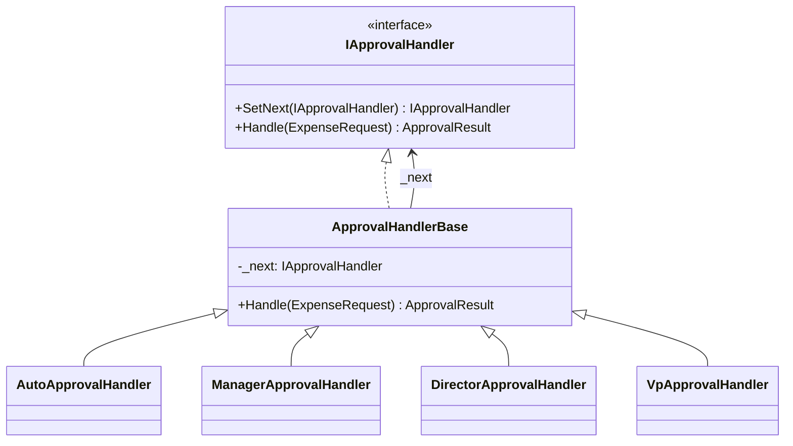
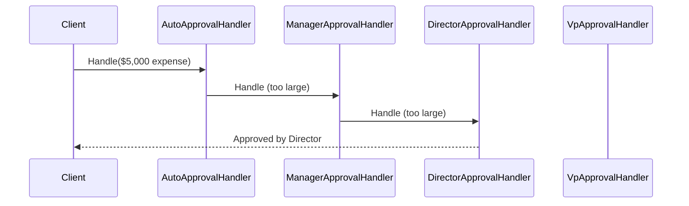

# Chain of Responsibility

## Memory Hook (one-liner)
"Pass the buck until someone can handle it" — like an expense report climbing the management ladder.

## Problem
You have a request that could be handled by several different objects, but you don't know which one at compile time. Hard-coding the decision logic creates tight coupling and makes adding new handlers painful.

## Naive Approach
A giant `if/else if/else` block or `switch` statement that checks every condition inline. This becomes unmaintainable as new approval levels are added, and the caller must know all possible handlers.

## Pattern Solution
Chain of Responsibility decouples the sender of a request from its receiver by giving multiple objects a chance to handle it. Each handler either processes the request or forwards it to the next handler in the chain.

## When To Use (5 bullets)
- More than one object can handle a request, and the handler isn't known a priori
- You want to issue a request to several objects without specifying the exact receiver
- The set of handlers should be configured dynamically
- You want to avoid coupling the sender to concrete handler classes
- Processing involves a pipeline where each step may transform or filter data

## When NOT To Use (5 bullets)
- There's a single, well-known handler — simple delegation is clearer
- Every request must be handled (chain may silently drop unhandled requests)
- Performance is critical and the chain is very long
- The order of handlers doesn't matter — use an event/observer instead
- You need guaranteed response times (chain length affects latency)

## Participants
| Role | In This Example |
|------|----------------|
| Handler | `IApprovalHandler` |
| ConcreteHandler | `AutoApprovalHandler`, `ManagerApprovalHandler`, `DirectorApprovalHandler`, `VpApprovalHandler` |
| Client | Code that creates the chain and submits `ExpenseRequest` |

## Variants
- **Classic Chain**: Stops at the first handler that can process (our approval chain)
- **Pipeline/Middleware**: Every handler processes AND forwards (our `Pipeline<T>` variant, similar to ASP.NET Core middleware)

## Tradeoffs Table
| Aspect | Pro | Con |
|--------|-----|-----|
| Flexibility | Add/remove handlers without changing client | Request might go unhandled |
| SRP | Each handler has one responsibility | Debugging chain traversal can be difficult |
| Open/Closed | New handlers don't modify existing code | Performance overhead if chain is long |
| Ordering | Chain order encodes business rules | Incorrect ordering causes subtle bugs |

## Common Interview Questions
1. How does Chain of Responsibility differ from Decorator?
2. Can a request be handled by multiple handlers? (Pipeline variant: yes)
3. How do you guarantee a request is always handled?
4. How would you implement this with dependency injection?
5. What is the relationship between CoR and middleware pipelines?

## Comparison with Similar Patterns
| Pattern | Similarity | Difference |
|---------|-----------|------------|
| Decorator | Both chain objects | Decorator always forwards; CoR may stop |
| Command | Both decouple sender/receiver | Command encapsulates action; CoR routes to handler |
| Observer | Both involve multiple receivers | Observer notifies all; CoR finds one handler |

## Mermaid Diagrams

### Class Diagram

### Sequence Diagram

## Similar Patterns to Review Next
- Decorator (structural chaining)
- Middleware/Pipeline (ASP.NET Core)
- Command (encapsulated actions)
