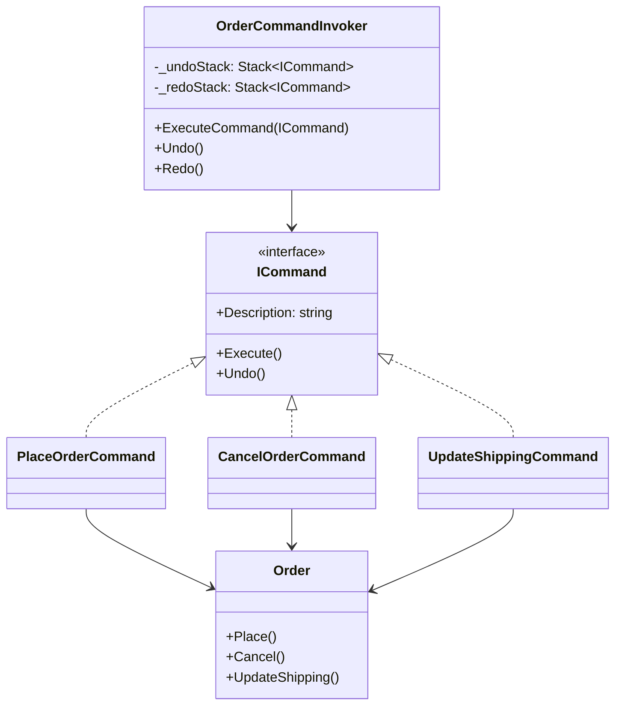
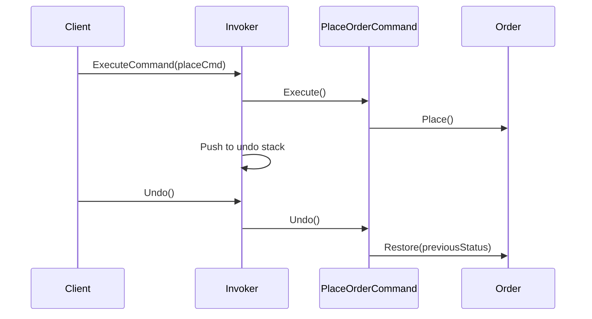

# Command

## Memory Hook (one-liner)
"Turn a request into a standalone object — like writing an order on a slip that can be filed, undone, or replayed."

## Problem
An order management system needs to place, cancel, and update orders — but also needs undo/redo support and command history. Directly calling methods on the order object makes it impossible to track, queue, or reverse operations.

## Naive Approach
```csharp
// Direct method calls — no history, no undo
order.Place();
order.UpdateShipping("123 Main St");
order.Cancel();
// Oops, user wants to undo the cancel? Too late.
```

## Pattern Solution
Encapsulate each operation as a Command object with `Execute()` and `Undo()`. An Invoker maintains a history stack, enabling undo/redo. Commands can be queued, logged, and even serialized for replay.

## When To Use (5 bullets)
- You need undo/redo functionality
- You want to queue or schedule operations for later execution
- You need to log or audit every operation performed
- You want to support macro commands (composite of multiple commands)
- You need to decouple the object that invokes the operation from the one that performs it

## When NOT To Use (5 bullets)
- Simple operations that don't need undo or history
- When the overhead of command objects isn't justified
- Real-time systems where command object allocation matters
- When operations are truly irreversible (e.g., sending an email)
- When you'd end up with hundreds of trivial command classes

## Participants
| Participant | In Our Code |
|---|---|
| Command | `ICommand` |
| ConcreteCommand | `PlaceOrderCommand`, `CancelOrderCommand`, `UpdateShippingCommand` |
| Receiver | `Order` |
| Invoker | `OrderCommandInvoker` |
| Client | Code that creates commands and passes to invoker |

## Variants
1. **Simple Command** — Execute only, no undo
2. **Undoable Command** — Execute + Undo (our implementation)
3. **Macro Command** — Composite of multiple commands executed as one
4. **Queued Command** — Commands stored for deferred execution

## Tradeoffs Table
| Aspect | Pro | Con |
|---|---|---|
| Undo/Redo | Natural support via command history | Must capture state for undo |
| Decoupling | Invoker doesn't know the receiver | More classes to maintain |
| Extensibility | New commands without changing existing code | Command proliferation |

## Common Interview Questions
1. How does Command pattern enable undo/redo?
2. What's the difference between Command and Strategy?
3. How would you implement a macro command?
4. How does Command relate to Event Sourcing?

## Comparison with Similar Patterns
| Pattern | Key Difference |
|---|---|
| **Strategy** | Strategy chooses algorithm; Command encapsulates a request |
| **Memento** | Memento saves state; Command saves the operation |
| **Observer** | Observer notifies; Command encapsulates and can undo |

## Mermaid Diagrams

### Class Diagram


### Sequence Diagram


## Similar Patterns to Review Next
- Memento (state snapshots for undo)
- Strategy (algorithm selection vs. request encapsulation)
- Chain of Responsibility (routing requests)
