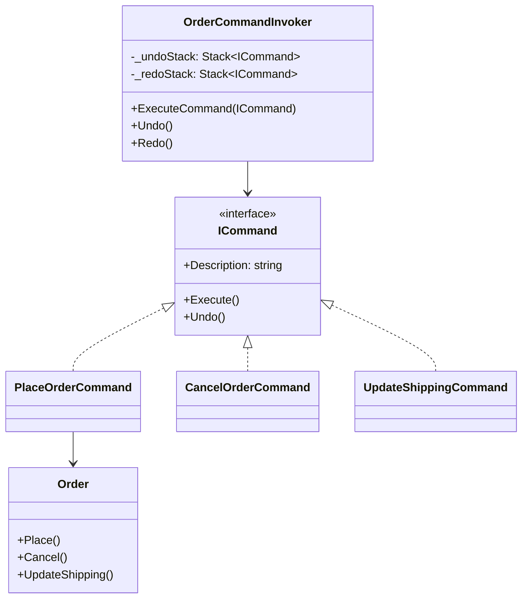
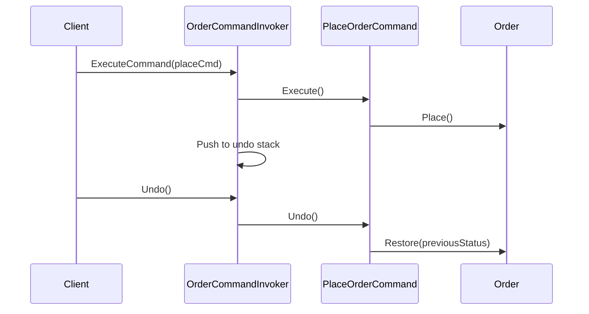

# Command

## Memory Hook (one-liner)
"Turn a request into a standalone object" — like a restaurant ticket that can be placed, cancelled, or replayed.

## Problem
You need to parameterize objects with operations, queue operations for later execution, or support undo/redo. Directly calling methods creates tight coupling and makes it impossible to track, replay, or reverse actions.

## Naive Approach
Directly calling methods on the receiver with no abstraction. Undo logic scattered throughout the codebase with manual state tracking. No command history, no replay capability.

## Pattern Solution
Command encapsulates a request as an object, letting you parameterize clients with different requests, queue requests, log them, and support undoable operations. The invoker maintains a history stack for undo/redo.

## When To Use (5 bullets)
- You need undo/redo functionality
- You want to queue, schedule, or log operations
- You need to support transactional behavior (execute/rollback)
- You want to decouple the object that invokes the operation from the one that performs it
- You need to build macro commands (composite of multiple commands)

## When NOT To Use (5 bullets)
- Simple operations that don't need undo or history
- The overhead of command objects isn't justified for trivial actions
- You don't need to decouple invoker from receiver
- Real-time systems where object creation overhead matters
- When a simple callback or delegate would suffice

## Participants
| Role | In This Example |
|------|----------------|
| Command | `ICommand` |
| ConcreteCommand | `PlaceOrderCommand`, `CancelOrderCommand`, `UpdateShippingCommand` |
| Receiver | `Order` |
| Invoker | `OrderCommandInvoker` |

## Variants
- **Undoable Commands**: Store state needed for undo (our implementation)
- **Macro Commands**: Composite of multiple commands executed together
- **Queued Commands**: Commands stored for deferred execution
- **Event Sourcing**: Commands as the source of truth for state reconstruction

## Tradeoffs Table
| Aspect | Pro | Con |
|--------|-----|-----|
| Undo/Redo | Natural support via history stack | Must capture and store state for reversal |
| Decoupling | Invoker doesn't know receiver details | Introduces many small command classes |
| Logging | Easy to log/audit every operation | Memory overhead for command history |
| Extensibility | New commands without changing invoker | Undo logic can be complex for some operations |

## Common Interview Questions
1. How does Command differ from Strategy?
2. How would you implement a macro command?
3. How does Command relate to Event Sourcing?
4. What happens when undo is impossible (e.g., sending an email)?
5. How would you persist command history?

## Comparison with Similar Patterns
| Pattern | Similarity | Difference |
|---------|-----------|------------|
| Strategy | Both encapsulate behavior | Strategy is about choosing algorithm; Command is about encapsulating action |
| Memento | Both support undo | Memento saves state snapshots; Command saves operations |
| Observer | Both decouple components | Observer is one-to-many notification; Command is one-to-one action |

## Mermaid Diagrams

### Class Diagram

### Sequence Diagram

## Similar Patterns to Review Next
- Memento (state snapshot for undo)
- Strategy (encapsulated algorithms)
- Event Sourcing (commands as event log)
