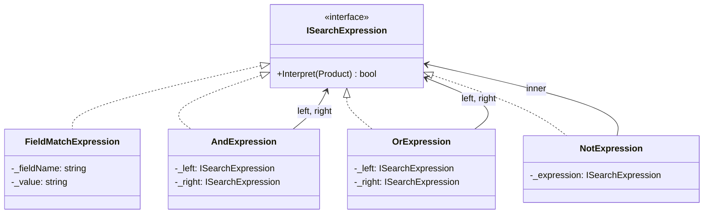
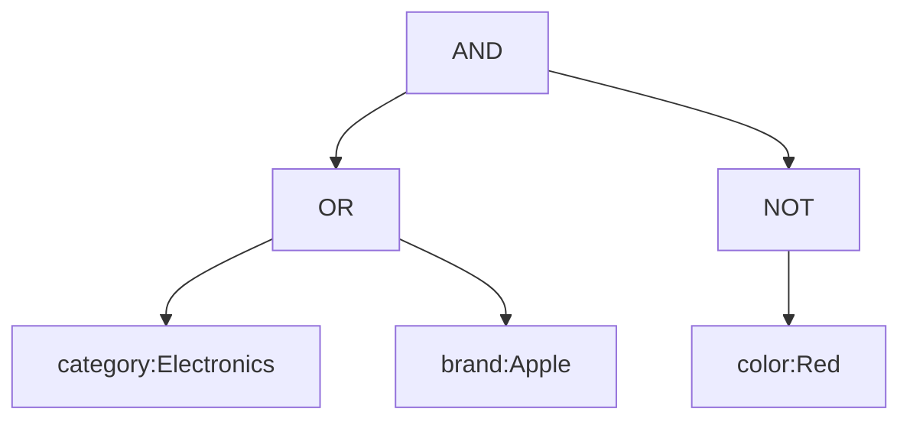

# Interpreter

## Memory Hook (one-liner)
"Define a grammar and build a tree to evaluate it" — like a search box that understands AND, OR, NOT.

## Problem
You need to evaluate expressions in a simple language. Without the pattern, you end up with tangled evaluation logic that's hard to extend with new operators or expression types.

## Naive Approach
String parsing with nested if/else or regex that handles each operator inline. Adding a new operator requires modifying the parsing logic everywhere. No clean separation between parsing and evaluation.

## Pattern Solution
Define a class for each grammar rule. Terminal expressions handle leaf values (field matches), non-terminal expressions combine sub-expressions (AND, OR, NOT). A parser builds the expression tree, and each node evaluates itself recursively.

## When To Use (5 bullets)
- You have a simple, well-defined grammar to evaluate
- The grammar is relatively stable but the things being evaluated change
- Efficiency is not the primary concern (interpreter is not the fastest approach)
- You need to combine expressions dynamically at runtime
- You want users to express complex filters/queries in a DSL

## When NOT To Use (5 bullets)
- The grammar is complex — use a real parser generator instead
- Performance is critical (interpreter pattern has overhead per node)
- The grammar changes frequently (each change requires new classes)
- A simple regex or string comparison would suffice
- You're building a full programming language (use ANTLR, Roslyn, etc.)

## Participants
| Role | In This Example |
|------|----------------|
| AbstractExpression | `ISearchExpression` |
| TerminalExpression | `FieldMatchExpression` |
| NonterminalExpression | `AndExpression`, `OrExpression`, `NotExpression` |
| Context | `Product` |
| Client/Parser | `SearchQueryParser` |

## Variants
- **Recursive Descent Parser**: Our approach — simple and readable
- **Visitor-based Evaluation**: Separate evaluation logic from expression tree
- **LINQ Expression Trees**: .NET's built-in expression tree support

## Tradeoffs Table
| Aspect | Pro | Con |
|--------|-----|-----|
| Extensibility | Easy to add new expression types | Each grammar rule is a class |
| Readability | Expression tree mirrors grammar | Complex grammars create deep hierarchies |
| Composability | Expressions combine naturally | Performance degrades with deep nesting |
| Testing | Each expression testable in isolation | Parser testing requires integration tests |

## Common Interview Questions
1. When would you use Interpreter vs. a parser generator?
2. How does Interpreter relate to Composite pattern?
3. How would you add operator precedence?
4. Can you optimize an Interpreter for performance?
5. How does this relate to LINQ expression trees?

## Comparison with Similar Patterns
| Pattern | Similarity | Difference |
|---------|-----------|------------|
| Composite | Both use tree structures | Composite is structural; Interpreter evaluates |
| Visitor | Both traverse structures | Visitor separates operations; Interpreter embeds evaluation |
| Strategy | Both encapsulate behavior | Strategy is one algorithm; Interpreter is a grammar |

## Mermaid Diagrams

### Class Diagram

### Expression Tree

## Similar Patterns to Review Next
- Composite (tree structures)
- Visitor (traversing object structures)
- Strategy (encapsulated algorithms)
