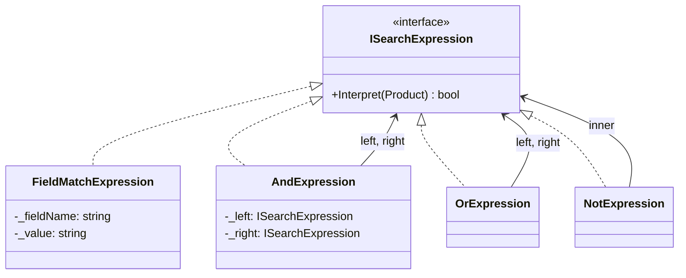
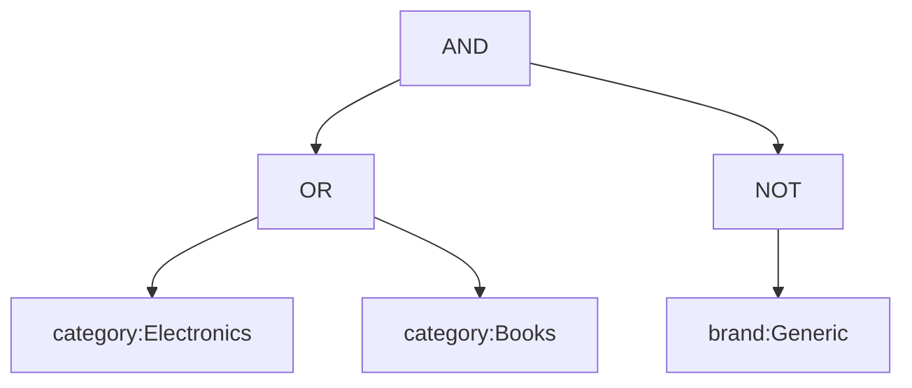

# Interpreter

## Memory Hook (one-liner)
"Define a grammar and build a tree of expression objects that can evaluate it — like a mini search query language with AND, OR, NOT."

## Problem
Users need to write search queries like `category:Electronics AND NOT color:Red`. Building this as string manipulation is fragile. You need a structured way to parse, represent, and evaluate these expressions.

## Naive Approach
```csharp
// Fragile string splitting and nested if-else
var parts = query.Split(" AND ");
foreach (var part in parts) {
    if (part.StartsWith("NOT ")) { /* negate */ }
    // Quickly becomes unmaintainable with OR, parentheses, etc.
}
```

## Pattern Solution
Define a grammar (AND, OR, NOT, field:value). Parse the query into an expression tree where each node implements `Interpret()`. Terminal expressions match fields; non-terminal expressions compose other expressions.

## When To Use (5 bullets)
- You have a simple language or DSL to interpret
- The grammar is relatively simple and stable
- Efficiency is not the primary concern
- You need to evaluate expressions against different contexts
- You want to combine simple rules into complex ones

## When NOT To Use (5 bullets)
- Complex grammars (use a parser generator like ANTLR instead)
- Performance-critical parsing (expression trees have overhead)
- When the grammar changes frequently
- When a simple regex or string parsing would suffice
- When you need compilation rather than interpretation

## Participants
| Participant | In Our Code |
|---|---|
| AbstractExpression | `ISearchExpression` |
| TerminalExpression | `FieldMatchExpression` |
| NonTerminalExpression | `AndExpression`, `OrExpression`, `NotExpression` |
| Context | `Product` |
| Client | `SearchQueryParser` |

## Variants
1. **Tree-based** — expression tree evaluated recursively (our implementation)
2. **Stack-based** — reverse-polish notation evaluation
3. **Compiled** — expressions compiled to IL for performance

## Tradeoffs Table
| Aspect | Pro | Con |
|---|---|---|
| Extensibility | Easy to add new expression types | Class per grammar rule |
| Composability | Expressions combine naturally into trees | Complex grammars become unwieldy |
| Testability | Each expression testable in isolation | Parser complexity grows with grammar |

## Common Interview Questions
1. When would you use Interpreter vs. a parser generator?
2. How does the Composite pattern relate to Interpreter?
3. How would you optimize an Interpreter for performance?
4. What's the difference between Interpreter and Strategy?

## Comparison with Similar Patterns
| Pattern | Key Difference |
|---|---|
| **Composite** | Composite structures objects; Interpreter evaluates a language |
| **Visitor** | Visitor adds operations to a structure; Interpreter evaluates expressions |
| **Strategy** | Strategy selects one algorithm; Interpreter combines grammar rules |

## Mermaid Diagrams

### Class Diagram


### Expression Tree


## Similar Patterns to Review Next
- Composite (tree structures)
- Visitor (operations on object structures)
- Strategy (algorithm selection)
