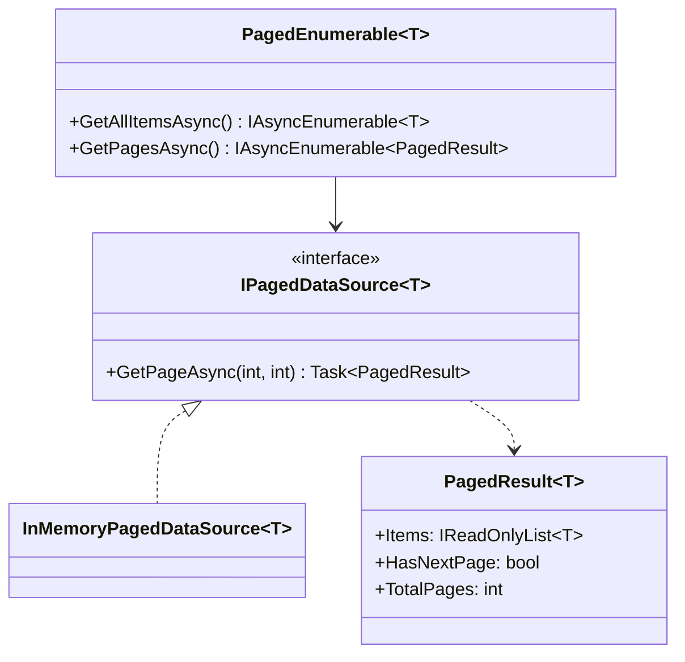
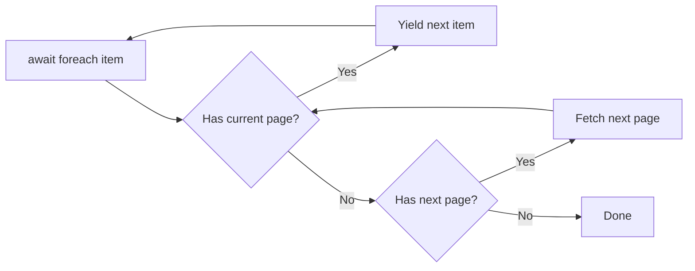

# Iterator

## Memory Hook (one-liner)
"Provide a way to access elements sequentially without exposing the underlying structure — like paging through API results with a simple foreach."

## Problem
An API returns data in pages (page 1 of 50, page 2 of 50...). The caller just wants to iterate over all items without managing page numbers, next-page tokens, or fetching logic. The pagination details should be hidden behind a clean iteration interface.

## Naive Approach
```csharp
// Caller manages pagination manually
int page = 1;
while (true) {
    var result = await api.GetPageAsync(page, 20);
    foreach (var item in result.Items) Process(item);
    if (!result.HasNextPage) break;
    page++;
}
```

## Pattern Solution
Implement `IAsyncEnumerable<T>` that lazily fetches pages as the caller iterates. The caller uses `await foreach` and never knows about pagination. Pages are fetched on-demand, not all at once.

## When To Use (5 bullets)
- You need to abstract away the traversal mechanism of a collection
- You want lazy/on-demand data fetching (pagination, streaming)
- You need multiple simultaneous traversals of the same collection
- You want to provide a uniform interface for different collection types
- You need to support cancellation during iteration

## When NOT To Use (5 bullets)
- Simple collections where `List<T>` or arrays suffice
- When you need random access (iterators are sequential)
- When all data must be loaded upfront anyway
- When the overhead of the iterator abstraction isn't justified
- When built-in LINQ already provides what you need

## Participants
| Participant | In Our Code |
|---|---|
| Iterator | `PagedEnumerable<T>` (yields via `IAsyncEnumerable`) |
| ConcreteIterator | The async enumerator state machine |
| Aggregate | `IPagedDataSource<T>` |
| ConcreteAggregate | `InMemoryPagedDataSource<T>` |

## Variants
1. **External Iterator** — caller controls iteration (`MoveNext`/`Current`)
2. **Internal Iterator** — collection controls iteration (LINQ's `ForEach`)
3. **Async Iterator** — `IAsyncEnumerable<T>` with `await foreach` (our implementation)
4. **Cursor-based** — using continuation tokens instead of page numbers

## Tradeoffs Table
| Aspect | Pro | Con |
|---|---|---|
| Abstraction | Hides pagination complexity | Adds indirection |
| Memory | Lazy loading keeps memory low | Can't random-access |
| Composability | Works with LINQ and async streams | Error handling across pages can be tricky |

## Common Interview Questions
1. What's the difference between `IEnumerable<T>` and `IAsyncEnumerable<T>`?
2. How does `yield return` work under the hood?
3. How would you implement cursor-based pagination?
4. What's the difference between external and internal iterators?

## Comparison with Similar Patterns
| Pattern | Key Difference |
|---|---|
| **Composite** | Composite structures a tree; Iterator traverses it |
| **Visitor** | Visitor operates on elements; Iterator provides access to them |
| **Memento** | Memento can snapshot iterator state for bookmarking |

## Mermaid Diagrams

### Class Diagram


### Flow Diagram


## Similar Patterns to Review Next
- Composite (tree traversal)
- Visitor (operating on iterated elements)
- Observer (push vs. pull model)
