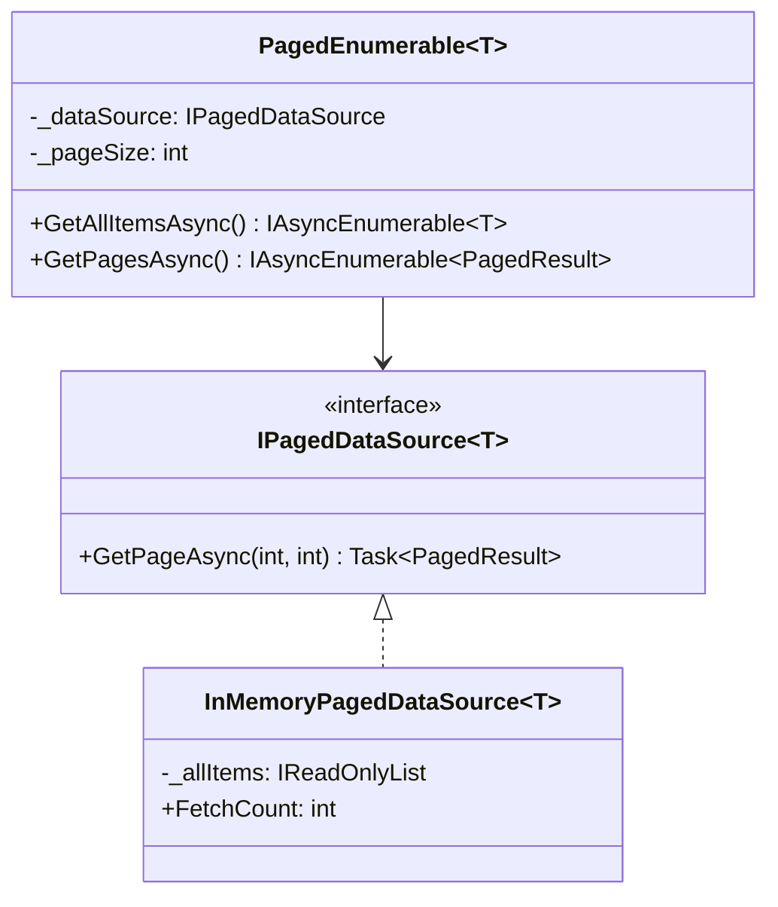
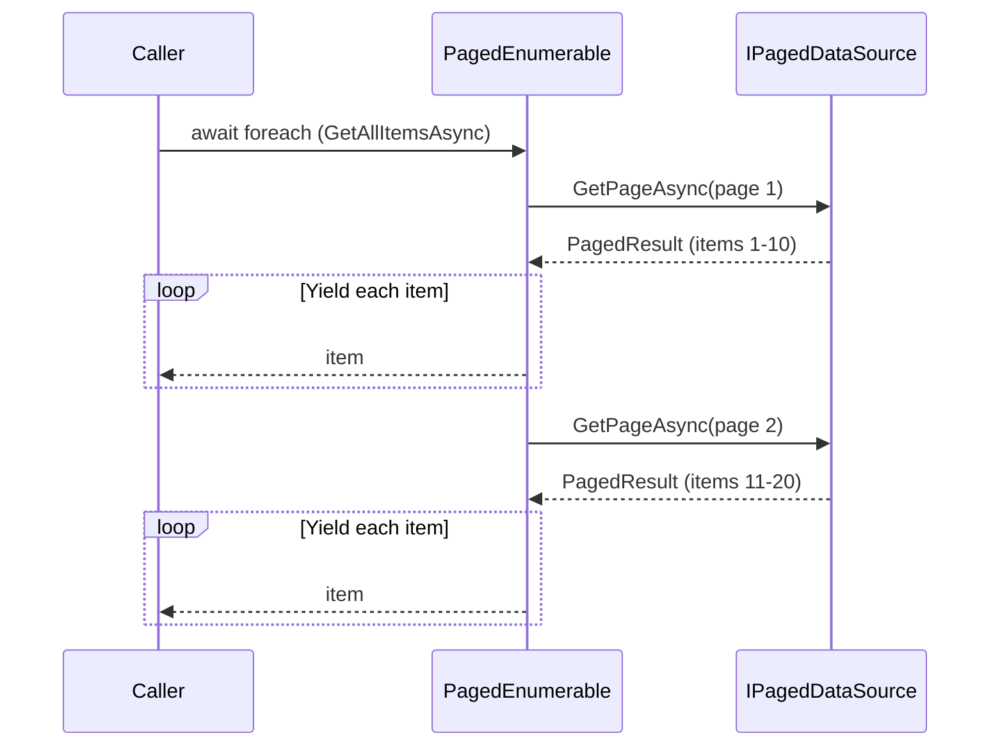

# Iterator

## Memory Hook (one-liner)
"Give me the next item without exposing the collection's internals" — like scrolling through paginated API results with foreach.

## Problem
You need to traverse a collection without exposing its underlying representation. For paginated APIs, the caller shouldn't need to manage page numbers, cursors, or batch sizes.

## Naive Approach
Manual page tracking with while loops, explicit page number increments, and offset calculations scattered across business logic. Every consumer reimplements the same paging boilerplate.

## Pattern Solution
Encapsulate the iteration logic behind `IAsyncEnumerable<T>`. The caller uses `await foreach` while pages are fetched lazily under the hood. The complexity of pagination is hidden from the consumer.

## When To Use (5 bullets)
- You need to traverse a collection without exposing its internal structure
- You want to support multiple simultaneous traversals
- You need lazy evaluation (fetch data only when needed)
- You're wrapping paginated APIs, database cursors, or streaming sources
- You want a uniform interface for iterating different data structures

## When NOT To Use (5 bullets)
- The collection is simple and already supports direct iteration (e.g., `List<T>`)
- You need random access, not sequential traversal
- The entire dataset must be loaded upfront anyway
- Performance overhead of the abstraction is unacceptable
- The iteration logic is trivial and doesn't warrant a separate class

## Participants
| Role | In This Example |
|------|----------------|
| Iterator | `PagedEnumerable<T>` (produces `IAsyncEnumerable<T>`) |
| ConcreteIterator | The async state machine generated by `yield return` |
| Aggregate | `IPagedDataSource<T>` |
| ConcreteAggregate | `InMemoryPagedDataSource<T>` |

## Variants
- **Synchronous**: `IEnumerable<T>` / `IEnumerator<T>`
- **Asynchronous**: `IAsyncEnumerable<T>` (our implementation)
- **External Iterator**: Caller controls iteration (standard C# foreach)
- **Internal Iterator**: Collection controls iteration (LINQ's `.ForEach()`)

## Tradeoffs Table
| Aspect | Pro | Con |
|--------|-----|-----|
| Abstraction | Hides collection complexity | One more layer of indirection |
| Lazy Loading | Only fetches data when needed | Harder to predict total memory usage |
| Composability | Works with LINQ, async streams | Async iteration has slight overhead |
| Testability | Easy to mock data sources | Testing lazy behavior requires care |

## Common Interview Questions
1. What is the difference between `IEnumerable` and `IEnumerator`?
2. How does `yield return` work under the hood?
3. What is `IAsyncEnumerable` and when would you use it?
4. How do you handle cancellation with async iterators?
5. What is the difference between internal and external iterators?

## Comparison with Similar Patterns
| Pattern | Similarity | Difference |
|---------|-----------|------------|
| Composite | Both traverse structures | Composite is hierarchical; Iterator is sequential |
| Visitor | Both access collection elements | Visitor applies operations; Iterator provides access |
| Strategy | Both encapsulate behavior | Strategy swaps algorithms; Iterator swaps traversal |

## Mermaid Diagrams

### Class Diagram

### Sequence Diagram

## Similar Patterns to Review Next
- Composite (hierarchical traversal)
- Visitor (operations on elements)
- Observer (push-based vs pull-based iteration)
