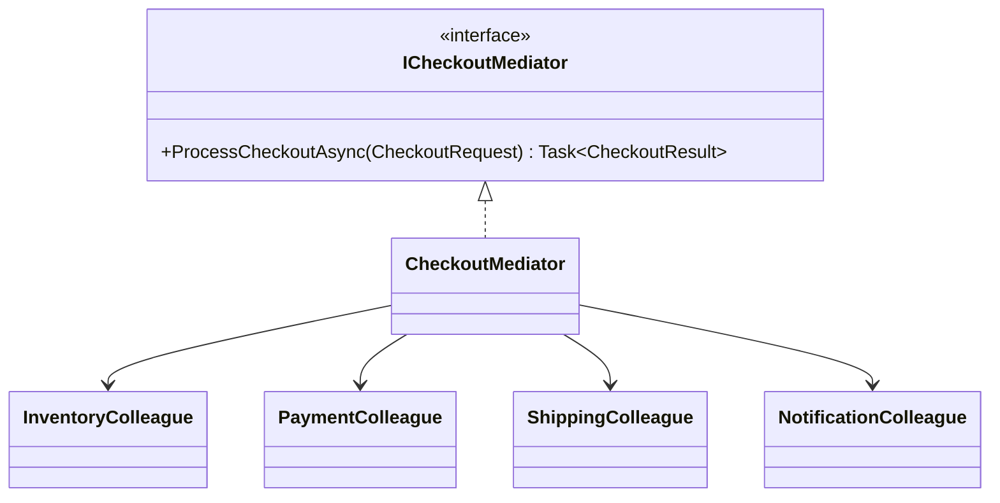
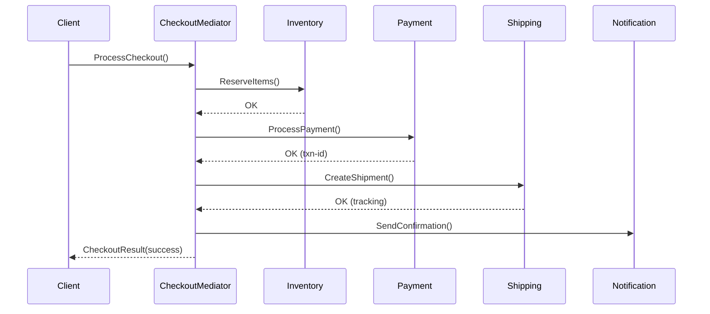

# Mediator

## Memory Hook (one-liner)
"A central coordinator that prevents components from talking directly to each other — like a checkout orchestrator that coordinates inventory, payment, shipping, and notifications."

## Problem
An e-commerce checkout involves inventory, payment, shipping, and notification systems. If each system called the others directly, you'd have N*(N-1) dependencies — a tangled web. Changes to one system would cascade through all others.

## Naive Approach
```csharp
// Every component knows about every other component
inventoryService.Reserve(items);
if (paymentService.Charge(amount)) {
    shippingService.Ship(address);
    notificationService.SendConfirmation();
} else {
    inventoryService.Release(items);
    notificationService.SendFailure();
}
```

## Pattern Solution
A Mediator centralizes the interaction logic. Colleagues (inventory, payment, shipping, notification) only know the mediator, not each other. The mediator orchestrates the workflow including compensating actions on failure.

## When To Use (5 bullets)
- Multiple objects interact in complex ways with many-to-many relationships
- You want to reduce direct dependencies between communicating objects
- You need to centralize control logic that spans multiple components
- You want to make the interaction logic independently testable
- You need to coordinate workflows with compensating actions (saga pattern)

## When NOT To Use (5 bullets)
- Simple interactions between two objects (just use direct calls)
- When the mediator would become a "god object" with too much logic
- When components need to be completely independent (use events instead)
- When performance matters and the indirection overhead is unacceptable
- When there's no complex coordination logic to centralize

## Participants
| Participant | In Our Code |
|---|---|
| Mediator | `ICheckoutMediator` |
| ConcreteMediator | `CheckoutMediator` |
| Colleague | `InventoryColleague`, `PaymentColleague`, `ShippingColleague`, `NotificationColleague` |

## Variants
1. **Classic Mediator** — mediator holds references to all colleagues (our implementation)
2. **Event-based Mediator** — colleagues publish events, mediator subscribes (MediatR library)
3. **CQRS Mediator** — separates commands and queries through a mediator

## Tradeoffs Table
| Aspect | Pro | Con |
|---|---|---|
| Coupling | Reduces N*N to N*1 dependencies | Mediator itself can become complex |
| Testability | Colleagues testable in isolation | Mediator harder to test end-to-end |
| Reusability | Colleagues reusable in other contexts | Mediator often context-specific |

## Common Interview Questions
1. How does Mediator differ from Observer?
2. How does MediatR implement the Mediator pattern?
3. When does a Mediator become a god object?
4. How does Mediator relate to the Saga pattern?

## Comparison with Similar Patterns
| Pattern | Key Difference |
|---|---|
| **Observer** | Observer is one-to-many notification; Mediator is many-to-many coordination |
| **Facade** | Facade simplifies an interface; Mediator coordinates interactions |
| **Chain of Responsibility** | CoR distributes handling; Mediator centralizes it |

## Mermaid Diagrams

### Class Diagram


### Sequence Diagram


## Similar Patterns to Review Next
- Observer (notification vs. coordination)
- Facade (simplifying vs. coordinating)
- Command (encapsulating requests the mediator orchestrates)
