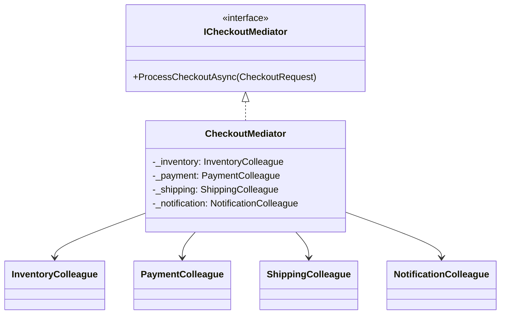
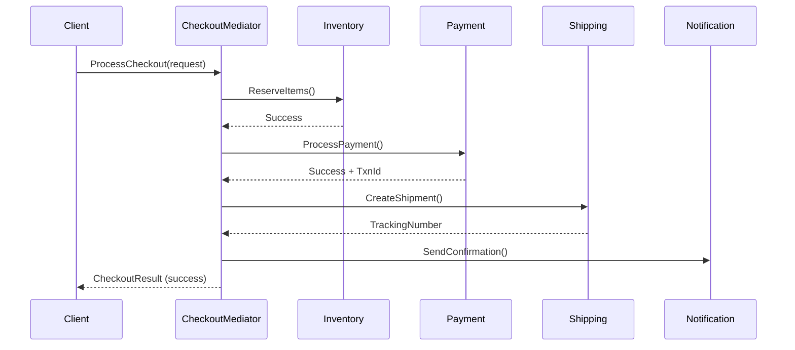

# Mediator

## Memory Hook (one-liner)
"Air traffic control for objects" — components don't talk to each other, they talk through the mediator.

## Problem
Multiple objects need to communicate, but direct references between them create a tangled web of dependencies. Adding a new participant requires modifying every existing one.

## Naive Approach
Each checkout component (inventory, payment, shipping, notifications) holds references to every other component and calls methods directly. This creates N*(N-1) dependencies and makes the system brittle.

## Pattern Solution
Introduce a mediator that coordinates interactions between colleagues. Each colleague knows only the mediator, not the other colleagues. The mediator encapsulates the workflow logic — the "who calls whom and in what order."

## When To Use (5 bullets)
- Multiple objects communicate in complex, well-defined ways
- Object reuse is difficult because it refers to many other objects
- You want to customize behavior distributed between several classes without subclassing all of them
- You need to centralize control logic that coordinates multiple subsystems
- You want to reduce the coupling graph from a mesh to a star topology

## When NOT To Use (5 bullets)
- Only two objects communicate (direct reference is simpler)
- The mediator becomes a "God object" with too much logic
- Communication is purely one-directional (Observer is better)
- You don't need to coordinate multiple independent subsystems
- The interaction patterns are simple and unlikely to change

## Participants
| Role | In This Example |
|------|----------------|
| Mediator | `ICheckoutMediator` |
| ConcreteMediator | `CheckoutMediator` |
| Colleague | `InventoryColleague`, `PaymentColleague`, `ShippingColleague`, `NotificationColleague` |

## Variants
- **Classic Mediator**: Concrete mediator with explicit coordination (our implementation)
- **MediatR Library**: Request/notification-based mediator with handler registration
- **Event Aggregator**: Mediator that uses events for loose coupling
- **Saga Pattern**: Long-running mediator with compensation logic

## Tradeoffs Table
| Aspect | Pro | Con |
|--------|-----|-----|
| Coupling | Colleagues are fully decoupled | Mediator can become complex |
| Reuse | Colleagues are independently reusable | Mediator is often application-specific |
| Flow Control | Workflow logic centralized in one place | Single point of failure |
| Testing | Colleagues testable in isolation | Mediator requires integration testing |

## Common Interview Questions
1. How does Mediator differ from Observer?
2. How does the MediatR library implement this pattern?
3. How do you prevent the mediator from becoming a God object?
4. How would you handle compensating transactions (saga)?
5. When would you use Mediator vs. direct method calls?

## Comparison with Similar Patterns
| Pattern | Similarity | Difference |
|---------|-----------|------------|
| Observer | Both decouple communication | Observer is one-to-many; Mediator is many-to-many via hub |
| Facade | Both simplify complex subsystems | Facade is unidirectional; Mediator is bidirectional |
| Chain of Responsibility | Both route requests | CoR is sequential; Mediator is coordinated |

## Mermaid Diagrams

### Class Diagram

### Sequence Diagram

## Similar Patterns to Review Next
- Observer (event-based communication)
- Facade (simplified interface)
- MediatR library (CQRS mediator)
