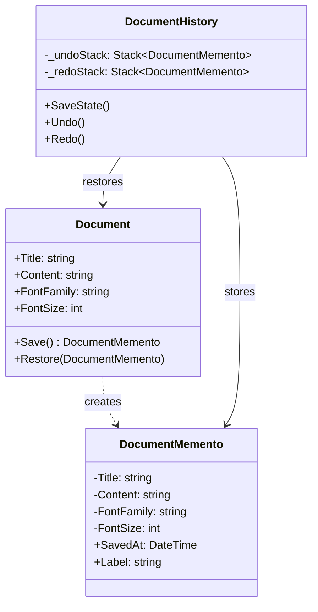
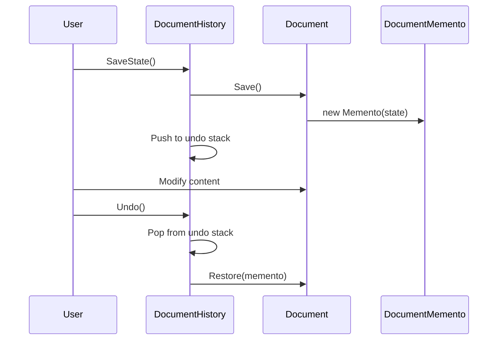

# Memento

## Memory Hook (one-liner)
"Save a snapshot of an object's state so you can restore it later — like Ctrl+Z in a document editor."

## Problem
A document editor needs undo/redo. You need to save and restore the complete state of the document (title, content, formatting) without exposing its internal structure. Simply making all fields public would break encapsulation.

## Naive Approach
```csharp
// Saving state by exposing internals
var backup = new { doc.Title, doc.Content, doc.FontSize };
// Later: doc.Title = backup.Title; etc.
// Breaks encapsulation, fragile if fields change
```

## Pattern Solution
The Document (originator) creates a Memento containing its internal state. A Caretaker (DocumentHistory) stores mementos without inspecting them. The Document can restore itself from any memento.

## When To Use (5 bullets)
- You need to implement undo/redo functionality
- You want to save checkpoints/snapshots of an object's state
- You need to preserve encapsulation while saving state externally
- You want to implement transactional behavior (rollback on failure)
- You need to save state at specific points for later comparison

## When NOT To Use (5 bullets)
- When the object's state is trivially simple (just copy a value)
- When state snapshots would consume too much memory
- When you need to query or inspect the saved state (use a different approach)
- When the object's state changes too frequently for snapshots
- When Command pattern's undo is simpler (inverse operations instead of snapshots)

## Participants
| Participant | In Our Code |
|---|---|
| Originator | `Document` |
| Memento | `DocumentMemento` |
| Caretaker | `DocumentHistory` |

## Variants
1. **Wide Memento** — captures all state (our implementation)
2. **Narrow Memento** — captures only changed state (incremental)
3. **Serialized Memento** — state serialized to JSON/binary for persistence

## Tradeoffs Table
| Aspect | Pro | Con |
|---|---|---|
| Encapsulation | Internal state not exposed | Memento can be expensive to create |
| Simplicity | Clean undo/redo implementation | Memory usage grows with history |
| Safety | State restoration is reliable | Must capture ALL relevant state |

## Common Interview Questions
1. How does Memento differ from Command for undo?
2. How do you limit memory usage with mementos?
3. How would you serialize mementos for persistence?
4. What's the difference between wide and narrow mementos?

## Comparison with Similar Patterns
| Pattern | Key Difference |
|---|---|
| **Command** | Command saves the operation; Memento saves the state |
| **Prototype** | Prototype clones objects; Memento saves/restores state |
| **Iterator** | Iterator can be bookmarked with a Memento |

## Mermaid Diagrams

### Class Diagram


### Sequence Diagram


## Similar Patterns to Review Next
- Command (operation-based undo)
- Prototype (deep cloning)
- State (object behavior changes with state)
