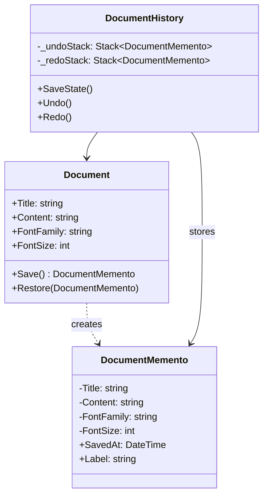
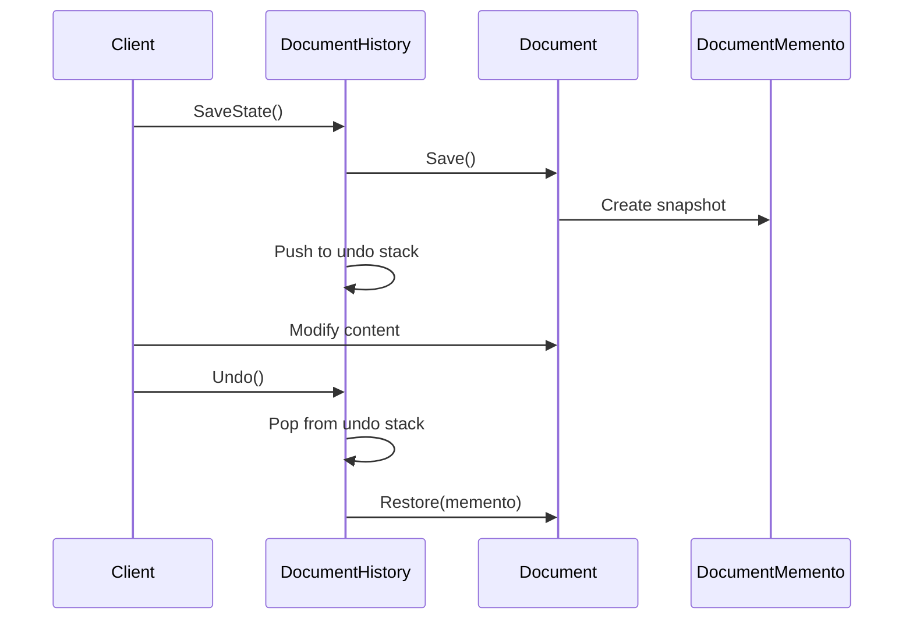

# Memento

## Memory Hook (one-liner)
"Save game, load game" — capture and restore an object's state without breaking encapsulation.

## Problem
You need to save and restore an object's internal state (for undo/redo, checkpointing, etc.) but exposing internal state would violate encapsulation. Direct field access creates coupling to the object's implementation.

## Naive Approach
Make all fields public and have the client manually copy/restore state. Or clone the entire object, which may include unnecessary data and doesn't communicate intent.

## Pattern Solution
The Originator creates a Memento containing a snapshot of its internal state. The Caretaker stores mementos without examining their contents. The Originator can restore itself from any memento. Encapsulation is preserved because only the Originator can read/write memento internals.

## When To Use (5 bullets)
- You need undo/redo functionality
- You need to save snapshots of an object's state for later restoration
- Direct access to the object's fields would break encapsulation
- You want to implement checkpoints or save points
- You need to support transactional rollback

## When NOT To Use (5 bullets)
- Saving state is computationally expensive and happens too frequently
- The object's state is trivial (a simple copy/clone suffices)
- You don't need to preserve encapsulation (internal state is already exposed)
- Memory constraints prevent storing multiple snapshots
- The object is immutable (no state changes to undo)

## Participants
| Role | In This Example |
|------|----------------|
| Originator | `Document` |
| Memento | `DocumentMemento` |
| Caretaker | `DocumentHistory` |

## Variants
- **Single Undo**: Only store the last state
- **Undo/Redo Stack**: Two stacks for undo and redo (our implementation)
- **Incremental Memento**: Store only the diff/delta between states
- **Serialized Memento**: Store state as JSON/binary for persistence

## Tradeoffs Table
| Aspect | Pro | Con |
|--------|-----|-----|
| Encapsulation | Internal state hidden from caretaker | Originator must expose save/restore |
| Simplicity | Clean undo/redo model | Memory cost of storing full snapshots |
| Reliability | Full state captured exactly | Large objects = expensive snapshots |
| Flexibility | Multiple restore points | Managing memento lifetime adds complexity |

## Common Interview Questions
1. How does Memento preserve encapsulation?
2. What is the difference between Memento and Command for undo?
3. How would you implement incremental mementos?
4. How would you persist mementos across application restarts?
5. How does Memento relate to Event Sourcing?

## Comparison with Similar Patterns
| Pattern | Similarity | Difference |
|---------|-----------|------------|
| Command | Both support undo | Command stores operations; Memento stores state |
| Prototype | Both involve copying state | Prototype clones objects; Memento saves/restores partial state |
| Serialization | Both capture object state | Serialization is general-purpose; Memento is pattern-specific |

## Mermaid Diagrams

### Class Diagram

### Sequence Diagram

## Similar Patterns to Review Next
- Command (operation-based undo)
- Prototype (object cloning)
- Event Sourcing (state reconstruction from events)
