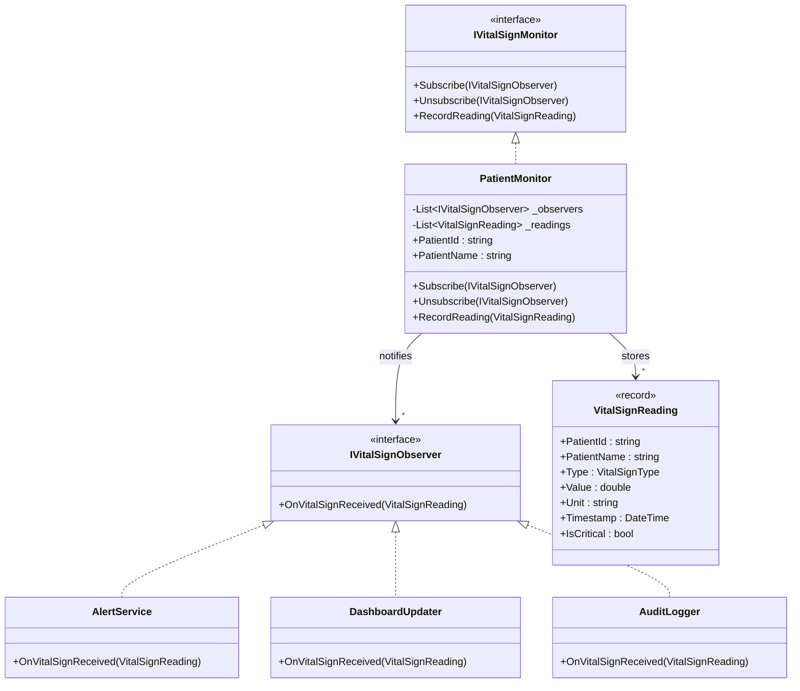
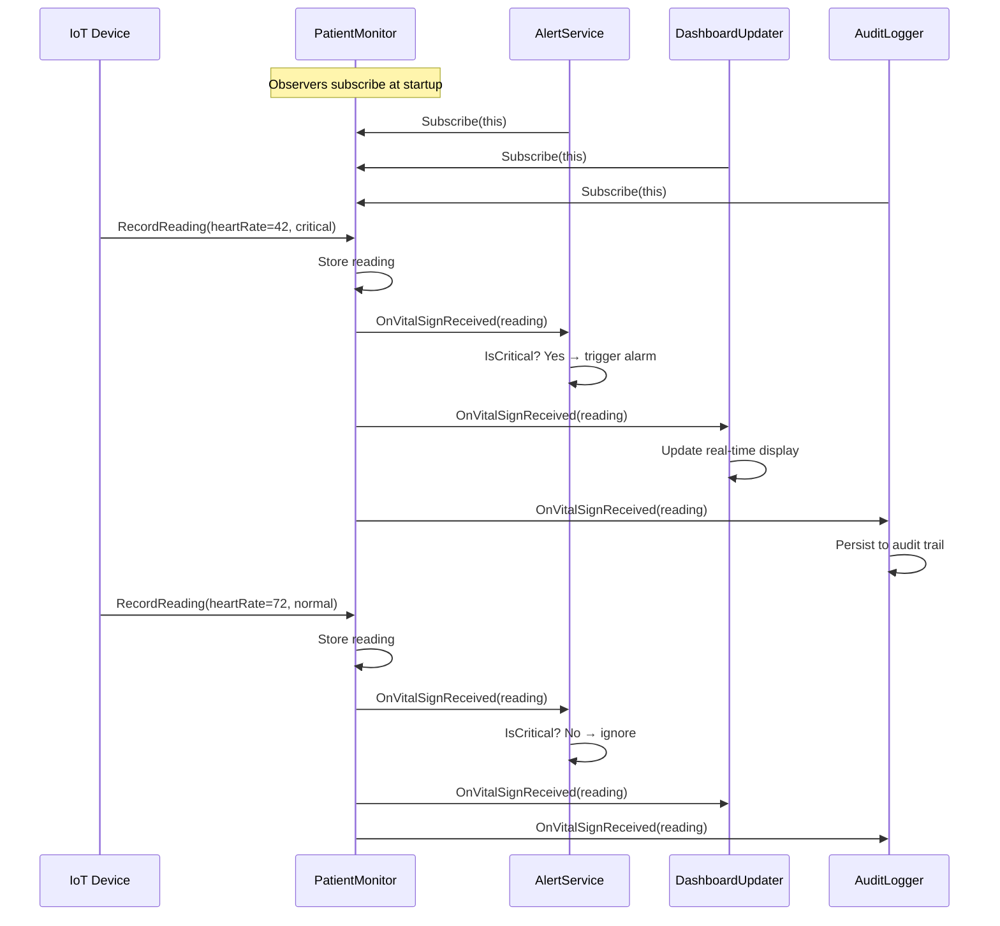

# Observer Pattern

## Memory Hook
"Don't call us, we'll call you" -- subjects push notifications to all registered observers automatically.

## Problem
In a Healthcare IoT system, a patient monitor produces vital sign readings (heart rate, blood oxygen, temperature, blood pressure, respiratory rate). Multiple independent subsystems need to react to these readings: an alert service triggers alarms for critical values, a dashboard updater refreshes the UI, and an audit logger records every reading for compliance. Without a decoupling mechanism, the patient monitor must know about every consumer and call each one directly, creating a tightly coupled web that is painful to extend or test.

## Naive Approach
The `PatientMonitor` class directly instantiates and calls `AlertService`, `DashboardUpdater`, and `AuditLogger` inside its `RecordReading` method. Adding a new consumer (e.g., a nurse pager) requires modifying the monitor class. Removing a consumer means editing the same class again. Unit testing the monitor requires standing up all consumers, and the monitor violates the Single Responsibility and Open/Closed principles.

## Pattern Solution
Define an `IVitalSignObserver` interface with a single `OnVitalSignReceived(VitalSignReading reading)` method. The `PatientMonitor` (subject) maintains a list of observers and notifies each one when a new reading arrives. Observers subscribe and unsubscribe at runtime. Each observer decides independently how to react -- the monitor neither knows nor cares what observers do with the data. Adding a new observer is a one-line registration; removing one requires no changes to existing code.

## When To Use
- Multiple independent components must react to the same event or state change.
- The set of consumers is unknown at compile time or changes at runtime.
- You want to broadcast events without the publisher depending on the subscribers.
- The subject and observers have different lifecycles or ownership boundaries.
- You need fan-out semantics (one event triggers multiple reactions).

## When NOT To Use
- There is only one consumer and it will never change -- direct coupling is simpler.
- Observer ordering matters and you need guaranteed sequential processing (use a pipeline instead).
- The notification causes a cascading chain of updates that is hard to debug (consider Mediator).
- Performance-critical tight loops where the indirection overhead matters.
- You need request-reply semantics rather than fire-and-forget notifications.

## Key Participants

| Participant | Role |
|---|---|
| `IVitalSignMonitor` (Subject) | Declares subscribe, unsubscribe, and notify operations. |
| `PatientMonitor` (Concrete Subject) | Stores observer list and vital sign readings; iterates observers on each new reading. |
| `IVitalSignObserver` (Observer) | Defines the `OnVitalSignReceived` callback contract. |
| `AlertService` (Concrete Observer) | Checks if a reading is critical and triggers alarms. |
| `DashboardUpdater` (Concrete Observer) | Pushes updated vital signs to a real-time dashboard. |
| `AuditLogger` (Concrete Observer) | Persists every reading to an audit trail for compliance. |
| `VitalSignReading` (Event Data) | Immutable record carrying patient ID, vital type, value, unit, timestamp, and criticality flag. |

## Variants
- **Push Model (this repo):** The subject sends the full `VitalSignReading` to observers. Simple but may send data observers do not need.
- **Pull Model:** The subject notifies observers that something changed; observers query the subject for the data they need. Reduces wasted data but adds coupling back to the subject.
- **Event-based (C# events / delegates):** The `VitalSignEventMonitor` variant in this repo uses C# `event` and delegates instead of an explicit interface. Idiomatic in .NET but harder to unit-test and carries risks of memory leaks from forgotten unsubscriptions.
- **Reactive Extensions (Rx):** Model the vital sign stream as `IObservable<VitalSignReading>` for composable filtering, throttling, and backpressure.
- **Weak Reference Observer:** Prevents memory leaks by holding weak references to observers, letting GC collect them if no other root exists.

## Tradeoffs

| Advantage | Disadvantage |
|---|---|
| Open/Closed: add observers without modifying the subject. | Observers are notified in registration order, which may create hidden ordering dependencies. |
| Loose coupling between subject and observers. | Debugging cascading notifications can be difficult ("who triggered this update?"). |
| Supports dynamic subscription and unsubscription at runtime. | Memory leaks if observers forget to unsubscribe (especially with C# events). |
| Each observer encapsulates its own reaction logic. | Broadcasting to many observers can impact performance if notifications are frequent. |
| Easy to unit-test subject and observers in isolation. | No built-in error isolation -- one observer throwing can prevent subsequent observers from running. |

## Common Interview Questions
1. How does the Observer pattern differ from the Mediator pattern, and when would you choose one over the other?
2. How do you prevent memory leaks in a .NET Observer implementation that uses events or long-lived subscriptions?
3. How would you make the Observer pattern thread-safe in a multi-threaded vital sign monitoring system?

## Comparison with Similar Patterns

| Aspect | Observer | Mediator |
|---|---|---|
| Communication | Subject broadcasts to many observers (1-to-many). | Mediator coordinates between colleagues (many-to-many). |
| Coupling | Observers depend on the subject interface only. | Colleagues depend on the mediator; mediator knows all colleagues. |
| Direction | Unidirectional push from subject to observers. | Bidirectional communication through a central hub. |
| Use case | Fan-out notifications (vital sign alerts). | Complex interactions between UI controls or microservices. |
| Adding participants | Add new observer class and register it. | Add new colleague and update the mediator. |

## Mermaid Class Diagram

## Mermaid Sequence Diagram

## Similar Patterns to Review Next
- **Mediator** -- centralizes complex many-to-many interactions instead of one-to-many broadcast.
- **Event Aggregator** -- a specialized mediator that routes events by type, common in MVVM frameworks.
- **Publish-Subscribe** -- decouples further with a message broker; observers do not reference the subject at all.
- **Chain of Responsibility** -- passes a request along a chain until one handler processes it, whereas Observer notifies all.
