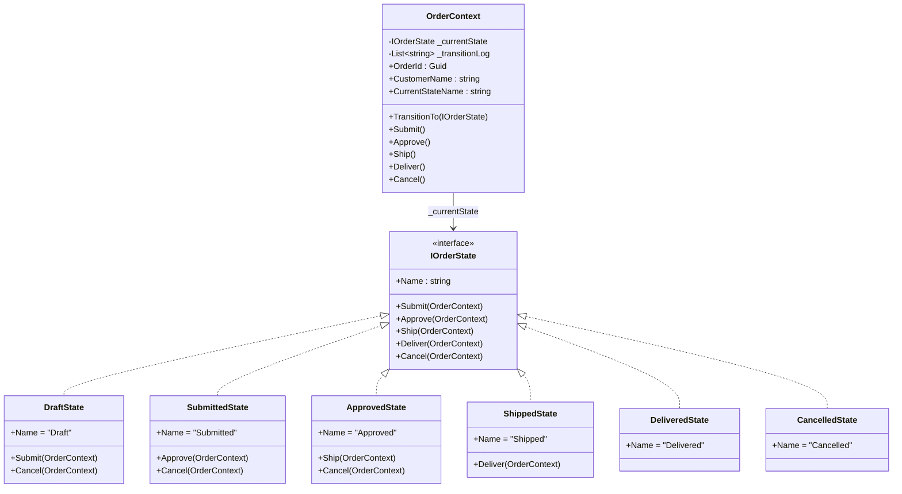
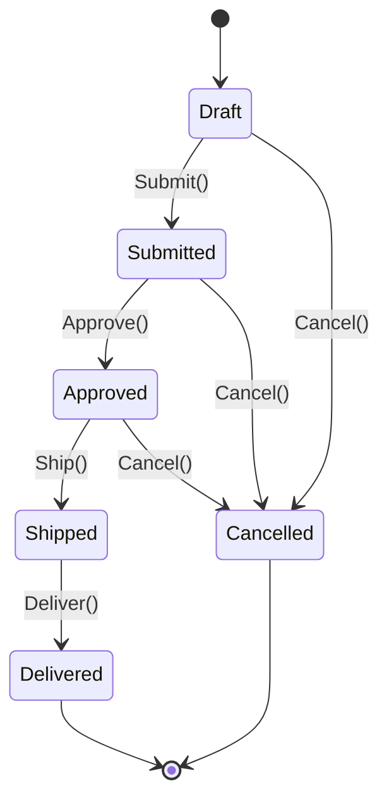

# State Pattern

## Memory Hook
"An object that changes its class at runtime" -- behavior changes as internal state transitions, without conditionals.

## Problem
An e-commerce order moves through a well-defined lifecycle: Draft, Submitted, Approved, Shipped, Delivered, and optionally Cancelled. Each state permits only certain transitions (you cannot ship a draft order, and you cannot cancel a delivered order). Without the State pattern, the `OrderContext` class accumulates a growing mass of `if/else` or `switch` statements in every method (`Submit()`, `Approve()`, `Ship()`, `Deliver()`, `Cancel()`), checking the current state before deciding what to do. Adding a new state (e.g., "ReturnRequested") forces changes across every method.

## Naive Approach
Store the order's state as an enum field. Every action method contains a switch on that enum: `if (state == OrderStatus.Draft) { ... } else if (state == OrderStatus.Submitted) { ... }`. This duplicates state-checking logic across five methods, violates the Open/Closed Principle, and scatters the rules for a single state across the entire class. Business analysts cannot easily verify that state transition rules are correct because the logic is interleaved everywhere.

## Pattern Solution
Encapsulate each state as a separate class implementing `IOrderState`. The `OrderContext` holds a reference to the current state object and delegates all actions to it. Each concrete state (e.g., `DraftState`, `SubmittedState`, `ApprovedState`) knows which transitions are valid from its perspective and either performs the transition or throws an `InvalidOperationException`. Adding a new state means adding a new class -- no existing state classes or the context need modification.

## When To Use
- An object has distinct behavioral modes that change at runtime (order lifecycle, workflow, game character states).
- You find yourself writing large switch/if-else blocks that check a status field before acting.
- State-specific behavior is complex enough to warrant its own class.
- Transitions between states follow well-defined rules that should be explicitly modeled.
- You want each state's logic to be testable in isolation.

## When NOT To Use
- The object has only two or three trivial states with minimal behavior differences (a boolean flag suffices).
- State transitions are not well-defined or change too frequently to justify the class explosion.
- The "states" do not carry behavior -- they are just data labels (use an enum).
- You need to choose an algorithm once at construction time and never change it (use Strategy instead).
- The overhead of one class per state is not justified for a simple domain.

## Key Participants

| Participant | Role |
|---|---|
| `IOrderState` (State Interface) | Declares `Submit`, `Approve`, `Ship`, `Deliver`, `Cancel` methods that each state must implement. |
| `OrderContext` (Context) | Holds the current `IOrderState`, delegates actions, and exposes `TransitionTo` for state changes. |
| `DraftState` | Initial state. Allows `Submit` and `Cancel`. Rejects approve/ship/deliver. |
| `SubmittedState` | Allows `Approve` and `Cancel`. Rejects submit/ship/deliver. |
| `ApprovedState` | Allows `Ship` and `Cancel`. Rejects submit/approve/deliver. |
| `ShippedState` | Allows `Deliver`. Rejects submit/approve/ship/cancel. |
| `DeliveredState` | Terminal state. Rejects all transitions. |
| `CancelledState` | Terminal state. Rejects all transitions. |

## Variants
- **Transition Table:** Instead of coding transitions in each state class, store them in a dictionary mapping (currentState, trigger) to nextState. More data-driven and easier to visualize, but less flexible for complex entry/exit actions.
- **Hierarchical State Machine:** States can have substates (e.g., Shipped has substates InTransit, OutForDelivery). Used in complex embedded systems and game AI.
- **State with Entry/Exit Actions:** Each state executes logic when entered or exited (e.g., send a notification email on entering ShippedState).
- **Stateless Library:** In .NET, the `Stateless` NuGet package provides a fluent API for defining state machines without writing one class per state.

## Tradeoffs

| Advantage | Disadvantage |
|---|---|
| Eliminates large conditional blocks; each state's logic is cohesive in one class. | Increases the number of classes (one per state). |
| Adding a new state does not require modifying existing state classes. | State classes may need to know about each other for transitions. |
| Transition rules are explicit and easy to verify. | Can be overkill for objects with very few simple states. |
| Each state is independently testable. | Context must expose an internal `TransitionTo` method, partially breaking encapsulation. |
| Transition log provides a built-in audit trail. | Understanding the full state machine requires reading multiple classes. |

## Common Interview Questions
1. How does the State pattern differ from the Strategy pattern, given that both use polymorphism to swap behavior?
2. Who should be responsible for deciding state transitions -- the state objects themselves or the context?
3. How would you implement a state machine that supports undo (reverting to the previous state)?

## Comparison with Similar Patterns

| Aspect | State | Strategy |
|---|---|---|
| Intent | Change behavior as internal state changes over time. | Choose an algorithm at runtime, typically once. |
| Transition | State objects trigger transitions to other states. | Client explicitly sets the strategy; no automatic transitions. |
| Awareness | Each state knows about sibling states it can transition to. | Strategies are independent and unaware of each other. |
| Lifecycle | State changes many times during the object's life. | Strategy is usually set once or changed infrequently. |
| Analogy | Order moving through Draft, Submitted, Shipped. | Selecting a pricing algorithm (Standard vs Premium vs Volume). |

## Mermaid Class Diagram

## Mermaid Sequence/Flow Diagram

## Similar Patterns to Review Next
- **Strategy** -- also swaps behavior via polymorphism, but the client chooses the algorithm rather than the object transitioning itself.
- **Command** -- encapsulates a request as an object; can be combined with State to record transitions as commands for undo/redo.
- **Memento** -- captures and restores an object's state, useful for implementing undo in state machines.
- **Finite State Machine libraries** -- `Stateless`, `MassTransit Automatonymous` for production-grade .NET state machines.
