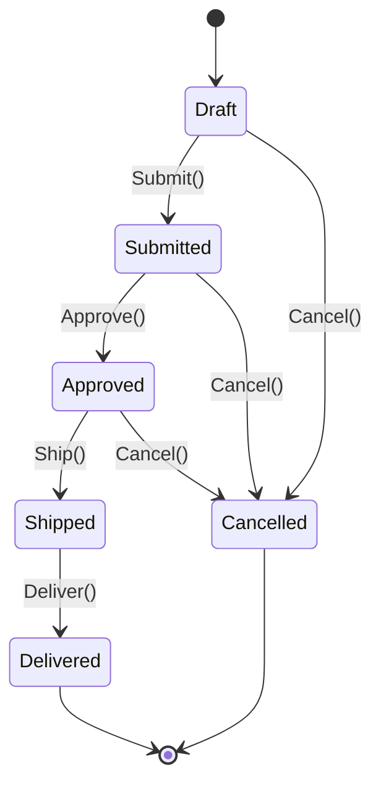
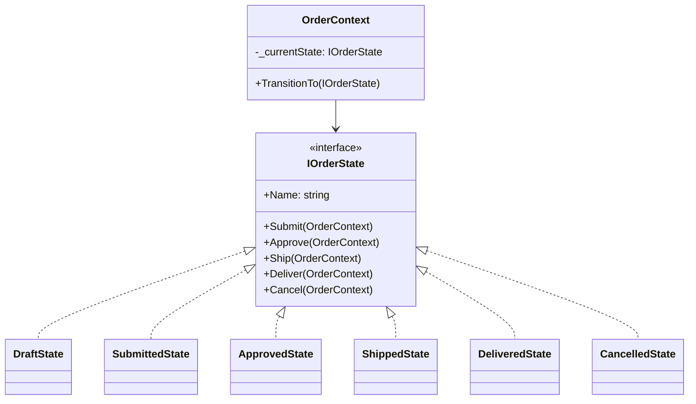

# State

## Memory Hook (one-liner)
"Let an object change its behavior when its internal state changes — like an order that behaves differently in Draft, Submitted, Shipped, and Delivered states."

## Problem
An order has a lifecycle: Draft, Submitted, Approved, Shipped, Delivered, Cancelled. Each state has different rules about which transitions are valid. Using `if/switch` on status enums leads to scattered, duplicated logic that grows out of control.

## Naive Approach
```csharp
public void Ship() {
    if (Status == "Approved") { Status = "Shipped"; }
    else if (Status == "Draft") throw new Exception("Can't ship draft");
    else if (Status == "Cancelled") throw new Exception("Can't ship cancelled");
    // Repeated for every action, every state...
}
```

## Pattern Solution
Each state is a separate class implementing `IOrderState`. The context delegates operations to the current state object. State transitions happen by swapping the state object, so each state class contains only its own rules.

## When To Use (5 bullets)
- An object's behavior depends on its state and changes at runtime
- Operations have conditional logic based on the object's state
- You have many states with distinct behaviors (state explosion in switch/if)
- State transitions follow specific rules that should be enforced
- You want to make state-specific behavior explicit and organized

## When NOT To Use (5 bullets)
- When there are only 2-3 states with simple logic (switch is fine)
- When state transitions are rare and trivial
- When the number of state-dependent operations is very small
- When a simple enum + switch provides sufficient clarity
- When you need a formal state machine library with persistence

## Participants
| Participant | In Our Code |
|---|---|
| Context | `OrderContext` |
| State | `IOrderState` |
| ConcreteStates | `DraftState`, `SubmittedState`, `ApprovedState`, `ShippedState`, `DeliveredState`, `CancelledState` |

## Variants
1. **Classic State** — state objects with explicit transitions (our implementation)
2. **State Table** — transitions defined in a lookup table
3. **Hierarchical State Machine** — states can have sub-states
4. **Stateless library** — .NET's Stateless library for declarative state machines

## Tradeoffs Table
| Aspect | Pro | Con |
|---|---|---|
| Organization | State logic concentrated in one class | More classes to manage |
| Transitions | Invalid transitions prevented at compile time | State objects need context reference |
| Testing | Each state testable in isolation | Transition coverage needs attention |

## Common Interview Questions
1. How does State differ from Strategy?
2. Who decides the next state — the context or the state?
3. How would you persist state machine state to a database?
4. How does the State pattern relate to finite automata?

## Comparison with Similar Patterns
| Pattern | Key Difference |
|---|---|
| **Strategy** | Strategy is chosen by client; State transitions internally |
| **Command** | Command encapsulates an action; State encapsulates behavior for a state |
| **Memento** | Memento saves state; State pattern models state-dependent behavior |

## Mermaid Diagrams

### State Machine Diagram


### Class Diagram


## Similar Patterns to Review Next
- Strategy (behavioral variation without state transitions)
- Command (encapsulating operations)
- Memento (saving/restoring state)
