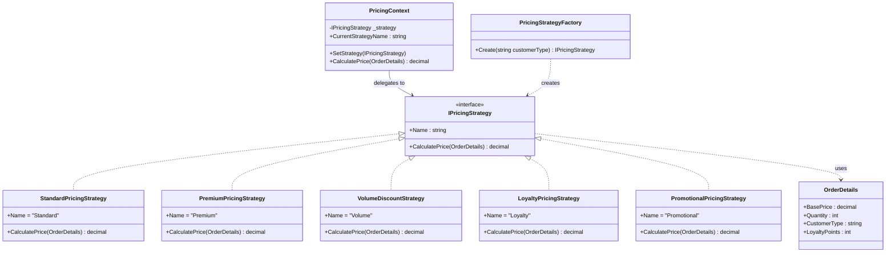
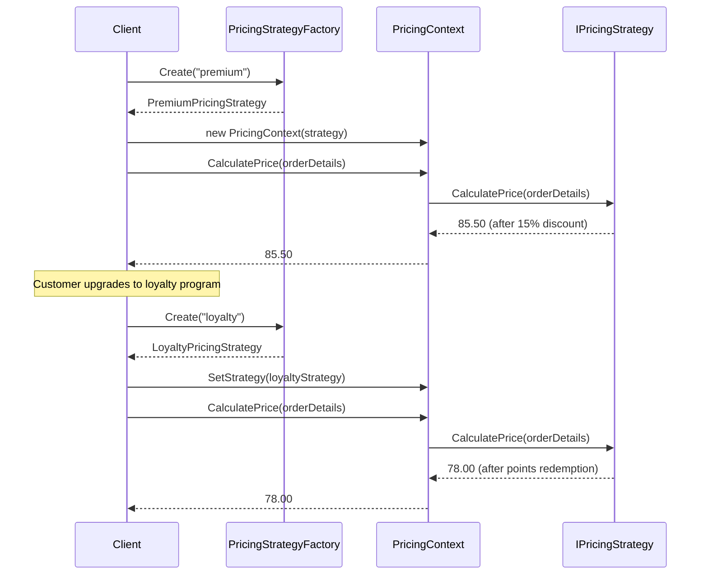

# Strategy Pattern

## Memory Hook
"Plug in the algorithm you need" -- encapsulate a family of algorithms behind a common interface and swap them at runtime.

## Problem
A pricing engine must calculate order totals using different strategies depending on the customer type: standard pricing, premium member discounts, volume-based discounts, loyalty point redemption, and promotional pricing. Without a clean abstraction, the pricing logic degenerates into a long chain of conditionals that grow with every new pricing rule. Each change to one strategy risks breaking another, and unit-testing individual strategies in isolation is impossible when they are entangled in a single method.

## Naive Approach
A single `CalculatePrice` method with a growing switch statement: `switch (customerType) { case "Standard": ... case "Premium": ... case "Volume": ... }`. Adding promotional pricing means touching the same method. Testing the loyalty discount requires constructing the full pricing context, including branches you do not care about. The method balloons in cyclomatic complexity.

## Pattern Solution
Define an `IPricingStrategy` interface with a `CalculatePrice(OrderDetails order)` method. Each pricing algorithm lives in its own class: `StandardPricingStrategy`, `PremiumPricingStrategy`, `VolumeDiscountStrategy`, `LoyaltyPricingStrategy`, `PromotionalPricingStrategy`. The `PricingContext` holds a reference to the current strategy and delegates pricing to it. Strategies are selected via a `PricingStrategyFactory` that maps customer types to strategy instances. The context can swap strategies at runtime if needed.

## When To Use
- You have a family of algorithms that differ only in their implementation but share the same interface.
- You want to eliminate conditional statements that select behavior based on a type discriminator.
- The algorithm needs to be selected or swapped at runtime.
- You need to unit-test each algorithm in isolation.
- New algorithms are added frequently and should not require changes to existing code.

## When NOT To Use
- There are only two trivial variants and a simple `if/else` is clearer and more maintainable.
- The algorithm choice never changes after construction -- consider making it a constructor parameter without the pattern overhead.
- The algorithms need to transition automatically between each other based on internal state (use the State pattern).
- The strategies need to share significant mutable state with each other (Strategy assumes independence).
- The indirection of an interface and multiple classes adds complexity without proportional benefit.

## Key Participants

| Participant | Role |
|---|---|
| `IPricingStrategy` (Strategy Interface) | Declares `Name` and `CalculatePrice(OrderDetails)` contract. |
| `StandardPricingStrategy` | Base price with no discounts. |
| `PremiumPricingStrategy` | Applies a premium member discount percentage. |
| `VolumeDiscountStrategy` | Tiered discounts based on order quantity. |
| `LoyaltyPricingStrategy` | Redeems loyalty points as a discount. |
| `PromotionalPricingStrategy` | Applies a promotional or coupon-based discount. |
| `PricingContext` (Context) | Holds the active strategy and delegates `CalculatePrice` calls. |
| `PricingStrategyFactory` | Maps customer type strings to concrete strategy instances. |
| `OrderDetails` | Data object carrying base price, quantity, customer type, and loyalty points. |

## Variants
- **Strategy via Delegates/Lambdas:** In C#, pass a `Func<OrderDetails, decimal>` instead of creating a class. Good for simple one-liner strategies.
- **Strategy via DI Container:** Register all strategies in the IoC container and resolve by name or key. Common in ASP.NET Core applications.
- **Composite Strategy:** Combine multiple strategies (e.g., apply volume discount then loyalty points) using a composite that chains calculations.
- **Strategy with Factory Method:** The factory selects the strategy based on runtime data (customer type, feature flags, A/B test group).

## Tradeoffs

| Advantage | Disadvantage |
|---|---|
| Eliminates conditional logic for algorithm selection. | Increases the number of classes (one per strategy). |
| Each strategy is independently testable and deployable. | Client must be aware of the different strategies to choose one. |
| New strategies can be added without modifying existing code. | All strategies must conform to the same interface, which may feel forced for dissimilar algorithms. |
| Strategies can be swapped at runtime. | Extra indirection adds a small performance overhead. |
| Encourages composition over inheritance. | If strategies need shared state, the interface must accommodate it, increasing coupling. |

## Common Interview Questions
1. How does the Strategy pattern differ from the State pattern if both encapsulate behavior behind an interface?
2. How would you implement a Strategy pattern in .NET using dependency injection and keyed services?
3. When would you use a lambda/delegate instead of creating a full strategy class?

## Comparison with Similar Patterns

| Aspect | Strategy | State |
|---|---|---|
| Who triggers the change | Client/external code explicitly sets the strategy. | State objects trigger transitions internally. |
| Awareness of siblings | Strategies are independent; they do not know about other strategies. | Each state knows which states it can transition to. |
| Frequency of change | Typically set once or changed infrequently. | Changes many times during the object's lifetime. |
| Purpose | Select an algorithm. | Model a lifecycle or workflow. |
| Example | Choosing a pricing algorithm for an order. | An order moving through Draft, Submitted, Shipped, Delivered. |

## Mermaid Class Diagram

## Mermaid Sequence Diagram

## Similar Patterns to Review Next
- **State** -- similar structure but states transition automatically; strategies are chosen externally.
- **Template Method** -- defines an algorithm skeleton in a base class with overridable steps; uses inheritance rather than composition.
- **Command** -- encapsulates a request as an object; can carry a strategy inside it.
- **Factory Method** -- often used alongside Strategy to select the correct strategy at runtime.
