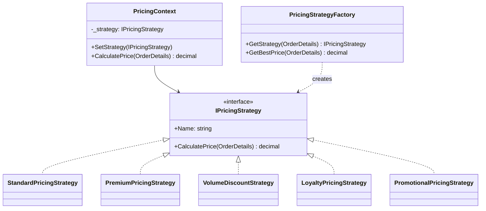
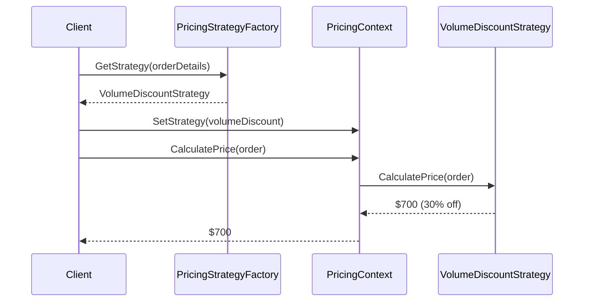

# Strategy

## Memory Hook (one-liner)
"Swap the algorithm at runtime without changing the code that uses it — like a pricing engine that switches between Standard, Premium, Volume, Loyalty, and Promotional pricing."

## Problem
An e-commerce platform needs different pricing logic for different customers and situations. Embedding all pricing rules in one class with conditionals makes it bloated, hard to test, and violates Open/Closed principle when adding new pricing models.

## Naive Approach
```csharp
decimal CalculatePrice(Order order) {
    if (order.CustomerTier == "Premium") return order.Subtotal * 0.85m;
    else if (order.Quantity >= 100) return order.Subtotal * 0.70m;
    else if (order.HasPromotion) return order.Subtotal * (1 - order.PromoDiscount);
    // Growing list of pricing rules...
    else return order.Subtotal;
}
```

## Pattern Solution
Define a `IPricingStrategy` interface. Each pricing model is a separate strategy class. A context holds the current strategy and delegates price calculation to it. Strategies can be swapped at runtime, and a factory can auto-select the best one.

## When To Use (5 bullets)
- Multiple algorithms/behaviors exist for the same operation
- You need to swap algorithms at runtime
- You want to avoid conditional statements for selecting behavior
- You want algorithms to be independently testable
- You want to combine Strategy with Factory for automatic selection

## When NOT To Use (5 bullets)
- When there's only one algorithm (no need for abstraction)
- When the algorithm never changes at runtime
- When clients don't need to know about different strategies
- When a simple lambda or delegate would suffice
- When the number of strategies is very small and stable

## Participants
| Participant | In Our Code |
|---|---|
| Strategy | `IPricingStrategy` |
| ConcreteStrategies | `StandardPricingStrategy`, `PremiumPricingStrategy`, `VolumeDiscountStrategy`, `LoyaltyPricingStrategy`, `PromotionalPricingStrategy` |
| Context | `PricingContext` |
| Factory | `PricingStrategyFactory` |

## Variants
1. **Classic Strategy** — context holds a strategy reference (our implementation)
2. **Lambda Strategy** — strategies as `Func<T, TResult>` delegates
3. **Strategy + Factory** — auto-selects the optimal strategy (our `PricingStrategyFactory`)
4. **DI-based** — strategies resolved from the DI container

## Tradeoffs Table
| Aspect | Pro | Con |
|---|---|---|
| Flexibility | Swap algorithms at runtime | Client must know about strategies |
| Testing | Each strategy testable in isolation | More classes/interfaces |
| OCP | Add new strategies without changing existing code | Strategy selection logic needed |

## Common Interview Questions
1. How does Strategy differ from State?
2. How does Strategy differ from Template Method?
3. When would you use a lambda instead of a Strategy class?
4. How do you combine Strategy with Factory or DI?

## Comparison with Similar Patterns
| Pattern | Key Difference |
|---|---|
| **State** | State transitions automatically; Strategy is selected explicitly |
| **Template Method** | Template Method uses inheritance; Strategy uses composition |
| **Command** | Command encapsulates a request; Strategy encapsulates an algorithm |
| **Decorator** | Decorator adds behavior; Strategy replaces behavior |

## Mermaid Diagrams

### Class Diagram


### Sequence Diagram


## Similar Patterns to Review Next
- State (behavior varies with state vs. chosen algorithm)
- Template Method (inheritance vs. composition)
- Factory Method (creating the right strategy)
