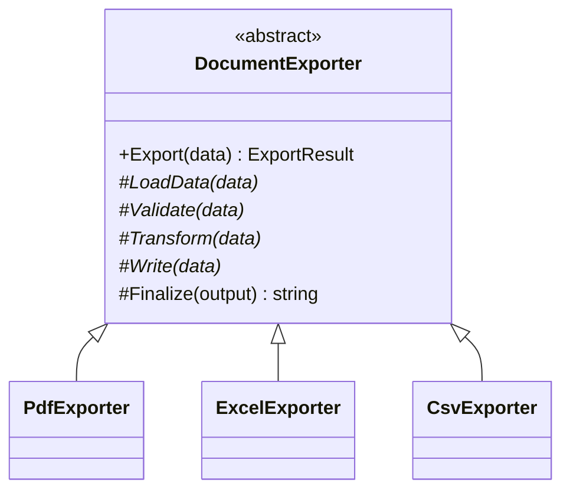
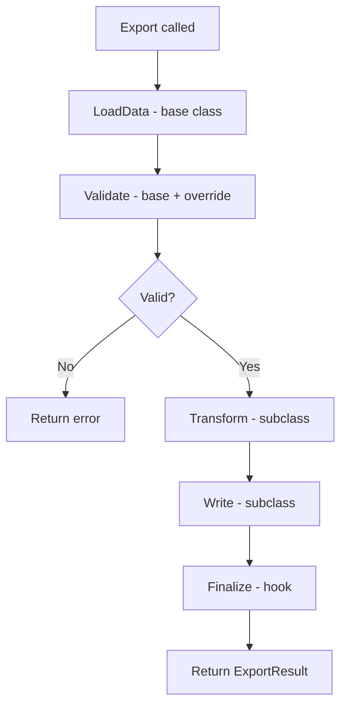

# Template Method

## Memory Hook (one-liner)
"Define the skeleton of an algorithm in a base class and let subclasses fill in the details — like a document export pipeline where PDF, Excel, and CSV share the same flow but differ in formatting."

## Problem
Document export to PDF, Excel, and CSV all follow the same steps: load data, validate, transform, write, finalize. Each format implements these steps differently, but the overall flow is identical. Duplicating the flow in each exporter leads to inconsistency and maintenance burden.

## Naive Approach
```csharp
// Each exporter duplicates the full pipeline
class CsvExporter {
    public string Export(Data data) {
        var loaded = LoadData(data);     // Same in every exporter
        Validate(loaded);                // Same in every exporter
        var transformed = TransformToCsv(loaded);  // Different
        var output = WriteCsv(transformed);        // Different
        return output;
    }
}
// Repeat for PDF, Excel... with duplicated load/validate logic
```

## Pattern Solution
An abstract base class defines the template method (`Export`) with the fixed algorithm skeleton. Subclasses override specific steps (Transform, Write, Finalize) while the base class handles common logic (LoadData, Validate).

## When To Use (5 bullets)
- Multiple classes share the same algorithm structure but differ in specific steps
- You want to enforce a specific order of operations
- You want to provide hook methods for optional customization
- You want to eliminate code duplication in related classes
- You want to control which parts of the algorithm can be overridden

## When NOT To Use (5 bullets)
- When the algorithm has only one step that varies (use Strategy instead)
- When subclasses need to change the algorithm's structure
- When composition would provide more flexibility than inheritance
- When the number of steps that vary is too large
- When you need multiple algorithm variations at runtime (use Strategy)

## Participants
| Participant | In Our Code |
|---|---|
| AbstractClass | `DocumentExporter` |
| ConcreteClasses | `PdfExporter`, `ExcelExporter`, `CsvExporter` |
| TemplateMethod | `Export()` |
| PrimitiveOperations | `Transform()`, `Write()` |
| Hook | `Finalize()` |

## Variants
1. **Classic Template Method** — abstract methods for required steps (our implementation)
2. **With Hooks** — virtual methods with default behavior that subclasses may override (`Finalize`)
3. **Functional** — using delegates/lambdas instead of inheritance

## Tradeoffs Table
| Aspect | Pro | Con |
|---|---|---|
| Reuse | Common algorithm logic in one place | Inheritance hierarchy required |
| Control | Base class controls the flow | Subclasses constrained by the skeleton |
| Consistency | All exporters follow the same steps | Adding new steps requires base class change |

## Common Interview Questions
1. How does Template Method differ from Strategy?
2. What's the Hollywood Principle and how does it relate?
3. What's the difference between abstract methods and hook methods?
4. When would you prefer Strategy over Template Method?

## Comparison with Similar Patterns
| Pattern | Key Difference |
|---|---|
| **Strategy** | Strategy uses composition; Template Method uses inheritance |
| **Factory Method** | Factory Method is a Template Method for object creation |
| **Builder** | Builder constructs objects step-by-step; Template Method processes data step-by-step |

## Mermaid Diagrams

### Class Diagram


### Flow Diagram


## Similar Patterns to Review Next
- Strategy (composition vs. inheritance)
- Factory Method (creation-focused template method)
- Builder (step-by-step construction)
