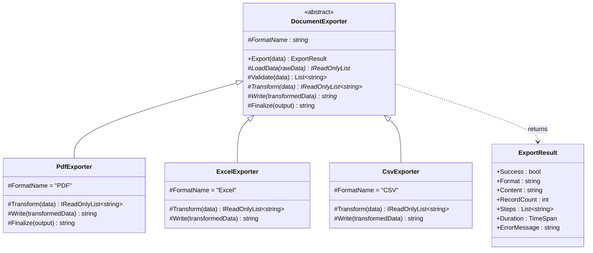
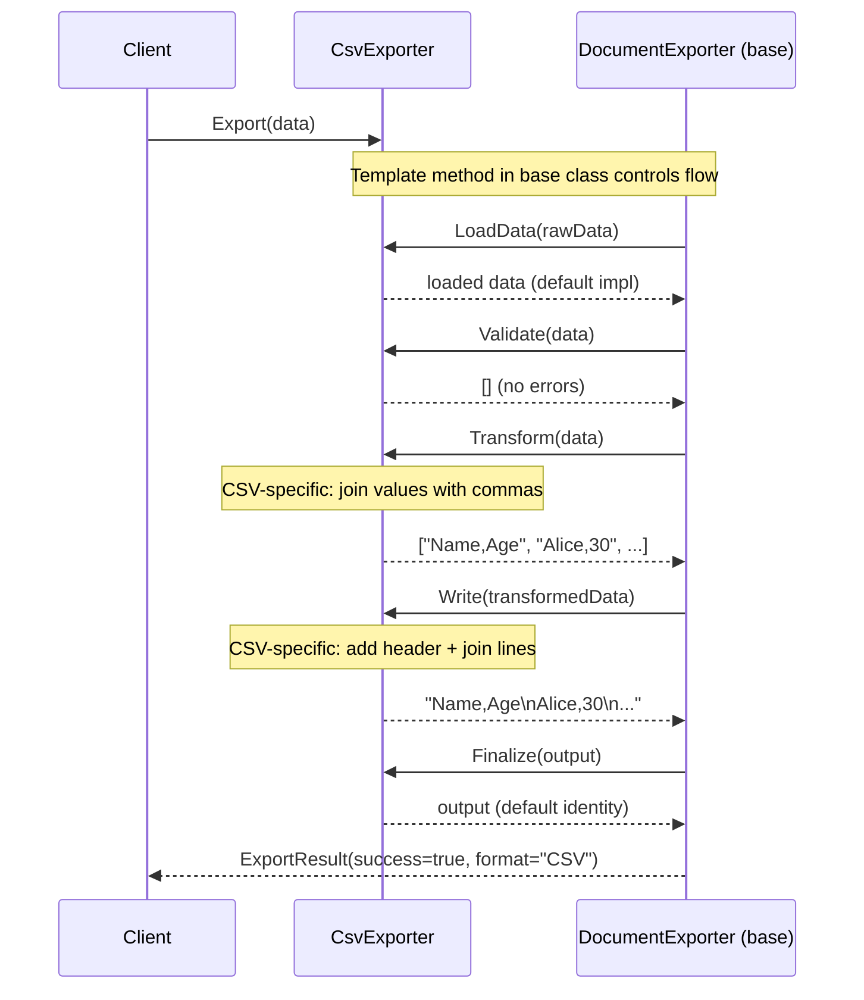

# Template Method Pattern

## Memory Hook
"Define the skeleton, let subclasses fill in the blanks" -- an abstract base class locks the algorithm's structure while subclasses customize individual steps.

## Problem
A document export pipeline must support multiple output formats (PDF, Excel, CSV). Every format follows the same high-level algorithm: Load Data, Validate, Transform, Write, and Finalize. The difference lies in how each step is implemented -- CSV transforms rows into comma-separated strings, PDF renders styled pages, and Excel produces structured worksheets. Without a unifying structure, each exporter duplicates the orchestration logic, and any change to the pipeline flow (e.g., adding a timing step) must be replicated across all exporters.

## Naive Approach
Create three completely independent exporter classes, each implementing the full pipeline from scratch. The load-validate-transform-write-finalize sequence is copy-pasted into `PdfExporter`, `ExcelExporter`, and `CsvExporter`. When a new requirement arises -- say, wrapping the pipeline in a `Stopwatch` for performance metrics -- you must modify all three classes identically. Bug fixes to validation logic must be applied three times.

## Pattern Solution
Define an abstract `DocumentExporter` base class with a sealed `Export` template method that orchestrates the fixed sequence: `LoadData` -> `Validate` -> `Transform` -> `Write` -> `Finalize`. The template method is not virtual, so subclasses cannot alter the flow. Individual steps are either abstract (subclasses must implement them: `Transform`, `Write`, `FormatName`) or virtual hooks with sensible defaults (`LoadData`, `Validate`, `Finalize`). Each concrete exporter (`PdfExporter`, `ExcelExporter`, `CsvExporter`) overrides only the steps that differ, inheriting the shared orchestration, error handling, and timing logic for free.

## When To Use
- Multiple classes share the same algorithm structure but differ in specific steps.
- You want to enforce a fixed sequence of operations that subclasses cannot reorder.
- Common behavior (logging, error handling, timing) should be coded once in the base class.
- You want to provide extension points (hooks) without exposing the full algorithm.
- The invariant parts of the algorithm should be locked down to prevent accidental breakage.

## When NOT To Use
- The algorithm structure itself varies across implementations -- there is no common skeleton to extract.
- You prefer composition over inheritance (use Strategy instead).
- The number of customizable steps is so large that subclasses override everything, leaving no shared skeleton.
- You need to swap behavior at runtime (Template Method is bound at compile time via inheritance).
- The base class becomes a "god class" with too many virtual hooks, creating a fragile base class problem.

## Key Participants

| Participant | Role |
|---|---|
| `DocumentExporter` (Abstract Class) | Defines the `Export` template method and declares abstract/virtual steps. |
| `PdfExporter` (Concrete Class) | Implements `Transform` and `Write` for PDF output, overrides `Finalize` to add metadata. |
| `ExcelExporter` (Concrete Class) | Implements `Transform` and `Write` for Excel/worksheet output. |
| `CsvExporter` (Concrete Class) | Implements `Transform` and `Write` for CSV output. |
| `ExportResult` (Result DTO) | Carries success/failure, content, record count, steps executed, and duration. |

## Variants
- **Hook Methods:** Virtual methods with default no-op or identity implementations (`Finalize` in this repo). Subclasses override only when they need custom behavior.
- **Template Method with Strategy:** Use Strategy for the variable steps instead of inheritance. The base class holds strategy references and delegates to them. Combines the benefits of both patterns.
- **Non-Virtual Interface (NVI):** In C#, the public method is non-virtual and calls protected virtual methods. This repo uses this approach -- `Export` is public and not overridable, while the steps are `protected abstract/virtual`.

## Tradeoffs

| Advantage | Disadvantage |
|---|---|
| Eliminates code duplication for the shared algorithm skeleton. | Relies on inheritance, which is less flexible than composition. |
| Enforces a consistent execution flow across all subclasses. | Adding new steps to the base class can break existing subclasses (fragile base class). |
| Common cross-cutting concerns (timing, error handling) are coded once. | The inverted control ("Hollywood Principle") can be confusing to newcomers. |
| Hook methods provide optional extension points with safe defaults. | Deep inheritance hierarchies become hard to understand and maintain. |
| Easy to add a new exporter without touching existing code. | Cannot swap the algorithm at runtime (compile-time binding via inheritance). |

## Common Interview Questions
1. What is the difference between Template Method and Strategy, given that both allow customizable behavior?
2. How does the "Hollywood Principle" (don't call us, we'll call you) apply to the Template Method pattern?
3. When would you choose a hook method (virtual with default) over an abstract method in a template?

## Comparison with Similar Patterns

| Aspect | Template Method | Strategy |
|---|---|---|
| Mechanism | Inheritance: subclass overrides steps. | Composition: inject an algorithm object. |
| Binding time | Compile time (class hierarchy). | Runtime (set or swap strategy). |
| Algorithm structure | Fixed skeleton in the base class. | Entire algorithm varies; no shared skeleton. |
| Code reuse | Shared steps live in the base class. | No implicit sharing; each strategy is self-contained. |
| Flexibility | Cannot swap behavior at runtime. | Can swap at any time. |
| Granularity | Customizes individual steps of a larger algorithm. | Replaces the entire algorithm. |

## Mermaid Class Diagram

## Mermaid Sequence Diagram

## Similar Patterns to Review Next
- **Strategy** -- uses composition instead of inheritance; lets you swap the entire algorithm at runtime.
- **Factory Method** -- a specialization of Template Method where the "step" being customized is object creation.
- **Builder** -- separates construction steps similarly but focuses on building complex objects rather than executing an algorithm pipeline.
