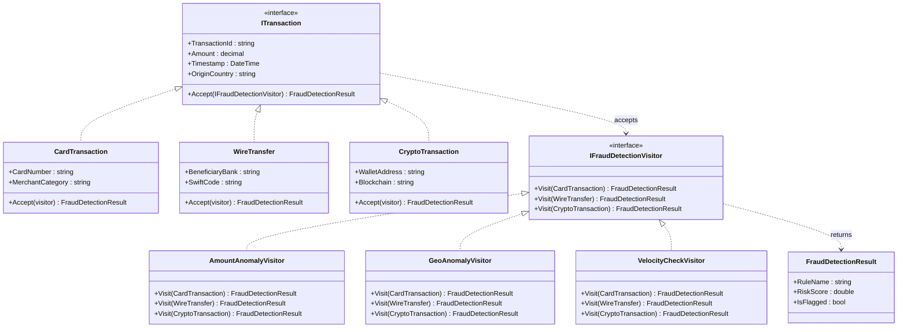
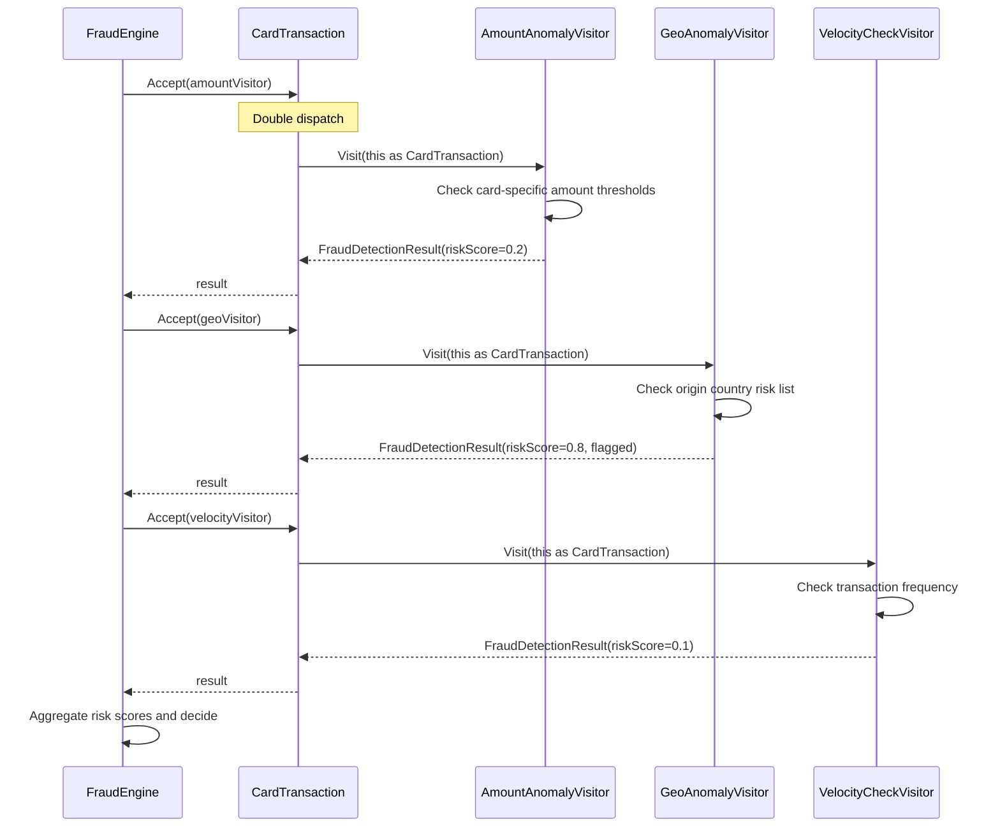

# Visitor Pattern

## Memory Hook
"Add new operations to existing classes without modifying them" -- double dispatch lets you define a new operation in a visitor, not in the element.

## Problem
A fraud detection engine must analyze multiple transaction types (card transactions, wire transfers, crypto transactions) with multiple independent detection rules (amount anomalies, geographic anomalies, velocity checks). Each detection rule behaves differently depending on the transaction type -- a velocity check for crypto looks very different from a velocity check for wire transfers. Without a structured approach, either the transaction classes accumulate fraud logic that does not belong to them, or a central service class uses cascading `if (transaction is CardTransaction)` checks that violate the Open/Closed Principle.

## Naive Approach
Each transaction class gets methods like `CheckAmountAnomaly()`, `CheckGeoAnomaly()`, `CheckVelocity()`. Adding a new fraud check (e.g., `CheckSanctionsList`) means modifying every transaction class. Alternatively, a single `FraudEngine` class casts transactions to their concrete types with `is` checks, creating a brittle, ever-growing conditional tree.

## Pattern Solution
Define an `IFraudDetectionVisitor` interface with a `Visit` method overloaded for each transaction type (`CardTransaction`, `WireTransfer`, `CryptoTransaction`). Each transaction implements `ITransaction.Accept(IFraudDetectionVisitor visitor)` which calls `visitor.Visit(this)`, achieving double dispatch. New fraud rules are added by creating a new visitor class (e.g., `AmountAnomalyVisitor`, `GeoAnomalyVisitor`, `VelocityCheckVisitor`) without touching any transaction class. Each visitor encapsulates one detection rule and contains type-specific logic for every transaction variant.

## When To Use
- You need to perform many unrelated operations on a stable set of element types.
- Adding new operations should not require modifying the element classes.
- The element hierarchy (transaction types) is stable and rarely changes.
- You want to keep related operation logic in one class (one visitor per rule) rather than scattering it across elements.
- Double dispatch is needed -- behavior depends on both the visitor type and the element type.

## When NOT To Use
- The element hierarchy changes frequently (adding new transaction types forces changes to every visitor).
- There is only one operation -- the pattern overhead is not justified.
- The elements do not need type-specific behavior; a single method on the interface suffices.
- You prefer simpler patterns like Strategy, where each element carries its own algorithm.
- The visitor needs to access private internals of elements, breaking encapsulation.

## Key Participants

| Participant | Role |
|---|---|
| `IFraudDetectionVisitor` (Visitor) | Declares `Visit(CardTransaction)`, `Visit(WireTransfer)`, `Visit(CryptoTransaction)`. |
| `AmountAnomalyVisitor` | Checks each transaction type for unusual amounts using type-specific thresholds. |
| `GeoAnomalyVisitor` | Flags transactions from high-risk geographic regions with type-specific risk scoring. |
| `VelocityCheckVisitor` | Detects rapid successive transactions that indicate automated fraud. |
| `ITransaction` (Element) | Declares `Accept(IFraudDetectionVisitor)` and common properties (Id, Amount, Timestamp). |
| `CardTransaction` | Concrete element with card-specific fields (card number, merchant category). |
| `WireTransfer` | Concrete element with wire-specific fields (beneficiary bank, SWIFT code). |
| `CryptoTransaction` | Concrete element with crypto-specific fields (wallet address, blockchain). |
| `FraudDetectionResult` | Result DTO carrying risk score, flags, and rule name. |

## Variants
- **Acyclic Visitor:** Breaks the circular dependency between visitor and elements by using separate interfaces per element type. More flexible but requires casts.
- **Default Visitor:** A base visitor class provides default implementations (no-op or pass-through) for all `Visit` methods. Concrete visitors override only the types they care about.
- **Collecting Visitor:** The visitor accumulates results internally (e.g., a list of fraud flags) and exposes them after traversal.
- **Hierarchical Visitor:** Handles composite structures by adding `VisitEnter` and `VisitLeave` methods for parent nodes.

## Tradeoffs

| Advantage | Disadvantage |
|---|---|
| Add new operations (fraud rules) without modifying element classes. | Adding a new element type (transaction) requires changing every visitor. |
| Related operation logic is consolidated in one visitor class. | Double dispatch mechanism is non-obvious and confusing to newcomers. |
| Visitors can accumulate state across the traversal. | Visitors may need to access element internals, weakening encapsulation. |
| Type safety: the compiler ensures all element types are handled. | Can lead to a proliferation of visitor classes in large systems. |
| Clean separation of concerns: transactions model data, visitors model operations. | The pattern assumes a stable element hierarchy, which is not always realistic. |

## Common Interview Questions
1. What is double dispatch and why does the Visitor pattern need it?
2. How does the Visitor pattern compare to using pattern matching (`switch` on types) in modern C#?
3. When would you choose Strategy over Visitor for applying different operations to objects?

## Comparison with Similar Patterns

| Aspect | Visitor | Strategy |
|---|---|---|
| What varies | Operations on a fixed set of types. | Algorithm implementation for a single operation. |
| Dispatch | Double dispatch (operation + element type). | Single dispatch (algorithm selection). |
| Where logic lives | In visitor classes, separated from elements. | In strategy classes, injected into the context. |
| Adding operations | Easy: add a new visitor class. | Requires a new strategy per algorithm variant. |
| Adding element types | Hard: must update every visitor. | Not applicable (Strategy does not iterate over types). |
| Use case | Fraud rules across transaction types. | Choosing a pricing algorithm. |

## Mermaid Class Diagram

## Mermaid Sequence Diagram

## Similar Patterns to Review Next
- **Strategy** -- choose a single algorithm at runtime; Visitor applies multiple operations across type hierarchies.
- **Iterator** -- traverses a collection; often used with Visitor to iterate elements and apply the visitor to each.
- **Command** -- encapsulates an operation as an object; Visitor encapsulates an operation that varies by element type.
- **Interpreter** -- uses a Visitor-like recursive traversal of an expression tree.
