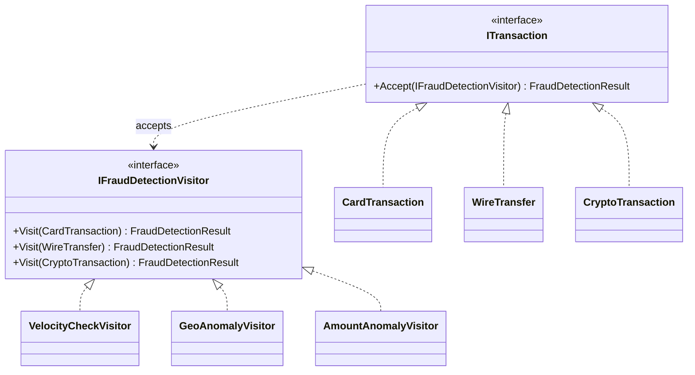
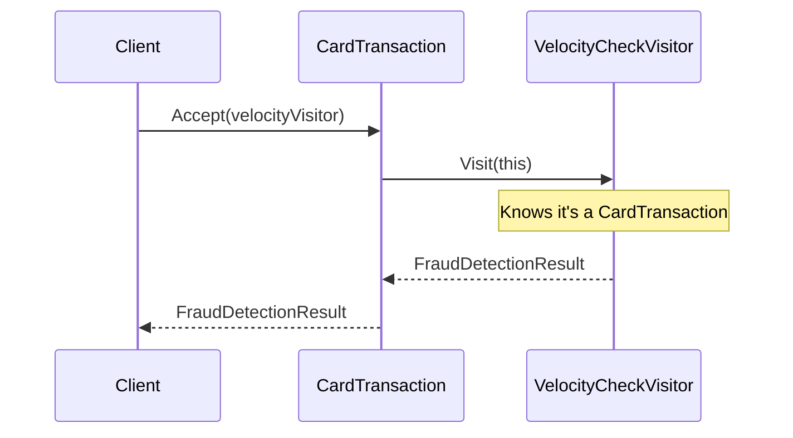

# Visitor

## Memory Hook (one-liner)
"Add new operations to a class hierarchy without modifying the classes — like running different fraud detection rules (velocity, geo-anomaly, amount) against different transaction types (card, wire, crypto)."

## Problem
A fraud detection system needs to analyze different transaction types (card, wire, crypto) with different rules (velocity check, geo-anomaly, amount anomaly). Adding a new rule shouldn't require modifying every transaction class. Adding a new transaction type should be straightforward too.

## Naive Approach
```csharp
// Each transaction type has all analysis logic inside it
class CardTransaction {
    public bool CheckVelocity() { /* card-specific */ }
    public bool CheckGeoAnomaly() { /* card-specific */ }
    public bool CheckAmount() { /* card-specific */ }
    // Adding a new check means modifying this class
}
```

## Pattern Solution
Transactions (elements) have an `Accept(visitor)` method. Each fraud detection rule is a Visitor that implements `Visit()` for each transaction type. Adding a new rule means adding a new Visitor class without touching transaction classes.

## When To Use (5 bullets)
- You need to perform many unrelated operations on elements of an object structure
- The element class hierarchy is stable but you frequently add new operations
- You want to accumulate state across an element structure traversal
- You want to avoid polluting element classes with operation-specific logic
- You need to perform type-specific operations without casting

## When NOT To Use (5 bullets)
- When the element hierarchy changes frequently (adding elements breaks all visitors)
- When there are very few operations (just add methods to the elements)
- When double dispatch is confusing for the team
- When elements don't have a clear `Accept` relationship
- When a simple pattern match on type would suffice

## Participants
| Participant | In Our Code |
|---|---|
| Visitor | `IFraudDetectionVisitor` |
| ConcreteVisitors | `VelocityCheckVisitor`, `GeoAnomalyVisitor`, `AmountAnomalyVisitor` |
| Element | `ITransaction` |
| ConcreteElements | `CardTransaction`, `WireTransfer`, `CryptoTransaction` |

## Variants
1. **Classic Visitor** — double dispatch with Accept/Visit (our implementation)
2. **Acyclic Visitor** — breaks circular dependency with marker interfaces
3. **Pattern-matching Visitor** — C# switch expressions instead of Visitor interface
4. **Hierarchical Visitor** — visitor for composite structures with Enter/Leave

## Tradeoffs Table
| Aspect | Pro | Con |
|---|---|---|
| Operations | Add new operations without modifying elements | Adding new element types breaks all visitors |
| SRP | Each visitor has a single responsibility | Double dispatch is non-obvious |
| State | Visitor can accumulate state during traversal | Visitors may need access to element internals |

## Common Interview Questions
1. What is double dispatch and why does Visitor need it?
2. When would you use pattern matching instead of Visitor in C#?
3. How does Visitor violate the Open/Closed principle?
4. How does Visitor relate to Interpreter?

## Comparison with Similar Patterns
| Pattern | Key Difference |
|---|---|
| **Strategy** | Strategy varies one algorithm; Visitor varies operations across a hierarchy |
| **Iterator** | Iterator provides access to elements; Visitor operates on them |
| **Interpreter** | Interpreter evaluates a language; Visitor adds operations to structures |
| **Composite** | Composite structures objects; Visitor traverses and operates on them |

## Mermaid Diagrams

### Class Diagram


### Sequence Diagram (Double Dispatch)


## Similar Patterns to Review Next
- Strategy (varying behavior)
- Iterator (traversing elements)
- Composite (tree structures to visit)
- Interpreter (evaluating expressions)
