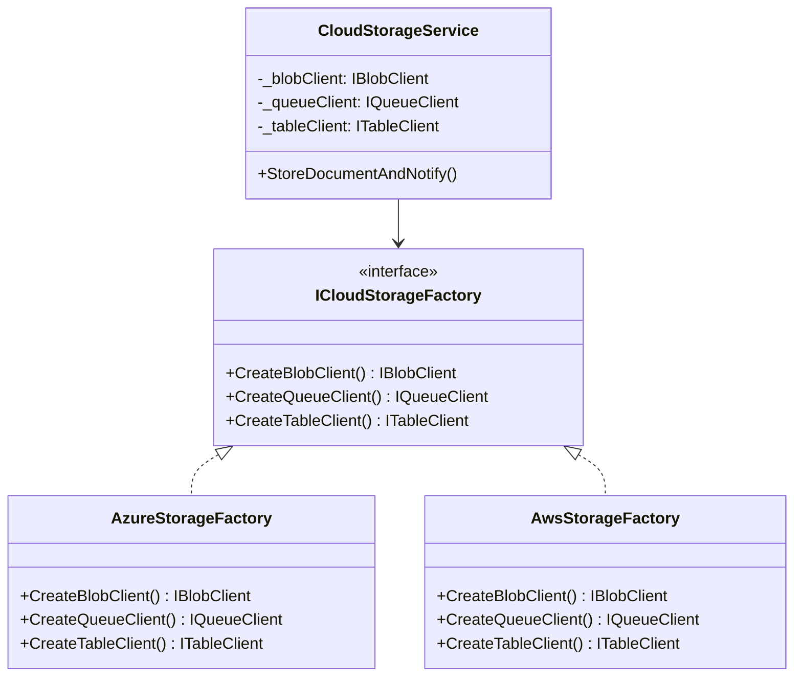
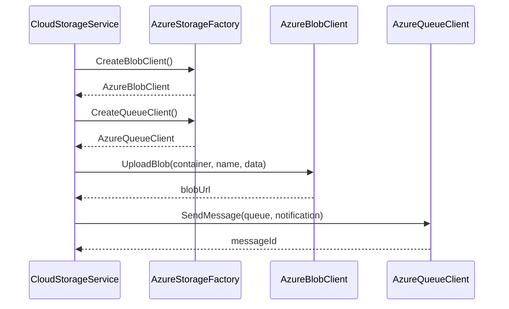

# Abstract Factory Pattern

## Memory Hook
"Create families of related objects without specifying their concrete classes — swap the whole family at once."

## Problem
A multi-cloud storage system must create blob clients, queue clients, and table clients. These clients must all come from the SAME cloud provider — you cannot mix an AWS S3 client with an Azure Queue client because they use different authentication, endpoints, and protocols. The system needs to swap entire cloud provider families without changing business logic.

## Naive Approach
Without Abstract Factory, you'd have switch statements or if-else chains everywhere: one for blob creation, one for queue creation, one for table creation. Nothing ensures consistency — a developer could accidentally create an AWS blob client but an Azure queue client, leading to runtime failures.

## Pattern Solution
Define an `ICloudStorageFactory` interface with methods `CreateBlobClient()`, `CreateQueueClient()`, `CreateTableClient()`. Each cloud provider implements this factory (`AzureStorageFactory`, `AwsStorageFactory`). The consumer (`CloudStorageService`) receives the factory and uses it to create all its clients — guaranteed to be from the same family.

## When To Use
- You need to create families of related objects that must work together
- The system needs to be independent of how its products are created and composed
- You want to enforce that related objects come from the same family
- You need to support multiple "themes" or "platforms" with consistent APIs
- You're building a plugin system where each plugin provides a family of implementations

## When NOT To Use
- You only have one family of objects (just use Factory Method)
- The products in the family are unrelated and don't need to be consistent
- The number of products in the family changes frequently (interfaces become bloated)
- Simple object creation is sufficient — don't over-engineer
- You're only ever going to support one provider (YAGNI)

## Participants
| Participant | In Our Example | Role |
|---|---|---|
| AbstractFactory | `ICloudStorageFactory` | Declares creation methods for each product |
| ConcreteFactory | `AzureStorageFactory`, `AwsStorageFactory` | Implements creation for one family |
| AbstractProduct | `IBlobClient`, `IQueueClient`, `ITableClient` | Product interfaces |
| ConcreteProduct | `AzureBlobClient`, `AwsBlobClient`, etc. | Concrete implementations |
| Client | `CloudStorageService` | Uses only abstract interfaces |

## Variants
- **Simple Abstract Factory**: Interface-based, as shown here.
- **Parameterized Abstract Factory**: Factory takes a parameter to select the family (combines with Simple Factory).
- **DI-based Abstract Factory**: Register factory as a DI service; resolve at runtime based on configuration.

## Tradeoffs Table

| Aspect | Pro | Con |
|---|---|---|
| Consistency | Guarantees related objects are compatible | Adding new product types requires changing ALL factories |
| Isolation | Client code is decoupled from concrete classes | More interfaces and classes to maintain |
| Swappability | Swap entire families by changing one factory | Over-engineering if you only have one family |
| Testing | Easy to create test/mock factories | Factory interfaces can become bloated |

## Common Interview Questions
1. **How does Abstract Factory differ from Factory Method?** Abstract Factory creates *families* of related objects (blob + queue + table); Factory Method creates *one* product type.
2. **How do you add a new product to an Abstract Factory?** You must add a new method to the abstract factory interface and implement it in every concrete factory — this is the pattern's main downside.
3. **Can Abstract Factory and Factory Method be combined?** Yes — each creation method in an Abstract Factory is itself a Factory Method.
4. **How does Abstract Factory relate to Dependency Injection?** DI containers can act as abstract factories. You can register `ICloudStorageFactory` as a service and resolve it at runtime.

## Comparison with Similar Patterns
| Pattern | Key Difference |
|---|---|
| Factory Method | Creates one product; Abstract Factory creates a family |
| Builder | Constructs one complex object step-by-step; Abstract Factory creates families in one call |
| Prototype | Creates by cloning; Abstract Factory creates from scratch |

## Mermaid Diagrams

### Class Diagram

### Sequence Diagram

## Similar Patterns to Review Next
- **Factory Method** — simpler variant for single products
- **Builder** — when construction is multi-step rather than single-call
- **Bridge** — also separates abstraction from implementation, but for different reasons
