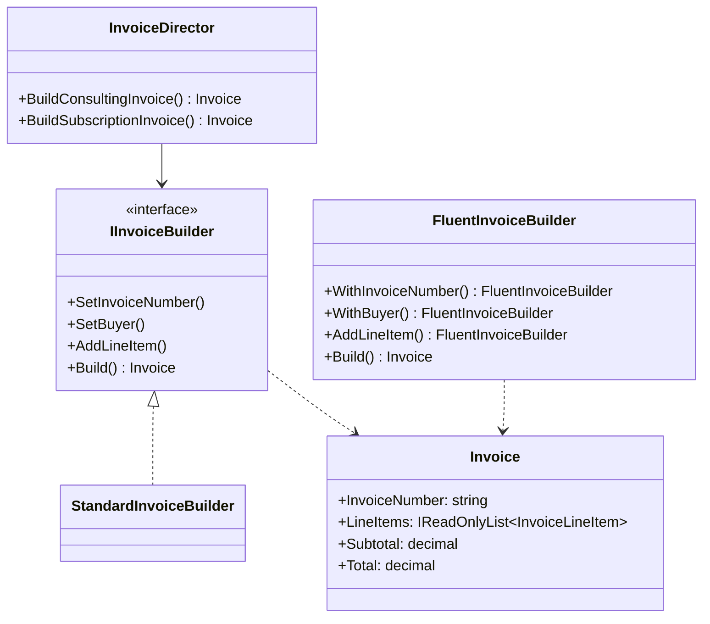
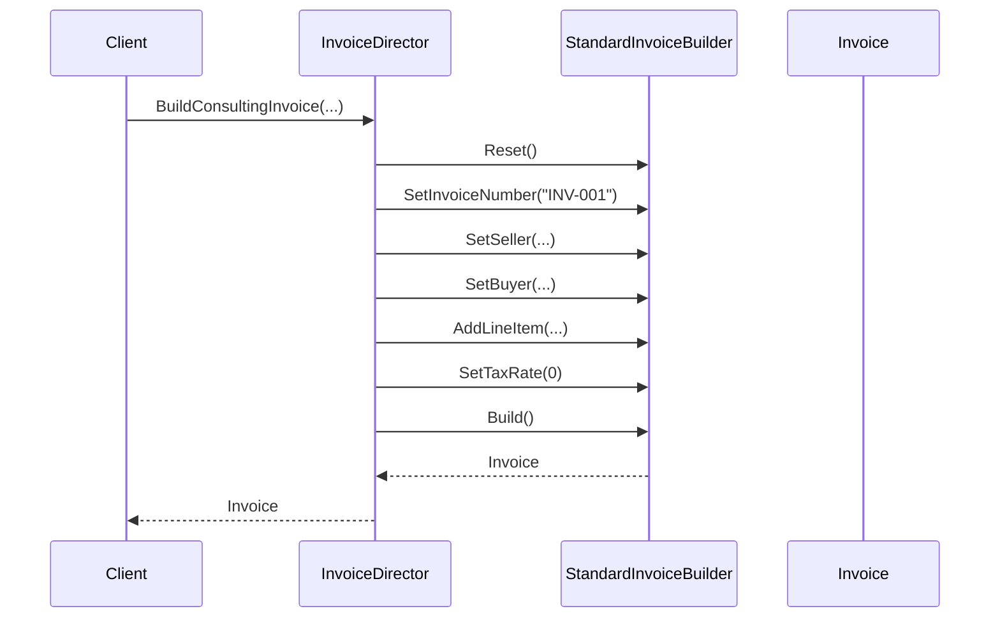

# Builder Pattern

## Memory Hook
"Construct a complex object step-by-step, and the same construction process can create different representations."

## Problem
An invoice has many parts: invoice number, buyer/seller info, line items, tax rates, discounts, currency formatting, header/footer notes, and payment terms. A constructor with 15+ parameters is error-prone (which string is which?). Optional parameters with defaults are better but still confusing. The Builder pattern separates construction from representation.

## Naive Approach
A telescoping constructor: `new Invoice(number, seller, sellerAddr, buyer, buyerAddr, issued, due, currency, taxRate, discount, header, footer, terms, poNumber, ...)`. Parameters are easy to swap, and you can't enforce "buyer must be set before line items."

## Pattern Solution
Three variants are demonstrated:
1. **Standard Builder** (`StandardInvoiceBuilder`): Classic GoF — void methods, Director controls order.
2. **Fluent Builder** (`FluentInvoiceBuilder`): Returns `this` for method chaining. Most common in modern C#.
3. **Step Builder** (`InvoiceStepBuilder`): Compile-time enforcement of build order via interface return types.

A **Director** (`InvoiceDirector`) encapsulates common invoice "recipes" (consulting, subscription, quick quote).

## When To Use
- Object construction requires many parameters (5+ is a good threshold)
- Some parameters are optional and have sensible defaults
- You need to enforce a specific construction order
- The same construction process should create different representations
- You want to create immutable objects without massive constructors

## When NOT To Use
- The object has only 2-3 fields — just use a constructor or record
- There's only one way to build the object — no need for abstraction
- Object construction is trivial (no validation, no computed fields)
- You're building a collection — use LINQ or collection initializers
- The builder would have more code than the object itself

## Participants
| Participant | In Our Example | Role |
|---|---|---|
| Product | `Invoice` | The complex object being built |
| Builder | `IInvoiceBuilder` | Abstract interface declaring build steps |
| ConcreteBuilder | `StandardInvoiceBuilder`, `FluentInvoiceBuilder` | Implements the build steps |
| Director | `InvoiceDirector` | Orchestrates the build steps in a specific order |

## Variants
- **Classic Builder**: Void methods, Director controls order. Good for multiple representations.
- **Fluent Builder**: Returns `this` for chaining. Most popular in C#/.NET.
- **Step Builder**: Each method returns the next step's interface. Compile-time build order enforcement.
- **Inner Builder**: Builder is a static inner class of the Product. Common in Java, less so in C#.

## Tradeoffs Table

| Aspect | Classic | Fluent | Step Builder |
|---|---|---|---|
| Readability | Good with Director | Best — reads like prose | Good — guided |
| Compile-time safety | Low — any order | Low — any order | High — enforced order |
| Flexibility | High | High | Medium — fixed order |
| Discoverability | Low | Medium (IDE shows methods) | High (IDE shows only valid next steps) |
| Complexity | Medium | Low | High (many interfaces) |

## Common Interview Questions
1. **Builder vs Factory?** Factory creates in one call; Builder constructs step-by-step with many options.
2. **Why is the Director optional?** The client can call builder methods directly; the Director is a convenience for common "recipes."
3. **How does Builder create immutable objects?** The builder accumulates mutable state internally, then produces an immutable Product via Build().
4. **When to use Step Builder over Fluent Builder?** When you need compile-time enforcement of required fields and build order.
5. **How does C#'s `required` keyword affect Builder?** `required` init properties can reduce the need for Builder in simple cases, but Builder is still useful for complex construction logic.

## Comparison with Similar Patterns
| Pattern | Key Difference |
|---|---|
| Abstract Factory | Creates families of objects in one call; Builder builds one complex object step-by-step |
| Prototype | Creates by cloning an existing instance; Builder creates from scratch |
| Fluent Interface | A language technique; Builder is a design pattern that often uses fluent interfaces |

## Mermaid Diagrams

### Class Diagram

### Sequence Diagram

## Similar Patterns to Review Next
- **Prototype** — when you want to create by cloning rather than building from scratch
- **Abstract Factory** — when you need families of related objects
- **Step Builder** — a compile-time-safe variant of Builder
