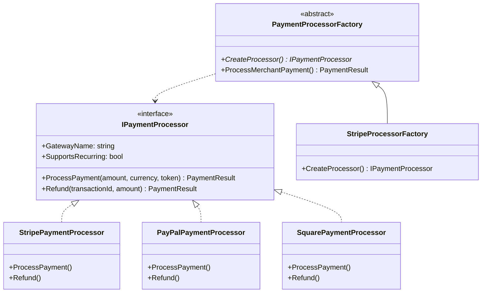
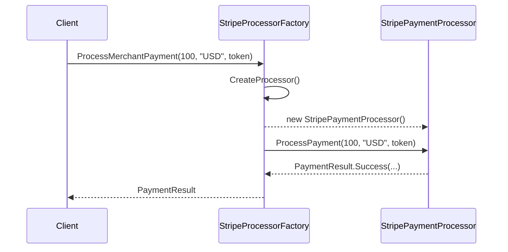

# Factory Method Pattern

## Memory Hook
"I need an object, but I'll let my subclass decide which one to create."

## Problem
A payment processing system needs to support multiple payment gateways (Stripe, PayPal, Square). The naive approach scatters `switch` statements throughout the codebase — every method that touches payment logic must know about every gateway. Adding a new gateway means modifying every switch statement, violating the Open/Closed Principle.

## Naive Approach
See `Naive/NaivePaymentProcessor.cs`. A single class with switch statements in every method (`ProcessPayment`, `Refund`, etc.). Every new gateway requires changes to this class. Every method grows linearly with the number of gateways. Testing requires testing all gateways through a single entry point.

## Pattern Solution
The Factory Method pattern defines an interface for creating an object (`IPaymentProcessor`) but lets subclasses decide which class to instantiate. The base class (`PaymentProcessorFactory`) contains the business logic template; subclasses (`StripeProcessorFactory`, `PayPalProcessorFactory`) provide the creation decision.

## When To Use
- You don't know ahead of time which concrete class you need to instantiate
- You want subclasses to specify the objects they create
- You need to decouple object creation from object usage
- You have parallel class hierarchies that need to be connected
- You want to provide a hook for subclasses to extend creation logic

## When NOT To Use
- You only have one implementation and don't foresee others (YAGNI)
- The creation logic is trivial and a `new` call is sufficient
- You're using a DI container that already handles object creation
- The overhead of extra classes outweighs the flexibility benefit
- The product types are known at compile time and won't change

## Participants
| Participant | In Our Example | Role |
|---|---|---|
| Product | `IPaymentProcessor` | The interface for objects the factory creates |
| ConcreteProduct | `StripePaymentProcessor`, etc. | The actual implementation |
| Creator | `PaymentProcessorFactory` | Declares the factory method |
| ConcreteCreator | `StripeProcessorFactory`, etc. | Overrides the factory method |

## Variants

### Simple Factory
Not a GoF pattern. A single class with a creation method that uses a switch/dictionary to pick the right type. See `SimpleFactory/PaymentProcessorSimpleFactory.cs`.

### Factory Method (GoF)
The classic pattern: an abstract base class with a `CreateProcessor()` method that subclasses override. See `PaymentProcessorFactory.cs`.

### Static Factory Method
Uses static methods like `CreateStripe()`, `CreatePayPal()`. Inspired by .NET conventions like `TimeSpan.FromMinutes()`. See `StaticFactory/PaymentProcessorStaticFactory.cs`.

## Tradeoffs Table

| Aspect | Naive | Simple Factory | Factory Method | Static Factory |
|---|---|---|---|---|
| Open/Closed | Violated | Partially | Respected | Violated |
| Testability | Low | Medium | High | Low |
| Complexity | Low | Low | Medium | Low |
| Extensibility | Low | Medium | High | Low |
| Number of classes | 1 | 2 | N+1 | 1 |

## Common Interview Questions
1. **What is the difference between Simple Factory and Factory Method?** Simple Factory is a single class with a switch; Factory Method uses polymorphism via an abstract creator class.
2. **When would you prefer Factory Method over Abstract Factory?** When you need to create a single product, not a family of related products.
3. **How does Factory Method support the Open/Closed Principle?** New products are added by creating new ConcreteCreator subclasses — no existing code is modified.
4. **Can Factory Method return cached instances?** Yes — nothing prevents the factory method from returning a cached or pooled instance instead of a new one.
5. **How does Factory Method relate to Dependency Injection?** DI containers are essentially sophisticated factories. Factory Method is useful when DI is not available or when creation logic is complex.

## Comparison with Similar Patterns
| Pattern | Key Difference |
|---|---|
| Abstract Factory | Creates *families* of related objects; Factory Method creates *one* object |
| Builder | Constructs complex objects step-by-step; Factory Method creates in one call |
| Prototype | Creates by cloning an existing instance; Factory Method creates from scratch |

## Mermaid Diagrams

### Class Diagram

### Sequence Diagram

## Similar Patterns to Review Next
- **Abstract Factory** — when you need families of related objects
- **Builder** — when construction requires multiple steps
- **Prototype** — when creation is expensive and cloning is cheaper
