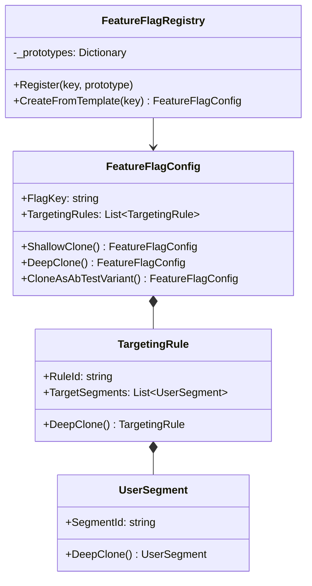
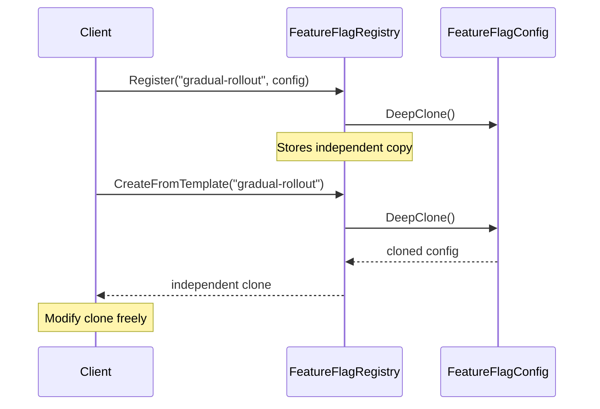

# Prototype Pattern

## Memory Hook
"Create new objects by copying an existing one — cloning is cheaper and safer than construction."

## Problem
Feature flag configurations are complex objects with nested targeting rules, user segments, and rollout percentages. When setting up A/B tests, you frequently need to create a variant that is almost identical to an existing configuration but with a few tweaks. Building each variant from scratch is tedious, error-prone, and wasteful.

## Naive Approach
Copy-paste the configuration setup code for each variant. Or use a constructor and manually set every field. Both approaches lead to duplicated code and bugs when the original configuration changes but the copies don't.

## Pattern Solution
The `FeatureFlagConfig` class implements a `DeepClone()` method that creates a fully independent copy. A `FeatureFlagRegistry` stores prototype instances and creates new configs by cloning templates. The `CloneAsAbTestVariant()` method shows a domain-specific clone-and-customize operation.

## When To Use
- Creating an object is more expensive than cloning one (complex initialization, DB lookups)
- You need many similar objects with minor variations
- The object's class is determined at runtime, not compile time
- You want to avoid subclass proliferation just for different initial states
- You have a registry/catalog of prototypical instances

## When NOT To Use
- Objects are simple with trivial constructors — cloning adds no value
- Objects contain resources that can't be cloned (file handles, DB connections)
- Deep cloning is complex and error-prone for your object graph
- The identity of the object matters (e.g., entity with unique DB ID)
- You need only one instance (use Singleton instead)

## Participants
| Participant | In Our Example | Role |
|---|---|---|
| Prototype | `FeatureFlagConfig` | Declares the cloning interface |
| ConcretePrototype | `FeatureFlagConfig`, `TargetingRule`, `UserSegment` | Implements deep clone |
| Client | `FeatureFlagRegistry` | Creates new objects by asking prototypes to clone |

## Variants
- **Shallow Clone**: `MemberwiseClone()` — copies value types, shares reference types. Dangerous for mutable objects.
- **Deep Clone**: Manually copy every field and nested collection. Safe but verbose.
- **Serialization Clone**: Serialize to JSON/binary and deserialize. Easy but slower and fragile.
- **Prototype Registry**: Store prototypes by key and clone on request (implemented here).

## Tradeoffs Table

| Aspect | Pro | Con |
|---|---|---|
| Performance | Avoids expensive initialization | Deep clone itself can be expensive for large graphs |
| Flexibility | Create variants without knowing the exact class | Must maintain clone logic when fields change |
| Simplicity | Client doesn't need to know constructor params | Deep vs shallow clone is a common source of bugs |
| Independence | Cloned objects are fully independent | Easy to miss a nested reference (partial deep clone) |

## Common Interview Questions
1. **Shallow vs Deep clone?** Shallow copies value types and shares references; deep copies everything recursively. Shallow clone of mutable objects is almost always a bug.
2. **Why not just use `ICloneable`?** `ICloneable.Clone()` returns `object` (no generics) and doesn't specify shallow vs deep — it's ambiguous by design. Better to define your own typed `DeepClone()` method.
3. **How does Prototype relate to the Builder?** Builder constructs from scratch step-by-step; Prototype starts with an existing complete object and copies it.
4. **When is Prototype better than Factory?** When the object's state is complex and determined at runtime, not at compile time.
5. **How do you test deep clone correctness?** Assert that the clone equals the original, then modify the clone and assert the original is unchanged.

## Comparison with Similar Patterns
| Pattern | Key Difference |
|---|---|
| Factory Method | Creates from scratch using `new`; Prototype copies an existing instance |
| Builder | Constructs step-by-step; Prototype copies all at once |
| Memento | Captures state for undo/restore; Prototype copies state for new instances |

## Mermaid Diagrams

### Class Diagram

### Sequence Diagram

## Similar Patterns to Review Next
- **Builder** — construct complex objects step-by-step instead of cloning
- **Factory Method** — create objects via polymorphism instead of cloning
- **Memento** — capture and restore state (similar deep copy mechanics)
