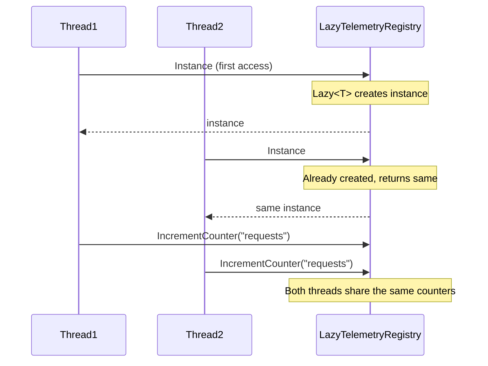

# Singleton Pattern

## Memory Hook
"Ensure a class has only one instance and provide a global access point to it — but in modern .NET, prefer DI singleton scope."

## Problem
An application telemetry registry must be a single shared instance: all components write metrics to the same registry. Multiple instances would fragment metrics data. The challenge is ensuring exactly one instance exists while maintaining thread safety and testability.

## Naive Approach
A public static field or a global variable. No enforcement of single-instance, no thread safety, no lazy initialization, and impossible to test in isolation.

## Pattern Solution
Four approaches are demonstrated, from classic to modern:
1. **Classic Singleton** (`TelemetryRegistry`): Eager static field initialization.
2. **Lazy Singleton** (`LazyTelemetryRegistry`): `Lazy<T>` for thread-safe lazy init.
3. **Thread-Safe Singleton** (`ThreadSafeTelemetryRegistry`): Double-check locking (educational).
4. **DI-Preferred** (`TelemetryService`): Regular class + DI singleton scope (recommended).

## When To Use
- You need exactly one instance of a class across the application
- The single instance must be accessible from many places
- The instance manages shared state (metrics, configuration, caches)
- You need to control instantiation timing (lazy vs eager)
- You're in a context where DI is not available (library code, static contexts)

## When NOT To Use
- You have a DI container — use `AddSingleton<T>()` instead
- The "singleton" is really just convenience for avoiding parameter passing
- You need testability — classic singletons are notoriously hard to test
- You might need multiple instances later (scaling, multi-tenancy)
- The singleton holds mutable state that makes tests interfere with each other

## Participants
| Participant | In Our Example | Role |
|---|---|---|
| Singleton | `TelemetryRegistry` | The class with private constructor and static Instance |
| Client | Any code calling `TelemetryRegistry.Instance` | Uses the single instance |

## Variants
- **Eager**: Static readonly field — simplest, thread-safe by CLR guarantee.
- **Lazy**: `Lazy<T>` — created on first access, thread-safe, recommended if you need lazy.
- **Double-Check Locking**: Manual lock with volatile field — educational, use `Lazy<T>` instead.
- **DI Singleton Scope**: Not a singleton class at all — the container manages lifetime. **Preferred.**

## Tradeoffs Table

| Aspect | Classic Singleton | Lazy<T> | Double-Check Lock | DI Singleton |
|---|---|---|---|---|
| Thread Safety | Yes (CLR) | Yes (built-in) | Yes (manual) | Yes (container) |
| Lazy Init | No | Yes | Yes | Depends on container |
| Testability | Poor | Poor | Poor | Excellent |
| DI Compatible | No | No | No | Yes |
| Complexity | Low | Low | Medium | Low |
| Recommended | Rarely | Sometimes | Never* | Always |

*Double-check locking is shown for interview prep only.

## Common Interview Questions
1. **How do you make a singleton thread-safe in C#?** Use `static readonly` (CLR guarantees), `Lazy<T>`, or double-check locking. Prefer `Lazy<T>`.
2. **What are the problems with Singleton?** Global state, hard to test, violates Dependency Inversion, tight coupling.
3. **How is DI singleton scope different from the Singleton pattern?** DI manages lifetime externally; the class itself is a normal class with no static state. Testable and substitutable.
4. **Can you have multiple singletons?** Technically one per AppDomain. With DI, one per container — and you can have multiple containers.
5. **How do you unit test code that uses a Singleton?** Extract an interface and use DI. Or if stuck with a classic singleton, add a `Reset()` method for tests (a design smell).

## Comparison with Similar Patterns
| Pattern | Key Difference |
|---|---|
| Monostate | All instances share state via static fields, but multiple instances exist |
| Factory Method | Controls WHAT is created; Singleton controls HOW MANY |
| Service Locator | Provides access to services like Singleton but for multiple types |

## Mermaid Diagrams

### Class Diagram
```mermaid
classDiagram
    class TelemetryRegistry {
        -_instance: TelemetryRegistry$
        -TelemetryRegistry()
        +Instance: TelemetryRegistry$
        +IncrementCounter(name, amount)
        +GetCounter(name) long
    }
    class ITelemetryService {
        <<interface>>
        +IncrementCounter(name, amount)
        +GetCounter(name) long
    }
    class TelemetryServiceDI {
        +IncrementCounter(name, amount)
        +GetCounter(name) long
    }

    ITelemetryService <|.. TelemetryServiceDI
    Note for TelemetryRegistry "Classic Singleton\n(avoid in new code)"
    Note for TelemetryServiceDI "DI Singleton\n(preferred approach)"
```

### Sequence Diagram


## Similar Patterns to Review Next
- **Monostate** — all instances share state but look like regular objects
- **Factory Method** — controls object creation (which type), while Singleton controls cardinality (how many)
- **Dependency Injection** — the modern alternative to Singleton for managing shared instances
