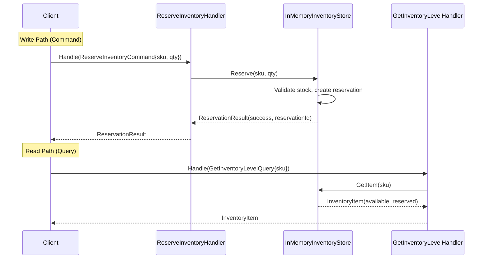

# CQRS (Command Query Responsibility Segregation)

## Memory Hook
"Separate the write path from the read path" -- commands mutate state, queries return data, and they never share the same model.

## Problem
An inventory management system handles both high-frequency read operations (checking stock levels, listing low-stock items) and lower-frequency but complex write operations (reserving inventory, releasing reservations). Using a single unified model for both reads and writes forces compromises: the read model carries validation logic it does not need, the write model exposes query capabilities that blur its intent, and optimizing one path degrades the other. Scaling reads independently from writes is impossible when they share the same pipeline.

## Naive Approach
A single `InventoryService` class with methods like `GetStockLevel()`, `GetLowStockItems()`, `ReserveInventory()`, and `ReleaseInventory()` all operating on the same `InventoryItem` model and the same data store. Read methods must navigate through write-optimized structures. Write methods carry query-related baggage. The class grows into a god service, and scaling the read-heavy dashboard independently from the write-heavy warehouse operations is architecturally impossible.

## Pattern Solution
Split the system into two distinct pipelines. **Commands** (`ReserveInventoryCommand`, `ReleaseInventoryCommand`) implement `ICommand<TResult>` and are handled by dedicated `ICommandHandler<TCommand, TResult>` classes that encapsulate validation and state mutation. **Queries** (`GetInventoryLevelQuery`, `GetLowStockItemsQuery`) implement `IQuery<TResult>` and are handled by `IQueryHandler<TQuery, TResult>` classes that are optimized purely for reading. An `InMemoryInventoryStore` provides the shared state, but in production the read and write stores can be separate databases optimized for their respective access patterns.

## When To Use
- Read and write workloads have significantly different performance, scaling, or consistency requirements.
- The domain model is complex enough that a single model compromises either reads or writes.
- You need to scale read replicas independently from the write master.
- Audit trails, event sourcing, or temporal queries are important.
- Different teams own the read and write sides of the system.

## When NOT To Use
- The domain is simple CRUD with no behavioral complexity -- CQRS adds unnecessary indirection.
- Read and write patterns are nearly identical and do not benefit from separation.
- The team is small and cannot justify the operational overhead of maintaining two models.
- Strong consistency is required everywhere and eventual consistency between read/write stores is unacceptable.
- The data volume is small enough that a single model performs well for both reads and writes.

## Key Participants

| Participant | Role |
|---|---|
| `ICommand` / `ICommand<TResult>` | Marker interfaces for commands that mutate state. |
| `ICommandHandler<TCommand, TResult>` | Handles a specific command; encapsulates validation and mutation logic. |
| `ReserveInventoryCommand` | Command to reserve a quantity of a specific SKU. |
| `ReleaseInventoryCommand` | Command to release a previously made reservation. |
| `ReserveInventoryHandler` | Validates and executes inventory reservation. |
| `ReleaseInventoryHandler` | Validates and executes reservation release. |
| `IQuery<TResult>` | Marker interface for read-only queries. |
| `IQueryHandler<TQuery, TResult>` | Handles a specific query; returns data without side effects. |
| `GetInventoryLevelQuery` | Query to check stock level for a SKU. |
| `GetLowStockItemsQuery` | Query to list items below a threshold. |
| `InMemoryInventoryStore` | Shared in-memory store (in production, read/write stores would be separate). |
| `InventoryItem` | Domain model representing an inventory item with quantity and reservations. |

## Variants
- **Simple CQRS (this repo):** Same database, separate handler classes for commands and queries. Low infrastructure overhead.
- **CQRS with Separate Read Store:** Write to a normalized relational database; project changes to a denormalized read store (Redis, Elasticsearch). Enables read-optimized views.
- **CQRS + Event Sourcing:** Commands produce domain events that are stored as the source of truth. Read models are built by replaying events. Full audit trail and temporal queries.
- **CQRS with MediatR:** Use the MediatR library to dispatch commands and queries through a pipeline with cross-cutting concerns (logging, validation, authorization).

## Tradeoffs

| Advantage | Disadvantage |
|---|---|
| Read and write models can be independently optimized. | Increased complexity: two models, two pipelines, potential data synchronization. |
| Scales reads independently from writes. | Eventual consistency between read and write stores can confuse users. |
| Commands carry explicit intent (ReserveInventory vs generic Update). | More classes and interfaces than simple CRUD. |
| Natural fit for event sourcing and audit trails. | Debugging requires tracing through command/query handlers. |
| Each handler has a single responsibility. | Overkill for simple domains where CRUD suffices. |

## Common Interview Questions
1. What is the difference between CQRS and simple CRUD, and when does CQRS justify its additional complexity?
2. How does CQRS relate to Event Sourcing, and can you use one without the other?
3. How do you handle eventual consistency between the write store and the read store in a CQRS system?

## Comparison with Similar Patterns

| Aspect | CQRS | CRUD |
|---|---|---|
| Model | Separate command and query models. | Single model for reads and writes. |
| Scaling | Read and write sides scale independently. | Entire application scales as one unit. |
| Complexity | Higher: two pipelines, potential sync issues. | Lower: one repository, one model. |
| Intent | Commands express business intent (Reserve, Release). | Generic Create/Read/Update/Delete operations. |
| Consistency | Can be eventually consistent (read store lags). | Strong consistency by default. |
| Best for | Complex domains with different read/write patterns. | Simple data-driven applications. |

## Mermaid Class Diagram

```mermaid
classDiagram
    class ICommand {
        <<interface>>
    }
    class ICommandT~TResult~ {
        <<interface>>
    }
    class ICommandHandler~TCommand,TResult~ {
        <<interface>>
        +HandleAsync(TCommand, CancellationToken) Task~TResult~
    }
    class IQuery~TResult~ {
        <<interface>>
    }
    class IQueryHandler~TQuery,TResult~ {
        <<interface>>
        +HandleAsync(TQuery, CancellationToken) Task~TResult~
    }

    class ReserveInventoryCommand {
        +Sku : string
        +Quantity : int
    }
    class ReleaseInventoryCommand {
        +ReservationId : string
    }
    class ReserveInventoryHandler {
        +HandleAsync(command, ct) Task~ReservationResult~
    }
    class ReleaseInventoryHandler {
        +HandleAsync(command, ct) Task~bool~
    }

    class GetInventoryLevelQuery {
        +Sku : string
    }
    class GetLowStockItemsQuery {
        +Threshold : int
    }
    class GetInventoryLevelHandler {
        +HandleAsync(query, ct) Task~InventoryItem~
    }
    class GetLowStockItemsHandler {
        +HandleAsync(query, ct) Task~List~
    }

    class InMemoryInventoryStore {
        +GetItem(sku) InventoryItem
        +Reserve(sku, qty) ReservationResult
        +Release(reservationId) bool
        +GetLowStockItems(threshold) List
    }

    ICommandT~TResult~ <|.. ReserveInventoryCommand
    ICommand <|.. ReleaseInventoryCommand
    ICommandHandler~TCommand,TResult~ <|.. ReserveInventoryHandler
    ICommandHandler~TCommand,TResult~ <|.. ReleaseInventoryHandler
    IQuery~TResult~ <|.. GetInventoryLevelQuery
    IQuery~TResult~ <|.. GetLowStockItemsQuery
    IQueryHandler~TQuery,TResult~ <|.. GetInventoryLevelHandler
    IQueryHandler~TQuery,TResult~ <|.. GetLowStockItemsHandler
    ReserveInventoryHandler --> InMemoryInventoryStore
    ReleaseInventoryHandler --> InMemoryInventoryStore
    GetInventoryLevelHandler --> InMemoryInventoryStore
    GetLowStockItemsHandler --> InMemoryInventoryStore
```

## Mermaid Sequence Diagram

## Similar Patterns to Review Next
- **Event Sourcing** -- stores state changes as events rather than current state; often paired with CQRS.
- **Mediator (MediatR)** -- dispatches commands and queries through a pipeline; natural companion to CQRS in .NET.
- **Repository** -- abstracts data access; CQRS may use separate read and write repositories.
- **Domain Events** -- commands can raise domain events that update read models asynchronously.
