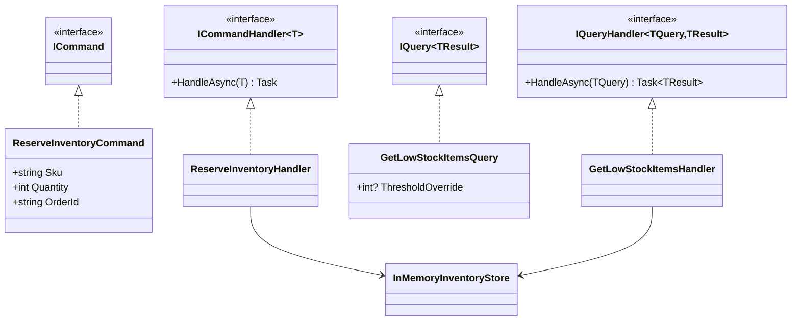
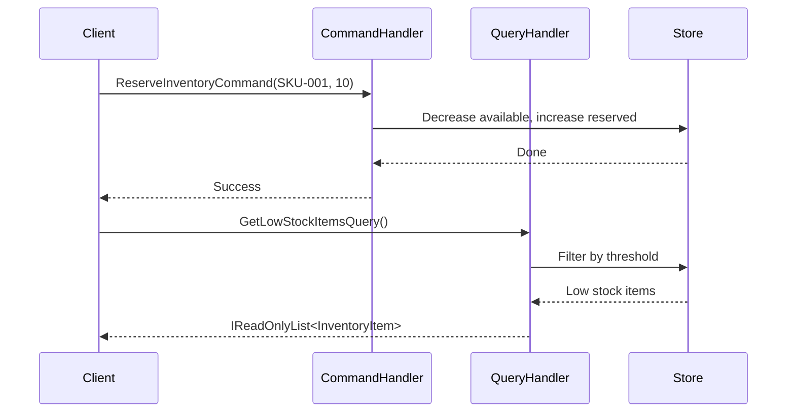

# CQRS (Command Query Responsibility Segregation)

## Memory Hook (one-liner)
"Separate the 'do something' code from the 'show me something' code — writes and reads have different needs, so give them different models."

## Problem
A single model serving both reads and writes becomes a compromise — too complex for simple queries, too rigid for complex commands. Read-heavy and write-heavy paths have different performance, scaling, and optimization needs.

## Naive Approach
```csharp
// One service does everything — reads and writes tangled together
public class InventoryService
{
    public void Reserve(string sku, int qty) { /* mutates state */ }
    public void Release(string sku, int qty) { /* mutates state */ }
    public InventoryItem Get(string sku) { /* reads state */ }
    public List<InventoryItem> GetLowStock() { /* reads state */ }
}
```
Read and write concerns are mixed — you cannot optimize, scale, or evolve them independently.

## Pattern Solution
Split operations into Commands (mutations) and Queries (reads). Each has its own handler, its own model, and potentially its own data store.

```
Command -> ICommandHandler -> Write Store
Query   -> IQueryHandler   -> Read Store (or same store, simple CQRS)
```

## When To Use
- Read and write workloads have vastly different volumes
- Read models need denormalization (dashboards, reports, search)
- You want to scale reads independently of writes
- Complex domain logic on the write side, simple flat DTOs on the read side
- Preparing for Event Sourcing

## When NOT To Use
- Simple CRUD where read and write models are identical
- Small team that cannot maintain separate models
- Strong consistency requirements with no tolerance for eventual consistency
- The application has no performance bottleneck that CQRS would solve
- Adding CQRS "just in case" without a concrete need

## Participants
| Role | Class | Purpose |
|------|-------|---------|
| Command | `ReserveInventoryCommand`, `ReleaseInventoryCommand` | Describe mutations |
| Command Handler | `ReserveInventoryHandler`, `ReleaseInventoryHandler` | Execute mutations |
| Query | `GetInventoryLevelQuery`, `GetLowStockItemsQuery` | Describe reads |
| Query Handler | `GetInventoryLevelHandler`, `GetLowStockItemsHandler` | Execute reads |
| Store | `InMemoryInventoryStore` | Shared state (simplified) |
| Model | `InventoryItem` | Domain entity |

## Variants
- **Simple CQRS** — same database, different models (shown here)
- **Full CQRS** — separate read and write databases
- **CQRS + Event Sourcing** — write store is an event log, read store is a projection
- **MediatR-based** — commands and queries dispatched through a mediator

## Tradeoffs Table
| Advantage | Disadvantage |
|-----------|-------------|
| Independent scaling of reads/writes | More classes and handlers |
| Optimized read models (denormalized) | Eventual consistency complexity |
| Clear separation of concerns | Overkill for simple CRUD |
| Natural fit for Event Sourcing | Requires disciplined team |

## Common Interview Questions
1. **Is CQRS the same as Event Sourcing?** No — CQRS is about separating read/write models; Event Sourcing is about storing state as events. They complement each other.
2. **Can commands return values?** Purists say no (commands are fire-and-forget). Pragmatists return IDs or Result types.
3. **How do you handle consistency between read and write stores?** Eventual consistency via domain events or change data capture (CDC).

## Comparison with Similar Patterns
| Pattern | Difference |
|---------|-----------|
| **Repository** | Repository hides data access; CQRS splits read/write concerns |
| **Mediator** | Mediator dispatches messages; CQRS is the architecture that defines command/query separation |
| **Event Sourcing** | ES stores events; CQRS separates models — they are orthogonal |

## Mermaid Diagrams

### Class Diagram


### Sequence Diagram


## Similar Patterns to Review Next
- Domain Events
- Saga
- Outbox
