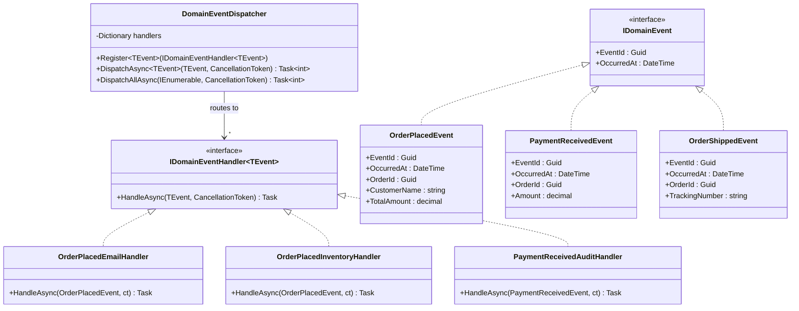
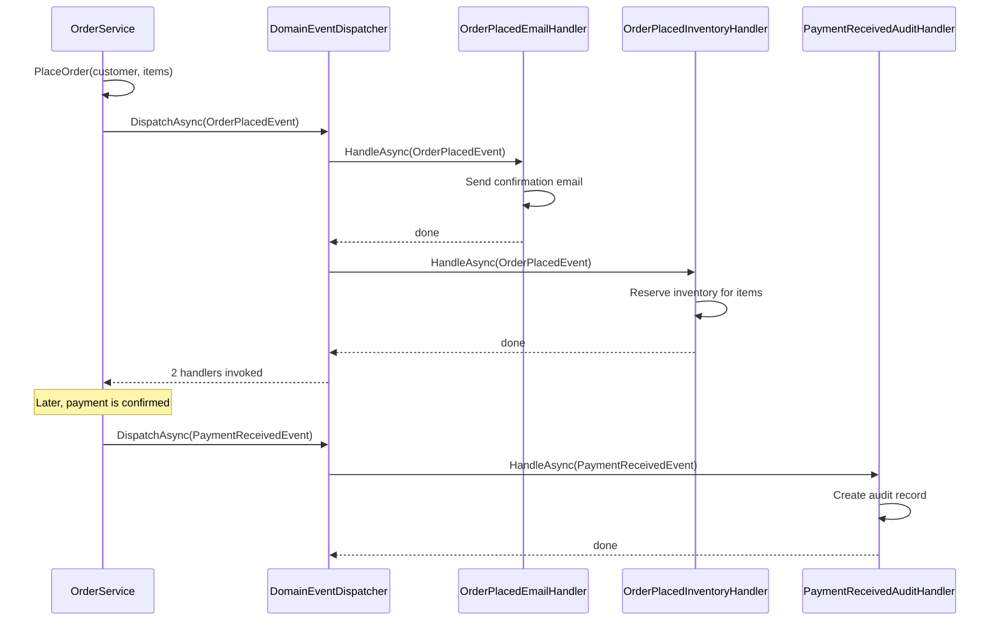

# Domain Events Pattern

## Memory Hook
"Something meaningful happened in the domain -- broadcast the fact" -- immutable records of business-significant occurrences that trigger side effects without coupling the source to the reaction.

## Problem
When an order is placed, multiple things must happen: send a confirmation email, reserve inventory, update analytics, and create an audit record. If the `OrderService.PlaceOrder()` method directly calls the email service, inventory service, and analytics service, it becomes tightly coupled to every downstream system. Adding a new reaction (e.g., notify a partner API) requires modifying the order placement code, violating the Open/Closed Principle and making the method fragile and untestable.

## Naive Approach
The `PlaceOrder` method calls `emailService.SendConfirmation()`, `inventoryService.Reserve()`, and `analyticsService.Track()` sequentially. Each new side effect adds another dependency and another line of code. Testing order placement now requires mocking five unrelated services. Failures in one side effect can cascade and prevent the order from being placed.

## Pattern Solution
Define domain events as immutable records implementing `IDomainEvent` (e.g., `OrderPlacedEvent`, `PaymentReceivedEvent`, `OrderShippedEvent`). The `PlaceOrder` method raises an `OrderPlacedEvent` instead of calling downstream services directly. A `DomainEventDispatcher` routes each event to all registered `IDomainEventHandler<TEvent>` implementations. Handlers like `OrderPlacedEmailHandler` and `OrderPlacedInventoryHandler` react independently. Adding a new reaction means adding a new handler class and registering it -- no changes to the order placement code.

## When To Use
- A business action triggers multiple independent side effects that should not be coupled to the action.
- You want to decouple the "what happened" from the "what should happen next."
- Side effects should be independently testable, deployable, and replaceable.
- You need an audit trail of meaningful business occurrences.
- Different bounded contexts need to react to the same business event.

## When NOT To Use
- The "event" has only one handler and will never have more -- direct method calls are simpler.
- You need synchronous, transactional consistency across all side effects (events introduce eventual consistency).
- The event dispatching infrastructure adds complexity without proportional benefit in a small application.
- Events would be purely technical signals with no business meaning (use method calls or service bus instead).
- The team lacks familiarity with event-driven architecture and the debugging challenges it introduces.

## Key Participants

| Participant | Role |
|---|---|
| `IDomainEvent` | Base interface with `EventId` and `OccurredAt`. Events are immutable facts. |
| `OrderPlacedEvent` | Raised when a new order is created. Carries order ID, customer, items, total. |
| `PaymentReceivedEvent` | Raised when payment is confirmed. Carries order ID, amount, payment method. |
| `OrderShippedEvent` | Raised when an order ships. Carries order ID, tracking number, carrier. |
| `IDomainEventHandler<TEvent>` | Interface for handling a specific event type asynchronously. |
| `OrderPlacedEmailHandler` | Sends a confirmation email when an order is placed. |
| `OrderPlacedInventoryHandler` | Reserves inventory when an order is placed. |
| `PaymentReceivedAuditHandler` | Creates an audit record when payment is received. |
| `DomainEventDispatcher` | Routes events to registered handlers. Supports multiple handlers per event type (fan-out). |

## Variants
- **In-Process Dispatch (this repo):** Events are dispatched synchronously within the same process. Simple but couples handler failure to the raising operation.
- **Outbox + Background Processor:** Events are stored in an outbox table within the same transaction, then published asynchronously by a background worker. Guarantees at-least-once delivery.
- **Message Broker (RabbitMQ, Kafka):** Events are published to an external broker for cross-service communication. Enables microservice-level decoupling.
- **MediatR Notifications:** Use MediatR's `INotification` and `INotificationHandler<T>` for in-process domain event dispatch with pipeline behaviors.

## Tradeoffs

| Advantage | Disadvantage |
|---|---|
| Decouples the event source from all event handlers. | Debugging event flows requires tracing through the dispatcher. |
| Adding new reactions requires no changes to existing code. | In-process dispatch can fail silently if a handler throws and is swallowed. |
| Events serve as an audit trail of what happened in the domain. | Eventual consistency between the event source and handler side effects. |
| Handlers are independently testable. | Event versioning and schema evolution become concerns over time. |
| Natural building block for event sourcing and CQRS. | Can lead to "event soup" if overused for trivial notifications. |

## Common Interview Questions
1. How do Domain Events differ from the Observer pattern, and when would you use each?
2. How do you ensure that domain events are published reliably, even if the message broker is down?
3. What is the difference between a domain event and an integration event in a microservices architecture?

## Comparison with Similar Patterns

| Aspect | Domain Events | Observer |
|---|---|---|
| Scope | Business-meaningful occurrences within a bounded context. | Generic notifications between a subject and its observers. |
| Coupling | Handlers are registered with a dispatcher; source does not know handlers. | Observers register directly with the subject. |
| Granularity | Coarse-grained business events (OrderPlaced, PaymentReceived). | Fine-grained state changes (vital sign reading received). |
| Persistence | Events are often persisted for audit or replay. | Notifications are typically ephemeral. |
| Async support | Naturally async with `Task`-based handlers. | Typically synchronous in the classic GoF pattern. |
| Cross-boundary | Can be published to external systems via brokers. | Usually in-process only. |

## Mermaid Class Diagram

## Mermaid Sequence Diagram

## Similar Patterns to Review Next
- **Observer** -- the foundational notification pattern; Domain Events add business semantics and persistence.
- **Outbox Pattern** -- ensures reliable event publishing by storing events in the same transaction as the business operation.
- **Event Sourcing** -- stores all domain events as the source of truth instead of current state.
- **Mediator** -- dispatches commands and events through a centralized pipeline (MediatR implements both).
