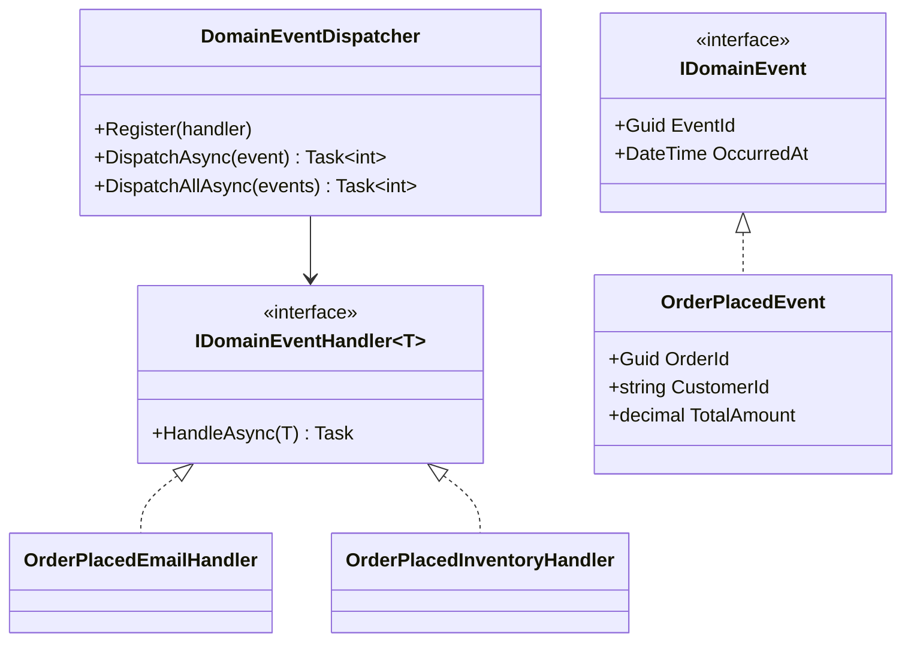
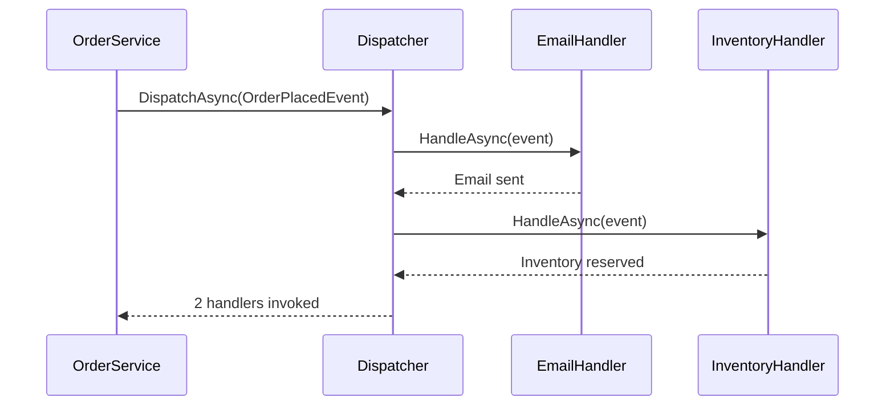

# Domain Events Pattern

## Memory Hook (one-liner)
"When something important happens, shout it to whoever is listening — decoupled reactions to business moments."

## Problem
When an order is placed, you need to send a confirmation email, reserve inventory, and log an audit entry. Putting all this logic in the order service creates tight coupling, violates SRP, and makes the service impossible to extend without modifying it.

## Naive Approach
```csharp
public void PlaceOrder(Order order)
{
    _orderRepo.Save(order);
    _emailService.SendConfirmation(order);   // tightly coupled
    _inventoryService.Reserve(order.Items);   // tightly coupled
    _auditService.Log("OrderPlaced", order);  // tightly coupled
}
```
Adding a new reaction means editing PlaceOrder — violating Open/Closed Principle.

## Pattern Solution
The order service raises a `OrderPlacedEvent`. A dispatcher routes it to registered handlers. Adding new reactions (SMS notification, analytics tracking) requires only a new handler — no changes to the order service.

## When To Use
- Multiple subsystems react to the same business event
- You want to decouple the producer from consumers
- Cross-cutting concerns (audit, notifications, projections) should not pollute core logic
- Building toward Event Sourcing or CQRS
- Need to maintain an audit trail of what happened

## When NOT To Use
- Single consumer — direct method call is simpler
- Strong consistency required across all reactions (events are often eventually consistent)
- Team is unfamiliar with event-driven architecture
- Simple CRUD with no cross-cutting side effects
- Debugging event flows adds too much complexity for the team size

## Participants
| Role | Class | Purpose |
|------|-------|---------|
| Event Interface | `IDomainEvent` | Marker with ID and timestamp |
| Handler Interface | `IDomainEventHandler<T>` | Reacts to a specific event |
| Dispatcher | `DomainEventDispatcher` | Routes events to handlers |
| Events | `OrderPlacedEvent`, `OrderShippedEvent`, `PaymentReceivedEvent` | Immutable facts |
| Handlers | `OrderPlacedEmailHandler`, etc. | Side effects |

## Variants
- **In-process** — dispatcher calls handlers synchronously (shown here)
- **Async/queued** — events published to a message broker
- **Outbox** — events stored in DB and published reliably (see Outbox pattern)
- **Entity-level** — aggregate root collects events, dispatcher drains them on save

## Tradeoffs Table
| Advantage | Disadvantage |
|-----------|-------------|
| Decoupled producer and consumers | Harder to trace flow (no single call stack) |
| Open/Closed — add handlers without changing source | Event ordering can be tricky |
| Each handler is independently testable | Risk of silent failures if handler throws |
| Natural audit trail | Eventual consistency between handlers |

## Common Interview Questions
1. **Domain Events vs Integration Events?** Domain events are in-process within a bounded context; integration events cross service boundaries.
2. **Should domain events be raised inside or outside the transaction?** Inside ensures they only fire on successful commits; outside avoids transaction locks.
3. **How do you handle handler failures?** Use the Outbox pattern for guaranteed delivery, or implement retry/dead-letter mechanisms.

## Comparison with Similar Patterns
| Pattern | Difference |
|---------|-----------|
| **Observer** | Observer is a general pub/sub; Domain Events are business-meaningful facts |
| **Mediator** | Mediator routes requests; Domain Events broadcast facts |
| **Outbox** | Outbox guarantees reliable publishing of domain events |

## Mermaid Diagrams

### Class Diagram


### Sequence Diagram


## Similar Patterns to Review Next
- Outbox (reliable event publishing)
- CQRS (events drive read model updates)
- Saga (events coordinate multi-step workflows)
