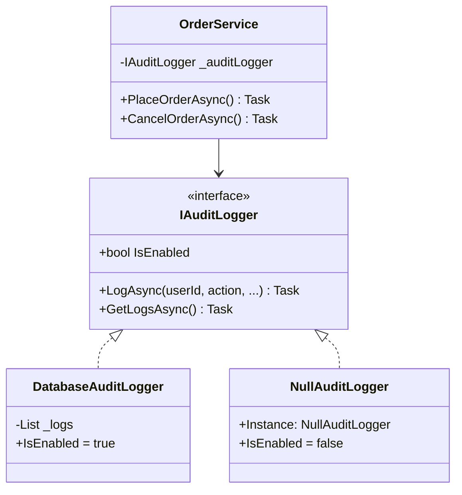
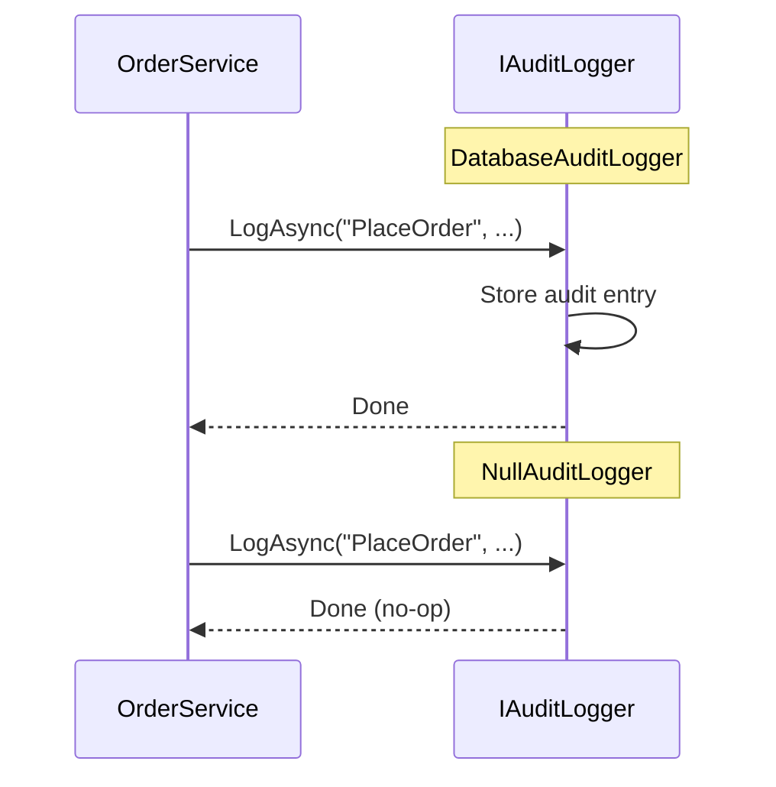

# Null Object Pattern

## Memory Hook (one-liner)
"Instead of checking for null, use a 'do-nothing' implementation — polymorphism replaces null checks."

## Problem
Every consumer of an optional dependency (logger, audit service, cache) must check `if (logger != null)` before calling methods. These null checks pollute the code, are easy to forget, and cause NullReferenceExceptions when missed.

## Naive Approach
```csharp
public async Task PlaceOrder(Order order)
{
    _orderRepo.Save(order);
    if (_auditLogger != null)  // null check everywhere
        await _auditLogger.LogAsync("PlaceOrder", order.Id);
    if (_auditLogger != null)  // and again...
        await _auditLogger.LogAsync("NotifyCustomer", order.Id);
}
```

## Pattern Solution
Create a "null" implementation that satisfies the interface but does nothing. Inject it when the real implementation is not needed. The consumer code has zero null checks — it always calls the interface methods.

## When To Use
- Optional dependencies that may or may not be configured
- Development/test environments where services like email, SMS, audit are disabled
- Reducing defensive null checks throughout the codebase
- Default "off" behavior that can be swapped for a real implementation via DI
- Logging, caching, and monitoring that should be silently disabled in some environments

## When NOT To Use
- The dependency is always required — just inject the real one
- You need to know whether the service is available (Null Object hides this)
- The "do nothing" behavior would mask bugs
- Performance monitoring needs to distinguish "no logger" from "silent logger"
- You need to collect information about skipped operations

## Participants
| Role | Class | Purpose |
|------|-------|---------|
| Interface | `IAuditLogger` | Contract for audit logging |
| Real Implementation | `DatabaseAuditLogger` | Logs to persistent store |
| Null Object | `NullAuditLogger` | Does nothing, silently |
| Consumer | `OrderService` | Uses IAuditLogger without null checks |

## Variants
- **Singleton Null Object** — single shared instance (shown here: `NullAuditLogger.Instance`)
- **Stub Object** — returns default values instead of doing nothing
- **Black Hole** — absorbs all calls silently (logging variant)
- **Special Case** — Martin Fowler's generalization (returns domain-specific defaults)

## Tradeoffs Table
| Advantage | Disadvantage |
|-----------|-------------|
| Eliminates null checks | Hides whether the service is active |
| Simplifies consumer code | Silently swallows operations — can mask bugs |
| Easy to swap via DI | Extra class to maintain |
| Follows Liskov Substitution Principle | `IsEnabled` property needed to check state |

## Common Interview Questions
1. **Null Object vs Optional/Nullable?** Null Object provides behavior (do nothing); Optional/Nullable provides presence/absence.
2. **Is Null Object a design pattern or anti-pattern?** It is a legitimate pattern when used for optional cross-cutting concerns. It becomes an anti-pattern when it masks errors.
3. **How does it relate to DI?** Register `NullAuditLogger` as the default; override with the real implementation in production config.

## Comparison with Similar Patterns
| Pattern | Difference |
|---------|-----------|
| **Strategy** | Strategy swaps algorithms; Null Object is a specific "no-op" strategy |
| **Proxy** | Proxy adds behavior; Null Object removes it |
| **Special Case** | Null Object does nothing; Special Case returns domain-specific defaults |

## Mermaid Diagrams

### Class Diagram


### Sequence Diagram


## Similar Patterns to Review Next
- Strategy
- Proxy
- Decorator
