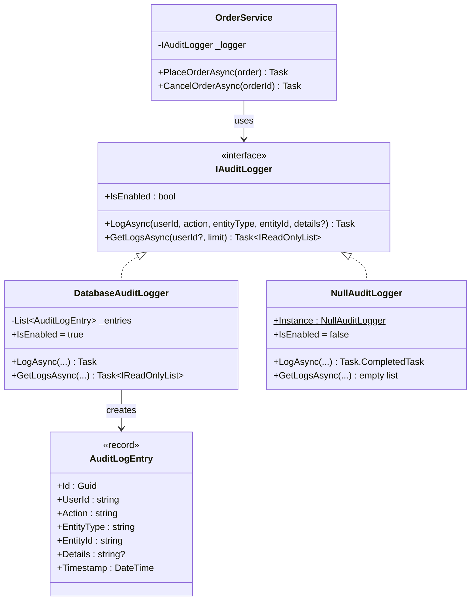
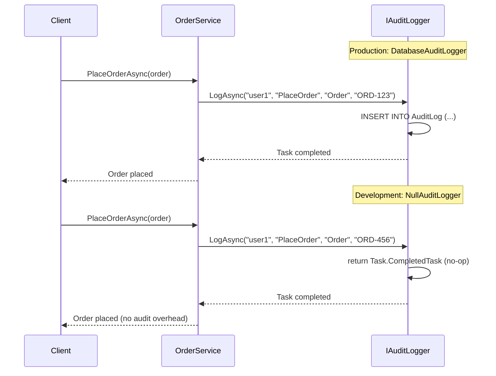

# Null Object Pattern

## Memory Hook
"Do nothing gracefully" -- replace null checks with a do-nothing implementation that satisfies the interface contract.

## Problem
An `OrderService` depends on an `IAuditLogger` to record business events. In production, a `DatabaseAuditLogger` persists audit entries. But in development, unit tests, and lightweight deployments, auditing is unnecessary. Without the Null Object pattern, every call site must check `if (logger != null) logger.LogAsync(...)` or risk `NullReferenceException`. These null checks clutter the codebase, are easy to forget, and violate the principle that the service should not care whether auditing is active.

## Naive Approach
The `OrderService` accepts a nullable `IAuditLogger?` and sprinkles `if (logger != null)` before every logging call. Alternatively, the team uses `logger?.LogAsync(...)` with the null-conditional operator. Both approaches scatter defensive checks throughout the business logic. When a new method is added to `IAuditLogger`, every call site must remember to add the null check. Forgetting one causes a runtime crash.

## Pattern Solution
Create a `NullAuditLogger` class that implements `IAuditLogger` with no-op methods: `LogAsync` returns `Task.CompletedTask`, `GetLogsAsync` returns an empty list, and `IsEnabled` returns `false`. The `OrderService` always receives a non-null `IAuditLogger` -- either a real `DatabaseAuditLogger` or the `NullAuditLogger.Instance`. Zero null checks are needed in the business logic. The service treats logging uniformly regardless of whether it is real or a no-op.

## When To Use
- A dependency is optional but the consuming code should not know or care whether it is present.
- You want to eliminate repetitive null checks for an interface used in many places.
- Default "do nothing" behavior is a valid and safe outcome (logging, metrics, notifications).
- You are injecting dependencies via DI and want a safe default registration.
- The interface has multiple methods, making null-conditional chaining verbose and error-prone.

## When NOT To Use
- The absence of the dependency is an error that should be surfaced, not silenced.
- The "null" case requires different behavior beyond doing nothing (use a Strategy or conditional logic).
- The interface has only one method and a simple `?.` operator is clearer and more concise.
- The Null Object hides bugs by silently swallowing operations that should have been handled.
- You are using a language with built-in `Optional`/`Maybe` types that provide better semantics.

## Key Participants

| Participant | Role |
|---|---|
| `IAuditLogger` (Interface) | Declares `LogAsync`, `GetLogsAsync`, and `IsEnabled`. |
| `DatabaseAuditLogger` (Real Implementation) | Persists audit entries to a database. Full production implementation. |
| `NullAuditLogger` (Null Object) | No-op implementation. `LogAsync` does nothing. `GetLogsAsync` returns empty. `IsEnabled` returns false. |
| `OrderService` (Client) | Depends on `IAuditLogger`; calls it without null checks. |
| `AuditLogEntry` (Data Record) | Immutable record representing a single audit log entry. |

## Variants
- **Singleton Null Object (this repo):** `NullAuditLogger.Instance` is a static singleton since it carries no state. Avoids unnecessary allocations.
- **Logging Null Object:** Instead of doing nothing, logs a trace message that the operation was skipped. Useful for debugging.
- **Null Object with Defaults:** Returns sensible default values (e.g., empty collections, zero counts) rather than null.
- **Conditional Null Object:** An `IsEnabled` property lets clients optionally skip expensive preparation before calling the no-op method.

## Tradeoffs

| Advantage | Disadvantage |
|---|---|
| Eliminates all null checks in consuming code. | Can hide bugs by silently swallowing operations that should have been handled. |
| Simplifies client code and reduces cyclomatic complexity. | Adds another class to the codebase for each nullable dependency. |
| Works naturally with dependency injection (register Null Object as default). | The Null Object must be updated whenever the interface changes. |
| Prevents `NullReferenceException` at runtime. | Developers may not realize a Null Object is in use, leading to confusion. |
| Follows the Liskov Substitution Principle. | Not appropriate when "no dependency" should be an error, not a silent default. |

## Common Interview Questions
1. How does the Null Object pattern compare to using `Optional<T>` or nullable reference types in C#?
2. When would the Null Object pattern actually hide a bug rather than prevent one?
3. How do you decide between Null Object and throwing an exception when a dependency is missing?

## Comparison with Similar Patterns

| Aspect | Null Object | Optional / Maybe |
|---|---|---|
| Mechanism | A concrete class implementing the interface with no-op behavior. | A wrapper type that explicitly represents presence or absence. |
| Null checks | Eliminated entirely; client always calls the object. | Replaced with `HasValue` / `Match` / `Map` checks. |
| Type safety | Same type as real implementation; polymorphic. | Different wrapper type; forces the caller to handle both cases. |
| Semantics | "Do nothing" is a valid behavior. | "Value may be absent" is a type-level fact. |
| Language support | Works in any OOP language. | Built into F#, Rust, Kotlin, Scala; partial in C# 8+ nullable refs. |
| Best for | Dependencies with safe do-nothing defaults (logging, metrics). | Values that may legitimately be missing (nullable query results). |

## Mermaid Class Diagram

## Mermaid Sequence Diagram

## Similar Patterns to Review Next
- **Strategy** -- Null Object is essentially a "do nothing" strategy; Strategy provides multiple real algorithm options.
- **Special Case (Martin Fowler)** -- a generalization of Null Object where any special case gets its own implementation.
- **Proxy** -- controls access to a real object; a Null Object could be seen as a proxy that never delegates.
- **Default Interface Methods (C# 8+)** -- provide default implementations on the interface itself, reducing the need for a separate Null Object class.
