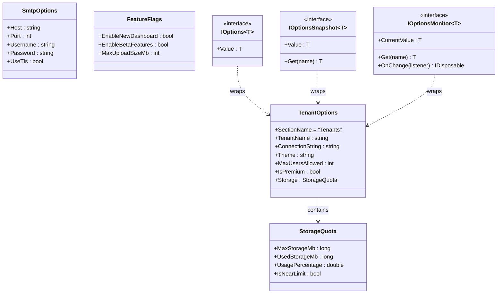
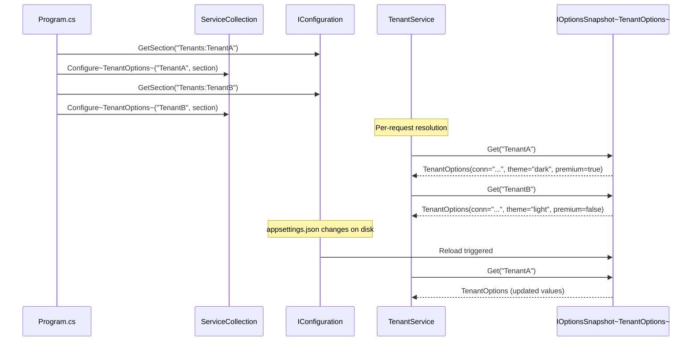

# Options Pattern

## Memory Hook
"Strongly-typed configuration that reloads itself" -- bind configuration sections to POCO classes and inject them with the right lifetime semantics.

## Problem
A multi-tenant SaaS application needs per-tenant configuration: connection strings, themes, storage quotas, user limits, and premium flags. Configuration comes from `appsettings.json`, environment variables, and secret stores. Without the Options pattern, services either read raw `IConfiguration` strings (stringly-typed, no validation, no IntelliSense) or build ad-hoc configuration classes that do not integrate with the .NET configuration pipeline. Reloading configuration at runtime without restarting the application is impossible.

## Naive Approach
Inject `IConfiguration` directly and call `config["Tenants:TenantA:ConnectionString"]` everywhere. Typos in key names cause silent `null` returns. There is no compile-time validation, no grouping of related settings, and no way to validate that required settings are present at startup. Changing a configuration key requires a global find-and-replace across the codebase.

## Pattern Solution
Define POCO classes (`TenantOptions`, `SmtpOptions`, `FeatureFlags`) with properties matching configuration sections. Use `services.Configure<TenantOptions>(config.GetSection("Tenants"))` to bind them. Inject configuration using the appropriate lifetime wrapper: `IOptions<T>` for singleton settings read once at startup, `IOptionsSnapshot<T>` for scoped settings that refresh per request, or `IOptionsMonitor<T>` for singleton-safe settings with real-time change notifications. Named options support per-tenant configuration by resolving `IOptionsSnapshot<TenantOptions>` with a tenant name.

## When To Use
- You need strongly-typed, validated configuration in an ASP.NET Core application.
- Configuration comes from multiple sources (JSON, environment variables, Azure Key Vault) and should be unified.
- Per-tenant or per-environment configuration requires named options.
- You want configuration to reload at runtime without application restart.
- Validation rules must run at startup to catch misconfiguration early.

## When NOT To Use
- The application has only one or two simple settings (a direct `IConfiguration` read is simpler).
- Configuration never changes at runtime and does not benefit from reload semantics.
- You are not using the .NET hosting/DI infrastructure.
- The configuration structure is deeply nested and does not map naturally to flat POCO classes.
- Feature flags need A/B testing or gradual rollout (use a dedicated feature flag system like LaunchDarkly).

## Key Participants

| Participant | Role |
|---|---|
| `TenantOptions` | POCO with tenant-specific settings: name, connection string, theme, max users, premium flag, storage quota. |
| `StorageQuota` | Nested POCO for storage limit tracking with `UsagePercentage` and `IsNearLimit` computed properties. |
| `SmtpOptions` | POCO for email server configuration: host, port, credentials, TLS. |
| `FeatureFlags` | POCO for feature toggles: enable/disable features at runtime. |
| `OptionsExample` | Demonstrates registration and consumption of all three option types. |
| `IOptions<T>` | Singleton lifetime. Reads configuration once at startup. Does not reload. |
| `IOptionsSnapshot<T>` | Scoped lifetime. Refreshes per request. Supports named options. |
| `IOptionsMonitor<T>` | Singleton lifetime. Provides `OnChange` callback for real-time reload. |

## Variants
- **Named Options:** Resolve different configurations by name (e.g., `IOptionsSnapshot<TenantOptions>` with name "TenantA"). Ideal for multi-tenant systems.
- **Options Validation:** Use `ValidateDataAnnotations()` or `Validate()` with a custom function to catch misconfiguration at startup.
- **Post-Configure:** Apply transformations after initial binding with `PostConfigure<T>` (e.g., set defaults, compute derived values).
- **Options with DI:** Create an `IConfigureOptions<T>` implementation that resolves other services to configure options dynamically.

## Tradeoffs

| Advantage | Disadvantage |
|---|---|
| Strongly-typed: compile-time safety and IntelliSense. | Requires defining a POCO class for each configuration section. |
| Integrates with .NET configuration pipeline (JSON, env vars, secrets). | Understanding IOptions vs IOptionsSnapshot vs IOptionsMonitor takes time. |
| Supports runtime reload without application restart. | Deeply nested configurations can be awkward to bind. |
| Named options enable per-tenant configuration. | Validation only runs at startup by default; invalid runtime changes are not caught. |
| Testable: pass options directly in unit tests with `Options.Create(new T())`. | Options classes proliferate in large applications. |

## Common Interview Questions
1. What is the difference between `IOptions<T>`, `IOptionsSnapshot<T>`, and `IOptionsMonitor<T>`, and when do you use each?
2. How do you validate configuration at startup to fail fast on misconfiguration?
3. How do named options work for multi-tenant configuration in ASP.NET Core?

## Comparison with Similar Patterns

| Aspect | IOptions&lt;T&gt; | IOptionsSnapshot&lt;T&gt; | IOptionsMonitor&lt;T&gt; |
|---|---|---|---|
| Lifetime | Singleton | Scoped | Singleton |
| Reload | No | Yes (per request) | Yes (real-time callback) |
| Named options | No | Yes | Yes |
| Best for | Settings that never change at runtime. | Per-request settings in web apps. | Long-lived services that need live updates. |
| Performance | Fastest (cached once). | Slight overhead (rebuilt per scope). | Callback overhead on change. |
| Registration | `services.Configure<T>()` | Same | Same |

## Mermaid Class Diagram

## Mermaid Sequence Diagram

## Similar Patterns to Review Next
- **Strategy** -- Options selects configuration data; Strategy selects behavior. Sometimes combined (use options to pick a strategy).
- **Builder** -- fluent configuration APIs (like `OptionsBuilder<T>`) use the Builder pattern internally.
- **Abstract Factory** -- can use Options to parameterize factory behavior per tenant.
- **Feature Flags** -- a specialized form of Options focused on boolean toggles with gradual rollout capabilities.
