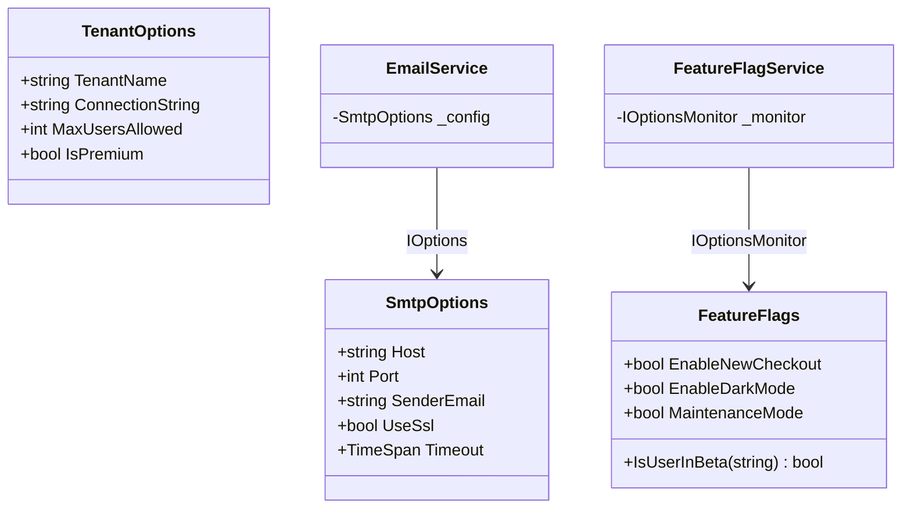
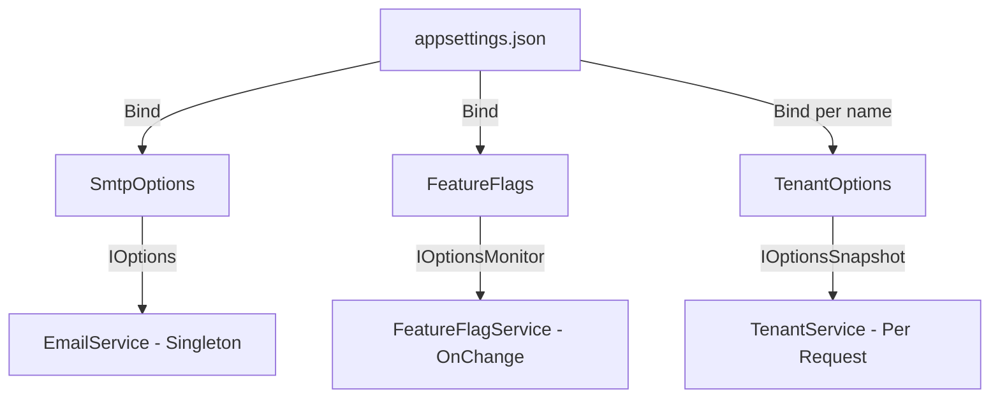

# Options Pattern

## Memory Hook (one-liner)
"Strongly-typed configuration classes that the framework keeps in sync with appsettings.json — no more magic strings."

## Problem
Reading configuration via `IConfiguration["Smtp:Host"]` uses magic strings, returns raw strings, lacks validation, and scatters config access across the codebase. There is no compile-time safety, and typos in keys cause silent failures.

## Naive Approach
```csharp
// Magic strings everywhere
var host = _config["Smtp:Host"];       // string — might be null
var port = int.Parse(_config["Smtp:Port"]); // manual parsing — might throw
var ssl = bool.Parse(_config["Smtp:UseSsl"]); // more manual parsing
```

## Pattern Solution
Bind configuration sections to strongly-typed classes. The framework provides three interfaces for different lifetimes:
- `IOptions<T>` — singleton, read once at startup
- `IOptionsSnapshot<T>` — scoped, re-reads per request, supports named options
- `IOptionsMonitor<T>` — singleton with change notifications

## When To Use
- Any configuration that benefits from compile-time type safety
- Validation of configuration at startup (fail fast on missing values)
- Named/per-tenant configuration with `IOptionsSnapshot<T>`
- Feature flags that change at runtime (`IOptionsMonitor<T>`)
- Clean separation of configuration from business logic

## When NOT To Use
- Trivial apps with 1-2 config values
- Configuration that must be fetched from an external service at runtime (use a custom provider)
- Dynamic config that changes faster than the reload interval
- CLI tools where DI is not used
- You only need environment variables (use `Environment.GetEnvironmentVariable`)

## Participants
| Role | Class | Purpose |
|------|-------|---------|
| Options Class | `SmtpOptions` | SMTP configuration with validation |
| Options Class | `FeatureFlags` | Runtime-toggleable feature flags |
| Options Class | `TenantOptions` | Per-tenant named configuration |
| Example | `OptionsExample` | Shows IOptions / IOptionsSnapshot / IOptionsMonitor |

## Variants
- **IOptions&lt;T&gt;** — singleton, never refreshes (cheapest)
- **IOptionsSnapshot&lt;T&gt;** — scoped, refreshes per request, supports named options
- **IOptionsMonitor&lt;T&gt;** — singleton, pushes change notifications
- **IOptionsFactory&lt;T&gt;** — custom creation logic
- **ValidateOnStart** — validates options eagerly at startup (fail fast)

## Tradeoffs Table
| Advantage | Disadvantage |
|-----------|-------------|
| Compile-time type safety | Requires DI container setup |
| Built-in validation | Three interfaces can be confusing |
| Named options for multi-tenant | Snapshot has per-request allocation |
| Change notifications with Monitor | Options classes must be configured in Startup |

## Common Interview Questions
1. **IOptions vs IOptionsSnapshot vs IOptionsMonitor?** IOptions: singleton, read once. IOptionsSnapshot: scoped, re-reads per request. IOptionsMonitor: singleton with OnChange callback.
2. **How do you validate options at startup?** Use `ValidateDataAnnotations()` and `ValidateOnStart()` in the service registration.
3. **What are named options?** Named options allow multiple configurations of the same type, resolved by name (e.g., per-tenant settings).

## Comparison with Similar Patterns
| Pattern | Difference |
|---------|-----------|
| **Configuration Provider** | Provider loads raw config; Options binds it to types |
| **Service Locator** | Service Locator resolves services; Options resolves configuration |
| **Feature Toggle** | Feature flags are one use case of the Options pattern |

## Mermaid Diagrams

### Class Diagram


### Flow Diagram


## Similar Patterns to Review Next
- Policy Pattern (configuration-driven resilience)
- Null Object (default behavior when config is missing)
- Repository (tenant-scoped data access)
