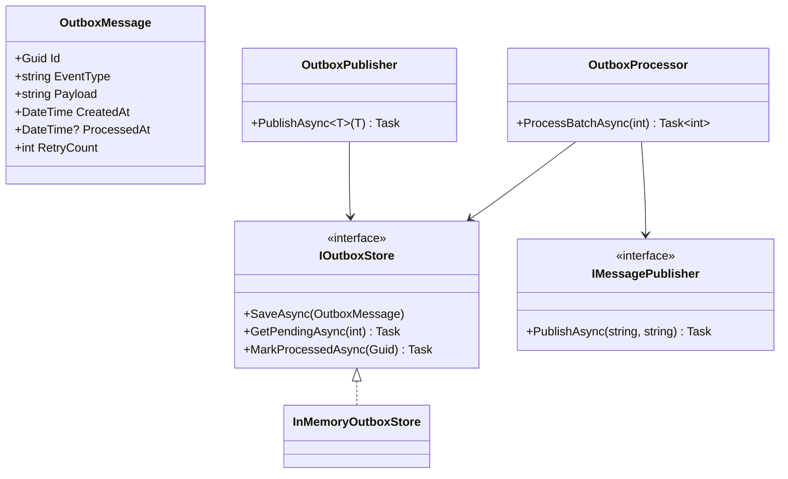
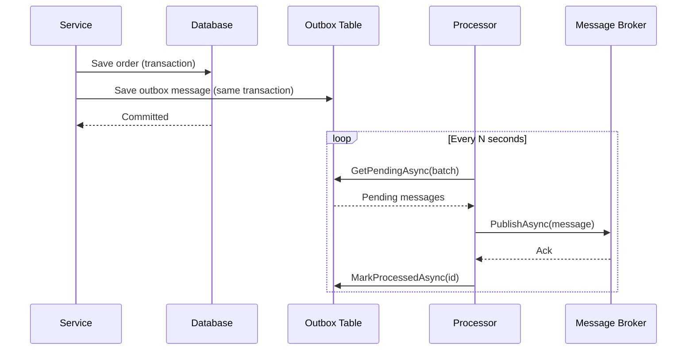

# Outbox Pattern

## Memory Hook (one-liner)
"Write the message to the same database as your business data, then a background worker delivers it — guaranteed delivery without two-phase commit."

## Problem
After saving an order to the database, you publish a message to RabbitMQ. But what if the broker is down? The order is saved but the message is lost. Or what if the message publishes but the DB transaction rolls back? Now consumers act on phantom data.

## Naive Approach
```csharp
await _dbContext.SaveChangesAsync();     // step 1: save to DB
await _messageBroker.PublishAsync(event); // step 2: publish — what if this fails?
```
This is a dual-write problem: two systems must agree, but there is no atomic transaction spanning both.

## Pattern Solution
Instead of publishing directly, write the event as a row in an "outbox" table within the same DB transaction as the business data. A background processor polls the outbox table, publishes pending messages, and marks them as processed. This guarantees at-least-once delivery.

## When To Use
- You need reliable event publishing without a distributed transaction
- Message broker availability should not block business operations
- At-least-once delivery semantics are acceptable (consumers must be idempotent)
- Microservices need to publish integration events reliably
- Replacing fragile dual-write patterns

## When NOT To Use
- Exactly-once delivery is required (outbox provides at-least-once)
- The system has no message broker — events are consumed in-process only
- Change Data Capture (CDC) is available and preferred (e.g., Debezium)
- The added polling latency is unacceptable for real-time requirements
- Simple monolith with no integration events

## Participants
| Role | Class | Purpose |
|------|-------|---------|
| Message | `OutboxMessage` | Stored event with status tracking |
| Store Interface | `IOutboxStore` | Save, fetch pending, mark processed |
| Store Implementation | `InMemoryOutboxStore` | In-memory store for demo |
| Publisher Interface | `IMessagePublisher` | Abstracts the real message broker |
| Outbox Publisher | `OutboxPublisher` | Writes to outbox instead of broker |
| Processor | `OutboxProcessor` | Background worker that drains the outbox |

## Variants
- **Polling** — background job queries for pending messages periodically (shown here)
- **CDC-based** — database change data capture streams new outbox rows
- **Transaction log tailing** — reads the DB write-ahead log directly
- **Inbox pattern** — consumer-side deduplication (complement to outbox)

## Tradeoffs Table
| Advantage | Disadvantage |
|-----------|-------------|
| Guaranteed at-least-once delivery | Added latency (polling interval) |
| No distributed transactions needed | Consumers must handle duplicates |
| Business operation never blocked by broker | Extra table and background worker |
| Simple to implement and reason about | Outbox table can grow if not cleaned up |

## Common Interview Questions
1. **How does the Outbox pattern avoid the dual-write problem?** The business data and the outbox message are written in the same DB transaction — they succeed or fail together.
2. **What about duplicates?** The processor might re-send if it crashes after publishing but before marking processed. Consumers must be idempotent.
3. **Polling vs CDC?** Polling is simpler but adds latency. CDC (e.g., Debezium) captures changes in near-real-time from the transaction log.

## Comparison with Similar Patterns
| Pattern | Difference |
|---------|-----------|
| **Domain Events** | Domain events are in-process; Outbox ensures cross-service delivery |
| **Saga** | Saga orchestrates steps; Outbox ensures each step's events are delivered |
| **Event Sourcing** | ES stores all state as events; Outbox stores events for reliable publishing |

## Mermaid Diagrams

### Class Diagram


### Sequence Diagram


## Similar Patterns to Review Next
- Domain Events
- Saga
- CQRS + Event Sourcing
