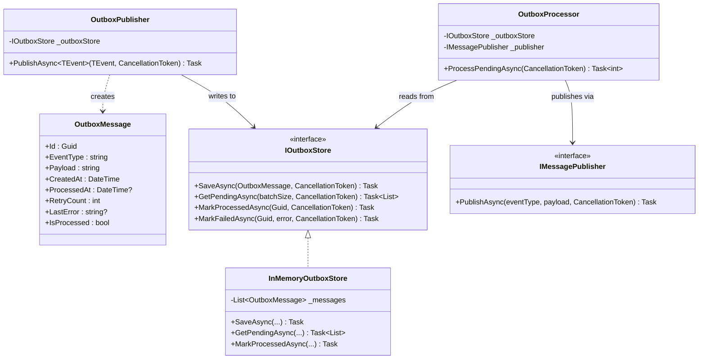
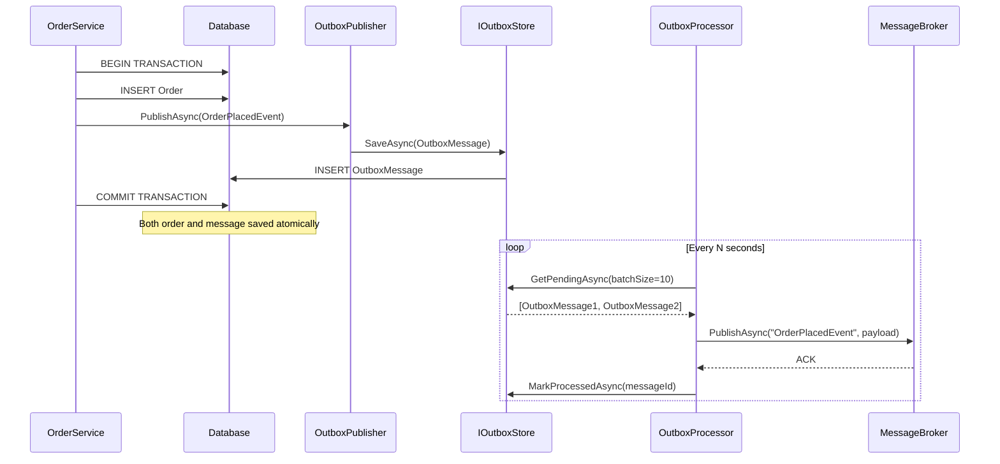

# Outbox Pattern

## Memory Hook
"Write the event to your database first, publish it later" -- guarantee at-least-once event delivery by storing messages in the same transaction as the business operation.

## Problem
When an order is placed, the service must both persist the order to the database and publish an `OrderPlacedEvent` to a message broker. If the database write succeeds but the broker publish fails (network blip, broker down), the order exists but downstream systems never learn about it. If you publish first and the database write fails, downstream systems react to an event that never materialized. There is no way to make a database write and a broker publish atomically without a distributed transaction.

## Naive Approach
Call `await dbContext.SaveChangesAsync()` followed by `await messageBroker.PublishAsync(event)`. If the publish fails, the order is saved but the event is lost. Adding a try/catch with compensating logic (delete the order on publish failure) is fragile, adds complexity, and still has race conditions. Using a distributed transaction (2PC) between the database and the broker introduces significant latency and is not supported by most message brokers.

## Pattern Solution
Instead of publishing directly to the broker, write an `OutboxMessage` to an outbox table in the same database transaction as the business operation. The `OutboxPublisher` serializes the event and stores it with a "Pending" status. A background `OutboxProcessor` periodically polls for pending messages, publishes them to the broker, and marks them as "Processed." If the processor fails, it retries on the next poll. This guarantees at-least-once delivery: if the business transaction commits, the message will eventually be published.

## When To Use
- You need reliable event publishing across a database and a message broker without distributed transactions.
- At-least-once delivery is acceptable (idempotent consumers handle duplicates).
- The message broker may be temporarily unavailable.
- You want to decouple the business operation from the publishing infrastructure.
- Audit and replay capabilities are needed (the outbox table serves as a log).

## When NOT To Use
- Exactly-once delivery is required (Outbox provides at-least-once; consumers must be idempotent).
- The application does not use a relational database (the Outbox pattern relies on database transactions).
- Latency is critical and the background polling delay is unacceptable (consider Change Data Capture instead).
- The system is simple enough that losing an occasional event is acceptable.
- You are already using an event store (Event Sourcing) that inherently provides reliable event publishing.

## Key Participants

| Participant | Role |
|---|---|
| `OutboxMessage` | Represents a pending message: Id, EventType, Payload (JSON), CreatedAt, ProcessedAt, RetryCount, LastError. |
| `IOutboxStore` | Interface for persisting and retrieving outbox messages. |
| `InMemoryOutboxStore` | In-memory implementation for testing and demos. |
| `OutboxPublisher` | Writes events to the outbox store (serializes to JSON) instead of publishing directly. |
| `OutboxProcessor` | Background worker that polls for pending messages, publishes them via `IMessagePublisher`, and marks them processed. |
| `IMessagePublisher` | Interface for the actual message broker (RabbitMQ, Kafka, Azure Service Bus). |

## Variants
- **Polling Processor (this repo):** A background worker polls the outbox table on a timer. Simple but introduces latency equal to the poll interval.
- **Change Data Capture (CDC):** Use Debezium or similar tools to tail the database transaction log and publish changes in near-real-time. No polling delay, but requires additional infrastructure.
- **Transactional Outbox with EF Core:** Override `SaveChangesAsync` in `DbContext` to automatically write domain events to the outbox table within the same transaction.
- **Outbox with Ordering Guarantees:** Add a sequence number to outbox messages and publish in order. Important for event sourcing scenarios.

## Tradeoffs

| Advantage | Disadvantage |
|---|---|
| Guarantees at-least-once delivery without distributed transactions. | Consumers must be idempotent (may receive duplicates). |
| Business operation and event storage are atomically consistent. | Adds latency: events are not published instantly (polling interval). |
| Outbox table serves as an audit log and replay source. | Requires a background processor to run reliably. |
| Works with any message broker (broker-agnostic). | Outbox table grows and needs periodic cleanup/archival. |
| Simple to implement and reason about. | Does not guarantee message ordering across multiple publishers. |

## Common Interview Questions
1. How does the Outbox pattern guarantee at-least-once delivery, and what must consumers do to handle duplicates?
2. What are the tradeoffs between polling-based Outbox processing and Change Data Capture?
3. How would you implement the Outbox pattern with Entity Framework Core to ensure the outbox write is in the same transaction as the business operation?

## Comparison with Similar Patterns

| Aspect | Outbox Pattern | Direct Publish |
|---|---|---|
| Atomicity | Event stored in same DB transaction as business data. | Separate operations; no atomicity guarantee. |
| Delivery | At-least-once (retry on failure). | At-most-once (fire and forget) or complex retry logic. |
| Broker dependency | Tolerates broker downtime. | Fails immediately if broker is unavailable. |
| Latency | Slight delay (polling interval). | Immediate. |
| Complexity | Background processor, outbox table, idempotent consumers. | Simple: one call to the broker. |
| Audit trail | Outbox table serves as event log. | No built-in audit trail. |

## Mermaid Class Diagram

## Mermaid Sequence Diagram

## Similar Patterns to Review Next
- **Domain Events** -- the events that get written to the outbox; Outbox ensures their reliable delivery.
- **Saga** -- orchestrates multi-step distributed operations; Outbox ensures each saga step's events are reliably published.
- **Event Sourcing** -- stores events as the source of truth; can eliminate the need for a separate outbox.
- **Idempotent Consumer** -- the receiving side must handle duplicate messages that the Outbox pattern may produce.
