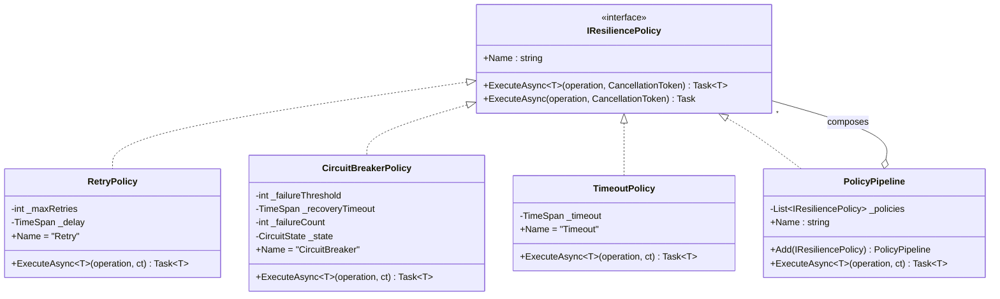
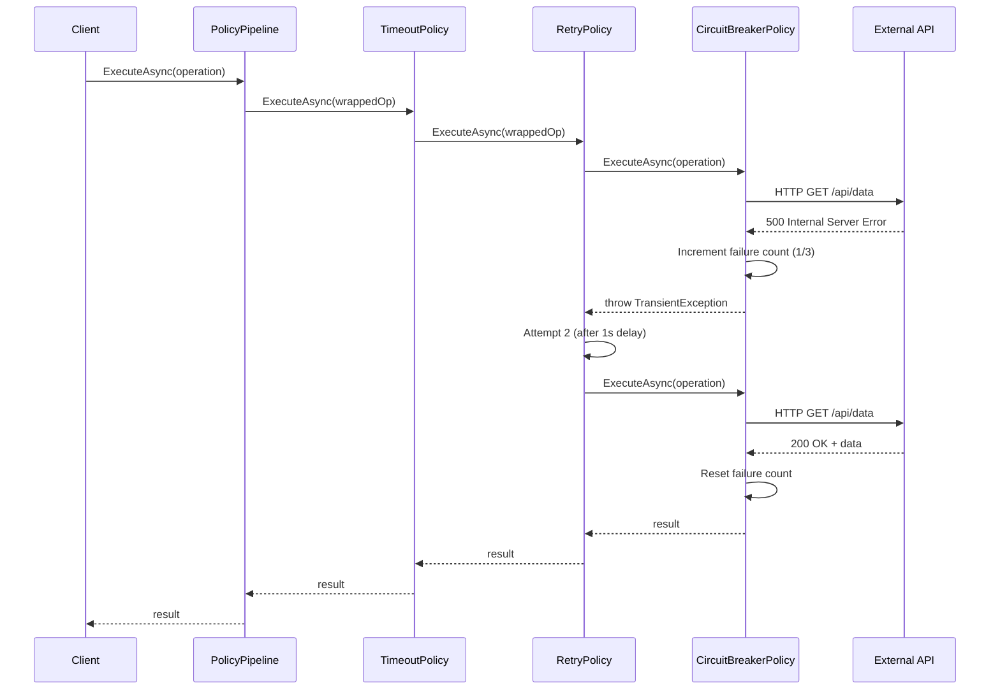

# Policy Pattern (Resilience Policies)

## Memory Hook
"Wrap your operation in armor" -- compose retry, circuit breaker, and timeout policies into a pipeline that makes fragile calls resilient.

## Problem
An application calls external services (HTTP APIs, databases, message brokers) that can fail transiently. Without resilience policies, a single timeout or transient error propagates up and crashes the request. Developers add ad-hoc retry loops, hardcoded timeouts, and manual circuit-breaking logic scattered throughout the codebase, each with different retry counts, backoff strategies, and error handling. This duplication is error-prone, untestable, and impossible to manage consistently.

## Naive Approach
Each service call gets its own `try/catch` with a `for` loop for retries: `for (int i = 0; i < 3; i++) { try { ... } catch { await Task.Delay(1000); } }`. Timeout logic uses `Task.WhenAny` with `Task.Delay`. Circuit-breaking is implemented with a static counter and a manual threshold check. Each call site has different retry counts, different delays, and no backoff. There is no way to compose policies (e.g., retry inside a circuit breaker inside a timeout).

## Pattern Solution
Define an `IResiliencePolicy` interface with `ExecuteAsync<T>(Func<CancellationToken, Task<T>> operation)`. Create concrete policies: `RetryPolicy` (configurable max retries and backoff), `CircuitBreakerPolicy` (configurable failure threshold and recovery timeout), and `TimeoutPolicy` (configurable deadline). A `PolicyPipeline` composes multiple policies into a chain: the outermost policy wraps the next, forming a Russian-nesting-doll structure. Execution flows from the outermost policy inward to the actual operation.

## When To Use
- You call external services that can fail transiently (HTTP, gRPC, database, message broker).
- You need configurable, testable, and composable resilience strategies.
- Different operations need different resilience configurations (e.g., reads get more retries than writes).
- You want to avoid duplicating retry/timeout/circuit-breaker logic across the codebase.
- You need to monitor and log resilience events (retries, circuit opens, timeouts) centrally.

## When NOT To Use
- The operation is idempotent-unsafe and retrying would cause duplicate side effects (e.g., double-charging).
- The failure is permanent, not transient (retrying a 404 or a validation error wastes resources).
- You are in a tight loop where the overhead of async policy wrapping matters.
- A simpler, single-use retry is sufficient and a full policy pipeline is over-engineering.
- You are already using Polly or Microsoft.Extensions.Resilience, which provide battle-tested implementations.

## Key Participants

| Participant | Role |
|---|---|
| `IResiliencePolicy` (Policy Interface) | Declares `ExecuteAsync` for wrapping operations with resilience behavior. |
| `RetryPolicy` | Retries a failed operation up to N times with configurable backoff. |
| `CircuitBreakerPolicy` | Opens the circuit after N consecutive failures; rejects calls until recovery. |
| `TimeoutPolicy` | Cancels the operation if it exceeds the configured deadline. |
| `PolicyPipeline` (Composite) | Chains multiple policies into a nested execution pipeline. |

## Variants
- **Exponential Backoff Retry:** Delays increase exponentially between retries (1s, 2s, 4s, 8s) to avoid thundering herd problems.
- **Jittered Backoff:** Adds random jitter to the backoff delay to prevent synchronized retries across multiple instances.
- **Bulkhead Isolation:** Limits the number of concurrent calls to a resource to prevent one slow service from exhausting all threads.
- **Fallback Policy:** Returns a default value or calls an alternative service when the primary operation fails.
- **Polly / Microsoft.Extensions.Resilience:** Production-grade .NET libraries that implement all these policies with extensive configuration and telemetry.

## Tradeoffs

| Advantage | Disadvantage |
|---|---|
| Composable: chain policies in any order without modifying the operation. | Each policy layer adds async overhead and stack depth. |
| Configurable: different operations get different policy configurations. | Misconfigured policies (too many retries, too long timeouts) can make failures worse. |
| Testable: each policy can be unit-tested in isolation. | Understanding the behavior of a deeply nested pipeline can be challenging. |
| Centralized resilience logic eliminates scattered try/catch blocks. | Retrying non-idempotent operations can cause data corruption. |
| Consistent error handling across the entire application. | Circuit breaker state management adds complexity in distributed environments. |

## Common Interview Questions
1. How does the Policy pattern relate to the Strategy pattern, and what distinguishes them?
2. What is the difference between a retry policy and a circuit breaker, and how do they complement each other?
3. How would you share circuit breaker state across multiple instances of a service in a distributed system?

## Comparison with Similar Patterns

| Aspect | Policy Pattern | Strategy Pattern |
|---|---|---|
| Purpose | Wrap an operation with cross-cutting resilience behavior. | Select an algorithm implementation. |
| Composition | Policies are composed into a pipeline (nested decoration). | Strategies are selected, not composed. |
| Concern | Infrastructure: retries, timeouts, circuit breaking. | Business logic: pricing, sorting, validation. |
| Wrapping | Wraps an existing operation without changing it. | Replaces the algorithm entirely. |
| Analogy | Armor around a fragile call. | Choosing which weapon to use. |

## Mermaid Class Diagram

## Mermaid Sequence Diagram

## Similar Patterns to Review Next
- **Strategy** -- Policy is a specialized form of Strategy focused on resilience rather than business logic.
- **Decorator** -- Policy wrapping is essentially decoration; each policy decorates the next.
- **Chain of Responsibility** -- the pipeline could be modeled as a chain where each policy decides whether to proceed.
- **Proxy** -- a protection or caching proxy serves a similar wrapping role for access control and caching.
