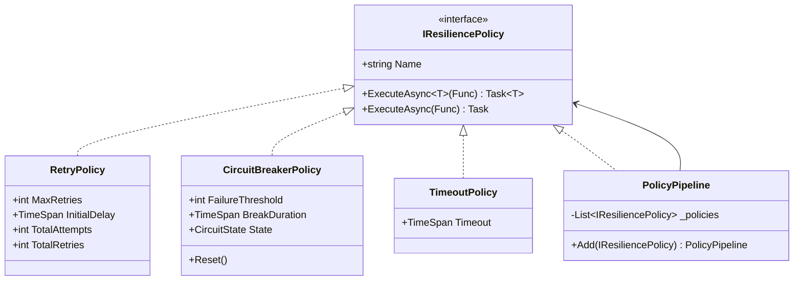
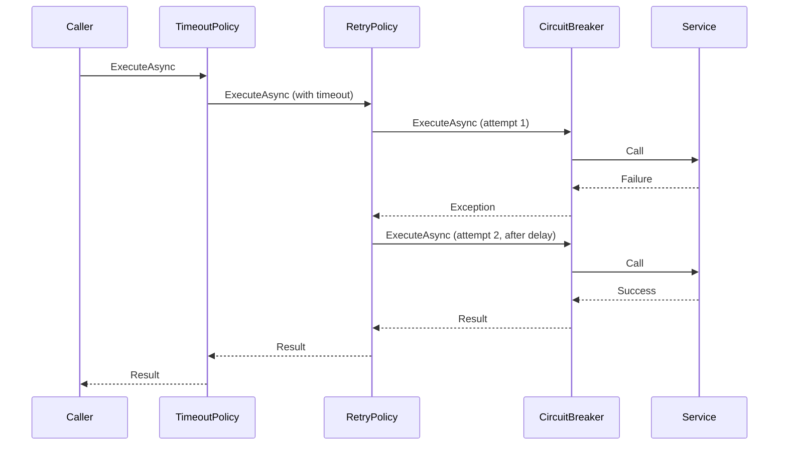

# Policy Pattern (Retry and Resilience)

## Memory Hook (one-liner)
"Wrap your operation in a safety net — retry on failure, break the circuit when it is hopeless, time out when it is stuck."

## Problem
Remote calls fail. Networks drop. Services go down. Without resilience policies, every call site needs its own retry loops, timeout logic, and failure tracking — duplicated and error-prone.

## Naive Approach
```csharp
// Hand-rolled retry with exponential backoff — duplicated everywhere
for (int i = 0; i < 3; i++)
{
    try { return await _httpClient.GetAsync(url); }
    catch (HttpRequestException)
    {
        if (i == 2) throw;
        await Task.Delay(TimeSpan.FromSeconds(Math.Pow(2, i)));
    }
}
```

## Pattern Solution
Encapsulate resilience strategies (retry, circuit breaker, timeout) as reusable `IResiliencePolicy` objects. Compose them into a `PolicyPipeline` so that `Timeout -> Retry -> CircuitBreaker` wraps the operation in layers.

## When To Use
- HTTP calls to external APIs that may fail transiently
- Database connections that experience intermittent timeouts
- Message broker publish operations
- Any I/O operation where transient failures are expected
- You want to prevent cascading failures (circuit breaker)

## When NOT To Use
- In-memory operations that never fail transiently
- Failures are permanent, not transient (retrying makes it worse)
- The framework already provides built-in resilience (e.g., HttpClient + Polly)
- Real-time systems where retry latency is unacceptable
- Simple scripts or CLI tools with no I/O resilience needs

## Participants
| Role | Class | Purpose |
|------|-------|---------|
| Interface | `IResiliencePolicy` | Wraps an operation with a resilience strategy |
| Retry | `RetryPolicy` | Retries with exponential backoff |
| Circuit Breaker | `CircuitBreakerPolicy` | Opens after N failures, prevents calls |
| Timeout | `TimeoutPolicy` | Cancels after a duration |
| Pipeline | `PolicyPipeline` | Composes policies in layers |

## Variants
- **Polly** — the industry-standard .NET resilience library
- **Microsoft.Extensions.Resilience** — built on Polly v8 with DI integration
- **Bulkhead** — limits concurrent calls to prevent resource exhaustion
- **Fallback** — returns a default value on failure
- **Hedging** — sends parallel requests, uses the first to succeed

## Tradeoffs Table
| Advantage | Disadvantage |
|-----------|-------------|
| Reusable resilience strategies | Added latency from retries and timeouts |
| Composable pipeline | Circuit breaker state is shared — must be singleton |
| Prevents cascading failures | Configuration tuning requires production metrics |
| Testable policies | Over-aggressive retry can amplify load on failing services |

## Common Interview Questions
1. **What are the circuit breaker states?** Closed (normal), Open (blocking calls), HalfOpen (allowing one probe call).
2. **Retry vs Circuit Breaker?** Retry handles transient failures; Circuit Breaker stops retrying when the service is clearly down.
3. **What is exponential backoff?** Each retry waits longer: 200ms, 400ms, 800ms, etc. — prevents thundering herd.

## Comparison with Similar Patterns
| Pattern | Difference |
|---------|-----------|
| **Strategy** | Strategy selects an algorithm; Policy wraps an operation with resilience |
| **Decorator** | Policies are decorators around the operation |
| **Proxy** | Proxy controls access; Policy controls reliability |

## Mermaid Diagrams

### Class Diagram


### Sequence Diagram


## Similar Patterns to Review Next
- Decorator (policies wrap operations like decorators)
- Strategy (each policy is a resilience strategy)
- Circuit Breaker (standalone GoF-adjacent pattern)
