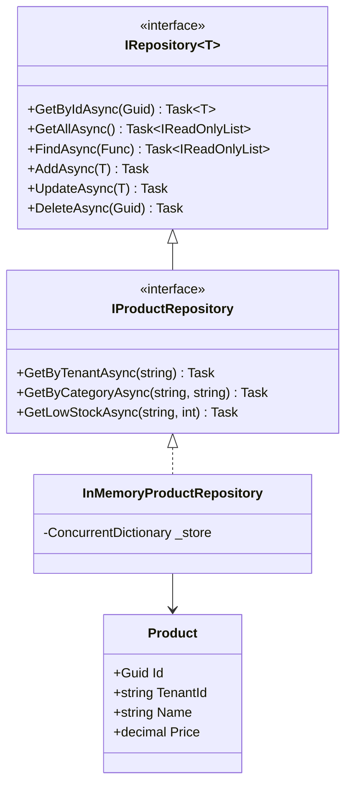
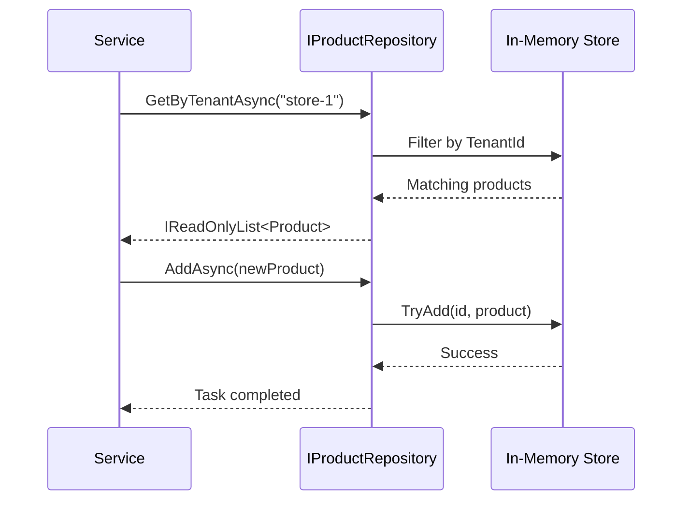

# Repository Pattern

## Memory Hook (one-liner)
"A collection-like interface that hides how and where data is stored — your domain code talks to a collection, not a database."

## Problem
Business logic becomes tightly coupled to data access technology (EF Core, Dapper, raw SQL). Changing the database or ORM forces changes across the entire application. Testing requires a live database.

## Naive Approach
```csharp
// Data access scattered across controllers and services
public class ProductController
{
    public IActionResult Get(Guid id)
    {
        using var conn = new SqlConnection(_connectionString);
        var product = conn.QuerySingle<Product>(
            "SELECT * FROM Products WHERE Id = @Id AND TenantId = @TenantId",
            new { Id = id, TenantId = _currentTenant });
        return Ok(product);
    }
}
```
Every service method repeats connection management, SQL strings, and tenant filtering.

## Pattern Solution
Define an interface that looks like a collection (`Add`, `Find`, `Delete`). The implementation handles database access, connection pooling, and tenant scoping internally. Domain code only depends on the interface.

```
IRepository<Product> ──> InMemoryProductRepository (tests)
                    ──> EfCoreProductRepository    (production)
```

## When To Use
- You want to swap persistence technology without rewriting business logic
- Multiple data sources (SQL, NoSQL, API) back the same entity
- Domain-specific query methods improve readability (e.g., `GetLowStock`)
- You need clean unit testing without database dependencies
- Multi-tenant applications that must scope every query to a tenant

## When NOT To Use
- Simple CRUD apps where EF Core's DbSet is already a repository
- You only have one data store and will never change it
- The abstraction layer adds no value beyond what the ORM provides
- Microservices with a single aggregate root and minimal query complexity
- Performance-critical paths where the extra abstraction layer costs measurable time

## Participants
| Role | Class | Purpose |
|------|-------|---------|
| Interface | `IRepository<T>` | Generic CRUD contract |
| Specialized Interface | `IProductRepository` | Domain-specific queries |
| Entity | `Product` | Domain model |
| Concrete Repository | `InMemoryProductRepository` | In-memory implementation |

## Variants
- **Generic Repository** — single interface for all entities
- **Specific Repository** — one interface per aggregate root (preferred in DDD)
- **Read/Write Split** — separate `IReadRepository` and `IWriteRepository`
- **Specification-based** — `FindAsync(ISpecification<T>)` instead of predicates

## Tradeoffs Table
| Advantage | Disadvantage |
|-----------|-------------|
| Persistence ignorance | Extra abstraction layer to maintain |
| Testable without database | Can leak ORM concepts if not careful |
| Tenant isolation in one place | Risk of "repository per table" anti-pattern |
| Swappable implementations | May duplicate ORM features (EF already has Unit of Work) |

## Common Interview Questions
1. **Why not just use DbSet directly?** DbSet is already a repository, but a custom interface lets you enforce domain rules, add tenant filtering, and test without EF.
2. **Should there be one repository per entity?** No — one per aggregate root. Child entities are accessed through the aggregate's repository.
3. **How does Repository relate to Unit of Work?** Repository manages a single collection; Unit of Work coordinates commits across multiple repositories.

## Comparison with Similar Patterns
| Pattern | Difference |
|---------|-----------|
| **DAO (Data Access Object)** | DAO is table-centric; Repository is domain-centric |
| **Unit of Work** | UoW manages transactions across repositories |
| **CQRS** | Splits read/write repositories into separate models |

## Mermaid Diagrams

### Class Diagram


### Sequence Diagram


## Similar Patterns to Review Next
- Unit of Work
- Specification
- CQRS
