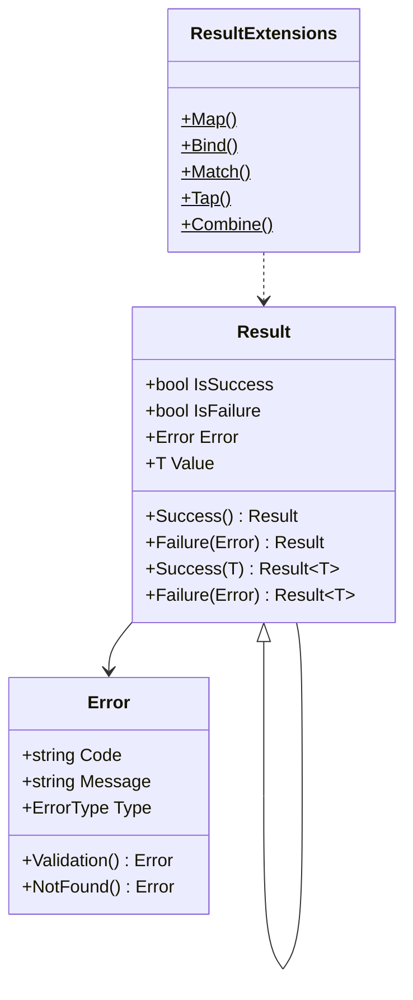
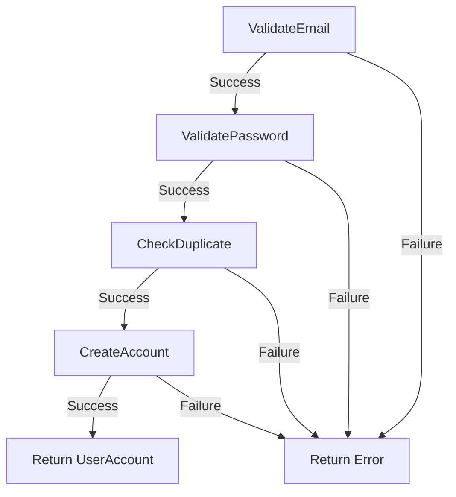

# Result Pattern

## Memory Hook (one-liner)
"Return a box that holds either the value or the error — no exceptions for expected failures."

## Problem
Using exceptions for expected business failures (validation errors, not-found, conflicts) is expensive, hard to track, and mixes control flow with error handling. Callers forget to catch, and the type system doesn't help.

## Naive Approach
```csharp
// Exceptions for business logic
public User Register(string email, string password)
{
    if (string.IsNullOrEmpty(email)) throw new ValidationException("Email required");
    if (_repo.Exists(email)) throw new ConflictException("Email taken");
    // caller must remember to catch each exception type...
}
```

## Pattern Solution
Return a `Result<T>` that is either Success (with value) or Failure (with a structured Error). Chain operations with `Map`, `Bind`, and `Match` — functional style.

## When To Use
- Validation flows with multiple potential failure reasons
- API layers that must return structured error responses
- Operations where failure is expected, not exceptional
- Chaining multiple fallible steps (registration, payment, booking)
- When you want the compiler to force error handling

## When NOT To Use
- Truly exceptional situations (out of memory, network failure)
- Simple operations that always succeed
- Libraries where callers expect exceptions (following .NET conventions)
- Performance-critical inner loops (struct-based results exist for this)
- Teams unfamiliar with functional programming concepts

## Participants
| Role | Class | Purpose |
|------|-------|---------|
| Base | `Result` | Non-generic success/failure without a value |
| Generic | `Result<T>` | Carries a value on success |
| Error | `Error` | Structured error with code, message, and type |
| Extensions | `ResultExtensions` | Map, Bind, Match, Tap, Combine |
| Example | `UserRegistrationService` | Real-world usage demonstration |

## Variants
- **OneOf / Discriminated Union** — uses `OneOf<Success, Error>` library
- **FluentResults** — popular NuGet package with similar API
- **ErrorOr** — lightweight alternative by Amichai Mantinband
- **Struct-based Result** — avoids heap allocation for performance
- **Result with multiple errors** — `Result<T, IReadOnlyList<Error>>`

## Tradeoffs Table
| Advantage | Disadvantage |
|-----------|-------------|
| Compiler enforces error handling | More verbose than try/catch for simple cases |
| No exception overhead for expected failures | Unfamiliar to devs from OOP-only backgrounds |
| Chainable with Map/Bind | Async chains need extra extension methods |
| Structured errors for API responses | Exceptions still needed for unexpected failures |

## Common Interview Questions
1. **When should you use Result vs exceptions?** Use Result for expected business failures; exceptions for unexpected infrastructure failures.
2. **What is the Bind operation?** Bind (flatMap) chains two operations that each return a Result, short-circuiting on the first failure.
3. **How does Result compare to nullable?** Nullable only says "missing"; Result also tells you why.

## Comparison with Similar Patterns
| Pattern | Difference |
|---------|-----------|
| **Option/Maybe** | Option represents presence/absence; Result adds error information |
| **Either** | Either<L,R> is the generic form; Result is a specialized Either<Error,T> |
| **Exception handling** | Exceptions use stack unwinding; Result uses normal control flow |

## Mermaid Diagrams

### Class Diagram


### Flow Diagram


## Similar Patterns to Review Next
- Specification
- Value Object
- Domain Events
